# 1.4.2 Implement Brand Concierge on your website

>[!IMPORTANT]
>
>This exercise is being worked on and isn't finished yet.

## 1.4.2.1 Configure your website to show Brand Concierge - AEM Author

In order for Brand Concierge to appear on your website, you need to create a new custom block that needs to be added to a new page, and you'll need to ensure that your new page is added to the navigation of your website.

You now need to configure the following things in this order:

- Create a new custom block that will be used to load Brand Concierge on your website.
- Create a new page on your website for Brand Concierge.
- Link the newly created custom block on the newly created Brand Concierge page.
- Add a reference to navigate to the newly created Brand Concierge page in your website's navigation header file.

### Create new custom block

To create the new custom block, navigate to the GitHub repository that is linked to your website.

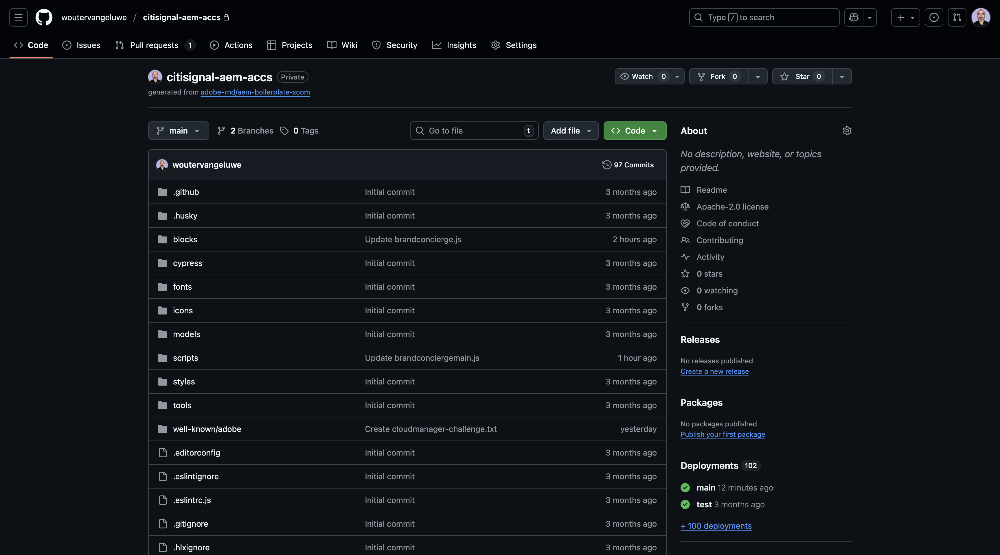

#### component-definition.json

Scroll down until you see the file **component-definition.json** and open it

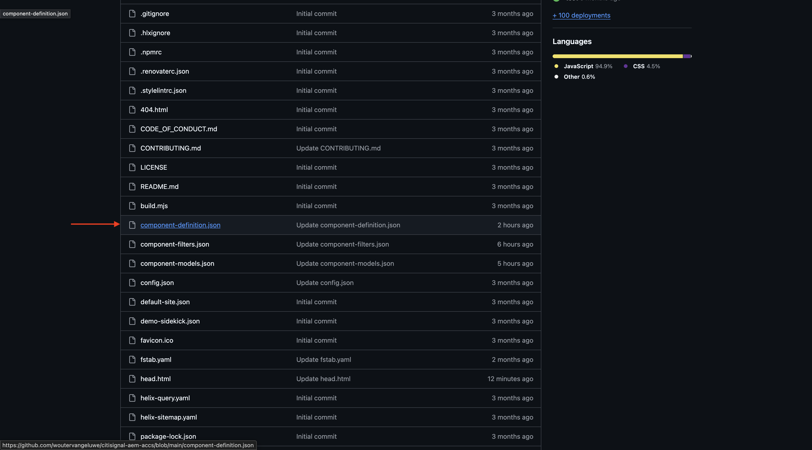

Scroll down until you see the **Blocks**. Set your cursor under the closing bracket of the component **Cards**

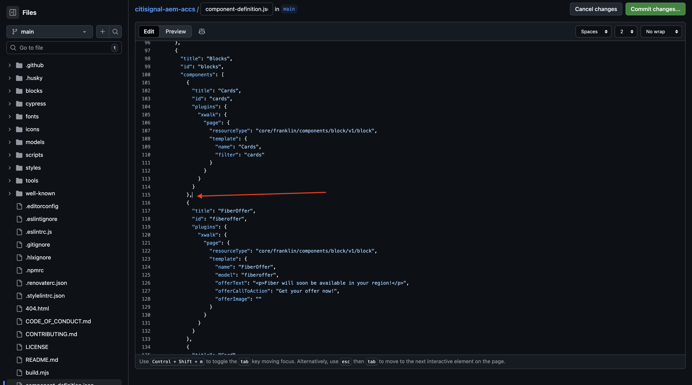

Paste this code and enter a comma **,** after the block of code:

```json
{
  "title": "FiberOffer",
  "id": "fiberoffer",
  "plugins": {
    "xwalk": {
      "page": {
        "resourceType": "core/franklin/components/block/v1/block",
        "template": {
          "name": "FiberOffer",
          "model": "fiberoffer",
          "offerText": "<p>Fiber will soon be available in your region!</p>",
          "offerCallToAction": "Get your offer now!",
          "offerImage": ""
        }
      }
    }
  }
}
```

Save your changes.

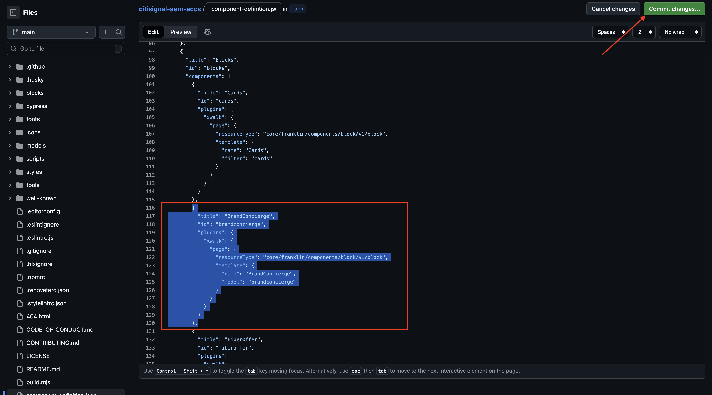

#### component-models.json

In Visual Studio Code, open the file **component-models.json**.

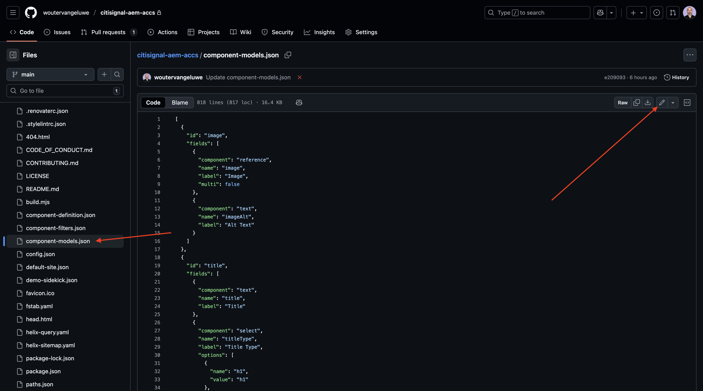

Scroll down until you see the last item. Set your cursor next to the closing bracket of the last component.

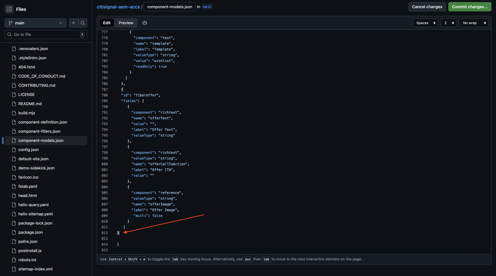

Enter a comma **,**, then push enter and on the next line, paste this code:

```json
{
  "id": "fiberoffer",
  "fields": [
     {
       "component": "richtext",
       "name": "offerText",
       "value": "",
       "label": "Offer Text",
       "valueType": "string"
     },
     {
       "component": "richtext",
       "valueType": "string",
       "name": "offerCallToAction",
       "label": "Offer CTA",
       "value": ""
     },
     {
       "component": "reference",
       "valueType": "string",
       "name": "offerImage",
       "label": "Offer Image",
        "multi": false
     }
   ]
}
```

Save your changes.

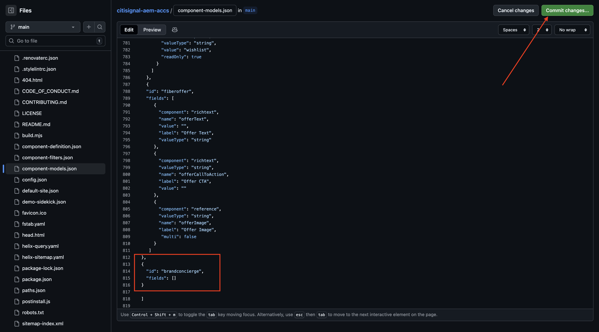

#### component-filters.json

In Visual Studio Code, open the file **component-filters.json**.

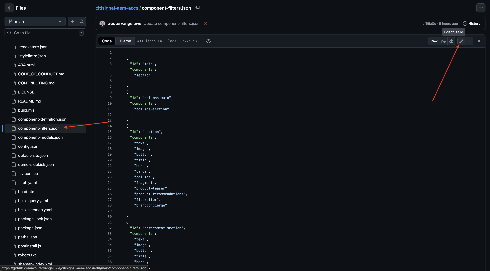

Under **section**, enter a comma `,` and paste the id of your component `"fiberoffer"` after the current last line.

Save your changes.

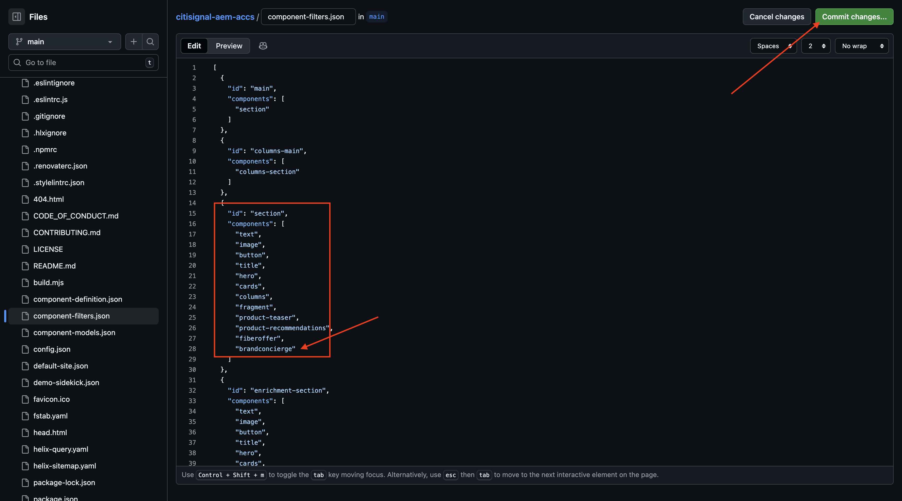


### Create new page & link new custom block

### Update navigation header file

## 1.4.2.2 Configure your website to show Brand Concierge - GitHub

After updating the content using your AEM Author environment, you now need to update some of the code in the GitHub repository that is used for your website.

### Javascript Libraries

The following libraries are required to implement Brand Concierge on your website running on AEM CS/EDS:

- [styleconfigurations.js](./assets/styleconfigurations.js)
- [alloy.js](./assets/alloy.js)
- [brandconciergemain.js](./assets/brandconciergemain.js)

Download all 3 files to your desktop.

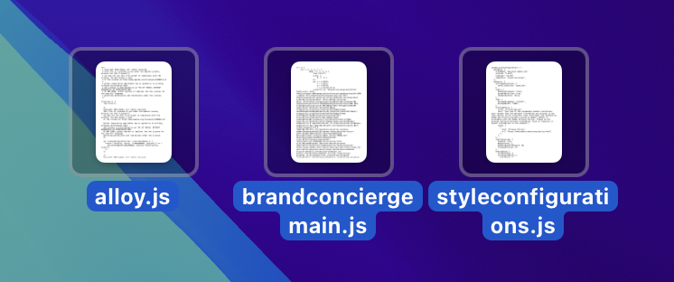

Go to the GitHub project of your AEM CS/EDS website. Go to **scripts**.

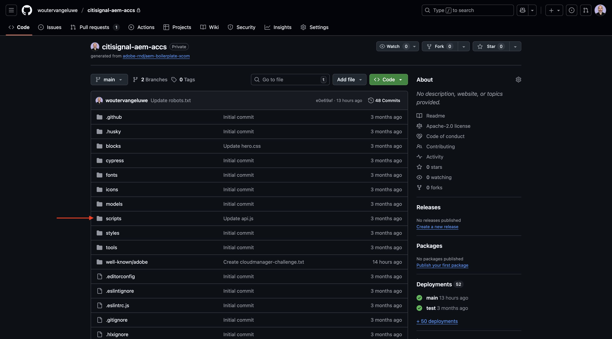

Click **Add file** and then select **Upload files**.

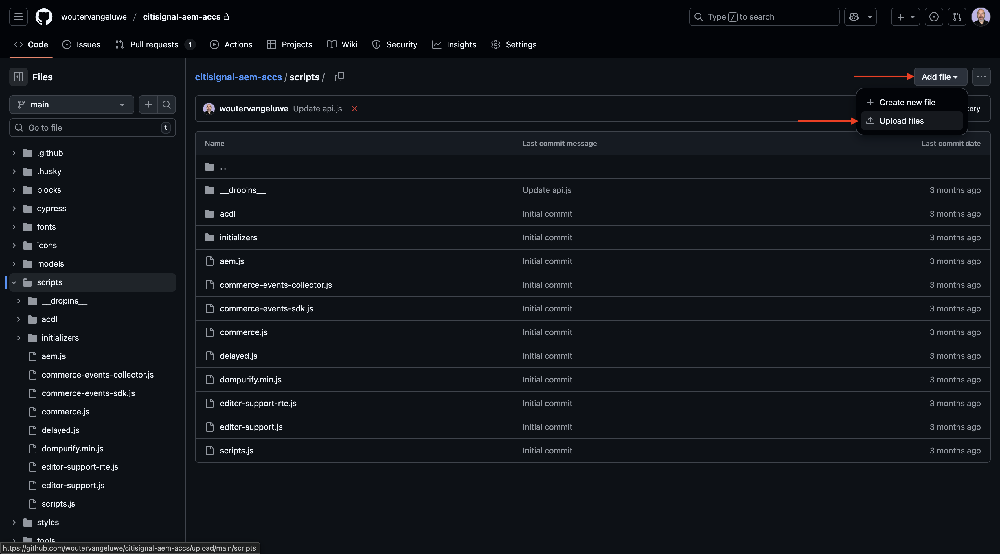

Click **Choose your files**.

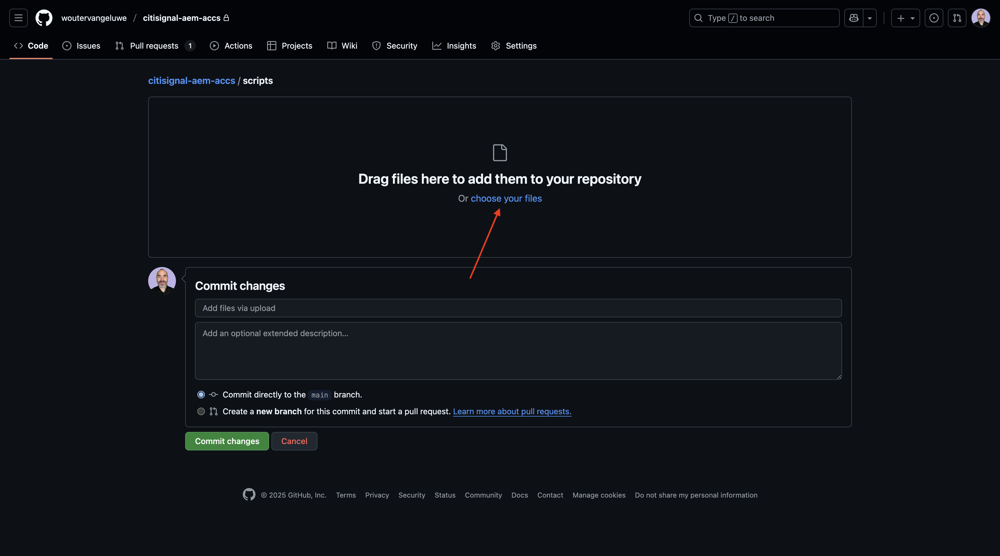

Select all 3 files **styleConfigurations.js, alloy.js and brandconciergemain.js** from your desktop and click **Open**.

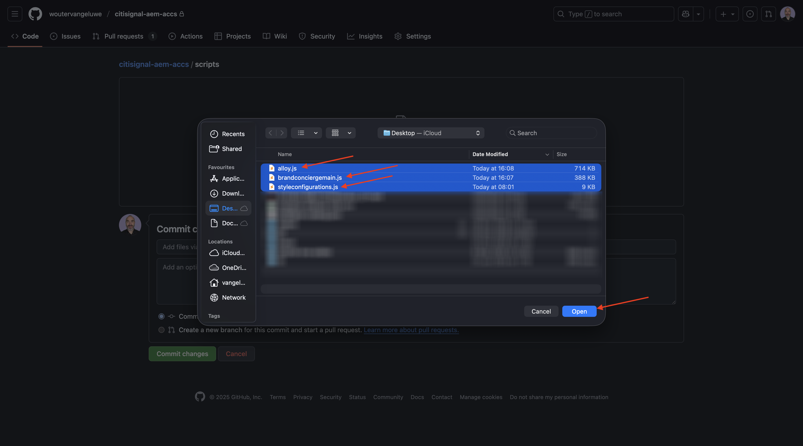

Click **Commit changes**.

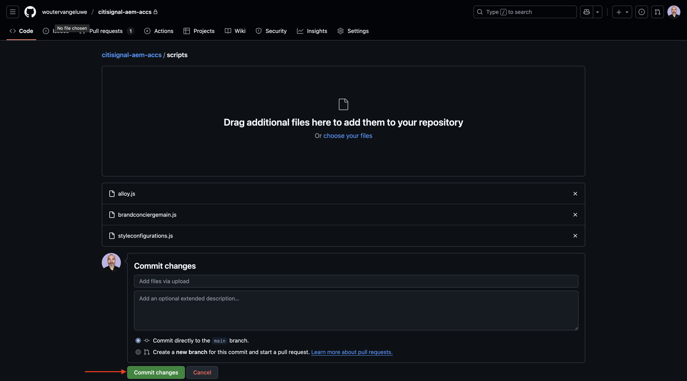

### Update head.html

In the previous step you uploaded 3 new libraries. These libraries now need to be loaded when your website is loaded and the way to do that is to add references to these files in the file **head.html**. 

Additionally, you also need to provide instructions in the **head.html** file to ensure that the libraries are loaded in the right order and in a correct way.

To do that, go to the GitHub project of your AEM CS/EDS website by clicking **Code**.

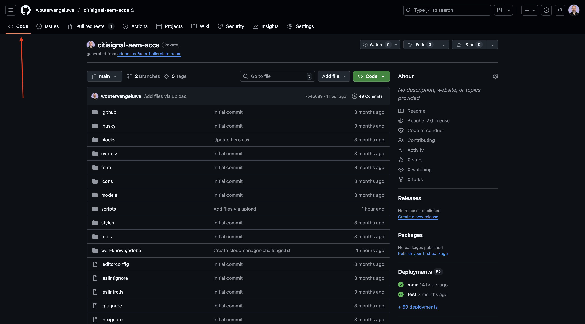

Scroll down a little bit. Open the file **head.html**.

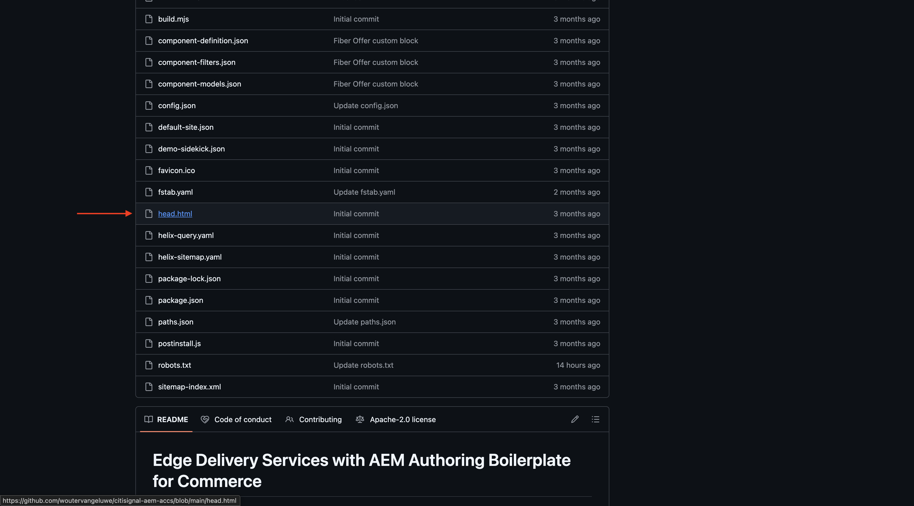

Click the **pencil** icon to edit this file.

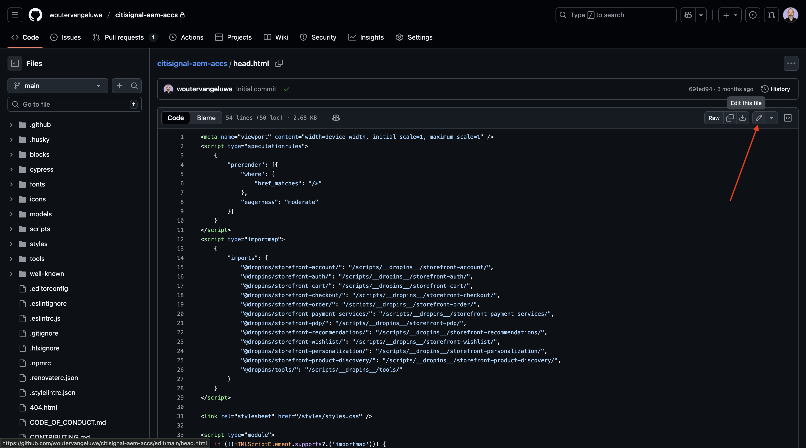

You should then see this. 

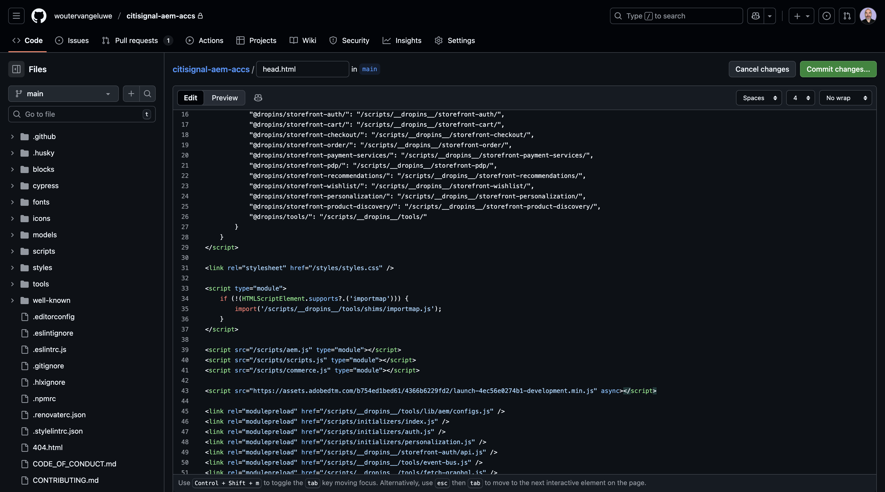

Scroll down to line 43 and paste the following:

There are 2 fields in the below code that you need to update:

>[!IMPORTANT]
>
>- **datastreamId** is currently set to "XXXXX" and need to be replaced by the ID of the datastream that you created in the previous step.
>- **orgId** needs to be replaced by the IMS Org ID of your Adobe Experience Cloud instance.

```javascript
<script src="/scripts/styleconfigurations.js"></script>

<script>
		!function (n, o) {
      o.forEach(function (o) {
        n[o] || ((n.__alloyNS = n.__alloyNS ||
          []).push(o), n[o] = function () {
            var u = arguments; return new Promise(
              function (i, l) { n[o].q.push([i, l, u]) })
          }, n[o].q = [])
      })
    }
      (window, ["alloy"]);
	</script>


<script src="/scripts/alloy.js"></script>

<script>
	alloy("configure", {
		defaultConsent: "in",
        edgeDomain: "edge.adobedc.net",
        edgeBasePath: "ee",
        datastreamId: "XXXXX", // replace datastreamId
        orgId: "--aepImsOrgId--", // replace ims org Id
        debugEnabled: true,
        idMigrationEnabled: false,
        thirdPartyCookiesEnabled: false,
        prehidingStyle: ".personalization-container { opacity: 0 !important }",
    });

window["alloy"]("sendEvent", {
    conversation: {
        fetchConversationalExperience: true
    }
}).then(result => {
    console.log("Conversation experience fetched", result);
    window["alloy"]("bootstrapConversationalExperience", {
        selector: "#brand-concierge-mount",
        src: "/scripts/brandconciergemain.js",
        stylingConfigurations: window.styleConfiguration,
        stickySession: true // create a sticky session cookie with expiration
    })
});
</script>
```

Click **Commit change...**.

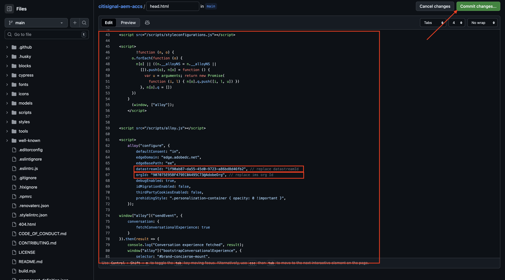

Click **Commit change**.

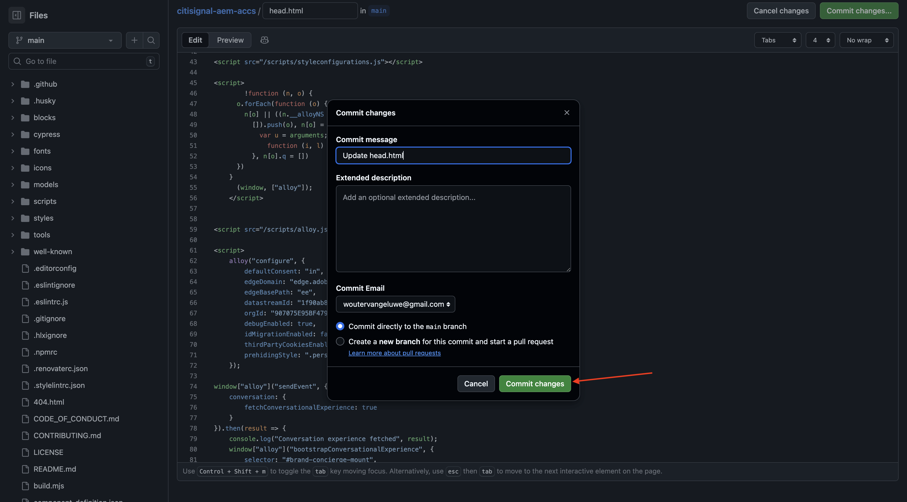

You've now updated the required code to load the libraries on your website.

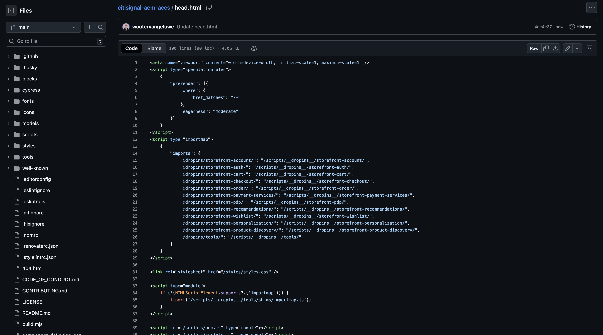

## 1.4.2.3 Test your configuration

You will now be able to test your changes on your website by going to `main--citisignal-aem-accs--XXX.aem.page` or `main--citisignal-aem-accs--XXX.aem.live`, after replacing XXX by your GitHub user account, which in this example is `woutervangeluwe`.

In this example, the full URL becomes this:
`https://main--citisignal-aem-accs--woutervangeluwe.aem.page` and/or `https://main--citisignal-aem-accs--woutervangeluwe.aem.live`.

It may take some time before all the assets are shown correctly, as they need to be published first.

You should then see this. Click **Brand Concierge**.


You should then see this Brand Concierge where you can enter your prompt.

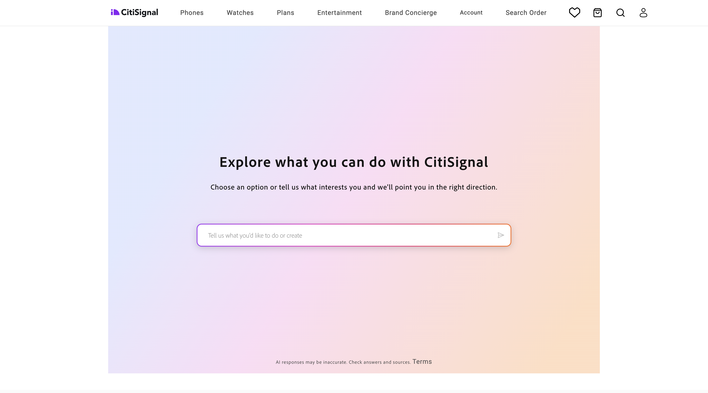

Go Back to [Brand Concierge](./brandconcierge.md){target="_blank"}

[Go Back to All Modules](./../../../overview.md){target="_blank"}