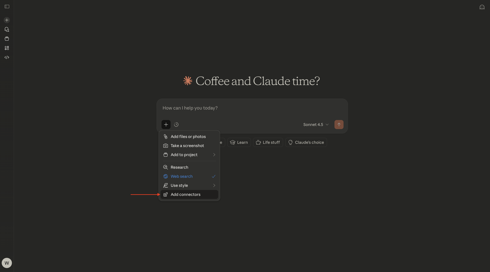
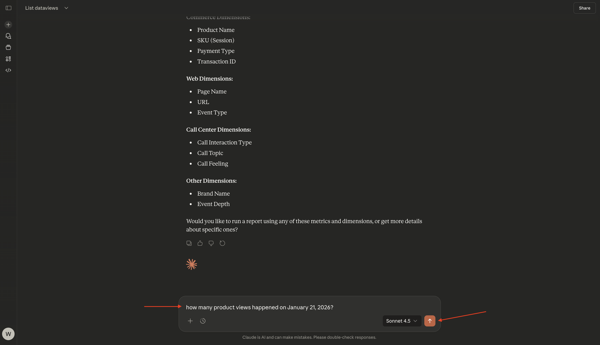
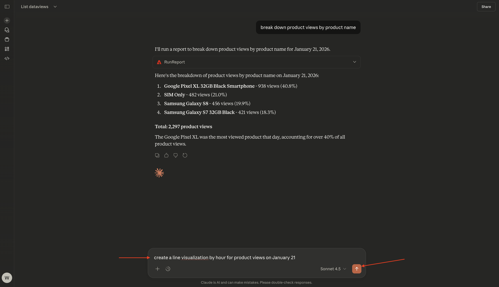

# 1.5.2 CJA & Claude.ai with MCP server

[!BADGE Alpha]

+++Alpha Details
By using the CJA & Claude.ai with MCP server Alpha, You hereby acknowledge that the Alpha is provided “as is” without warranty of any kind. Adobe shall have no obligation to maintain, correct, update, change, modify or otherwise support the Alpha. You are advised to use caution and not to rely in any way on the correct functioning or performance of such Alpha and/or accompanying materials. The Alpha is considered Confidential Information of Adobe. Any “Feedback” (information regarding the Alpha including but not limited to problems or defects you encounter while using the Alpha, suggestions, improvements, and recommendations) provided by You to Adobe is hereby assigned to Adobe including all rights, title, and interest in and to such Feedback.

+++


>[!NOTE]
>
>This exercise on setting up and using an MCP Server with Claude.ai to connect to CJA is related to this exercise [1.1 Customer Journey Analytics: Build a dashboard using Analysis Workspace on top of Adobe Experience Platform](./../../../modules/reporting-insights/cja-b2c/cjab2c-1/customer-journey-analytics-build-a-dashboard.md). The CJA dataview and connection that is being used in the below exercise is the dataview and connection that was set up in that exercise. If you want to replicate the below results,  you should follow those instructions first.

## Video

In this video, you'll get an explanation and demonstration of all the steps involved in this exercise.

>[!VIDEO](https://video.tv.adobe.com/v/3479561?quality=12&learn=on)

## 1.5.2.1 Create custom app in Claude.ai for CJA 

>[!NOTE]
>
>Using CJA in Claude.ai requires the following:
>- a paid version of Claude.ai
>- using the Claude.ai web client

Go to [https://claude.ai/](https://claude.ai/){target="_blank"} and log in using your account details. Once you're logged in, you should see this. Click the **+** icon.


Select **Add connectors**.



Click **add a custom one**.


Fill out the fields like this:

- **Name**: `CJA`
- **MCP Server URL**: check with your Adobe representative

Click **Add**.


You should then see this. Click **Connect**.


Once you're successfully authenticated, you should see this. Click the **+** icon to start a new chat.


Go to **+**, to **Connectors** and you should see that the **CJA** connector is now enabled.


You're now ready to start your data analysis.


## 1.5.2.2 Set context in CJA 

Before interacting further with CJA through Claude.ai, the context needs to be set.

For this exercise, the context needs to be set to use:

- **Dataview**: **--aepUserLdap-- - Omnichannel Data View**

The Dataview setting helps to identify which dataview Claude.ai should look at when asking questions.

Enter the following **Prompt** and click the **send** button.

```javascript
list dataviews
```


Select **Always allow**.


You should then see a similar list of available dataviews. 


To change that to the dataview that needs to be used, enter the following **Prompt** and click the **send** button.

```javascript
switch to dataview --aepUserLdap-- - Omnichannel Data View
```


Select **Always allow**.


You should then see this.


Your context is now properly set, so you can start sending specific prompts next.

## 1.5.2.3 Explore the dataview

>[!NOTE]
>
>The dataview being used here has been set up as part of exercise [Create a dataview](./../../../modules/reporting-insights/cja-b2c/cjab2c-1/ex3.md). 

Enter the following **Prompt** and click the **send** button to explore which metrics and dimensions are available to you.

```javascript
list the available metrics and dimensions
```


Select **Always allow** twice, once for retrieving **metrics** and a second time for retrieving **dimensions**.


You should then see this response, which includes the metrics and dimensions that were set up as part of the exercise [Create a dataview](./../../../modules/reporting-insights/cja-b2c/cjab2c-1/ex3.md). 


## 1.5.2.4 Freeform Table - Product Views

You can now start exploring the data. Start by entering the below prompt and click **send** to submit your report request.

```javascript
how many product views happened on January 21, 2026?
```



Select **Always allow**.


You should then see a response like this.


You can now break down the response by adding a dimension. Enter the following **prompt** and click the **send** button.

```javascript
break down product views by product name
```


You should then see a response like this.


You can now also create a visualization. Enter the following **prompt** and click the **send** button.

```javascript
create a line visualization by hour for product views on January 21
```



You should then see this.


You can now also download this line graph. Enter the following **prompt** and click the **send** button.

```javascript
export this chart to PNG
```


You should then see this. Click **Download**.


You can then open the downloaded PNG and use it in other documents.


Enter the following **prompt** and click the **send** button.

```javascript
can you breakdown product views by user agent?
```


You should then see this.


## 1.5.2.5 Fallout Visualization

Enter the following **prompt** and click the **send** button.

```javascript
can you create a fallout visualization for the product interaction funnel, starting with all traffic and then in the next steps add Product Views, Add to Cart and purchases?
```


You should then see something like this, which includes a visualization generated by Claude.ai based on the data provided by Customer Journey Analytics.


Next Step: [Adobe Analytics & Claude.ai with MCP server](./ex3.md){target="_blank"}

Go Back to [Analytics & Agents](./analyticsagents.md){target="_blank"}

[Go Back to All Modules](./../../../overview.md){target="_blank"}