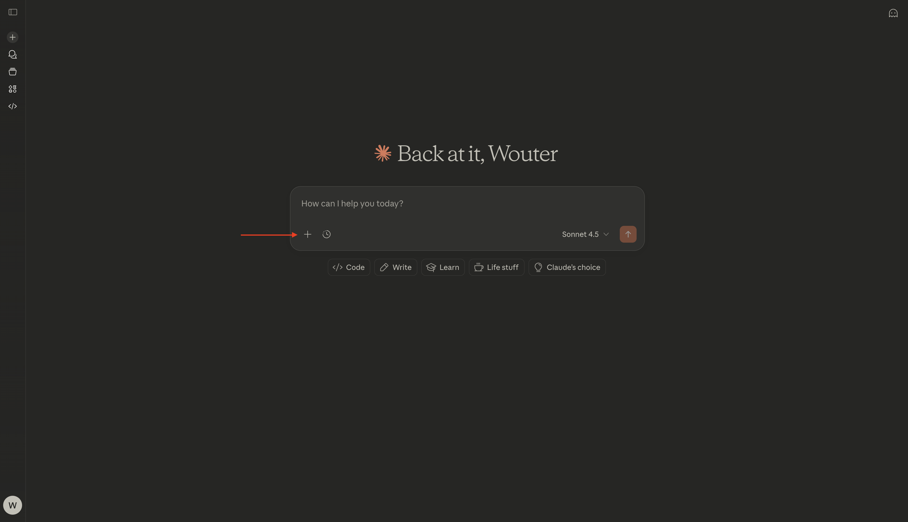
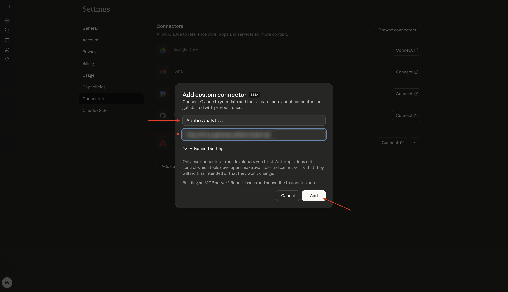
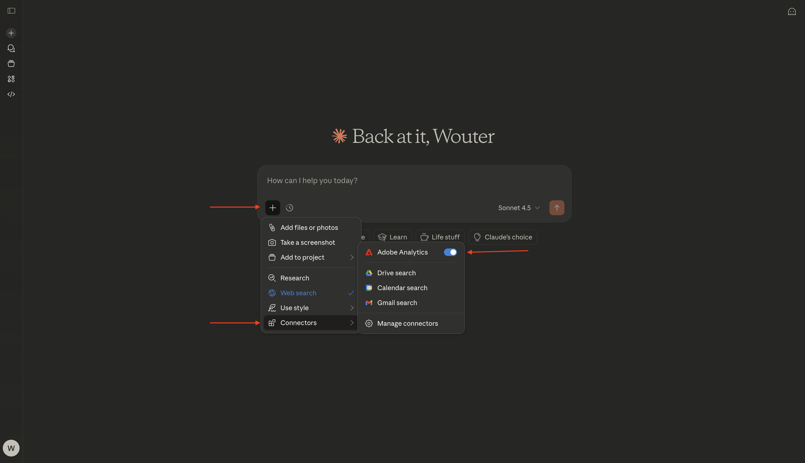
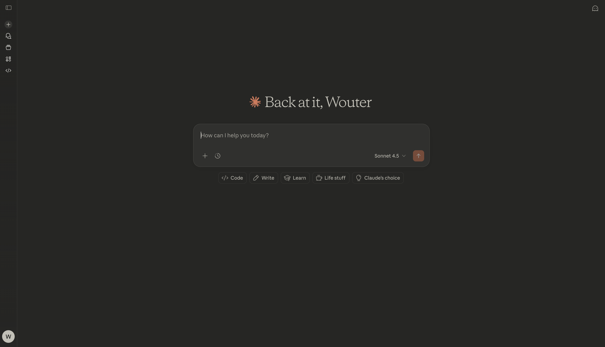
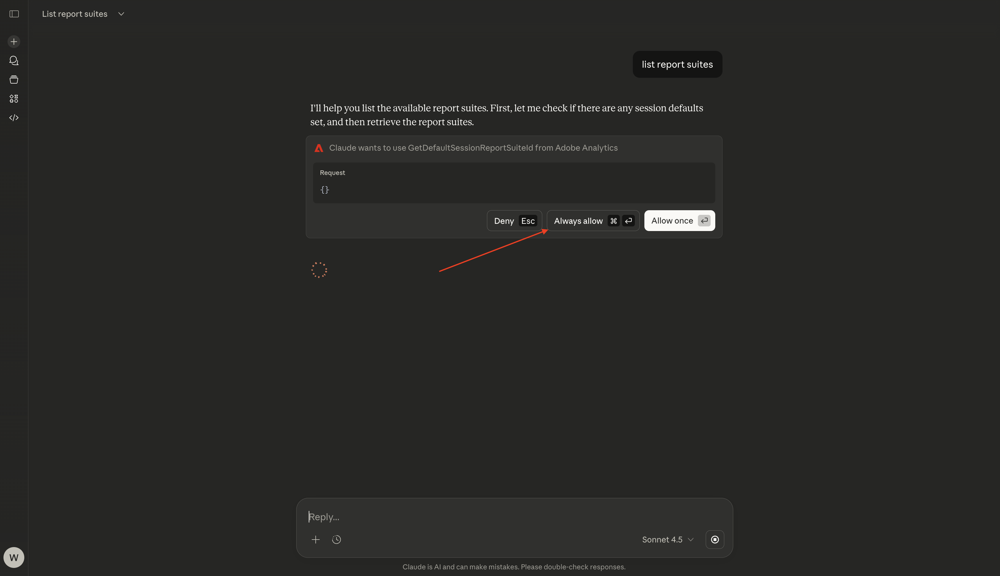
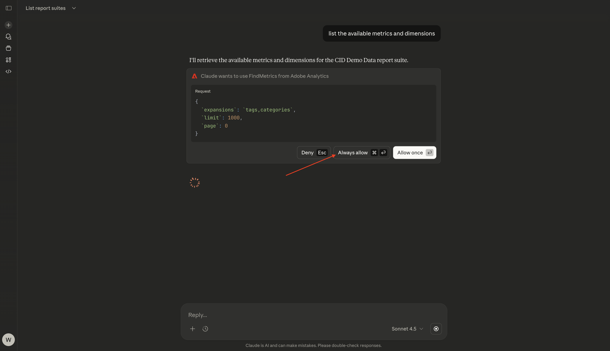
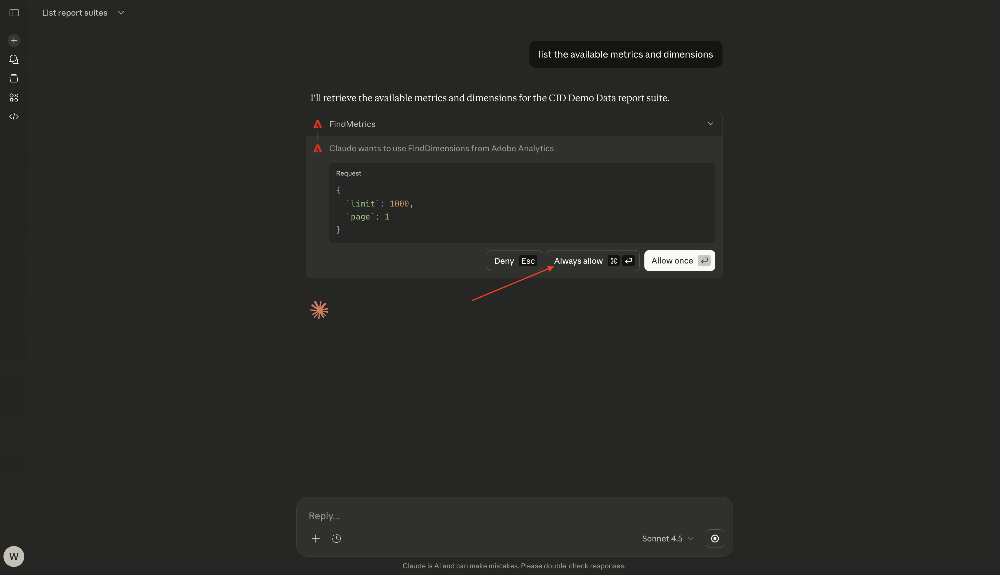
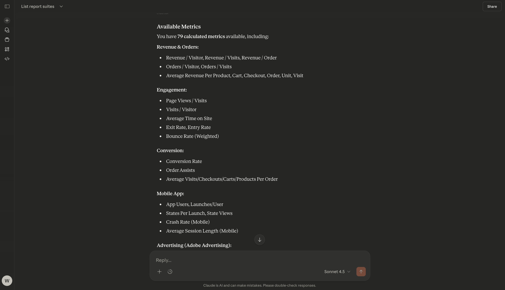
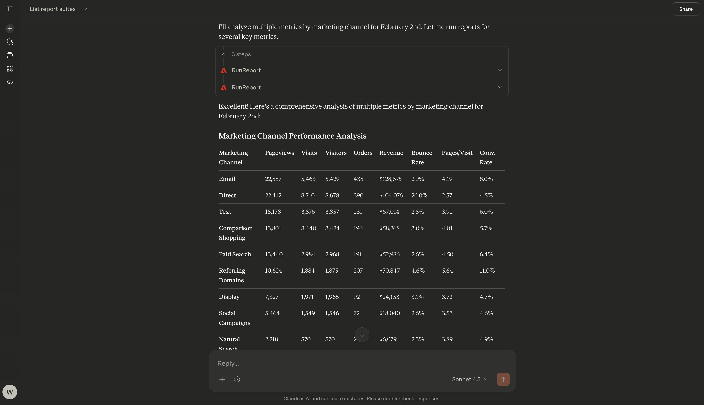

# 1.5.3 Adobe Analytics & Claude.ai with MCP server

[!BADGE Alpha]

+++Alpha Details
By using the CJA & Claude.ai with MCP server Alpha, You hereby acknowledge that the Alpha is provided “as is” without warranty of any kind. Adobe shall have no obligation to maintain, correct, update, change, modify or otherwise support the Alpha. You are advised to use caution and not to rely in any way on the correct functioning or performance of such Alpha and/or accompanying materials. The Alpha is considered Confidential Information of Adobe. Any “Feedback” (information regarding the Alpha including but not limited to problems or defects you encounter while using the Alpha, suggestions, improvements, and recommendations) provided by You to Adobe is hereby assigned to Adobe including all rights, title, and interest in and to such Feedback.

+++

## Video

In this video, you'll get an explanation and demonstration of all the steps involved in this exercise.

>[!VIDEO](https://video.tv.adobe.com/v/3479562?quality=12&learn=on)

## 1.5.3.1 Create custom app in Claude.ai for Adobe Analytics 

>[!NOTE]
>
>Using Adobe Analytics in Claude.ai requires the following:
>- a paid version of Claude.ai
>- using the Claude.ai web client

Go to [https://claude.ai/](https://claude.ai/){target="_blank"} and log in using your account details. Once you're logged in, you should see this. Click the **+** icon.



Select **Add connectors**.


Click **add a custom one**.


Fill out the fields like this:

- **Name**: `CJA`
- **MCP Server URL**: check with your Adobe representative

Click **Add**.



You should then see this. Click **Connect**.


Once you're successfully authenticated, you should see this. Click the **+** icon to start a new chat.


Go to **+**, to **Connectors** and you should see that the **Adobe Analytics** connector is now enabled.



You're now ready to start your data analysis.



## 1.5.3.2 Set context in Adobe Analytics

Before interacting further with CJA through Claude.ai, the context needs to be set.

For this exercise, the context needs to be set to use:

- **Report Suite**: **CID - Demo Data**

The Report Suite setting helps to identify which data Claude.ai should look at when asking questions.

Enter the following **Prompt** and click the **send** button.

```javascript
list report suites
```


Select **Always allow**.



Select **Always allow**.


You should then see something like this.


Enter the following **Prompt** and click the **send** button.

```javascript
use report suite CID Demo Data
```


Select **Always allow**.


Your report suite has now been selected.


## 1.5.2.3 Explore the report suite

Enter the following **Prompt** and click the **send** button to explore which metrics and dimensions are available to you.

```javascript
list the available metrics and dimensions
```


Select **Always allow**.



Select **Always allow** again.



You should then see this response, which includes the metrics and dimensions that were set up ain this report suite.



## 1.5.2.4 Reports

You can now start exploring the data. Start by entering the below prompt and click **send** to submit your report request.

```javascript
show me pageviews for Feb 2?
```


You should then see something like this.


Enter the following **Prompt** and click the **send** button.

```javascript
break down pageviews by page name
```


You should then see this.


Enter the following **Prompt** and click the **send** button.

```javascript
give me an overview of page names, page views by marketing channel
```


You should then see something like this.


Scroll down a little bit to see the analysis.


Enter the following **Prompt** and click the **send** button.

```javascript
Analyze different metrics by marketing channel
```


You should then see something like this.



You've now finished this exercise.

Go Back to [Analytics & Agents](./analyticsagents.md){target="_blank"}

[Go Back to All Modules](./../../../overview.md){target="_blank"}