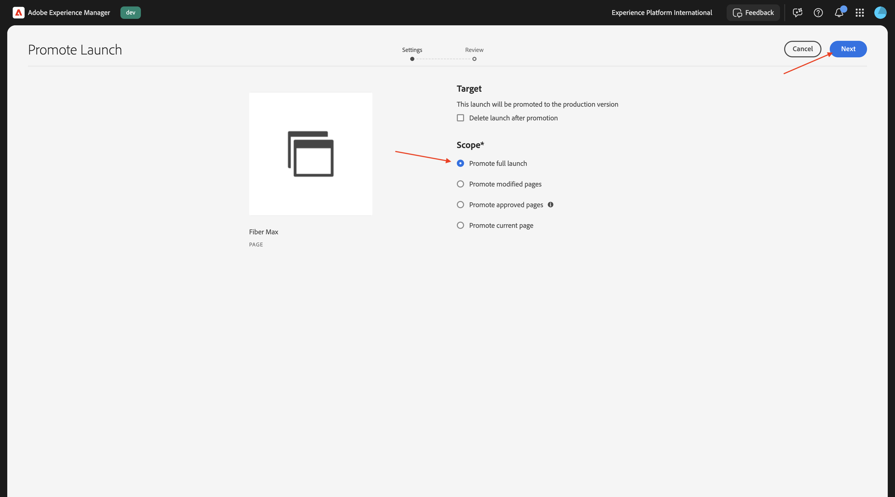
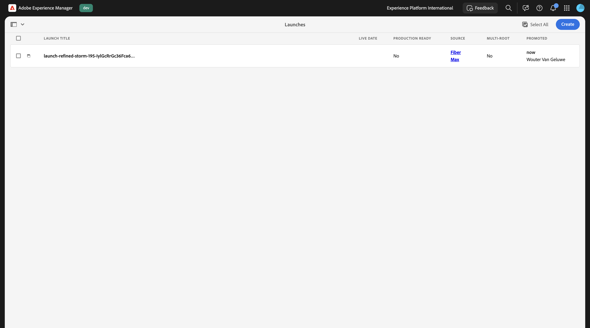

# 1.6.1 Getting started with AEM Agents

>[!IMPORTANT]
>
>In order to complete this exercise, you need to have access to a working AEM Sites and Assets CS with EDS environment and the various AEM Agents need to be enabled for the IMS Org you're using.
>
>If you don't have such an environment yet, go to exercise [Adobe Experience Manager Cloud Service & Edge Delivery Services](./../../../modules/asset-mgmt/module2.1/aemcs.md){target="_blank"}. Follow the instructions there, and you'll have access to such an environment.

>[!IMPORTANT]
>
>If you have previously configured an AEM CS Program with an AEM Sites and Assets CS environment, it may be that your AEM CS sandbox was hibernated. Given that dehibernating such a sandbox takes 10-15 minutes, it would be a good idea to start the dehibernation process now so that you don't have to wait for it at a later time.

## 1.6.1.1 Discovery Agent

The Adobe Experience Manager (AEM) Discovery Agent is an AI-powered tool within AEM as a Cloud Service that enables users to find, retrieve, and utilize content—including Assets, Content Fragments, and Adaptive Forms—using natural language prompts. It eliminates the need for manual, click-heavy, or complex filtering by understanding intent and searching across the repository.

In order to use **Discovery Agent**, you will first create some Tags in Adobe Experience Manager, and you will then tag some assets using those tags. Once that's done, you'll be able to use AI Assistant to discover assets in an easy and business-friendly way.

Go to [https://my.cloudmanager.adobe.com](https://my.cloudmanager.adobe.com){target="_blank"}. The org you should select is `--aepImsOrgName--`. 

### Create and use Tags with Assets

Click to open your Cloud Manager Program, which should be called `--aepUserLdap-- - CitiSignal AEM+ACCS`.


Click the URL of your environment to open it.


Click the **hammer** icon.


Under **General**, click **Tagging**.


You should then see this. Click **Create** and then select **Create Namespace**.


In the field **Title**, enter: `CitiSignal`. Click **Create**.


Drill down into the namespace **CitiSignal** by clicking it. Click **Create** and then select **Create Tag**.


In the field **Title**, enter: `Campaign`. Click **Submit**.


Select the tag **Campaign** by clicking it. Click **Create** and then select **Create Tag**.


In the field **Title**, enter: `Winter 2026`. Click **Submit**.


Select the tag **Campaign** by clicking it. Click **Create** and then select **Create Tag**.


In the field **Title**, enter: `Spring 2026`. Click **Submit**.


You should now have this.


Click **Adobe Experience Manager** and then click **Assets**.


Click **Files**.


Double-click the folder **CitiSignal** to open it.


Click **Create** and then select **Files**.


Download the file [citisignal-images-campaign.zip](./assets/citisignal-images-campaign.zip) and unzip it onto your desktop.


Select. the 3 files that you just downloaded and click **open**.


Click **Upload**.


You should then see this.


Select the first image and then click **Properties**.


Click the **folder**-icon under Tags.


Select the tag **Spring 2026** and click **Select**. Repeat that process for these images:

- citisignal_lion.png
- citisignal_leopard.png
- citisignal_gorilla.png
- citisignal_rabbit.png


Once you've selected that tag for all images, go to **Experience Manager Assets**.


Select the repo you're using.


Go to **Assets** and open the folder **CitiSignal**.


Open the first image.


Select **Approved** and then click **Save**.


Under **Tags**, you can see the tag that you selected previously.


Repeat that process so that all 4 images are approved.


Next, go to **My workspace** and click to open **AI Assistant**.


Enter the following prompt and click **Send**.

```javascript
find all assets tagged with 'Spring 2026'
```


In case you have access to multiple AEM Assets CS environments you will see something like this. Click the proposed answer for the environment you wish to use and then click **Send**.


You should then see a similar answer. Click the icon to expand the AI Assistant to full screen.


Review the answers.


From within the AI Assistant window, you can click to view any of these assets.


You will then be taken directly into AEM Assets CS, to that specific image.


You can then also review any of the other available metadata.


## 1.6.1.2 Experience Production Agent

### Content Update - Assets

The Content Update skill updates existing content — including content fragments, pages, forms and assets — with ease. The agent can perform actions such as updating, removing, replacing, or adding content elements to keep experiences accurate and current. Inputs can be natural language description, and when used with Jira PDFs and screenshots can provide input too.

Go back to the AI Assistant screen.


Enter the following prompt and click **Send**.

`Generate multiple social media formats (Instagram 1080x1920, Facebook 1200x630, Twitter 1200x675) for the third image`


After a couple of minutes, you should see a similar response.


Review the images that were generated.


### Content Update - Pages

Go back to your Adobe Experience Manager Author environment and then go to **Sites**.


Go to **CitiSignal**. Click **Create** and select **Page**.


Select **Page** and click **Next**.


Enter the following values:

- Title: **Fiber Max**
- Name: **fiber-max**
- Page Title: **Fiber Max**

Click **Create**.


Select **Open**.


You should then see this. 


Click in the blank area to select the **section** component. Then, click the plus **+** icon in the right menu and select **Hero**.


You should then see this. Click **+ Add** to add an image.


Select your assets repository. Then, open the folder **CitiSignal**.


Choose the image of the lion that you uploaded earlier. Click **Select**.


You should then see this. Click the **text** area to change the text.


Paste this text in the are:

```
This winter, be as fast as a lion.
```

Select **Heading 1** and then click **Done**.


You should then see this. Go to **Content tree** and select the area **Section**.


Click the **+** icon and then select **Cards**.


You should then see this. Make sure that in the **Content tree**, **Cards** is selected.

Then, click the button **+** 4 times.


You should now see this, where there are 4 **Card** objects in the **Cards** object.


Select the first **Card**. Click the **text** area to change the text.


Paste the following text. Make sure the first line of text is using **Heading 1**. Click **Done**.

```
99.9% network reliability

Game, video chat and stream on multiple devices with ultra low lag.
```


Select the second **Card**. Click the **text** area to change the text.


Paste the following text. Make sure the first line of text is using **Heading 1**. Click **Done**.

```
3-year

price lock guarantee

For new and existing Fiber Max customers on all internet plans.

No hidden fees.
```


Select the third **Card**. Click the **text** area to change the text.


Paste the following text. Make sure the first line of text is using **Heading 1**. Click **Done**.

```
More ways to save

Save over 45% on the best entertainment with CitiSignal
```


Select the fourth **Card**. Click the **text** area to change the text.


Paste the following text. Make sure the first line of text is using **Heading 1**. Click **Done**.

```
Get Fiber Max now!

Fill out the form here to get started.
```


You should now have this. Click **Publish**.


Click **Publish** again.


Click **Open Page**.


Copy the URL of the page as you'll need it next.

The URL should be similar to this: `https://author-pXXXXXX-eXXXXXXX.adobeaemcloud.com/content/CitiSignal/fiber-max.html`.


Go to [https://experience.adobe.com/#/experiencemanager/](https://experience.adobe.com/#/experiencemanager/). Click to open **AI Assistant**.


```
On the page XXX, please make the following changes:

- change the word 'Winter' to 'Spring'
- change the word 'lion' to 'leopard'
- change the image in the hero block to use the image 'citisignal_leopard.png'
- change the text '99.9% network reliability' to '99.999% network reliability'
```

Replace XXX in this text to the URL that you copied in the previous step.


After 1-2 minutes, you should see this. Enter the prompt `generate` and click **Send**.


A couple of minutes later, you should see a confirmation like this that the changes have been performed. Click **Preview the updated page**.


You now get a visual confirmation of the changes that have been done. This preview page is purely for informational purpose, you can't take action from this page.


To take action, click **Edit in AEM**. 


In the Universal Editor, you now see all the changes in detail, with the ability the change anything. Once you've reviewed the page, click **Publish**.


Click **Publish** again. The change you've made isn't published to your production environment yet. Instead, it's been published under **Launches** in AEM. 

Launches enable you to efficiently develop content for a future release. A Launch is created to allow you to make changes in preparation for future publication, at the same time as maintaining your current pages. This means that you are effectively editing two versions at the same time: pages that are currently published, and a version of those pages, to be published at a time in the future. Once that time arrives you can replace the original pages and publish the new version.


To **Promote** your pending changes for a future release, go back to AEM. Click **Adobe Experience Manager** at the top of the page, click the **hammer** icon and then select **Launches**.


You should now see a pending **Launch**. Check the checkbox in front of the pending **Launch**.


Click **Promote**.


Select **Promote full launch** and click **Next**.



Click **Promote**.


You should now see this. Your changes are in production now.



Refresh your page, you should now see all your changes on the published page.


### Content Update - Form Creation

The Form Creation skill enables users to build adaptive forms through natural language prompts without dependency on development or IT teams. This capability accelerates form development while maintaining brand consistency and allowing business users to create forms without deep technical product knowledge.


## Next Steps

Go Back to [AEM & Agents](./aemagents.md){target="_blank"}

[Go Back to All Modules](./../../../overview.md){target="_blank"}