# 1.6.1 Getting started with AEM Agents

>[!IMPORTANT]
>
>Your AEM CS sandbox may be hibernated. Given that dehibernating a sandbox takes 10-15 minutes, it would be a good idea to start the dehibernation process now so that you don't have to wait for it at a later time.

>[!IMPORTANT]
>
>Before you begin, read the below instructions!

## Instructions for live workshops

For this exercise, you need to use:

- **Instance**: **Adobe Tech Insiders**
- **Username**: adobetechinsiders-XXX@adobeeventlab.com
- **Password**: use the password that was shared with you
- **AEM Program**: Tech Insiders - AEM + ACCS XXX which you can access through [https://my.cloudmanager.adobe.com](https://my.cloudmanager.adobe.com)
- **GitHub repository**: [https://github.com/woutervangeluwe/techinsidersXXX-citisignal-aem-accs](https://github.com/woutervangeluwe/techinsidersXXX-citisignal-aem-accs)

## 1.6.1.1 Discovery Agent

The Adobe Experience Manager (AEM) Discovery Agent is an AI-powered tool within AEM as a Cloud Service that enables users to find, retrieve, and utilize content—including Assets, Content Fragments, and Adaptive Forms—using natural language prompts. It eliminates the need for manual, click-heavy, or complex filtering by understanding intent and searching across the repository.

In order to use **Discovery Agent**, you will first create some Tags in Adobe Experience Manager, and you will then tag some assets using those tags. Once that's done, you'll be able to use AI Assistant to discover assets in an easy and business-friendly way.

Go to [https://my.cloudmanager.adobe.com](https://my.cloudmanager.adobe.com). The org you should select is `--aepImsOrgName--`. 

### Create and use Tags with Assets

Click to open your Cloud Manager Program, which should use of the below naming options:

- **`Tech Insiders - AEM + ACCS X`** whereby X stands for the number that was assigned to you.
- **`Tech Insiders On Demand - AEM + ACCS X`** whereby X stands for the number that was assigned to you.
- **`--aepUserLdap-- - CitiSignal AEM+ACCS`**, in this case you don't have a number as you're using your own AEM program that you created yourself.

In this example, the program **Tech Insiders - AEM + ACCS 100** will be used. You should use your own program.


Click the URL of your environment to open it.


Click the **tools** icon.


Under **General**, click **Tagging**.


You should then see this. Click **Create** and then select **Create Namespace**.

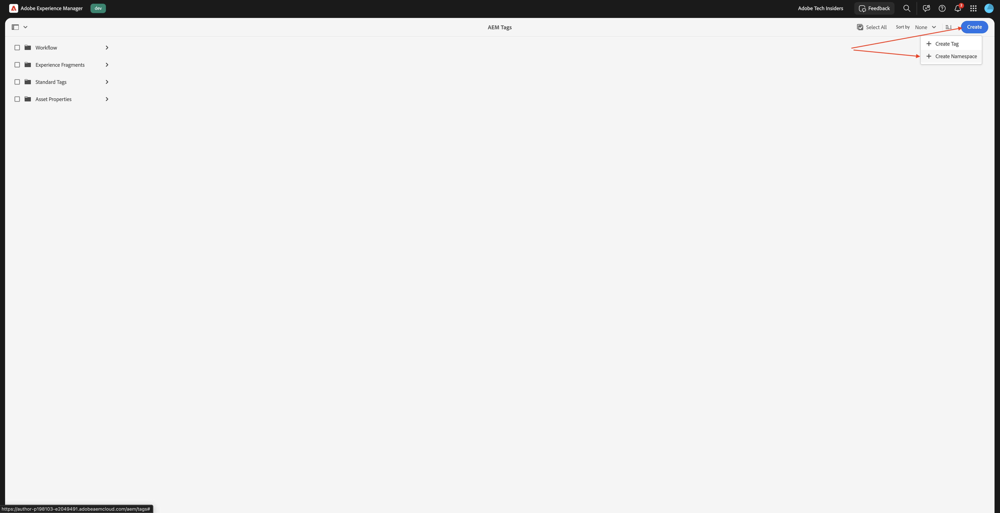

In the field **Title**, enter: `--aepUserLdap-- - CitiSignal`. Click **Create**.


Drill down into the namespace **`--aepUserLdap-- - CitiSignal`** by clicking it. Click **Create** and then select **Create Tag**.


In the field **Title**, enter: `--aepUserLdap-- - Campaign`. Click **Submit**.


Select the tag **`--aepUserLdap-- - Campaign`** by clicking it. Click **Create** and then select **Create Tag**.

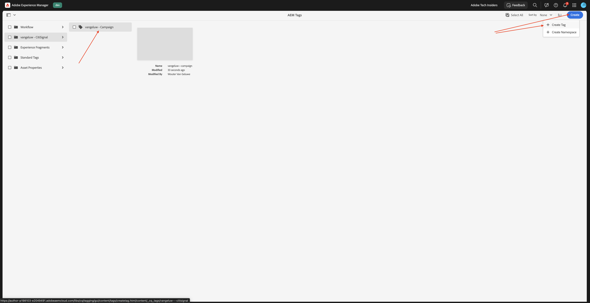

In the field **Title**, enter: `--aepUserLdap-- - Winter 2026`. Click **Submit**.


Select the tag **Campaign** by clicking it. Click **Create** and then select **Create Tag**.


In the field **Title**, enter: `--aepUserLdap-- - Spring 2026`. Click **Submit**.


You should now have this.

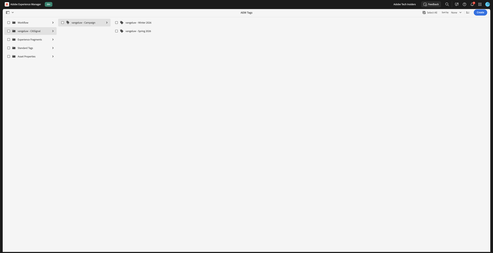

Click **Adobe Experience Manager** and then click **Assets**.


Click **Files**.


Click the folder **CitiSignal** to open it.


Click **Create** and then select **Files**.


Download the file [citisignal-images-campaign.zip](./assets/citisignal-images-campaign.zip) and unzip it onto your desktop.


Select the 3 files that you just downloaded and click **open**.


Click **Upload**.


You should then see this.


Select the first image (citisignal_lion.png) and then click **Properties**.


Click the **folder**-icon under Tags.


Select the tag **`--aepUserLdap-- - Spring 2026`** and click **Select**. 


Click **Save & Close**.

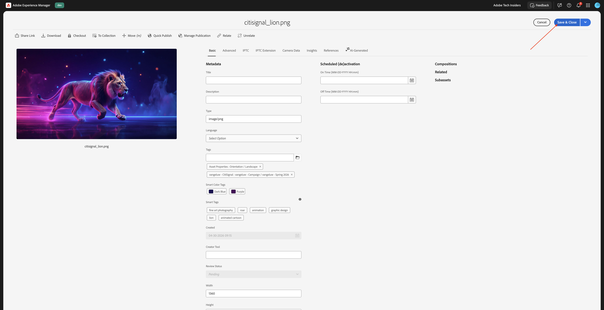

Repeat these for these images:

- `citisignal_leopard.png`
- `citisignal_gorilla.png`
- `citisignal_neon_rabbit.png`

Once you've selected that tag for all images, go to **Experience Manager Assets**.


Click the **profile** icon at the top right of your screen. Click **Switch view**.


You should then see this.


Doubmle-click to open the first image.


Select **Approved** and then click **Save**.


Under **Tags**, you can see the tag that you selected previously.


Repeat that process so that all 4 images are approved.


Next, go to **My workspace** and click to open **AI Assistant**.


Go to [https://experience.adobe.com/#/coworker/chat](https://experience.adobe.com/#/coworker/chat). Sign in using your Adobe account. After logging in, click your user initials in the bottom left part of the screen and make sure you've selected the correct instance and sandbox by changing selecting them as indicated below.

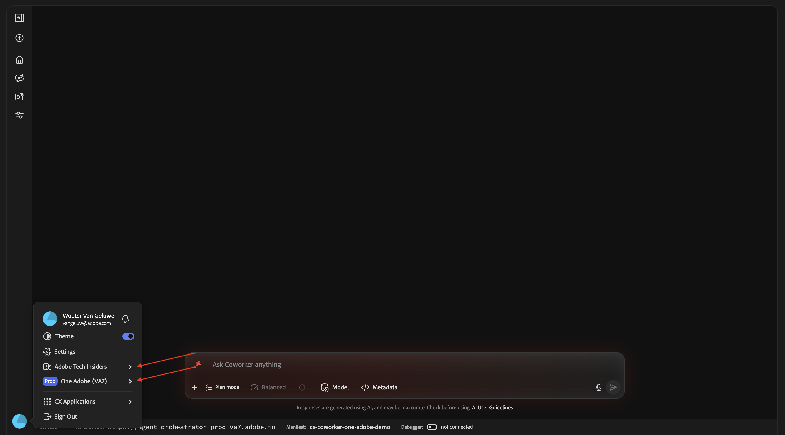

Enter the following prompt and click **Send**.

```javascript
find all assets tagged with '--aepUserLdap-- - Spring 2026'
```

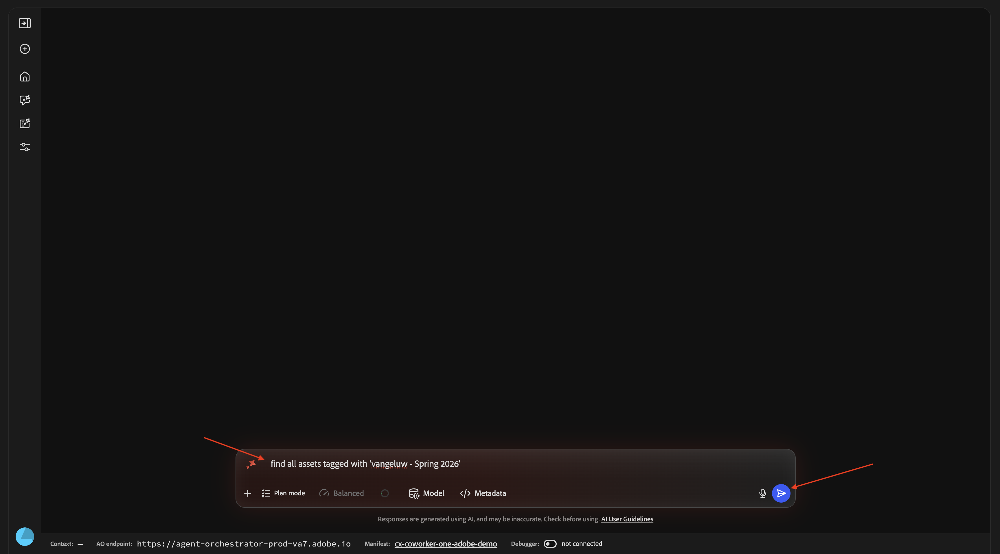

In case you have access to multiple AEM Assets CS environments you will see something like this. Either you can enter the number of your environment, or you can speicfy the full path of your AEM Assets environemtn and then click **Send**.

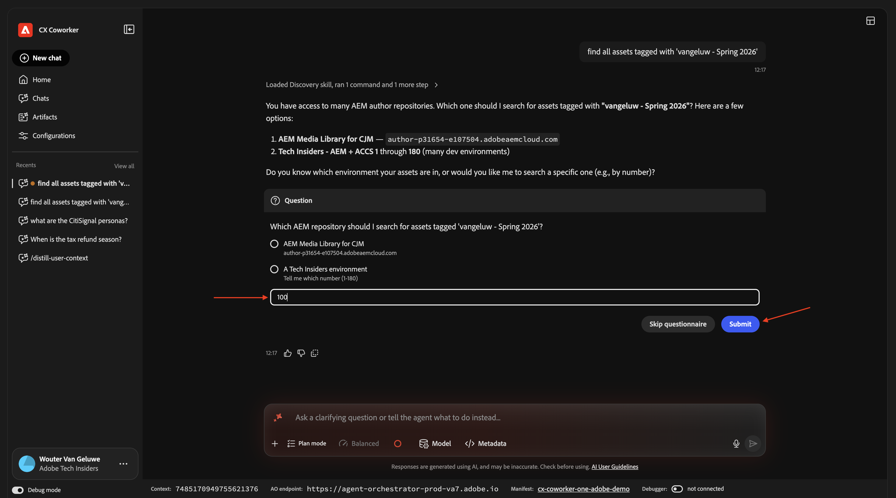

You should then see a similar answer.


Click the link on any of the assets.

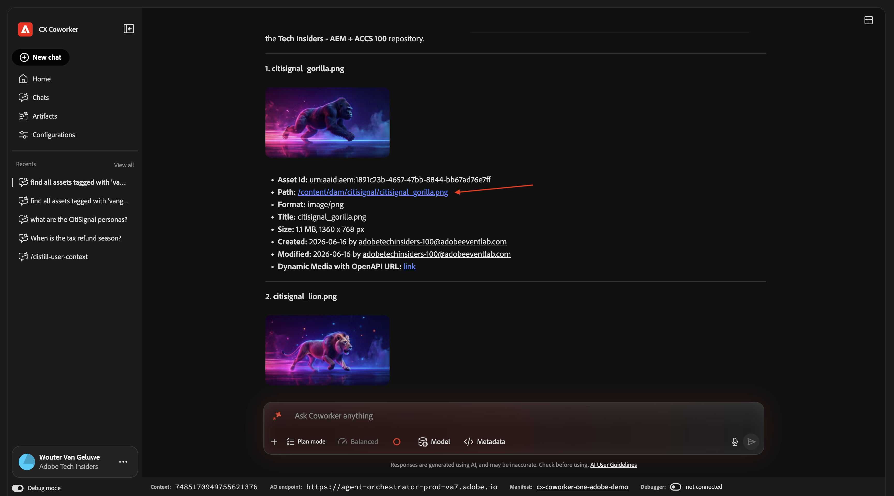

You will then see an enlarged view of the asset you selected, with some metadata.

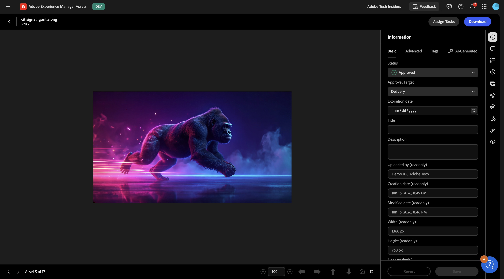

## 1.6.1.2 Experience Production Agent

### Content Update - Assets

The Content Update skill updates existing content — including content fragments, pages, forms and assets — with ease. The agent can perform actions such as updating, removing, replacing, or adding content elements to keep experiences accurate and current. Inputs can be natural language description, and when used with Jira PDFs and screenshots can provide input too.

Go back to the AI Assistant screen. Close the side panel.

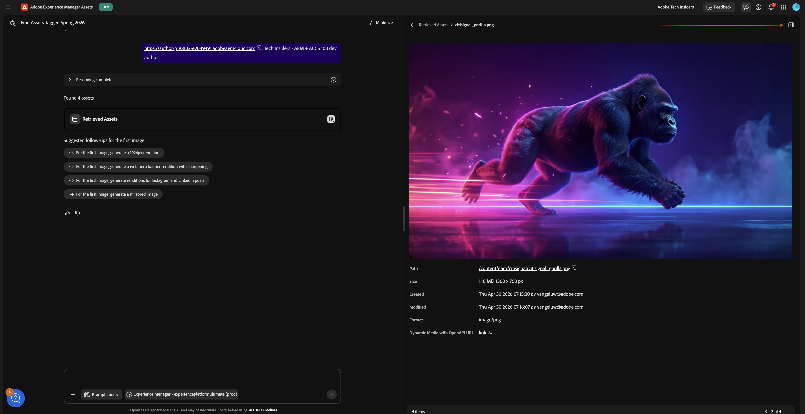

Select one of the proposed prompts and click **Send**.

`For the first image, generate renditions for Instagram and LinkedIn posts`

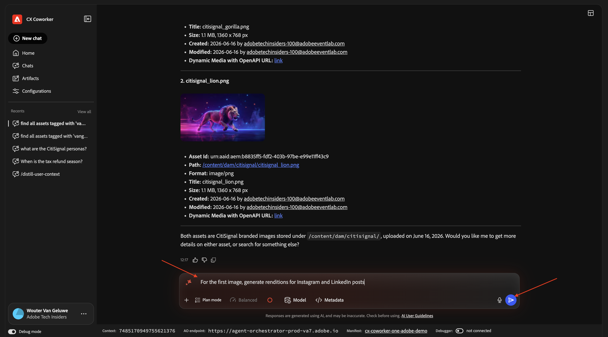

After a couple of minutes, you should see a similar response.

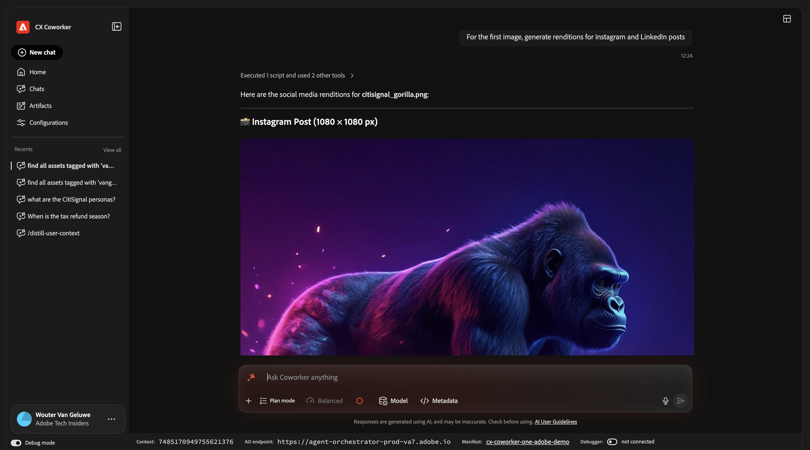

Review the images that were generated.

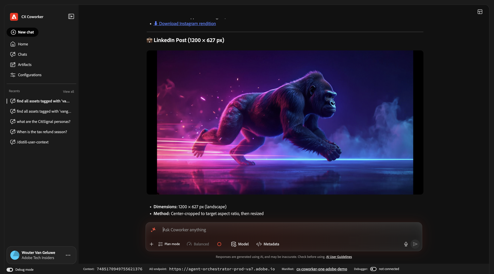

Feel free to experiment with other prompts. Scroll up and select one of the other proposed prompts, or enter your own, and click **Send**.

`For the first image, generate a mirrored image`

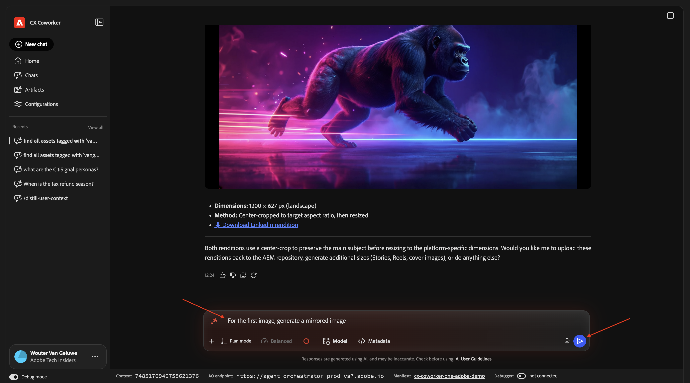

Review the image that was generated.

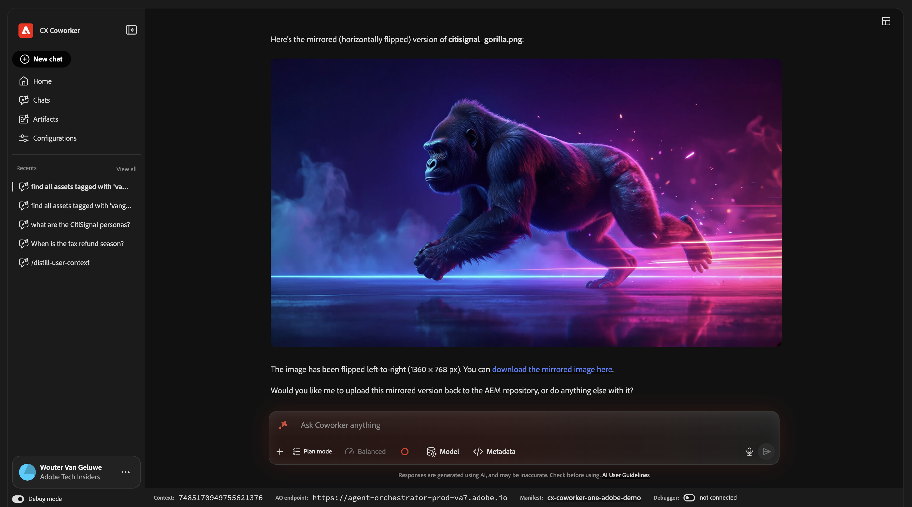

### Content Update - Pages

Go back to your Adobe Experience Manager Author environment and then go to **Sites**.


Go to **CitiSignal**. Click **Create** and select **Page**.


Select **Page** and click **Next**.


Enter the following values:

- Title: **Fiber Max**
- Name: **fiber-max**
- Page Title: **Fiber Max**

Click **Create**.


Select **Open**.


You should then see this. 


Click in the blank area to select the **section** component. Then, click the plus **+** icon in the right menu and select **Hero**.

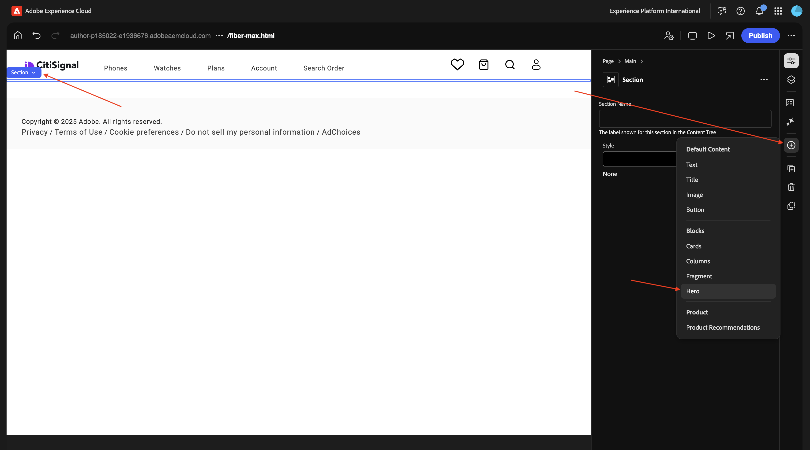

You should then see this. Click **+ Add** to add an image.


Select your assets repository. Then, open the folder **CitiSignal**.


Choose the image of the lion that you uploaded earlier. Click **Select**.


You should then see this. Click the **text** area to change the text.


Paste this text in the are:

```
This winter, be as fast as a lion.
```

Select **Heading 1** and then click **Done**.


You should then see this. Go to **Content tree** and select the area **Section**.


Click the **+** icon and then select **Cards**.

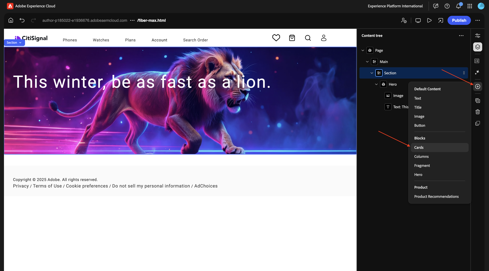

You should then see this. Make sure that in the **Content tree**, **Cards** is selected.

Then, click the button **+** 4 times.


You should now see this, where there are 4 **Card** objects in the **Cards** object.


Select the first **Card**. Click the **text** area to change the text.


Paste the following text. Make sure the first line of text is using **Heading 1**. Click **Done**.

```
99.9% network reliability

Game, video chat and stream on multiple devices with ultra low lag.
```


Select the second **Card**. Click the **text** area to change the text.


Paste the following text. Make sure the first line of text is using **Heading 1**. Click **Done**.

```
3-year

price lock guarantee

For new and existing Fiber Max customers on all internet plans.

No hidden fees.
```


Select the third **Card**. Click the **text** area to change the text.


Paste the following text. Make sure the first line of text is using **Heading 1**. Click **Done**.

```
More ways to save

Save over 45% on the best entertainment with CitiSignal
```


Select the fourth **Card**. Click the **text** area to change the text.

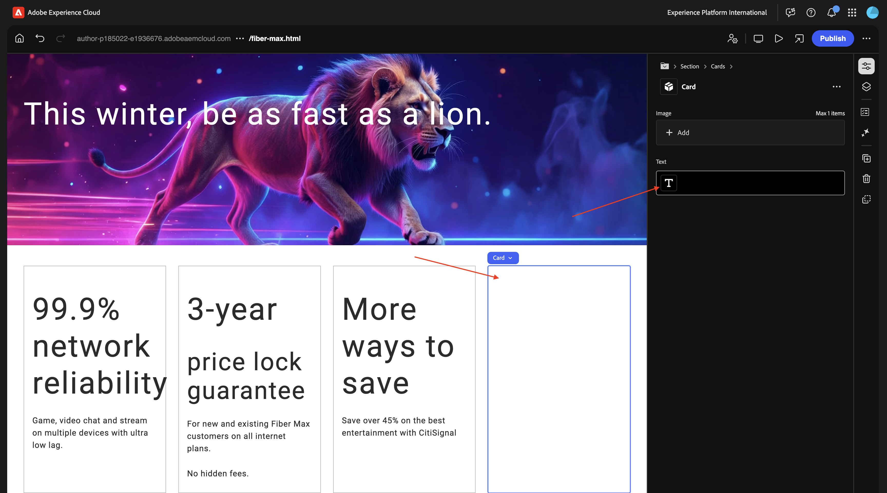

Paste the following text. Make sure the first line of text is using **Heading 1**. Click **Done**.

```
Get Fiber Max now!

Fill out the form here to get started.
```


You should now have this. Click **Publish**.


Click **Publish** again.


Click **Open Page**.


Copy the URL of the page as you'll need it next.

The URL should be similar to this: `https://author-pXXXXXX-eXXXXXXX.adobeaemcloud.com/content/CitiSignal/fiber-max.html`.

>[!NOTE]
>
>You will need to use this URL again at a later time so please write it down in a separate word document, or keep it open in a separate tab in your browser.


Go back to your CX Enterprise Coworker chat on [https://experience.adobe.com/#/coworker/chat](https://experience.adobe.com/#/coworker/chat).

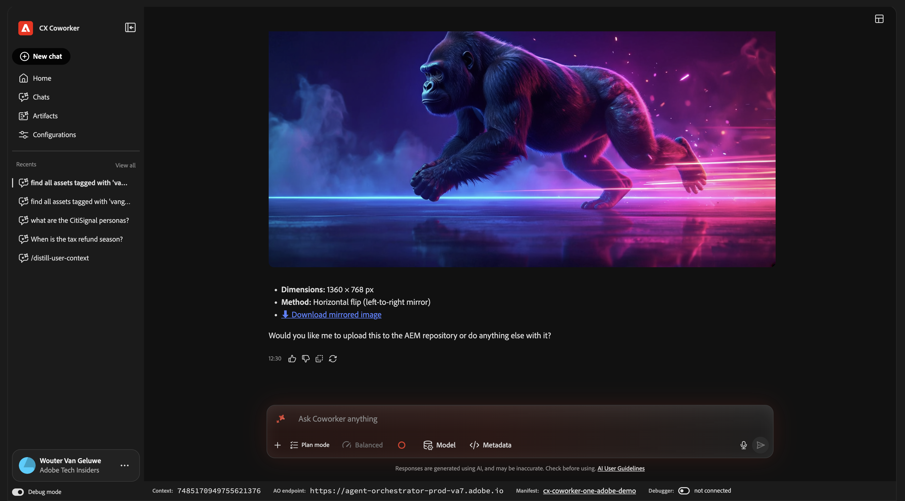

Paste the following prompt and click **send**. Replace XXX in this prompt by the URL that you copied in the previous step.

```
On the page XXX, please make the following changes:

- change the word 'winter' to 'spring'
- change the word 'lion' to 'leopard'
- change the image in the hero block to use the image 'citisignal_leopard.png'
- change the text '99.9% network reliability' to '99.999% network reliability'
```

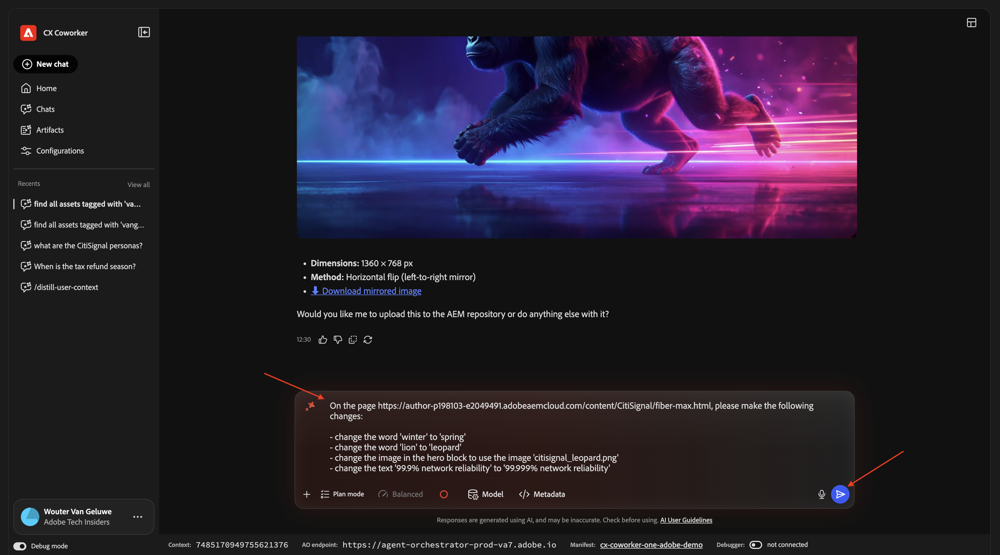

After 1-2 minutes, you should see this. Select the prompt `Proceed` and click **Submit**.

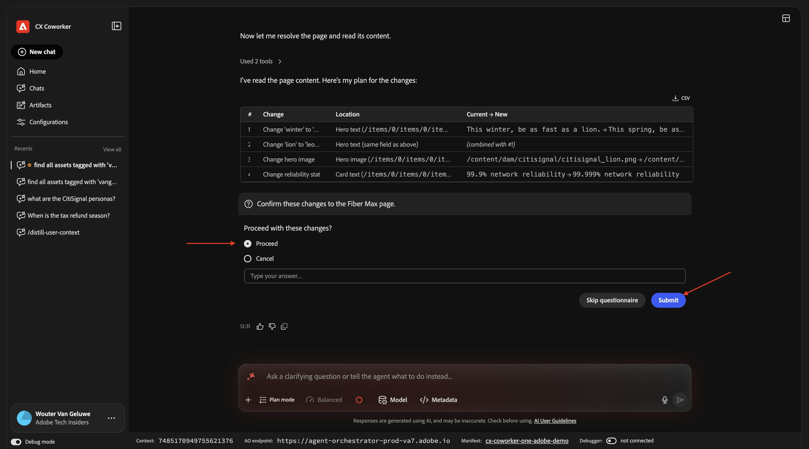

A couple of minutes later, you should see a confirmation like this that the changes have been performed. Click the **Preview** link.

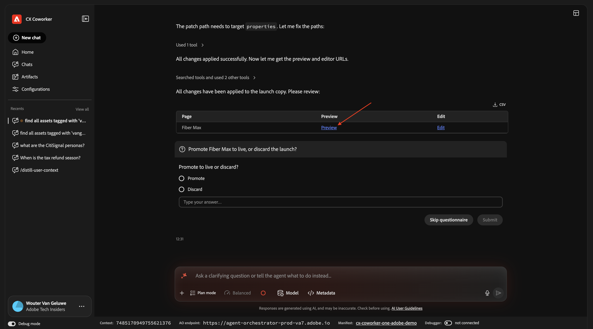

You now get a visual confirmation of the changes that have been done. This preview page is purely for informational purpose, you can't take action from this page.

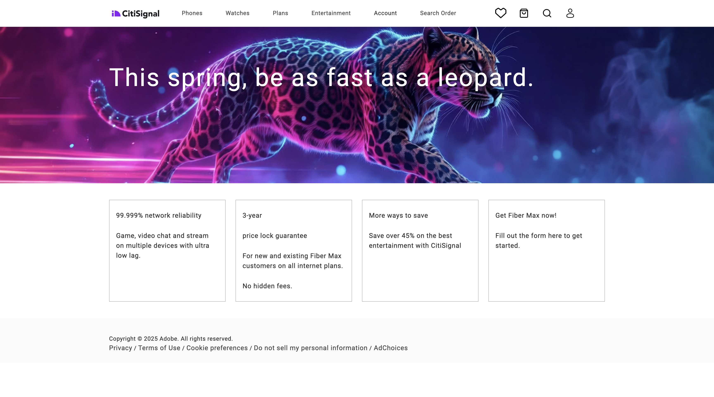

To take action, click **Edit**. 

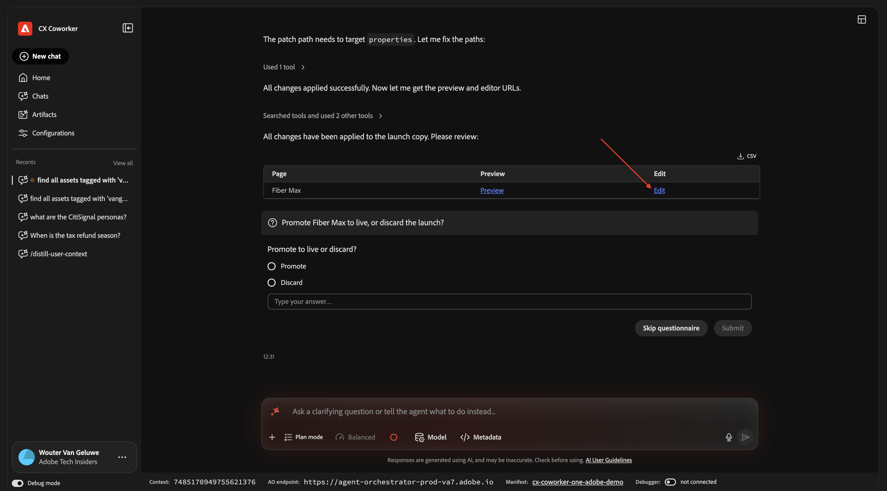

In the Universal Editor, you now see all the changes in detail, with the ability the change anything. 


Go back to your Coworker chat. Select **Promote** and then click **Submit**.

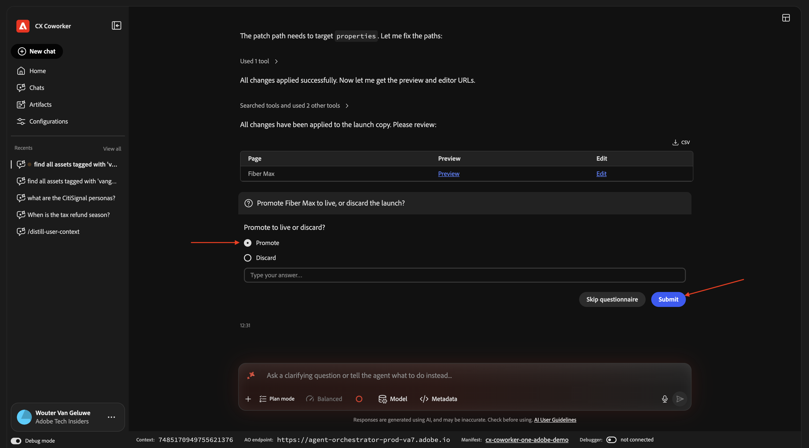

Refresh your page, you should now see all your changes on the published page.


### Content Update - Form Creation

The Form Creation skill now enables users to build adaptive forms through natural language prompts without dependency on development or IT teams. This capability accelerates form development while maintaining brand consistency and allowing business users to create forms without deep technical product knowledge.

Go back to your CX Enterprise Coworker chat on [https://experience.adobe.com/#/coworker/chat](https://experience.adobe.com/#/coworker/chat).

Enter the following prompt and click **send**.

```
Create a new adaptive form using Edge Delivery Services and the existing CitiSignal site, with the following details:
- Form name: "citisignal-fiber-max-interest-2"
- Form fields: 4 text input fields are needed, for "first-name", "last-name", "email" and "city"
```

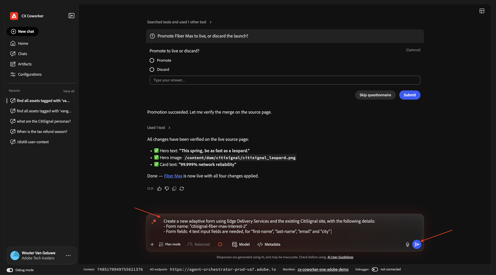

You should then get an answer like this one.

Enter the following prompt and click **send**.

```
can you create the adaptive form for me?
```

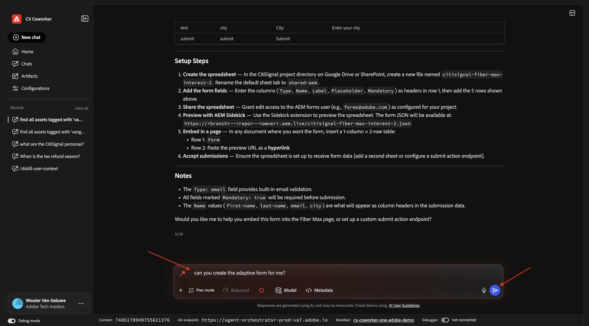

## Next Steps

Go to [1.6.2 AEM MCP Servers & Cursor](./ex2.md){target="_blank"}

Go Back to [AEM & Agents](./aemagents.md){target="_blank"}

[Go Back to All Modules](./../../../overview.md){target="_blank"}

