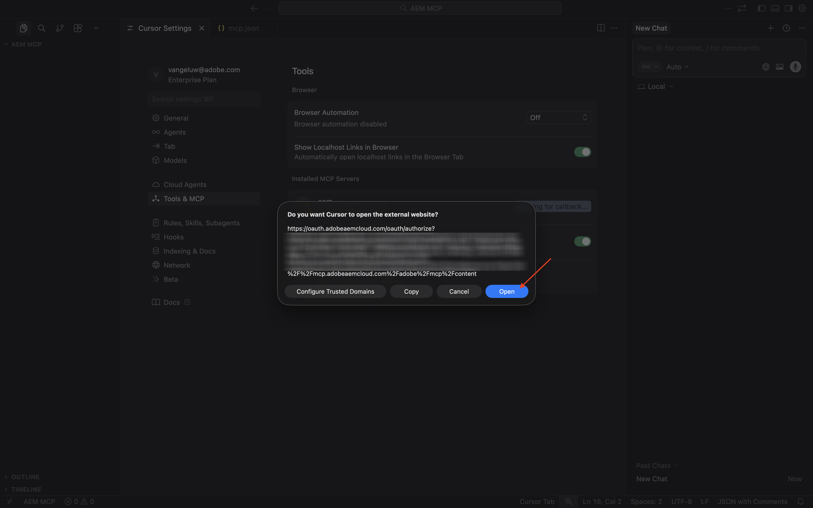
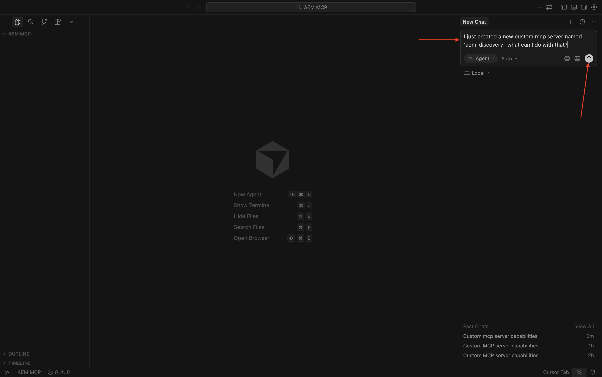

# 1.6.2 AEM MCP Servers & Cursor

>[!IMPORTANT]
>
>In order to complete this exercise, you need to have access to a working AEM Sites and Assets CS with EDS environment and the various AEM Agents need to be enabled for the IMS Org you're using.
>
>If you don't have such an environment yet, go to exercise [Adobe Experience Manager Cloud Service & Edge Delivery Services](./../../../modules/asset-mgmt/module2.1/aemcs.md){target="_blank"}. Follow the instructions there, and you'll have access to such an environment.

>[!IMPORTANT]
>
>If you have previously configured an AEM CS Program with an AEM Sites and Assets CS environment, it may be that your AEM CS sandbox was hibernated. Given that dehibernating such a sandbox takes 10-15 minutes, it would be a good idea to start the dehibernation process now so that you don't have to wait for it at a later time.


Here are all the available AEM MCP servers:

- https://mcp.adobeaemcloud.com/adobe/mcp/content
- https://mcp.adobeaemcloud.com/adobe/mcp/content-readonly (Read-only Content Operations)
- https://mcp.adobeaemcloud.com/adobe/mcp/content-updater (Exposes the corresponding skill from Experience Production Agent)
- https://mcp.adobeaemcloud.com/adobe/mcp/experience-governance (Exposes skills to get and check brand policy for a page)
- https://mcp.adobeaemcloud.com/adobe/mcp/discovery (Exposes skills to discover content in an AEM environment)

In this exercise, you'll find instructions on how to use these specific MCP severs:

- https://mcp.adobeaemcloud.com/adobe/mcp/content
- https://mcp.adobeaemcloud.com/adobe/mcp/discovery 

You can use the below instructions to set up similar MCP servers for the other available AEM MCP servers as the process is very similar.

## 1.6.2.1 Experience Production Agent Cursor MCP Server setup

Create a new empty folder on your desktop.


Open Cursor. Click **Open project**.


Select he folder you created before and click **Open**.


Click **Yes, I trust the authors**.


You should then see this. Use the keyboard shortcut `Cmd + Shift + J` to open Cursor settings. You should then see this. Go to **Tools& MCP**.


Click **+ New MCP Server**.


Add the following MCP server to the file **mcp.json**. There may be other MCP Servers already specified in this file - don't remove those and just add the below new lines. Save your changes.

```json
"aem": {
	"url": "https://mcp.adobeaemcloud.com/adobe/mcp/content"
	}
```


Switch back to the tab **Cursor Settings**. You should now see a tool called **aem** added in the list of MCP servers. Click **connect** to authenticate using your Adobe account.


Click **Open** in case you see this message. You should then authenticate in your browser.



After successful authentication, you should see something like this.


Close the **Cursor Settings** and **mcp.json** tabs. Paste the following prompt in the chat and click **send**.

```
I just created a new custom mcp server named 'aem'. what can I do with that?
```


Click **Run**.


You should then see a similar response.


As you can see, similar capabilities are exposed through the MCP server in Cursor as compared to what was possible using AI Assistant in the previous exercise.

Enter the following prompt and click **Send**.

```javascript
List AEM Author instances
```


You should then see something like this. Search for the environment you want to use and then enter the following prompt and click **Send**.

```javascript
use environment number X
```


You should then see this.


Paste the following prompt and click **send**. Replace XXX in this prompt by the URL that you copied in the previous exercise.

```
On the page https://author-p185022-e1936676.adobeaemcloud.com/content/CitiSignal/fiber-max.html, please make the following changes:

- change the word 'winter' to 'summer'
- change the text 'be as fast as a leopard' to 'dominate your internet like a gorilla'
- change the image in the hero block to use the image 'citisignal_gorilla.png'
- change the text '99.9% network reliability' to '99.998% network reliability'
```


After 1-2 minutes, you should get a similar response. Copy the URL and open the page in your browser.


You should then see this.


Enter the following prompt and click **Send**.

```javascript
promote the changes by creating a new launch and promoting it
```


After 1-2 minutes, the changes have been promoted.


You can now see the changes live on your website.


Feel free to explore the other capabilities of the AEM MCP Server.

## 1.6.2.2 Discovery Agent Cursor MCP Server setup

Use the keyboard shortcut `Cmd + Shift + J` to open Cursor settings. You should then see this. Go to **Tools& MCP**. Click **+ New MCP Server**.


Add the following MCP server to the file **mcp.json**. There may be other MCP Servers already specified in this file - don't remove those and just add the below new lines. Save your changes.

```
,
"aem-discovery": {
	"url": "https://mcp.adobeaemcloud.com/adobe/mcp/discovery"
}
```


Switch back to the tab **Cursor Settings**. You should now see a tool called **aem** added in the list of MCP servers. Click **connect** to authenticate using your Adobe account.


After authenticating, you should see this.


Close the **Cursor Settings** and **mcp.json** tabs. Paste the following prompt in the chat and click **send**.

```
I just created a new custom mcp server named 'aem-discovery'. what can I do with that?
```



```
for the environment https://author-pXXXXXX-eXXXXXXX.adobeaemcloud.com/, list all assets tagged with 'Spring 2026'
```


You should then see something like this.


## Next Steps

Go Back to [AEM & Agents](./aemagents.md){target="_blank"}

[Go Back to All Modules](./../../../overview.md){target="_blank"}