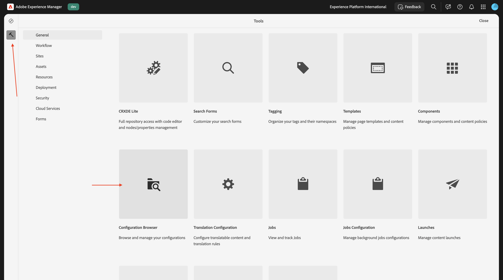
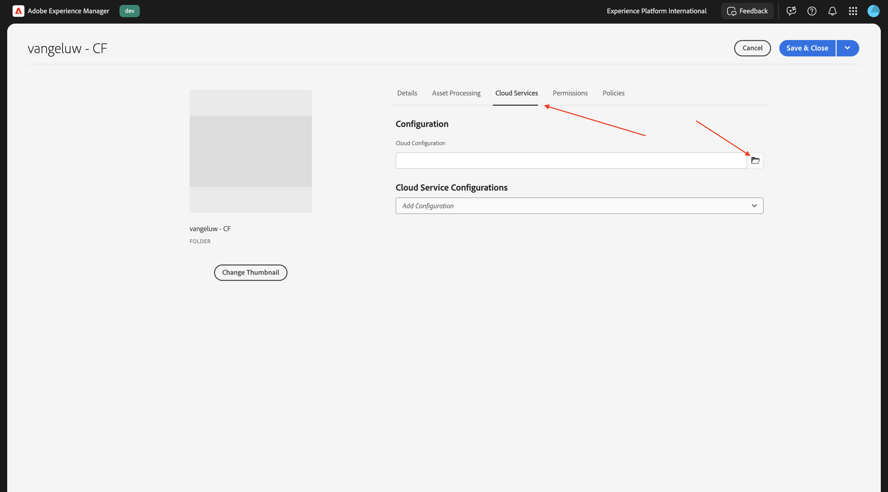
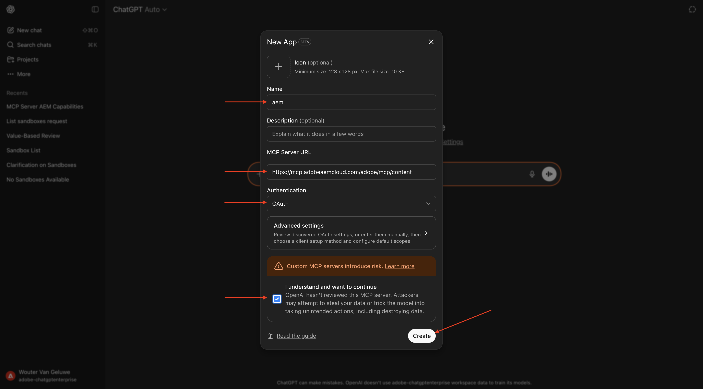
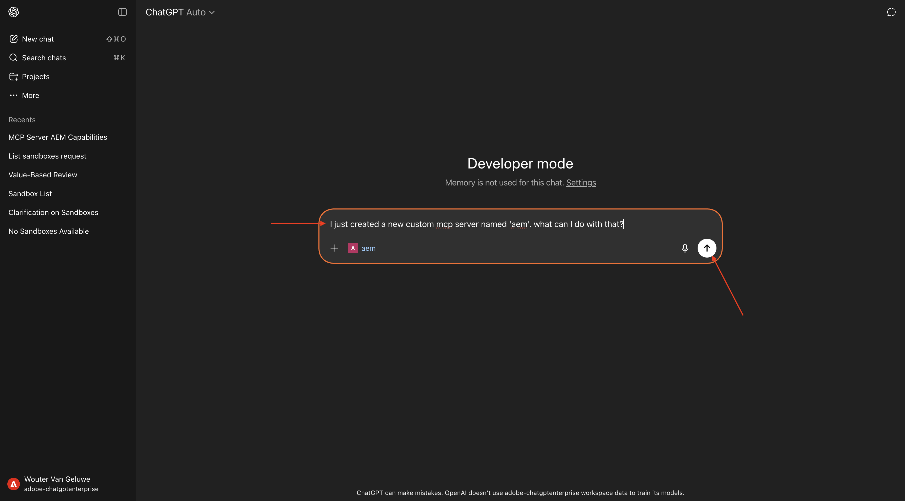
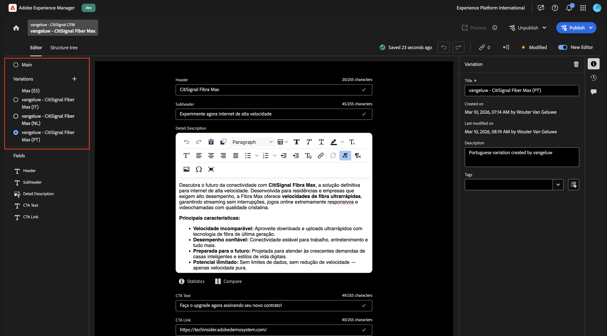

# 1.6.3 Scale Content Fragments with ChatGPT & MCP Server

>[!IMPORTANT]
>
>Your AEM CS sandbox may be hibernated. Given that dehibernating a sandbox takes 10-15 minutes, it would be a good idea to start the dehibernation process now so that you don't have to wait for it at a later time.

>[!IMPORTANT]
>
>Before you begin, read the below instructions!

## Instructions: Partner Lab New Orleans

For this exercise, you need to use:

- **Instance**: **Adobe Tech Insiders**
- **Username**: adobetechinsiders-XXX@adobeeventlab.com
- **Password**: use the password that was shared with you
- **AEM Program**: Tech Insiders - AEM + ACCS XXX which you can access through [https://my.cloudmanager.adobe.com](https://my.cloudmanager.adobe.com)
- **GitHub repository**: [https://github.com/woutervangeluwe/techinsidersXXX-citisignal-aem-accs](https://github.com/woutervangeluwe/techinsidersXXX-citisignal-aem-accs)

## 1.6.3.1 Create Content Fragment Model

Go back to your Adobe Experience Manager Author environment, to **Tools** and then go to **Configuration Browser**.



Click **Create**.


Use `Content Fragments` for the fields **Title** and **Name**.

Make sure the options **Content Fragment Models** and **GraphQL Persisted Queries** are both enabled.

Click **Create**.


Go back to your Adobe Experience Manager Author environment and then go to **Content Fragments**.


Go to **Content Fragment Models**, select your configuration **Content Fragments** and then click **Create**.


Use the name `--aepUserLdap-- - CitiSignal CFM`. Click **Create and open**.


You should then see this. Drag and drop a **Single line text** field onto the canvas.


Change the field **Field label** to `Header`.


Go back to **Data Types**. Drag and drop a **Single line text** field onto the canvas.


Change the field **Field label** to `Subheader`.


Go back to **Data Types**. Drag and drop a **Multi line text** field onto the canvas.


Change the field **Field label** to `Detail Description`.


Go back to **Data Types**. Drag and drop a **Single line text** field onto the canvas.


Change the field **Field label** to `CTA Text`.


Go back to **Data Types**. Drag and drop a **Single line text** field onto the canvas.


Change the field **Field label** to `CTA Link`. Click **Save**.


You should then see this.


Select your content fragment model and click **Publish**.


Click **Publish**.


## 1.6.3.2 Create Content Fragment

Go back to your Adobe Experience Manager Author environment and then go to **Content Fragments**.


You should then see this. Click **Create** and then select **Folder**.


Enter the title: `--aepUserLdap-- - CF`. Click **Create**.


Go back to your Adobe Experience Manager Author environment and then go to **Assets**.


Go to **Files**.


Select the folder you just created, which should be named `--aepUserLdap-- - CF` and click **Properties**.


Go to **Cloud Services** and then click the **folder** icon.



Select the cloud configuration you created before, which should be named **Content Fragments**. Click **Select**.


You shoudl then see this. Click **Save & Close**.


Go back to your Adobe Experience Manager Author environment and then go to **Content Fragments**.


You should then see this. Click **Create** and then select **Content Fragment**.


Select the **Content Fragment Model** you created before, which should be named `--aepUserLdap-- - CitiSignal CFM`. Use the name `--aepUserLdap-- CitiSignal Fiber Max`.

Click **Create and open**.


You should then see this.


Fill out the fields like this:

- **Header**: `CitiSignal Fiber Max`
- **Subheader**: `Experience high speed internet now`
- **Detail Description**:

```
Experience the future of connectivity with CitiSignal Fiber Max, the ultimate solution for high-speed internet. Designed for homes and businesses that demand performance, Fiber Max delivers blazing-fast fiber speeds, ensuring seamless streaming, ultra-responsive gaming, and crystal-clear video calls.

Key Features:

Unmatched Speed: Enjoy lightning-fast downloads and uploads powered by cutting-edge fiber technology.
Reliable Performance: Consistent connectivity for work, entertainment, and everything in between.
Future-Ready: Built to handle the growing demands of smart homes and digital lifestyles.
Unlimited Potential: No data caps, no throttling—just pure speed.
Why Choose CitiSignal Fiber Max? Stay ahead with internet that works as hard as you do. Whether you're powering a remote office or streaming in 4K, Fiber Max ensures you never miss a beat.
```

**CTA Text**: `Upgrade now by signing your new contract!`
**CTA Link**: `https://techinsiders68.adobedemosystem.com/`

Click **Publish** and then select **Now**.


Click **Publish**.


## 1.6.3.3 Configure MCP server in ChatGPT

>[!NOTE]
>
>Using Adobe Marketing Agent in ChatGPT requires the following:
>- a paid version of OpenAI's ChatGPT Enterprise
>- using the ChatGPT Enterprise web client

Go to [https://chatgpt.com/](https://chatgpt.com/){target="_blank"} and log in using your account details. Once you're logged in, you should see this. Click your username and then select **Settings**.


Go to **Apps** and then select **Advanced settings**.


Turn on **Developer mode** and then click **Back**.


Click **Create app**.


Fill out the fields like this:

- **Name**: `aem`
- **MCP Server URL**: `https://mcp.adobeaemcloud.com/adobe/mcp/content`
- **Authentication**: `OAuth`

Check the checkbox for **I understand and want to continue**.

Click **Create**.



ChatGPT will now attempt to connect to your Adobe account. Select **Allow Access** and then you'll have to log in with your Adobe account.

Once you've logged in successfully, you should see that your Adobe Marketing Agent is now connected successfully.


## 1.6.3.4 Use AEM MCP server in ChatGPT

Close this window.


You should then see this. Click the **+** icon, go to **More** and then select **aem**.


Enter the following prompt and click **Send**.

```
I just created a new custom mcp server named 'aem'. what can I do with that?
```



You should then see something like this. Enter the following prompt and click **Send**.

```
use the author url https://author-pXXXXXX-eXXXXXXX.adobeaemcloud.com/ from now on
```


You should then see something like this. Enter the following prompt and click **Send**.

```
find the content fragment --aepUserLdap-- - CitiSignal Fiber Max and make a variation called --aepUserLdap-- - CitiSignal Fiber Max (FR), then translate all fields into french
```


Click **CreateFragmentVariation**.


Click **UpdateFragment**.


You should then see this. Your fragment variation has been created successfully.


You can now see your new variation in the AEM UI as well.


Next, use ChatGPT to translate your content fragment into more variations. Enter the following prompt and click **Send**.

```
now do the same thing for the 5 top country's languages that CitiSignal does business with
```


Confirm your language choice.


Click **CreateFragmentVariation**.


Click **UpdateFragment**.


Repeat this process for each of the languages you selected. Once done, you should see something like this.


Go back to your AEM UI and refresh your screen. You can now see your new variations in your content fragment.



## Next Steps

Go Back to [AEM & Agents](./aemagents.md){target="_blank"}

[Go Back to All Modules](./../../../overview.md){target="_blank"}

