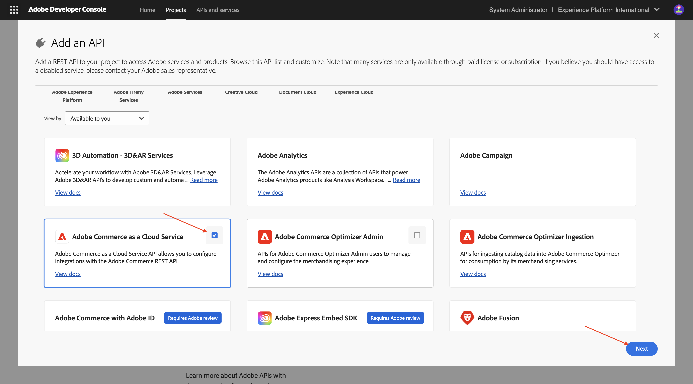
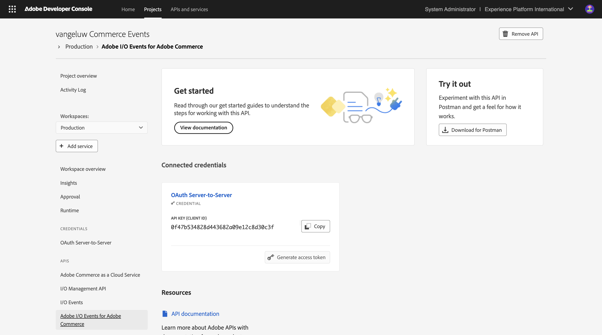
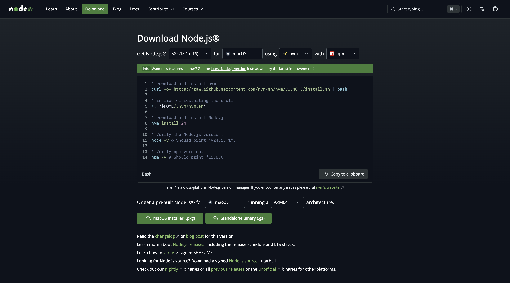

# 1.7.1 Setting up your development environment

## 1.7.1.1 Create your Adobe I/O project

Go to [https://developer.adobe.com/console/home](https://developer.adobe.com/console/home){target="_blank"}.

Make sure to select the correct instance in the top right corner of your screen. Your instance is `--aepImsOrgName--`. 

>[!NOTE]
>
> The below screenshot shows a specific org being selected. When you are going through this tutorial, it is very likely that your org has a different name. When you signed up for this tutorial, you were provided with the environment details to use, please follow those instructions.

Next, select **Create project from template**.

Select **App Builder**.

Enter the name `--aepUserLdap-- Commerce Events`. Click **Save**.

You should then see something like this.

Click **+ Add service** and then select **API**.

Search and select the API **I/O Events**. Click **Next**.

Change the name of the credential to `vangeluw Commerce Events - Production`. Click **Save configured API**.

You should then see this. Click **+ Add service** and then select **API**.

Search and select the API **I/O Management API**. Click **Next**.

Click **Save configured API**.

You should then see this. Click **+ Add service** and then select **API**.

Search and select the API **Adobe Commerce as a Cloud Service**. Click **Next**.

Select **Server-to-Server Authentication**. Click **Next**.

Click **Next**.

Select **Default - Cloud Manager**. Click **Save configured API**.

You should then see this. Click **+ Add service** and then select **API**.

Search and select the API **Adobe I/O Events for Adobe Commerce**. Click **Next**.

Click **Save configured API**.

Your project is now set up and can be used.

## 1.7.1.2 Configure your development environment

In order to create, submit and deploy your extensible app, your local development environment on your computer should have the following applications and packages installed:

- Node.js (version 20.x or higher)
- npm (packaged with Node.js)
- Adobe Developer command-line interface (CLI)

In case these applications or packages aren't installed yet on your computer, follow these steps.

### Node.js & npm

Go to [https://nodejs.org/en/download](https://nodejs.org/en/download). You should then see this, with a number of terminal commands that need to be executed in order to have Node.js and npm installed. The commands that are shown here are applicable to MacBook.

First, open a new terminal window. Paste and execute the command mentioned on line 2 in the screenshot:

`curl -o- https://raw.githubusercontent.com/nvm-sh/nvm/v0.40.3/install.sh | bash`

Next, execute the command on line 5 in the screenshot:

`\. "$HOME/.nvm/nvm.sh"`

After having executed both commands successfully, run this command:

`node -v`

You should see a version number being returned.

Next, run this command:

`npm -v`

In case NPM isn't installed yet, you can install it using this command: `npm install -g npm@11.9.0`.

You should see a version number being returned.

If the last 2 commands successfully returned a version number, then your configuration of these 2 capabilities is successful.

### Adobe Developer command-line interface (CLI)

To install the Adobe Developer command-line interface (CLI), run the following command in a terminal window:

`npm install -g @adobe/aio-cli`

Running this command may take a couple of minutes, the end result should be similar to this:

The Adobe Developer command-line interface (CLI) is now also successfully installed.

### Adobe Developer command-line interface (CLI) SDK extension for Commerce

To install the Adobe I/O SDK extension for Commerce, run the following command in a terminal window:

`npm install @adobe/aio-commerce-sdk`

### Adobe Commerce plugins for Adobe I/O CLI

To install the Adobe Commerce plugins for Adobe I/O CLI, run the following command in a terminal window:

`aio plugins:install https://github.com/adobe-commerce/aio-cli-plugin-commerce @adobe/aio-cli-plugin-app-dev @adobe/aio-cli-plugin-runtime`

You've now set up the basic elements to be able to run an App Builder project, in combination with Adobe Commerce, Adobe I/O Events and Adobe I/O Runtime.

## Next Steps

Go to [Use Cursor to develop your project](./ex2.md){target="_blank"}

Go Back to [Intelligent Developer Tools for Adobe Commerce](./aiassisteddev.md){target="_blank"}

[Go Back to All Modules](./../../../overview.md){target="_blank"}
