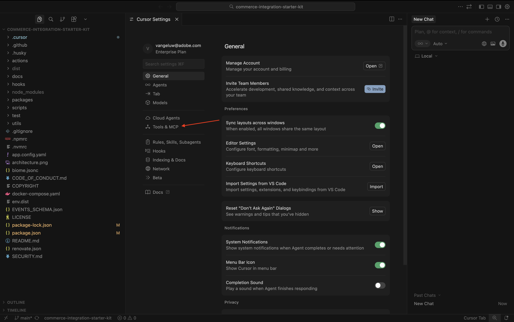
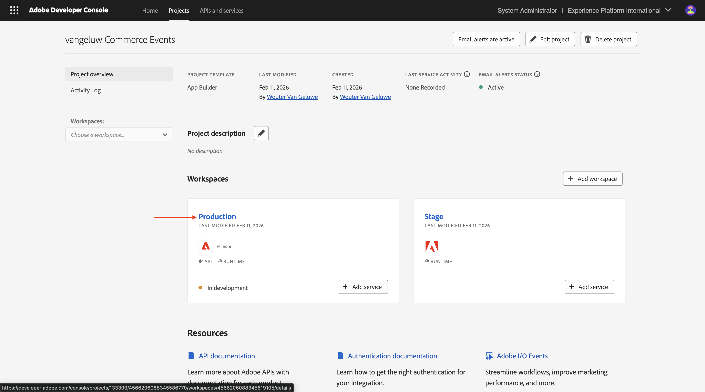
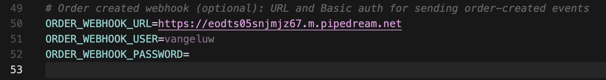
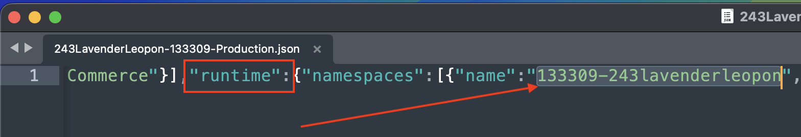
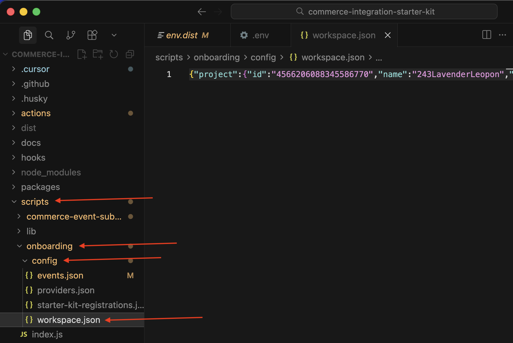
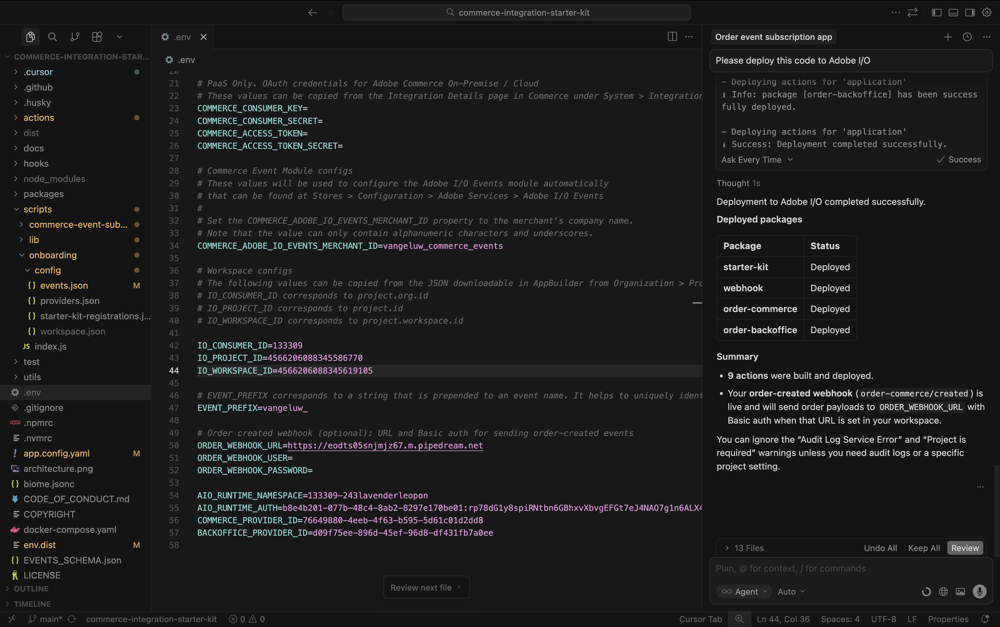
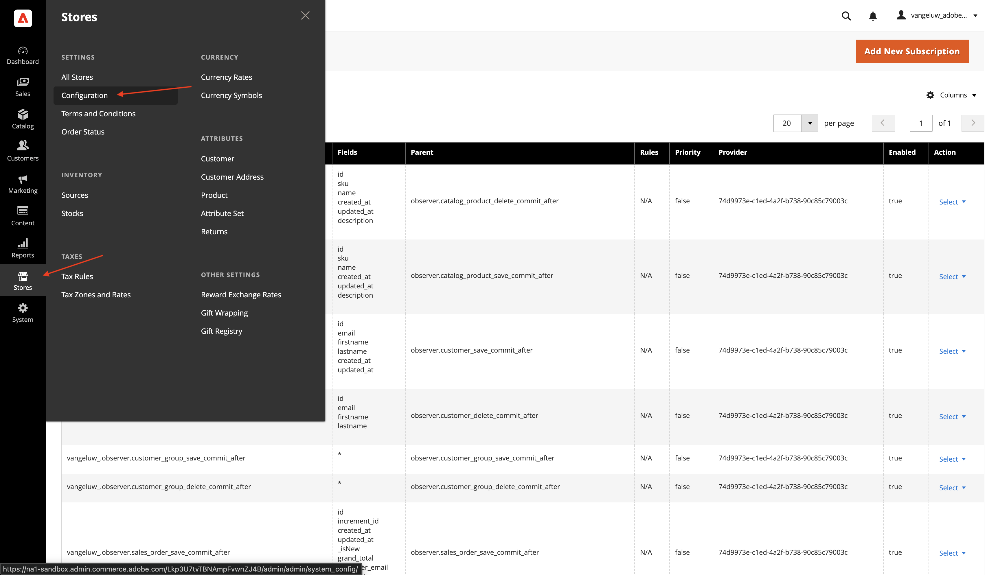

# 1.7.2 Use Cursor to develop your project

## 1.7.2.1 Set up your directory & tools

On your desktop, create a new directory with the name `--aepUserLdap---commerce`

Right-click your folder and select **New Terminal at Folder**.

You should then see this.

You now need to clone an existing Github repository, which you can view [https://github.com/adobe/commerce-integration-starter-kit](https://github.com/adobe/commerce-integration-starter-kit).

This repository is Adobe's integration starter kit that uses Adobe Developer App Builder to improve real-time connection reliability and reduce the time-to-market for integrations between Adobe Commerce and other back-office systems, such as ERPs, CRMs, and PIMs.

There are several ways to clone this repository, in this example Terminal is used.

Enter the following command in your Terminal window and execute it.

`git clone https://github.com/adobe/commerce-integration-starter-kit`

After a couple of seconds, you should see this result.

Next, you should navigate to the folder that was just created. Enter the following command and then execute it.

`cd commerce-integration-starter-kit`

You should then see this.

Next, you need to set up the Commerce extensibility tools for Cursor. Enter the following command and then execute it.

`aio commerce extensibility tools-setup`

Select **Current directory**.

Select **Cursor**.

Select **npm**.

After a couple of minutes, you should see this.

By installing Commerce extensibility tools for Cursor, there is now an MCP server available as part of your Cursor environment. In the next exercises, you'll use that MCP server to help you develop and deploy the app builder project.

## 1.7.2.2 Set up your webhook

For this exercise, you'll need a webhook that needs to be configued so that when an order is created, the order event can be streamed to that webhook. In this exercise, you'll use a sample endpoint using [https://pipedream.com/requestbin](https://pipedream.com/requestbin). 

Go to [https://pipedream.com/requestbin](https://pipedream.com/requestbin), create an account and then create a workspace. Once the workspace is created, you'll see something similar to this. 

Click **copy** to copy the url. You'll need to specify this url in the next exercise. The URL in this example is `https://eodts05snjmjz67.m.pipedream.net`.

## 1.7.2.3 Create app with Cursor

Open Cursor. Click **Open project**.

Navigate to the folder that you created, which should be named `--aepUserLdap---commerce`. In that folder, select the folder which is named `commerce-integration-starter-kit`. Click **Open**.

You should then see this. Before continuing, sure that the top-level folder that is opened in Cursor is `commerce-integration-starter-kit`.

Use the keyboard shortcut `Cmd + Shift + J` to open Cursor settings. You should then see this. Go to **Tools& MCP**.

Enable the MCP server **commerce-extensibility**. Once that's done, click the **X** to close the window.

Copy the following prompt and paste it in Cursor. Then, click the **send** button.

`I would like to build an app that subscribes to order created events and sends them to a configurable URL with basic authentication`

Cursor will start reasoning and executing. Cursor will ask you for confirmation a couple of times. When that happens, click **Run**. This may happen 5-10 times, depending on the reasoning and your settings.

After a couple of minutes, you should see something like this.

The next step, as indicated by Cursor, is to create a file with the name `.env` and provide the required variables there.

## 1.7.2.4 Create your.env file

Select the file **env.dist**. Enter the command `Cmd + C` and then enter the command `Cmd + V`. 

Rename the newly created file to `.env`.

Next, you need to provide the values for all the variables in the file **.env**.

Here's where you can find all the required information.

### Commerce endpoints

You can find these variables by going to [https://experience.adobe.com](https://experience.adobe.com). Click **Commerce**.

You should then see this. Click the **information** icon next to your ACCS environment, which should be named `--aepUserLdap-- - ACCS`. Copy the values of the REST endpoint and the GraphQL endpoint.

In this example, these are the values to copy. Paste them next to the below variables in the file **.env** on lines 6 & 7.

- **COMMERCE_BASE_URL** = https://na1-sandbox.api.commerce.adobe.com/Lkp3U7tvTBNAmpFvwnZJ4B/
- **COMMERCE_GRAPHQL_ENDPOINT** = https://na1-sandbox.api.commerce.adobe.com/Lkp3U7tvTBNAmpFvwnZJ4B/graphql

You should then have this in the file **.env**.

### Adobe I/O project variables

You can find these variables by going to [https://developer.adobe.com/console](https://developer.adobe.com/console). Go to **Projects** and click to open the Adobe I/O project you created in the previous exercise, which should be named `--aepUserLdap-- Commerce Events`.

Go to **Production**.

Go to **OAuth Server-to-Server**. You should then see this.

Copy the values of the fields **Client ID**, **Client Secret**, **Technical Account ID**, **Technical Account Email** and **Organization ID** and paste them next to the below variables in the file **.env** on lines 13-17.

- **OAUTH_CLIENT_ID**= **Client ID**
- **OAUTH_CLIENT_SECRET**= **Client Secret**
- **OAUTH_TECHNICAL_ACCOUNT_ID**= **Technical Account ID**
- **OAUTH_TECHNICAL_ACCOUNT_EMAIL**= **Technical Account Email**
- **OAUTH_ORG_ID**= **Organization ID**

You should then have this in the file **.env**.

### COMMERCE_ADOBE_IO_EVENTS_MERCHANT_ID

For the field **COMMERCE_ADOBE_IO_EVENTS_MERCHANT_ID=**, enter the value `--aepUserLdap--_commerce_events` on line 34 in the file **.env**.

You should then have this in the file **.env**.

### Workspace configs

To retrieve these variables, go back to your Adobe I/O project and click **Workspace overview**.

After going to **Workspace overview**, have a look at the URL, which should look like this: **https://developer.adobe.com/console/projects/133309/4566206088345586770/workspaces/4566206088345619105/details**.

The first number in this example, 133309, is the value to use for the field **IO_CONSUMER_ID**.
The second numnber in this example, 4566206088345586770, is the value to use for the field **IO_PROJECT_ID**.
The third number in this example, 4566206088345619105, is the value to use for the field **IO_WORKSPACE_ID**.

- **IO_CONSUMER_ID**= 133309
- **IO_PROJECT_ID**= 4566206088345586770
- **IO_WORKSPACE_ID**= 4566206088345619105

Copy these values and paste them next to the below variables in the file **.env** on lines 42-44.

### EVENT_PREFIX

For the field **EVENT_PREFIX =**, enter the value `--aepUserLdap--_` on line 47 in the file **.env**.

You should then have this in the file **.env**.

### Webhook

For the field **ORDER_WEBHOOK_URL**, you should paste the URL of the webhook you created earlier in this exercise, which should look like this: `https://eodts05snjmjz67.m.pipedream.net`.

You should then have this in the file **.env**.

### App Builder credentials

You should update the following variables in the file **.env** on lines 54-55:

- **AIO_RUNTIME_NAMESPACE**=
- **AIO_RUNTIME_AUTH**=

You can retrieve the values for these variables by going back to your Adobe I/O project. Go to **Workspace overview** and click **Download all**.

A file like this will then be downloaded. Open that file using a text editor.

Scroll to the right until you see **runtime**. You should then see the field **name**, which contains the value for **AIO_RUNTIME_NAMESPACE**.

Scroll further to the right until you see **auth**, which contains the value for **AIO_RUNTIME_AUTH**.

Paste both values in the file **.env** on lines 54-55, you should then have this.

Your **.env** file is now completely configured.

## 1.7.2.5 workspace.json

In the previous step you downloaded a file like this from your Adobe I/O project.

Rename that file and use the name `workspace.json`.

Copy the file into the directory **scripts**>**onboarding**>**config**.

## 1.7.2.6 Adobe I/O login

Go back to the terminal window that you had used before. Enter the command `aio login`.

You should then see this after logging in through your browser.

## 1.7.2.7 Ready to deploy

Copy the following prompt and paste it in Cursor. Then, click the **send** button.

`Please deploy this code to Adobe I/O`

Click **Run** to allow the action, Cursor may ask you several times to confirm an action. 

Deployment will then finish after a couple of minutes.

Copy the following prompt and paste it in Cursor. Then, click the **send** button.

`run the onboarding to commerce`

After a couple of minutes, you should see this.

Copy the following prompt and paste it in Cursor. Then, click the **send** button.

`subscribe to commerce events`

After a couple of minutes, you should see this.

## 1.7.2.8 Verify configuration in Adobe Commerce as a Cloud Service

Go to [https://experience.adobe.com](https://experience.adobe.com). Click **Commerce**.

Click your Adobe Commerce as a Cloud Service environment to open it and then log in.

Go to **System** and then to **Event Subscriptions**.

You should then see this list of event subscriptions.

Go to **Stores** and then to **Configuration**.

Go to **Adobe Services** and select **Adobe I/O Events**. You should then see that the field **Adobe I/O Workspace Configuration** has a value of a couple of asterixes and the field **Merchant ID** should also have a value like `--aepUserLdap--_commerce_events`.

With this configuration in place, you can now test your configuration.

## 1.7.2.9 Test your scenario

Open your website.

Go to **Watches** and click any product.

Configure the product and click **Add to cart**.

Click the **Cart** icon and select **Checkout**.

Fill out your details and click **Place order**.

You should then see an order confirmation.

Switch to your webhook application. You should now see an incoming event for the order that was just confirmed.

## 1.7.2.10 Adobe I/O debugging

Go back to your Adobe I/O project. Go to **Workspace overview**. You should see something similar to this. Scroll down a little bit.

Click to open **Commerce Order Sync**.

Go to **Debug Tracing**. You can find the latest incoming events there, along with their payload. This is helpful to understand what events have been processed and if they were processed successfully.

## Next Steps

Go back to [Intelligent Developer Tools for Adobe Commerce](./aiassisteddev.md){target="_blank"}

[Go Back to All Modules](./../../../overview.md){target="_blank"}
