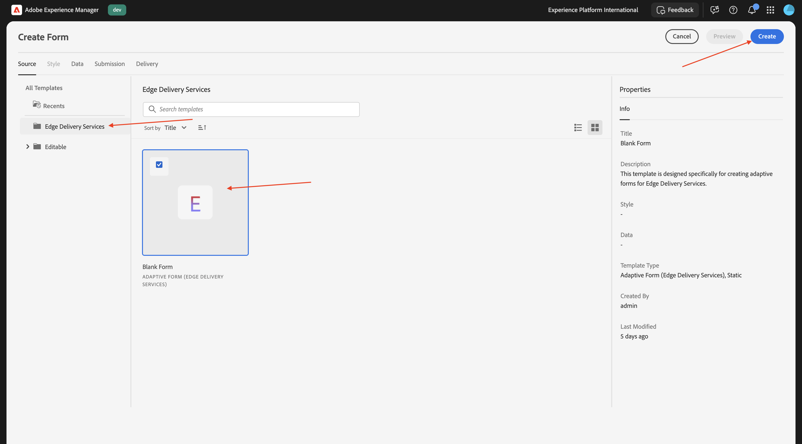
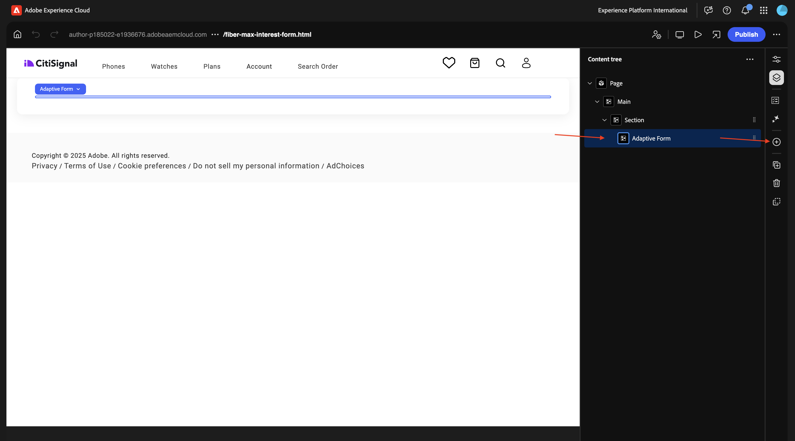
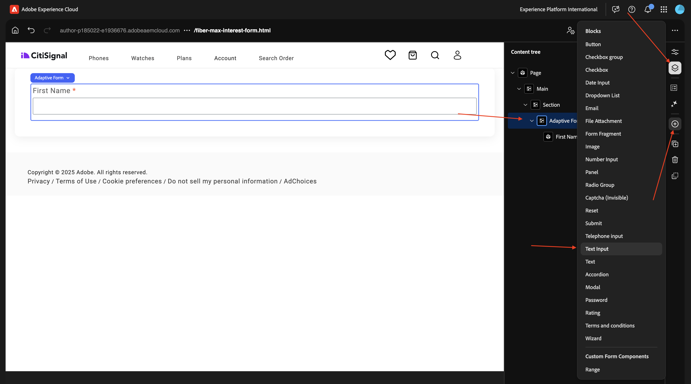
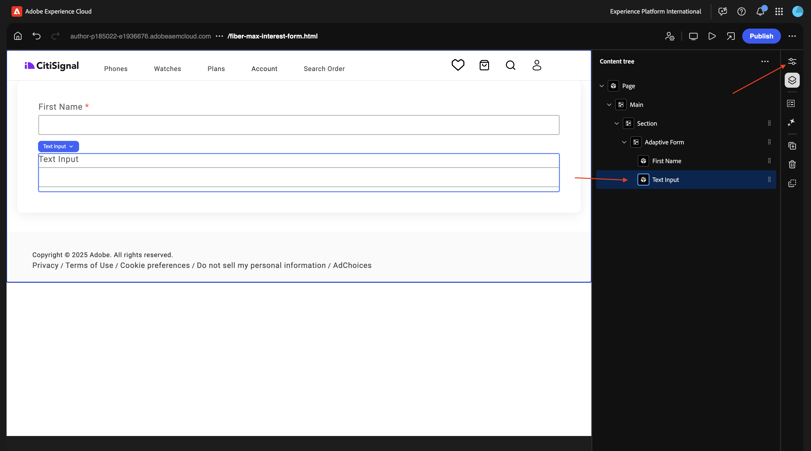
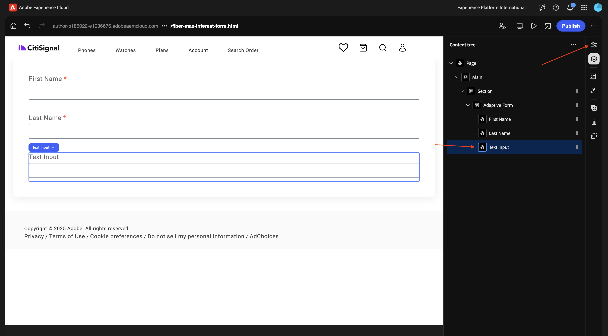
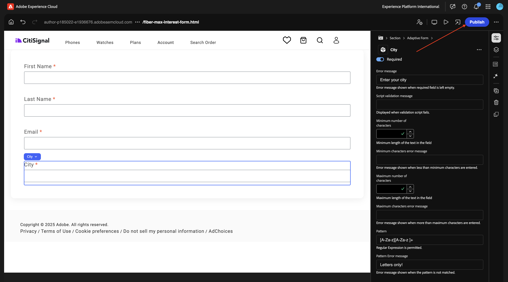

# 1.3.1 Create your first form

>[!IMPORTANT]
>
>In order to complete this exercise, you need to have access to a working AEM Assets CS Author environment with AEM Assets Dynamic Media enabled.
>
>If you don't have such an environment, go to [Adobe Experience Manager Cloud Service & Edge Delivery Services](./../../../modules/asset-mgmt/module2.1/aemcs.md){target="_blank"}. Follow the instructions there, and you'll have access to such an environment.

>[!IMPORTANT]
>
>If you have previously configured an AEM CS Program with an AEM Assets CS environment, it may be that your AEM CS sandbox was hibernated. Given that dehibernating such a sandbox takes 10-15 minutes, it would be a good idea to start the dehibernation process now so that you don't have to wait for it at a later time.

## 1.3.1.1 -

Go to [https://my.cloudmanager.adobe.com](https://my.cloudmanager.adobe.com){target="_blank"}. The org you should select is `--aepImsOrgName--`. Open your environment.

Go to **Forms**.

Go to **Forms & Documents**.

Click **Create** and then select **Adaptive Form**.

Select **Edge Delivery Services** and then select **Blank Page**. Click **Create**.

You should then see this. Fill out the following fields:

- **Title**: `Fiber Max Interest Form`
- **Name**: should be populated automatically based on the field **Title**.
- **Github URL**: provide the path to the Github repo that is linked to your website

Click **Create**.

After clicking **Create**, the **Universal Editor** should open automatically and you should see something like this. Click the icon to open the **Content Tree**.

In the **Content Tree**, select the object **Adaptive Form**.

Then, click the **+** icon to add a new element, and select **text Input**.

In the **Content Tree**, select the field **Text Input**.

Go to the **Basic** view. You should see this.

Fill out the following fields:

- **Name**: `first-name`
- **Title**: `First Name`

Then, go to **Validation**.

Flip the switch to make this a required field. Fill out the following fields:

- **Error message**: `Enter your first name`
- **Pattern**: `[A-Za-z][A-Za-z ]+`
- **Pattern error message**: `Letters only!`

In the **Content Tree**, select the field **Adaptive Form**. Click the **+** icon and then select **text Input**.

In the **Content Tree**, select the newly created field **Text Input**. Go to **Properties**.

Go to the **Basic** view. You should see this.

Fill out the following fields:

- **Name**: `last-name`
- **Title**: `Last Name`

Then, go to **Validation**.

Flip the switch to make this a required field. Fill out the following fields:

- **Error message**: `Enter your last name`
- **Pattern**: `[A-Za-z][A-Za-z ]+`
- **Pattern error message**: `Letters only!`

In the **Content Tree**, select the field **Adaptive Form**. Click the **+** icon and then select **text Input**.

In the **Content Tree**, select the newly created field **Text Input**. Go to **Properties**.

Go to the **Basic** view. You should see this.

Fill out the following fields:

- **Name**: `email`
- **Title**: `Email`

Then, go to **Validation**.

Flip the switch to make this a required field. Fill out the following fields:

- **Error message**: `Enter your email address`
- **Pattern**: `^[^@]+@[^@]+\.[^@]+$`
- **Pattern error message**: `Please verify your email address!`

In the **Content Tree**, select the field **Adaptive Form**. Click the **+** icon and then select **text Input**.

In the **Content Tree**, select the newly created field **Text Input**.

Go to the **Basic** view. You should see this.

Fill out the following fields:

- **Name**: `city`
- **Title**: `city`

Then, go to **Validation**.

Flip the switch to make this a required field. Fill out the following fields:

- **Error message**: `Enter your city`
- **Pattern**: `[A-Za-z][A-Za-z ]+`
- **Pattern error message**: `Letters only!`

Click **Publish**.

Click **Publish** again.

Click to open your form.

You can then fill out the form, but you can't submit it yet.

## Next Steps

Next Step: [-](./ex1.md){target="_blank"}

Go Back to [Adobe Experience Manager Forms with Edge Delivery Services](./aemforms.md){target="_blank"}

[Go Back to All Modules](./../../../overview.md){target="_blank"}
