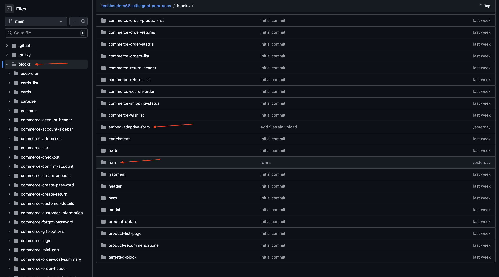
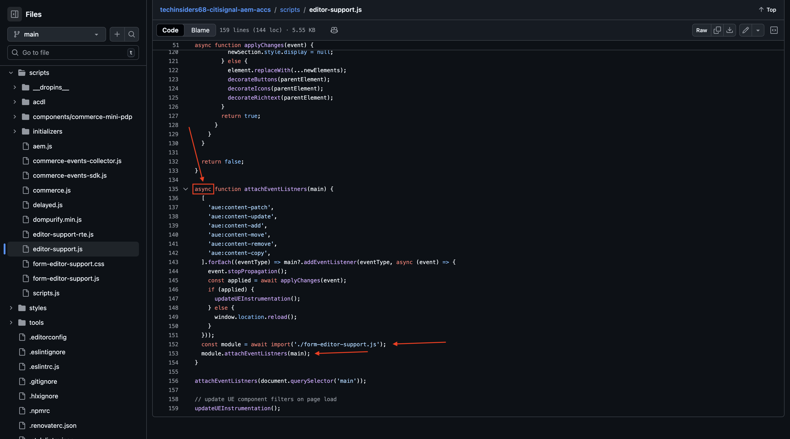
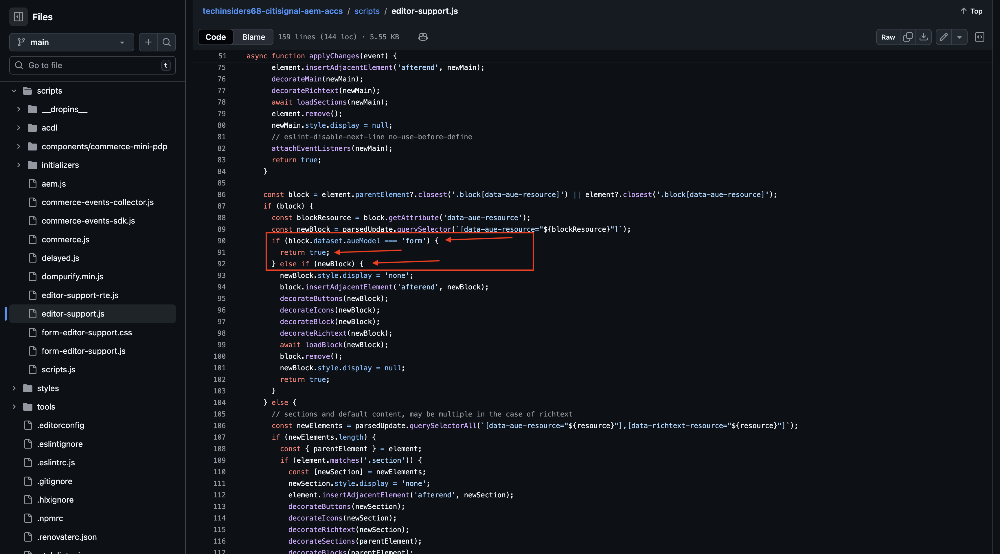
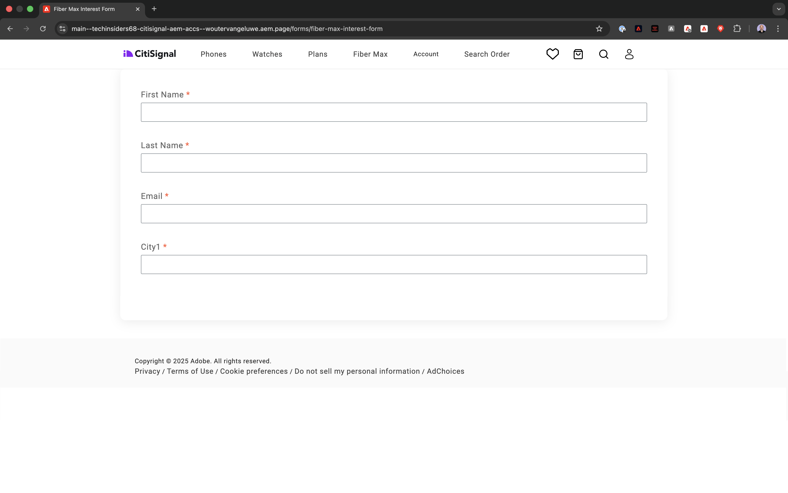
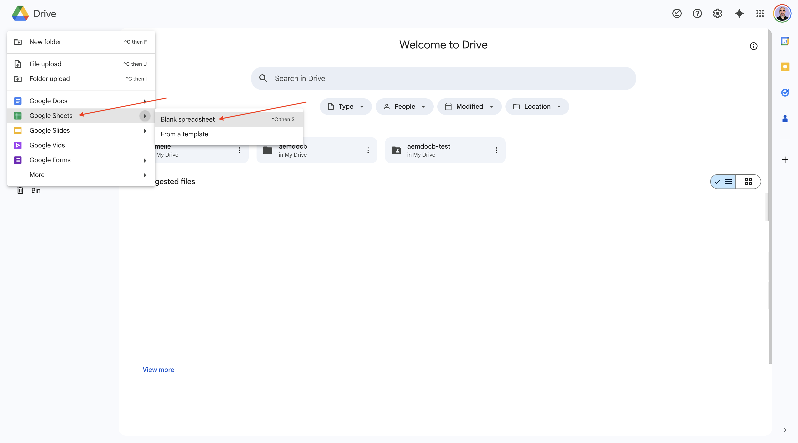
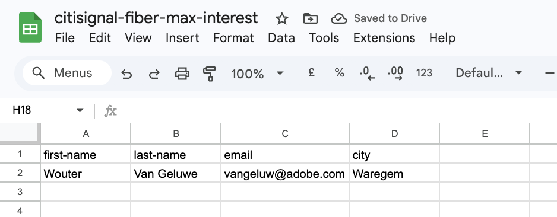

# 1.3.1 Create your first form

>[!IMPORTANT]
>
>In order to complete this exercise, you need to have access to a working AEM Assets CS Author environment with AEM Assets Dynamic Media enabled.
>
>If you don't have such an environment, go to [Adobe Experience Manager Cloud Service & Edge Delivery Services](./../../../modules/asset-mgmt/module2.1/aemcs.md){target="_blank"}. Follow the instructions there, and you'll have access to such an environment.

>[!IMPORTANT]
>
>If you have previously configured an AEM CS Program with an AEM Assets CS environment, it may be that your AEM CS sandbox was hibernated. Given that dehibernating such a sandbox takes 10-15 minutes, it would be a good idea to start the dehibernation process now so that you don't have to wait for it at a later time.

## 1.3.1.1 Environment requirements for using AEM Forms with Edge Delivery Services

Prior to configuring your first form, there are a number of requirements that need to be met before you can follow the below steps.

### Program setup

In the **Solutions & add-ons** of your Cloud Manager Program, **Forms** needs to be enabled.


### blocks

In your Github repository, you need to have the following blocks available:

- **form**
- **embed-adaptive-form**



### scripts

In your Github repository, you need to have the following scripts available:

- **form-editor-support.css**
- **form-editor-support.js**


Additionally, in the file **editor-support.js**, the following changes need to be done to enable editing forms in the Universal Editor.

- change function declaration from **function attachEventListners(main) {** to **async function attachEventListners(main) {**
- add lines 152 and 153:
  
```
const module = await import('./form-editor-support.js');
module.attachEventListners(main);
```
  


Also, in the file **editor-support.js**, change lines 90-92 like this:

```
if (block.dataset.aueModel === 'form') {
        return true;
      } else if (newBlock) {
```



### paths.json

Please verify your Github repo configuration, specifically in the file **paths.json**. These lines need to be present in the file:

- Under mappings: **"/content/forms/af/:/forms/"**
- Under includes: **"/content/forms/af/"**

```json
{
  "mappings": [
    "/content/CitiSignal/:/",
    "/content/CitiSignal/configuration:/.helix/config.json",
    "/content/CitiSignal/headers:/.helix/headers.json",
    "/content/CitiSignal/metadata:/metadata.json",
    "/content/CitiSignal.resource/enrichment/enrichment.json:/enrichment/enrichment.json",
    "/content/forms/af/:/forms/"
  ],
  "includes": [
    "/content/CitiSignal/",
    "/content/forms/af/"
  ]
}
```


With these requirements in place, you can create your first form.

## 1.3.1.1 Create form

Go to [https://my.cloudmanager.adobe.com](https://my.cloudmanager.adobe.com){target="_blank"}. The org you should select is `--aepImsOrgName--`. Open your environment.


Go to **Forms**.


Go to **Forms & Documents**.


Click **Create** and then select **Adaptive Form**.


Select **Edge Delivery Services** and then select **Blank Page**. Click **Create**.


You should then see this. Fill out the following fields:

- **Title**: `Fiber Max Interest Form`
- **Name**: should be populated automatically based on the field **Title**.
- **Github URL**: provide the path to the Github repo that is linked to your website

Click **Create**.


After clicking **Create**, the **Universal Editor** should open automatically and you should see something like this. Click the icon to open the **Content Tree**.


In the **Content Tree**, select the object **Adaptive Form**.


Then, click the **+** icon to add a new element, and select **text Input**.


In the **Content Tree**, select the field **Text Input**.


Go to the **Basic** view. You should see this.

Fill out the following fields:

- **Name**: `first-name`
- **Title**: `First Name`

Then, go to **Validation**.


Flip the switch to make this a required field. Fill out the following fields:

- **Error message**: `Enter your first name`
- **Pattern**: `[A-Za-z][A-Za-z ]+`
- **Pattern error message**: `Letters only!`


In the **Content Tree**, select the field **Adaptive Form**. Click the **+** icon and then select **text Input**.


In the **Content Tree**, select the newly created field **Text Input**. Go to **Properties**.


Go to the **Basic** view. You should see this.

Fill out the following fields:

- **Name**: `last-name`
- **Title**: `Last Name`

Then, go to **Validation**.


Flip the switch to make this a required field. Fill out the following fields:

- **Error message**: `Enter your last name`
- **Pattern**: `[A-Za-z][A-Za-z ]+`
- **Pattern error message**: `Letters only!`


In the **Content Tree**, select the field **Adaptive Form**. Click the **+** icon and then select **text Input**.


In the **Content Tree**, select the newly created field **Text Input**. Go to **Properties**.


Go to the **Basic** view. You should see this.

Fill out the following fields:

- **Name**: `email`
- **Title**: `Email`

Then, go to **Validation**.


Flip the switch to make this a required field. Fill out the following fields:

- **Error message**: `Enter your email address`
- **Pattern**: `^[^@]+@[^@]+\.[^@]+$`
- **Pattern error message**: `Please verify your email address!`


In the **Content Tree**, select the field **Adaptive Form**. Click the **+** icon and then select **text Input**.


In the **Content Tree**, select the newly created field **Text Input**.


Go to the **Basic** view. You should see this.

Fill out the following fields:

- **Name**: `city`
- **Title**: `city`

Then, go to **Validation**.


Flip the switch to make this a required field. Fill out the following fields:

- **Error message**: `Enter your city`
- **Pattern**: `[A-Za-z][A-Za-z ]+`
- **Pattern error message**: `Letters only!`


Click **Publish**.


Click **Publish** again.


Click to open your form.


You can then fill out the form, but you can't submit it yet.


After publishing your form, it's now also available on your Edge Delivery Services domain, which looks like this:

`https://main--techinsidersXX-citisignal-aem-accs--woutervangeluwe.aem.page/forms/fiber-max-interest-form`



## 1.3.1.2 Submit form

In order to submit your form, 2 things are required:

- a **Submit** button
- a **Submit** action

Also, in this exercise you should use a Google spreadsheet to record submissions of this form.

### Google spreadsheet

Go to [https://drive.google.com](https://drive.google.com) and create a new blank spreadsheet.



Name your file `citisignal-fiber-max-interest`.

In line 1, in cells A-B-C-D, enter the following field names:

- first-name
- last-name
- email
- city

Then, click **Share**.


Share the file with **forms@adobe.com** with **Editor**-level access rights.

Then, click **Copy link**.

Click **Send**.


You will need to use the copied link in the next step.

### Submit button

To configure the **Submit** button, go to **Content tree**, select **Adaptive Form**, click the **+** icon and then select **Submit**.


You should then see this.


### Submit action

Submit actions are part of an extension for the Universal Editor. 

>[!NOTE]
>
>If you don't see the **Edit Form Properties** icon, it means that this etxension isn't enabled for your environment yet. To enable this extension, go to [https://experience.adobe.com/#/aem/extension-manager](https://experience.adobe.com/#/aem/extension-manager) and enable the **Edit Form Properties** extension.
>
>

Click the **Edit Form Properties** icon.


Select **Submit to Spreadsheet**. Paste the URL of the Google Sheet that you created earlier.

Click **Save & Close**.


>[!NOTE]
>
>If you receive an error 401 - Unauthorized, it may be. because your environment hasn't been enabled to work with Google Sheets. Contact your Adobe representative to have your environment enabled.

Click **Publish**.


Click **Publish** again.


You can then refresh your site, fill out the forms and click **Submit**.


Your submission should then be successful.


If you then have a look at your Google sheet, you should see the successful submission there as well.



You've now successfully finished this exercise.

## Next Steps

Go Back to [Adobe Experience Manager Forms with Edge Delivery Services](./aemforms.md){target="_blank"}

[Go Back to All Modules](./../../../overview.md){target="_blank"}
