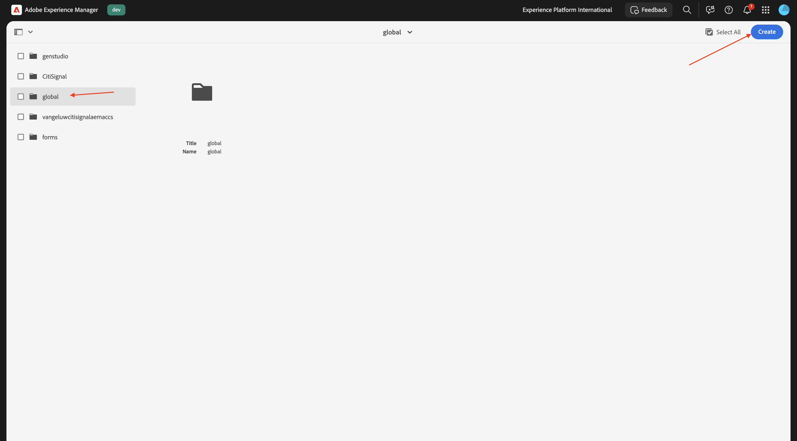
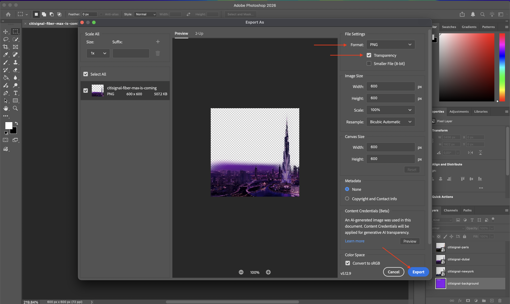
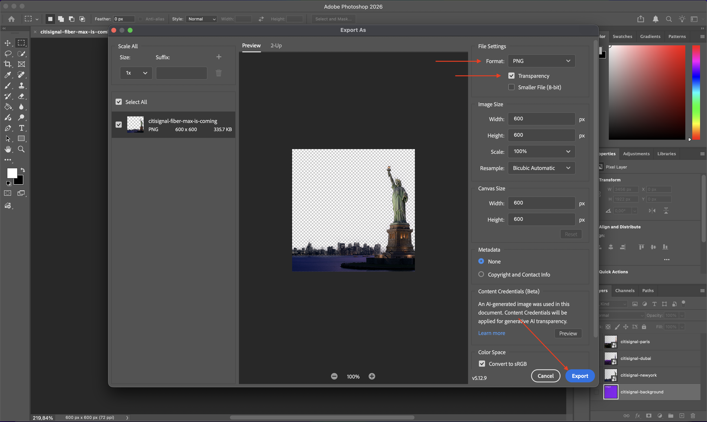
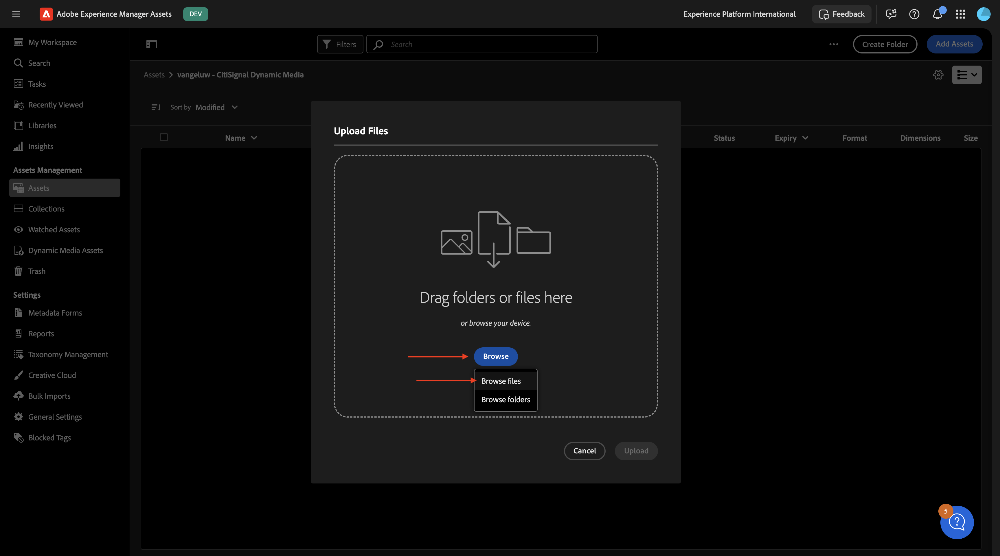
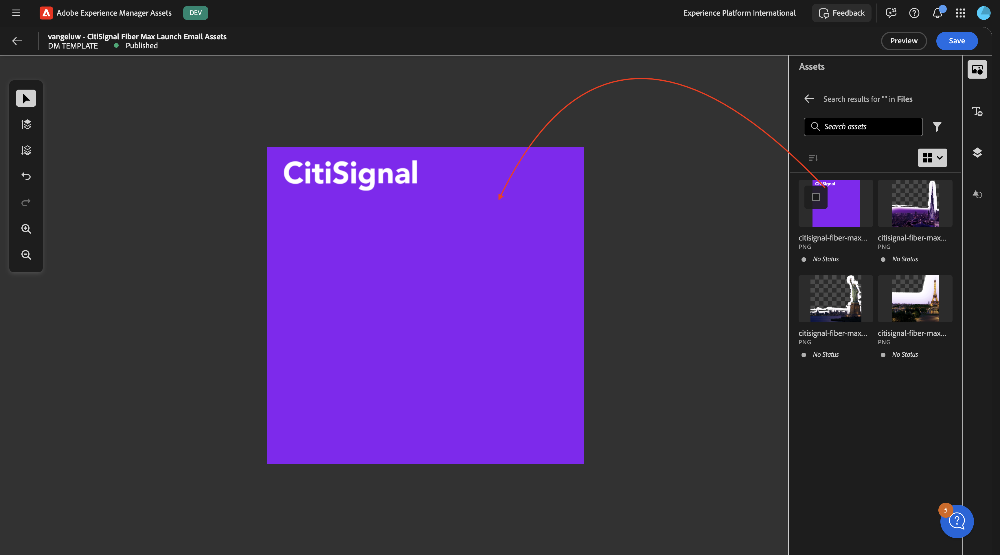
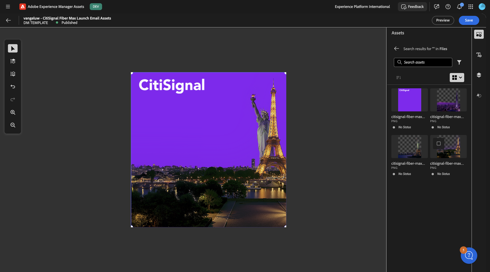
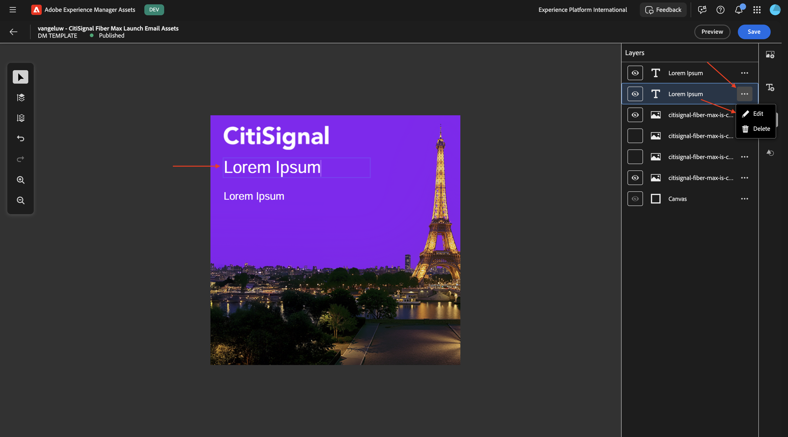
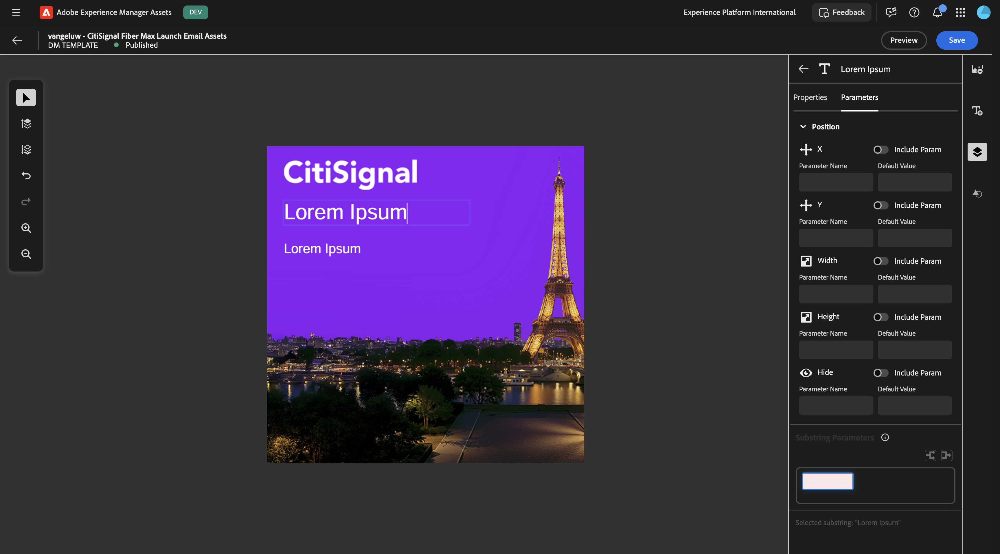
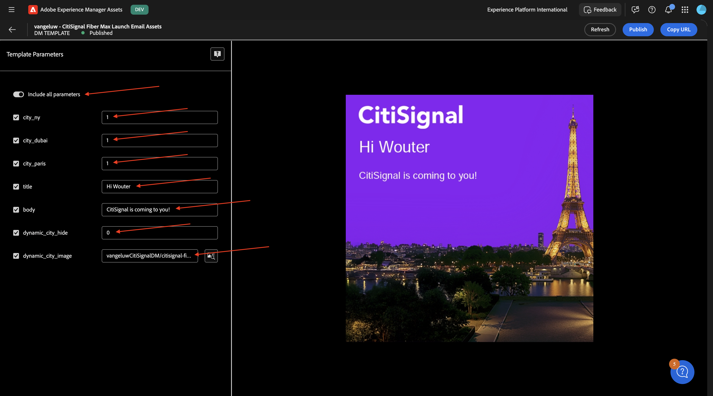
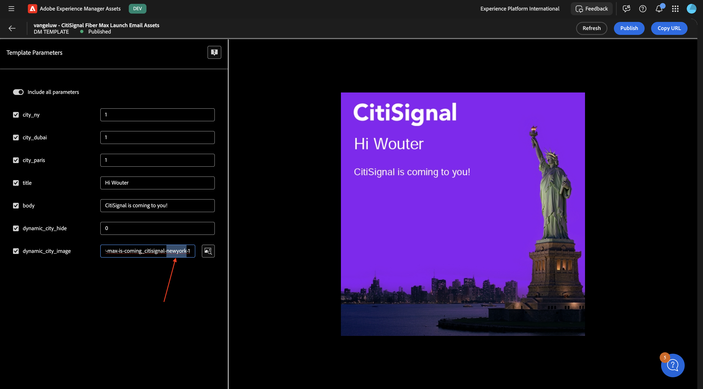

# 1.4.1 Create your assets and dynamic media template

>[!IMPORTANT]
>
>In order to complete this exercise, you need to have access to a working AEM Assets CS Author environment with AEM Assets Dynamic Media enabled.
>
>If you don't have such an environment, go to [Adobe Experience Manager Cloud Service & Edge Delivery Services](./../../../modules/asset-mgmt/module2.1/aemcs.md){target="_blank"}. Follow the instructions there, and you'll have access to such an environment.

>[!IMPORTANT]
>
>If you have previously configured an AEM CS Program with an AEM Assets CS environment, it may be that your AEM CS sandbox was hibernated. Given that dehibernating such a sandbox takes 10-15 minutes, it would be a good idea to start the dehibernation process now so that you don't have to wait for it at a later time.

## 1.4.1.1 Create your Dynamic Media company

Go to [https://my.cloudmanager.adobe.com](https://my.cloudmanager.adobe.com){target="_blank"}. The org you should select is `--aepImsOrgName--`. 

Scroll down to **Dynamic Media Companies**. Click the **+** icon to create a new Dynamic Media Company.

Enter the following information:

- **Company name**: `--aepUserLdap---CitiSignal`.
- **Company region**: select the region that's closest to you.
- **Company admin emails**: enter your admin email.

Click **Create**.

You should then see this.

You should now receive an email like the one below, which contains your temporary password. To change your password, or to retrieve it in case you didn't receive an email, you should install the **Adobe Dynamic Media Classic desktop app**. You can find installation instructions here: [https://experienceleague.adobe.com/en/docs/dynamic-media-classic/using/intro/dynamic-media-classic-desktop-app](https://experienceleague.adobe.com/en/docs/dynamic-media-classic/using/intro/dynamic-media-classic-desktop-app). 

Follow the instructions there, and come back here once the app is installed on your system.

Open the **Adobe Dynamic Media Classic desktop app**. If you know your password, then please enter it here and follow the instructions to change it upon first login.

If you don't know your password, click the **Forgot your password** link and follow the instruction to reset your password, to then come back here and log in.

After successful login, you should see a screen similar to this.

## 1.4.1.2 Configure Dynamic Media in AEM

Go to [https://my.cloudmanager.adobe.com](https://my.cloudmanager.adobe.com){target="_blank"}. The org you should select is `--aepImsOrgName--`. 

Click to open your Cloud Manager Program, which should be called `--aepUserLdap-- - CitiSignal AEM+ACCS`.

Click your environment.

Click the URL of your environment.

Go to **Tools**, to **Cloud Services** and then to **Dynamic Media Configuration**.

Select **Global** (don't check the checkbox), and then click **Create**.

Enter the following information:

- **Title**: use this title: `--aepUserLdap-- - CitiSignal`.
- **Email**: enter your email address.
- **Password**: enter your Dynamic Media account password 
- **Region**: select the region that you chose when creating your Dynamic Media company, in this example, **Europe**.

Click **Connect to Dynamic Media**.

You should then see this. Configure the following:

- Select the **Company**: `--aepUserLdap-- - CitiSignal`.
- Set **Publish Assets** to **Immediate**.
- Check the checkbox to **Sync all content**.

Click **Save**.

Your DYnamic Media configuration is now done. Click **OK**.

## 1.4.1.3 Export your assets

Download this file [citisignal-fiber-max-is-coming.psd](./assets/citisignal-fiber-max-is-coming.psd){target="_blank"} and open it with Adobe Photoshop.

You should then see this. CitiSignal is planning a rollout of Fiber Max across 3 cities: New York, Paris and Dubai. 

By showing or hiding specific layers, you can view the image that was created by the designers.

Below are the instructions to export the image files from the Photoshop PSD template. If you prefer, you can also download the finished images here [citisignal-dm-email-assets.zip](./assets/citisignal-dm-email-assets.zip){target="_blank"} and unzip the file onto your desktop.

This is the version for New York.

This is the version for Dubai.

This is the version for Paris.

There will potentially be many other cities that CitiSignal will be rolling Fiber Max out to so in the future, new layers may be created in this file. For now, the focus is on the 3 cities already mentioned.

In order to use these variations in combination with AEM Assets Dynamic Media, the layers for each city should be exported as images separately without the background file, and another export should be done for the background layer without including any cities. 

You should now hide and show only one of the layers. The first layer to show is the **Paris** layer, and all other layers should be hidden.

To export that layer, go to **File** > **Export** > **Export As...**.

You should then see this. Select the file type **PNG**, make sure **Transparency** is enabled and then click **Export**.

Change the filename to `citisignal-fiber-max-is-coming-paris.png`and click **Export**.

The next layer to show is the **Dubai** layer, and all other layers should be hidden.

To export that layer, go to **File** > **Export** > **Export As...**.

You should then see this. Select the file type **PNG**, make sure **Transparency** is enabled and then click **Export**.

Change the filename to `citisignal-fiber-max-is-coming-dubai.png`and click **Export**.

The next layer to show is the **New York** layer, and all other layers should be hidden.

To export that layer, go to **File** > **Export** > **Export As...**.

You should then see this. Select the file type **PNG**, make sure **Transparency** is enabled and then click **Export**.

Change the filename to `citisignal-fiber-max-is-coming-newyork.png`and click **Export**.

The next layer to show is the **background** layer, and all other layers should be hidden.

To export that layer, go to **File** > **Export** > **Export As...**.

You should then see this. Select the file type **PNG**, make sure **Transparency** is enabled and then click **Export**.

Change the filename to `citisignal-fiber-max-is-coming-background`and click **Export**.

You should then have these files available in the export location that you selected.

## 1.4.1.4 Upload your assets to AEM Assets CS

Go to [https://experience.adobe.com/](https://experience.adobe.com/){target="_blank"}. Go to **Experience Manager Assets**.

Select your repository, which should be named `--aepUserLdap-- - CitiSignal AEM + ACCS`.

Go to **Assets** and then click **Create Folder**.

For the folder, use the name: `--aepUserLdap-- - CitiSignal Dynamic Media`. Click **Create**.

Double-click to open the folder you just created.

Click **Add Assets**.

Click **Browse** and then select **Browse Files**.

Select the 4 PNG files that you exported in the previous step.

Click **Upload**.

Your images are now available in AEM Assets CS.

Wait a couple of minutes and then open the **Adobe Dynamic Media Classic desktop app**, you should now also see the uploaded images become available within Dynamic Media.

## 1.4.1.5 Configure Dynamic Media Template

In the left menu, go to **Dynamic Media Assets**. Click to open your folder `--aepUserLdap-- - CitiSignal Dynamic Media`. Then, click **Create Template**.

Enter the following information:

- **Template Name**: `--aepUserLdap-- - CitiSignal Fiber Max Launch Email Assets`
- **Canvas Width**: `600px`
- **Canvas Height**: `600px`

Click **Create**.

You should then see this. Click the **Add Image** icon.

Drag the file **citisignal-fiber-max-is-coming_citisignal-background.png** onto the canvas and make it fit the canvas.

Next, drag the file **citisignal-fiber-max-is-coming_citisignal-newyork.png** onto the canvas and make it fit the canvas.

Next, drag the file **citisignal-fiber-max-is-coming_citisignal-dubai.png** onto the canvas and make it fit the canvas.

Next, drag the file **citisignal-fiber-max-is-coming_citisignal-paris.png** onto the canvas and make it fit the canvas.

You now have all 3 variations in the template as distinct layers at the same time. You can show/hide specific layers by clicking the **layers** icon, where you see that all layers are currently visible. 

By hiding a couple of layers, you can control what the image looks like. In this example, only the layer for **Paris** and the background layer is visible.

Next, you need to add a text layer. Click the **text layer** icon.

You should then see this.

Feel free to adapt the text field in whichever way you see fit, here's an example. Don't forget to enable the option **Smart Text Resize** so that the real text that is inserted at a later stage will look fine.

Add a second text layer and make it look like this. Don't forget to enable the option **Smart Text Resize** so that the real text that is inserted at a later stage will look fine.

Select the first text layer. Click the 3 dots **...** and then select **Edit**.

You should then see this. Scroll down.

Click the **switcher** icon so that the field **Text** is enabled. Change the **Parameter Name** to `title`.

Select the second text layer. Click the 3 dots **...** and then select **Edit**.

You should then see this. Scroll down.

Click the **switcher** icon so that the field **Text** is enabled. Change the **Parameter Name** to `body`.

Select the layer for **Paris**. Click the 3 dots **...** and click **Edit**.

Go to **Paramaters**. Enable the field **Hide** and enter the **Parameter Name**: `city_paris`. Click **Save**.

Select the layer for **Dubai**. Click the 3 dots **...** and click **Edit**.

Go to **Paramaters**. Enable the field **Hide** and enter the **Parameter Name**: `city_dubai`. Click **Save**.

Select the layer for **New York**. Click the 3 dots **...** and click **Edit**.

Go to **Paramaters**. Enable the field **Hide** and enter the **Parameter Name**: `city_ny`. Click **Save**.

Click **Preview**.

Enable the switcher for **Include all parameters** and change some input variables as indicated in the screenshot. You should see your image change dynamically based on the input provided. For the fields **city_paris**, **city_dubai** and **city_ny**, a value of 0 means that this image will NOT be hidden and a value of 1 means this image will be hidden.

By changing some variables, you now see another image being shown.

By changing more variables, you now see another image being shown.

In order to use this template with Adobe Journey Optimizer, and to meet the requirements of this use case, you should add one more layer that will be used to dynamically change the path of the file that needs to be displayed, based on a field that is part of the Real-Time Customer Profile in Adobe Experience Platform.

During dataprep, a field was created in Adobe Experience Platform Schema's to store the **closest rollout city** for a customer. The path of the field is `--aepTenantId--.individualCharacteristics.fiber_rollout.closest_rollout_city`. 

>[!NOTE]
>
>The screenshot below of the Adobe Experience Platform Schema is for information only. There is no need to navigate to AEP to visualize this yourself.

In the next exercise, you will use that field to dynamically select which image should be shown to which customer.

To make that possible, you should add a new image layer.

First, let's hide the other layers that contain images for the rollout cities.

Next, go to **Images** and select a random image of a city and add it to the canvas, and make sure it fits the whole canvas. It doesn't matter which city image you choose, as the path will be change dynamically by AJO in the next exercise.

Go to **Parameters**. 

Click the **switcher** icon so that the field **Hide** is enabled. Change the **Parameter Name** to `dynamic_city_hide`.

Click the **switcher** icon so that the field **Hide** is enabled. Change the **Parameter Name** to `dynamic_city_image`.

Click **Save**.

Click **Preview**.

You should then see this. Enable the switcher icon to **Include all parameters**. Change some input variables as indicated in the screenshot. You should see your image change dynamically based on the input provided. The static fields **city_paris**, **city_dubai** and **city_ny**, should be set to 1 which means that these images will be hidden.

The field **dynamic_city_hide** should be set to 0, which means that it will be shown.

The field **dynamic_city_image** now has the URL to the image of Paris, which looks like this: `vangeluwCitiSignalDM/citisignal-fiber-max-is-coming_citisignal-paris-1`.

Select the word **paris** in the URL.

Change **paris** to `newyork` and then click somewhere else in the UI to see the image change to the New York city image.

Select the word **newyork** and change it to `dubai` and then click somewhere else in the UI to see the image change to the Dubai city image.

Finally, click **Publish**.

You should then see this. Click **Yes**.

Your Dynamic Media template is now configured and published successfully. In the next exercise, you'll use that template in combination with an email campaign in Adobe Journey Optimizer.

## Next Steps

Next Step: [Use your dynamic media template with Adobe Journey Optimizer](./ex2.md){target="_blank"}

Go Back to [Adobe Experience Manager Assets & Dynamic Media](./aemassetsdm.md){target="_blank"}

[Go Back to All Modules](./../../../overview.md){target="_blank"}
