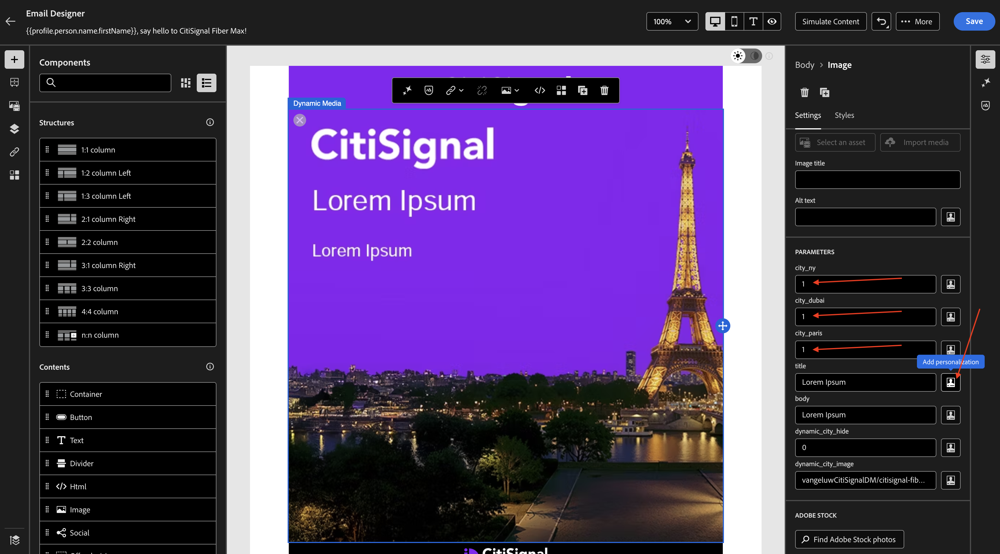
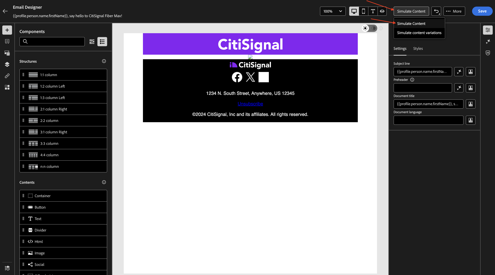

# 1.4.2 Use your dynamic media template with Adobe Journey Optimizer

## 1.4.2.1 Create your campaign in Adobe Journey Optimizer

Login to Adobe Journey Optimizer by going to [Adobe Experience Cloud](https://experience.adobe.com). Click **Journey Optimizer**.


You'll be redirected to the **Home**  view in Journey Optimizer. First, make sure you're using the correct sandbox. The sandbox to use is called `--aepSandboxName--`. You'll then be in the **Home** view of your sandbox `--aepSandboxName--`.


You'll now create a campaign. Unlike the event-based journey of the previous exercise which relies on incoming experience events or audience entries or exits to trigger a journey for 1 specific customer, campaigns target a whole audience once with unique content like newsletters, one-off promotions, or generic information or periodically with similar content sent on a regular basis like for instance birthday campaigns and reminders. 

In the menu, go to **Campaigns** and click **Create campaign**.


Select **Scheduled - Marketing** and click **Create**.


On the campaign creation screen, configure the following:

- **Name**: `--aepUserLdap-- - CitiSignal Fiber Max DM Email Campaign`.

Click **Actions**.


Click **+ Add Action** and then select **Email**.


Then, select an existing **Email configuration** and then click **Edit content**.


You'll then see this. For the **Subject line**, use this: 

```
{{profile.person.name.firstName}}, say hello to CitiSignal Fiber Max!
```

Next, click **Edit content**.


Select **Design from scratch**.


You should then see this.


Add 2x **1:1 column** to the canvas.


Go to **Fragments**, drag the **header** fragment to the first 1:1 column and then drag the **footer** fragment to the second 1:1 column.


Add a new 1:1 column in between the 2 fragments, and then add an **Image** into that 1:1 column. Then, click **Browse**.


Navigate to the folder in which you stored your Dynamic Media template. Select your Dynamic Media template and then click **Select**.


You should then see this. You also. notice the **PARAMETERS** which allow you to change the parameters of the dynamic media template.


## 1.4.2.2 Personalize the dynamic media template

As dicussed in the previous exercise, AJO now needs to dynamically decide what the values should be that become part of the Dynamic Media template.

Just like in the **Preview** step in the previous exercise, the fields **city_paris**, **city_dubai** and **city_ny**, should be set to 1 which means that these images will be hidden.

For the field **title**, click the personalization icon.



Replace the default text by this: `Hi {{profile.person.name.firstName}}`. Click **Save**.


For the field **body**, click the personalization icon.


Replace the default text by this: `CitiSignal is coming to {{profile.homeAddress.city}}!`. Click **Save**.


Ensure that the field **`dynamic_city_hide`** is set to 0. Click the personalization icon for the field **`dynamic_city_image`**.


Replace the default text by this: `--aepUserLdap--CitiSignalDM/citisignal-fiber-max-is-coming_citisignal-{{profile._experienceplatform.individualCharacteristics.fiber_rollout.closest_rollout_city}}-1`. Click **Save**.


You should then see this. The image isn't rendering here anymore which is expected as the dynamic variables aren't available in the context of the email editor.

Click **Save**.


Top test your configuration, click **Simulate Content** and then select **Simulate Content**.



You should then see something like this. If you don't have test profiles available, you can add them by going to **Manage test profiles**.

Once you have test profiles available that contain the data needed to test this use case, you can switch from one profile to another to see the changes happen dynamically.

Here's a profile that is linked to the rollout city New York.


Here's a profile that is linked to the rollout city Paris.


Here's a profile that is linked to the rollout city Dubai.

Click **Close**.


You've now finished this exercise. There's no need to publish your email campaign.

## Next Steps

Go Back to [Adobe Experience Manager Assets & Dynamic Media](./aemassetsdm.md){target="_blank"}

[Go Back to All Modules](./../../../overview.md){target="_blank"}