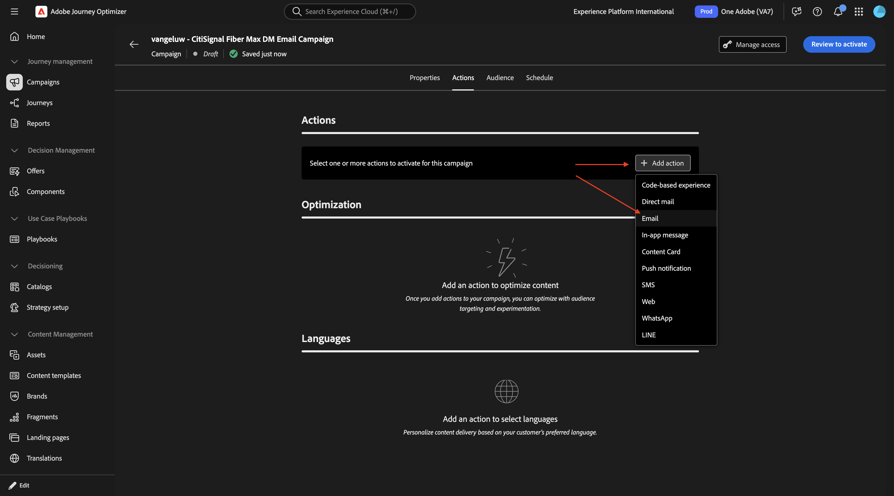
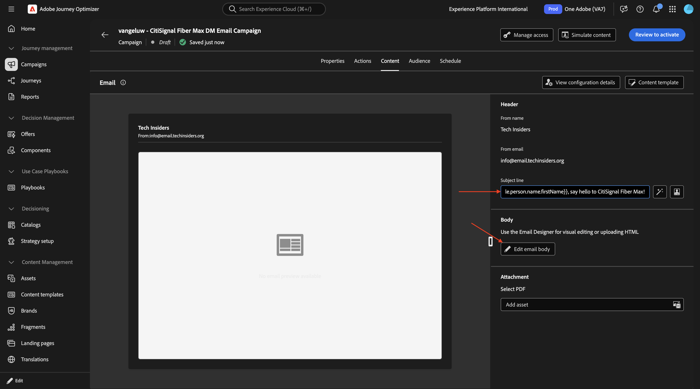
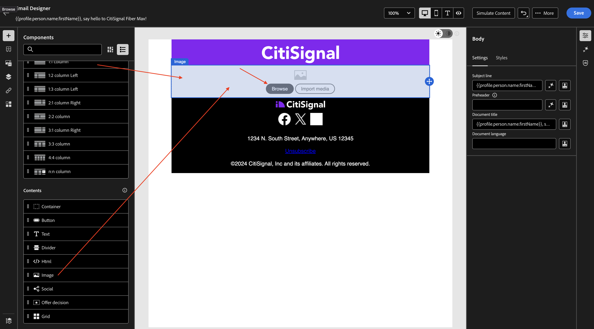
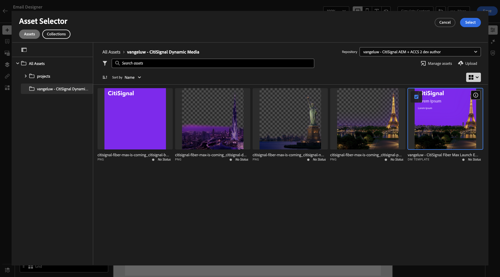

# 1.4.2 Use your dynamic media template with Adobe Journey Optimizer

## 1.4.2.1 Create your campaign in Adobe Journey Optimizer

Login to Adobe Journey Optimizer by going to [Adobe Experience Cloud](https://experience.adobe.com). Click **Journey Optimizer**.


You'll be redirected to the **Home**  view in Journey Optimizer. First, make sure you're using the correct sandbox. The sandbox to use is called `--aepSandboxName--`. You'll then be in the **Home** view of your sandbox `--aepSandboxName--`.


You'll now create a campaign. Unlike the event-based journey of the previous exercise which relies on incoming experience events or audience entries or exits to trigger a journey for 1 specific customer, campaigns target a whole audience once with unique content like newsletters, one-off promotions, or generic information or periodically with similar content sent on a regular basis like for instance birthday campaigns and reminders. 

In the menu, go to **Campaigns** and click **Create campaign**.


Select **Scheduled - Marketing** and click **Create**.


On the campaign creation screen, configure the following:

- **Name**: `--aepUserLdap-- - CitiSignal Fiber Max DM Email Campaign`.

Click **Actions**.


Click **+ Add Action** and then select **Email**.



Then, select an existing **Email configuration** and then click **Edit content**.


You'll then see this. For the **Subject line**, use this: 

```
{{profile.person.name.firstName}}, say hello to CitiSignal Fiber Max!
```

Next, click **Edit content**.



Select **Design from scratch**.


You should then see this.


Add 2x **1:1 column** to the canvas.


Go to **Fragments**, drag the **header** fragment to the first 1:1 column and then drag the **footer** fragment to the second 1:1 column.


Add a new 1:1 column in between the 2 fragments, and then add an **Image** into that 1:1 column. Then, click **Browse**.



Navigate to the folder in which you stored your Dynamic Media template. Select your Dynamic Media template and then click **Select**.



You should then see this.


## Next Steps

Go Back to [Adobe Experience Manager Assets & Dynamic Media](./aemassetsdm.md){target="_blank"}

[Go Back to All Modules](./../../../overview.md){target="_blank"}
