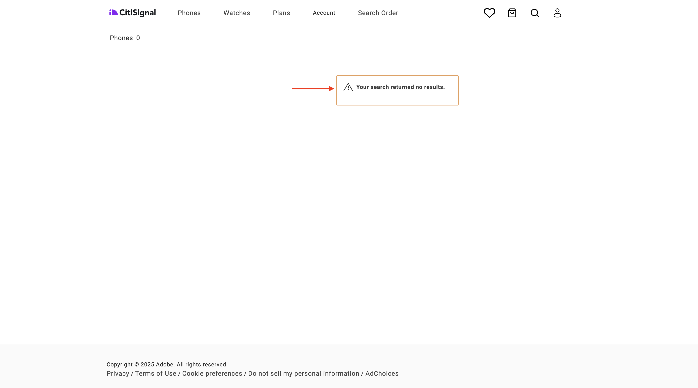
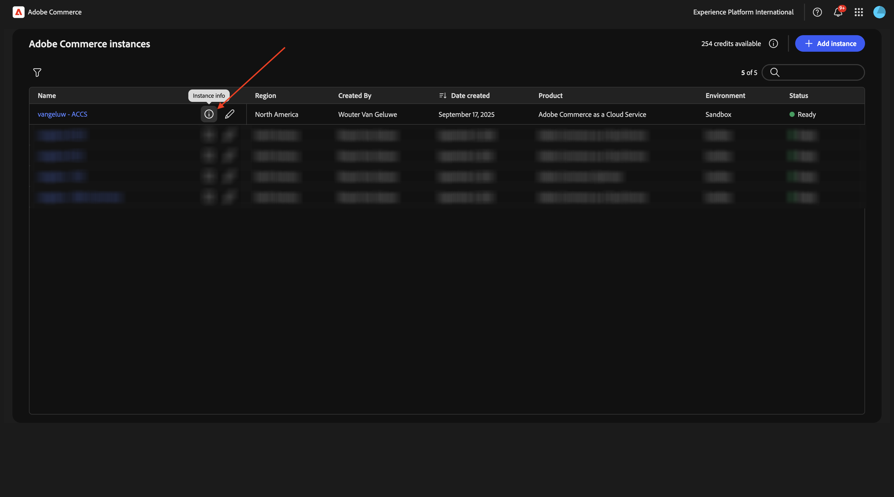
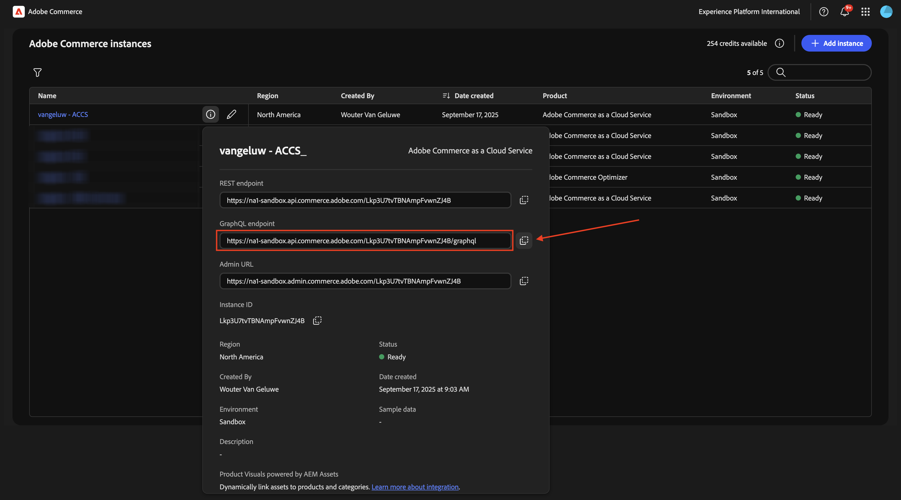
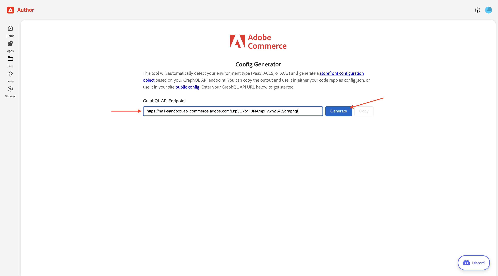
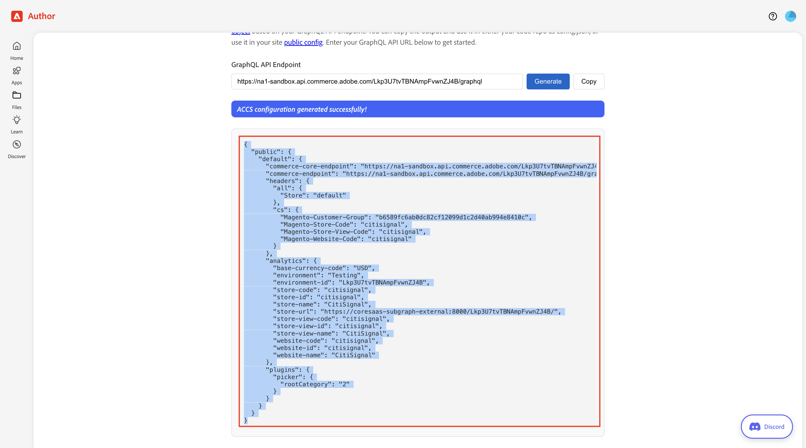
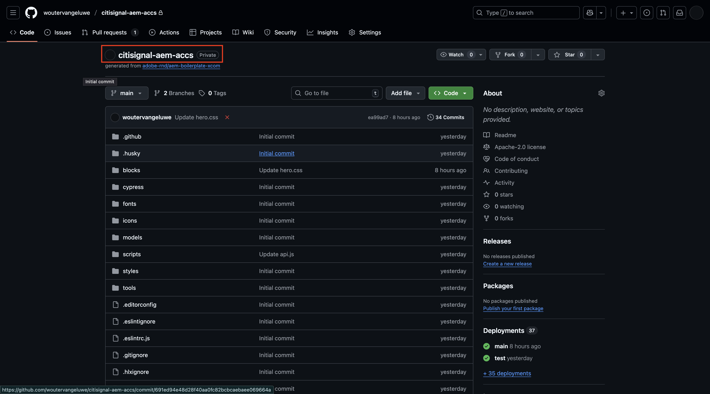
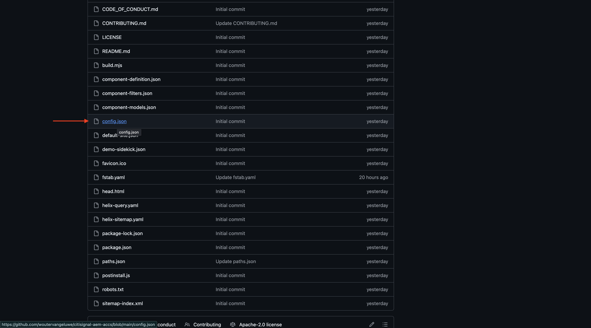
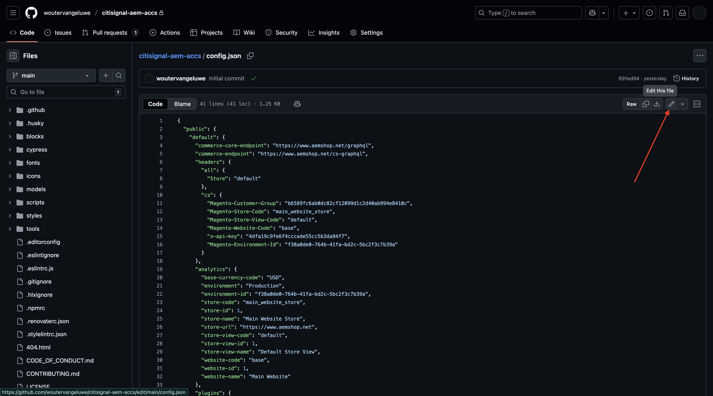
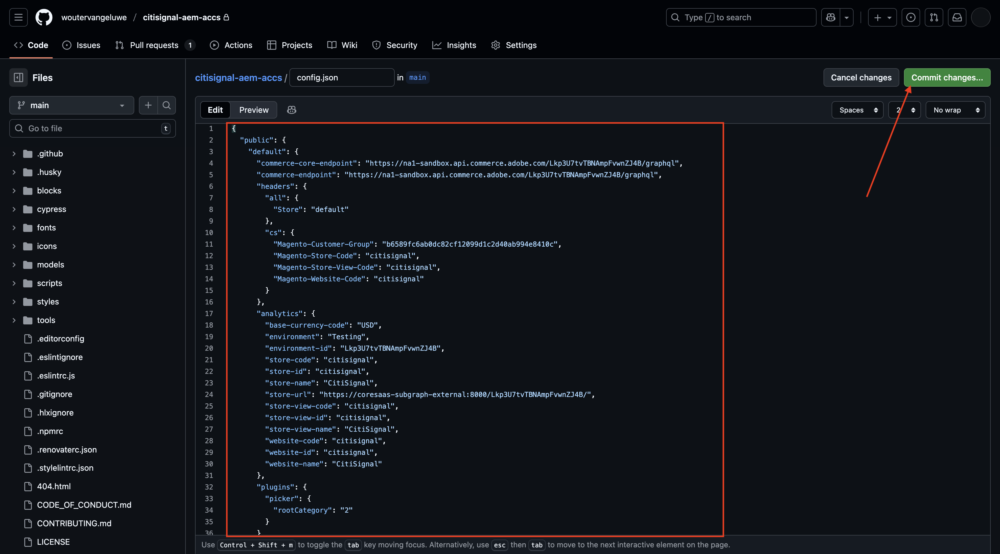
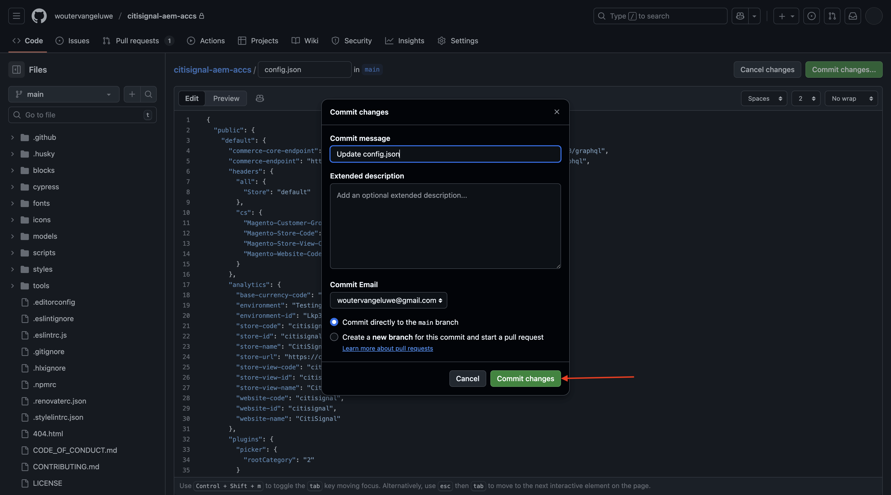

# 1.5.2 Connect ACCS to AEM Sites CS/EDS Storefront

>[!IMPORTANT]
>
>In order to complete this exercise, you need to have access to a working AEM Sites and Assets CS with EDS environment. 
>
>If you don't have such an environment yet, go to exercise [Adobe Experience Manager Cloud Service & Edge Delivery Services](./../../../modules/asset-mgmt/module2.1/aemcs.md){target="_blank"}. Follow the instructions there, and you'll have access to such an environment.

>[!IMPORTANT]
>
>If you have previously configured an AEM CS Program with an AEM Sites and Assets CS environment, it may be that your AEM CS sandbox was hibernated. Given that dehibernating such a sandbox takes 10-15 minutes, it would be a good idea to start the dehibernation process now so that you don't have to wait for it at a later time.

In this exercise, you'll link the AEM Sites CS/EDS Storefront to the ACCS backend. At the moment, when you open your AEM Sites CS/EDS Storefront and go to the **Phones** product list page, you don't see any products yet.

At the end of this exercise, you should see the products that you configured in the previous exercise appear on the **Phones** product list page on your AEM Sites CS/EDS Storefront.

Go to [https://experience.adobe.com/](https://experience.adobe.com/){target="_blank"}. Ensure you're in the correct environment, which should be named `--aepImsOrgName--`. Click **Commerce**.

Click the **info** icon next to your ACCS instance, which should be named `--aepUserLdap-- - ACCS`.

You should then see this. Copy the **GraphQL endpoint**.

Go to [https://da.live/app/adobe-commerce/storefront-tools/tools/config-generator/config-generator](https://da.live/app/adobe-commerce/storefront-tools/tools/config-generator/config-generator). You now need to generate a config.json file that will be used to link your AEM Sites CS Storefront to your ACCS backend.

On the **Config Generator** page, paste the **GraphQL endpoint** url that you copied.

Click **Generate**.

Copy the full generated JSON payload.

Go to the GitHub repository that was created when setting up your AEM Sites CS/EDS environment. That repository was created in the exercise [1.1.2 Setup your AEM CS environment](./../../../modules/asset-mgmt/module2.1/ex3.md){target="_blank"} and should be named **citisignal-aem-accs**.

In the root directory, scroll down and click to open the file **config.json**.

Click the **Edit** icon.

Remove all the current text and replace it by pasting the JSON payload you copied on the **Config Generator** page.

Click **Commmit changes...**.

Click **Commmit changes**.

The **config.json** file was now updated. You should see your changes on the website within a couple of minutes. The way to verify if the changes were picked up successfully is to go to the **Phones** product page. You should now see the **iPhone Air** appear on the page.

To acces your website, you need to go to `main--citisignal-aem-accs--XXX.aem.page` and/or `main--citisignal-aem-accs--XXX.aem.live`, after replacing XXX by your GitHub user account, which in this example is `woutervangeluwe`.

In this example, the full URL becomes this:
`https://main--citisignal-aem-accs--woutervangeluwe.aem.page` and/or `https://main--citisignal-aem-accs--woutervangeluwe.aem.live`.

While the product is now showing successfully, there isn't an image available for the product just yet. You will set up the link with AEM Assets CS for product images in the next exercise.

Next Step: [Connect ACCS to AEM Assets CS](./ex3.md){target="_blank"}

Go Back to [Adobe Commerce as a Cloud Service](./accs.md){target="_blank"}

[Go Back to All Modules](./../../../overview.md){target="_blank"}
