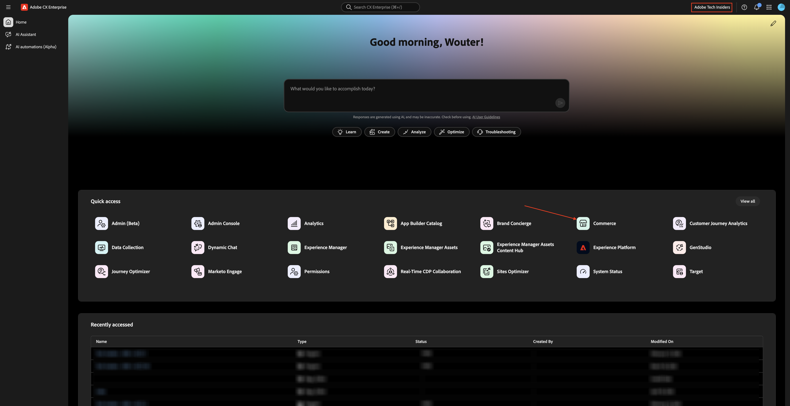
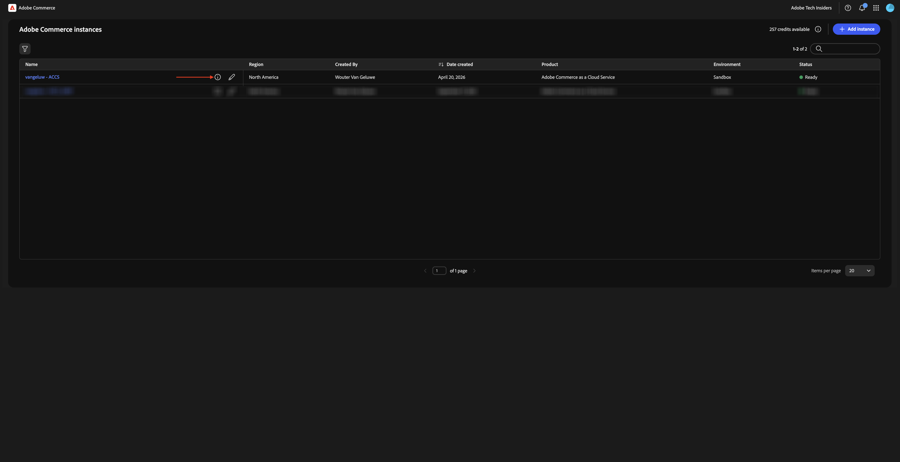
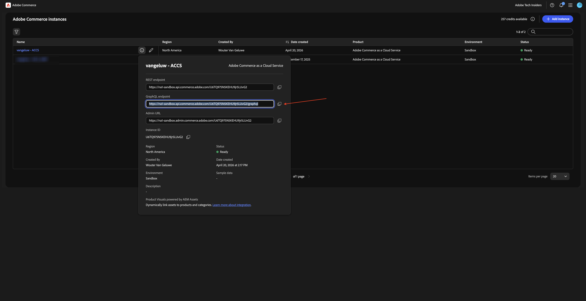
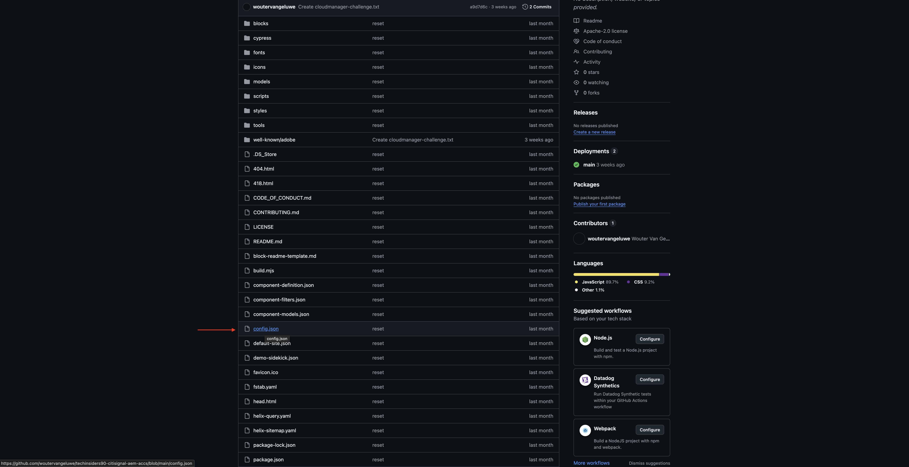
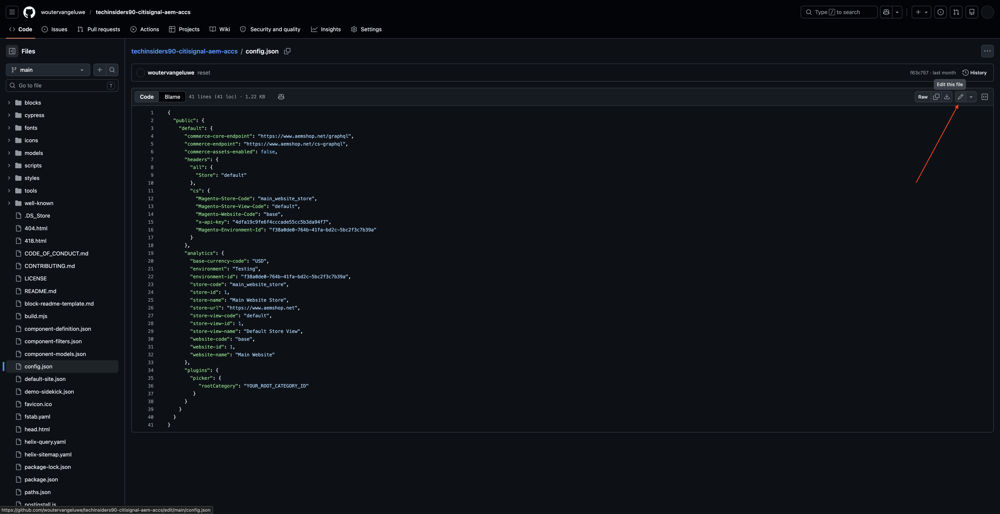
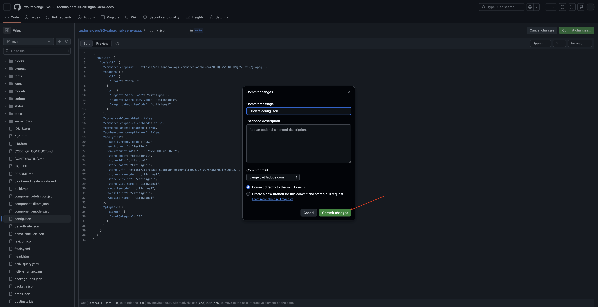
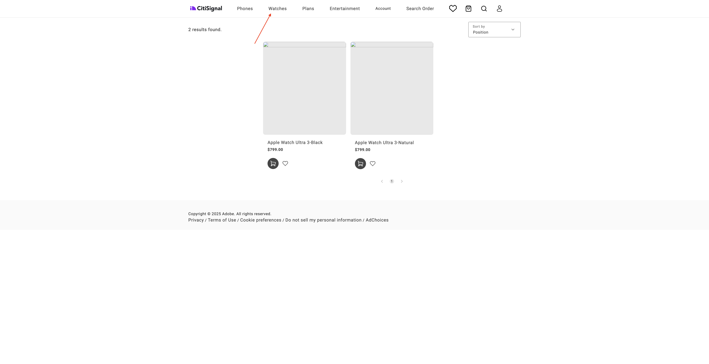

# 1.5.2 Connect ACCS to AEM Sites CS/EDS Storefront

>[!IMPORTANT]
>
>Your AEM CS sandbox may be hibernated. Given that dehibernating a sandbox takes 10-15 minutes, it would be a good idea to start the dehibernation process now so that you don't have to wait for it at a later time.

>[!IMPORTANT]
>
>Before you begin, read the below instructions!

## Instructions: Partner Lab New Orleans

For this exercise, you need to use:

- **Instance**: **Adobe Tech Insiders**
- **Username**: **adobetechinsiders---userNumber--@adobeeventlab.com**
- **Password**: use the password that was shared with you
- **AEM Program**: **Tech Insiders - AEM + ACCS --userNumber--** which you can access through [https://my.cloudmanager.adobe.com](https://my.cloudmanager.adobe.com)
- **GitHub repository**: [https://github.com/woutervangeluwe/techinsiders--userNumber---citisignal-aem-accs](https://github.com/woutervangeluwe/techinsiders--userNumber---citisignal-aem-accs)

## Configure the link between ACCS and AEM CS

In this exercise, you'll link the AEM Sites CS/EDS Storefront to the ACCS backend. At the moment, when you open your AEM Sites CS/EDS Storefront and go to the **Phones** product list page, you don't see any products yet.

At the end of this exercise, you should see the products that you configured in the previous exercise appear on the **Phones/Watches/Plans/Entertainment** product list page on your AEM Sites CS/EDS Storefront.

Go to [https://experience.adobe.com/](https://experience.adobe.com/){target="_blank"}. Ensure you're in the correct environment, which should be named `--aepImsOrgName--`. Click **Commerce**.

Click the **info** icon next to your ACCS instance, which should be named `--aepUserLdap-- - ACCS`.

You should then see this. Copy the **GraphQL endpoint**.

Go to [https://da.live/app/adobe-commerce/storefront-tools/tools/config-generator/config-generator](https://da.live/app/adobe-commerce/storefront-tools/tools/config-generator/config-generator). You now need to generate a config.json file that will be used to link your AEM Sites CS Storefront to your ACCS backend.

On the **Config Generator** page, paste the **GraphQL endpoint** url that you copied.

Click **Generate**.

Click **Copy** to copy the full generated JSON payload.

Go to the GitHub repository that was created when setting up your AEM Sites CS/EDS environment. That repository was created in the exercise [1.1.2 Setup your AEM CS environment](./../../../modules/asset-mgmt/module2.1/ex3.md){target="_blank"} and should be named **citisignal-aem-accs** or **techinsidersodXX-citisignal-aem-accs** or, in case you're attending a live in-person training, should be named **techinsidersXX-citisignal-aem-accs**.

In the root directory, scroll down and click to open the file **config.json**.

Click the **Edit** icon.

Remove all the current text and replace it by pasting the JSON payload you copied on the **Config Generator** page.

Click **Commit changes...**.

Click **Commit changes**.

The **config.json** file was now updated. You should see your changes on the website within a couple of minutes. The way to verify if the changes were picked up successfully is to go to the **Phones** product page. You should now see the **iPhone Air** appear on the page.

Open your website by using the **.page** or **.live** URLs, and then go to **Phones**. You should see this.

Go to **Watches**. You should see this.

Go to **Plans**. You should see this.

Go to **Entertainment**. You should see this.

While the products are now showing successfully, there isn't an image available for these products just yet. You will set up the link with AEM Assets CS for product images in the next exercise.

Next Step: [Connect ACCS to AEM Assets CS](./ex3.md){target="_blank"}

Go Back to [Adobe Commerce as a Cloud Service](./accs.md){target="_blank"}

[Go Back to All Modules](./../../../overview.md){target="_blank"}
