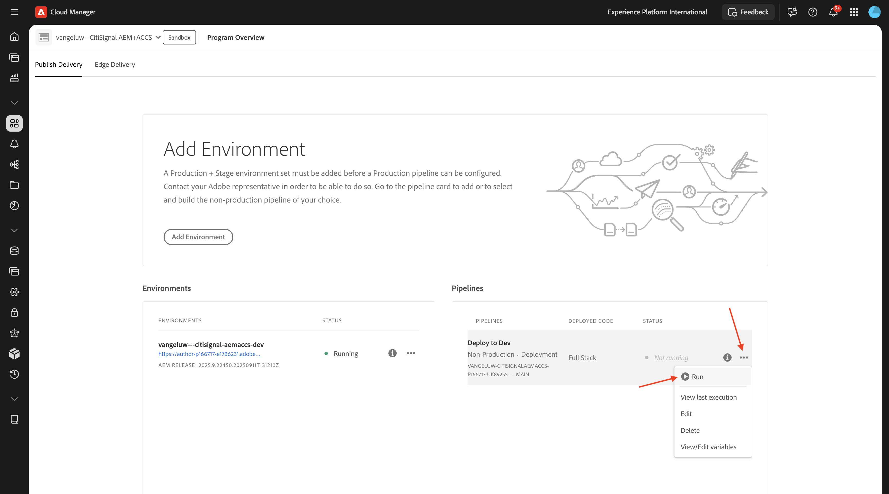
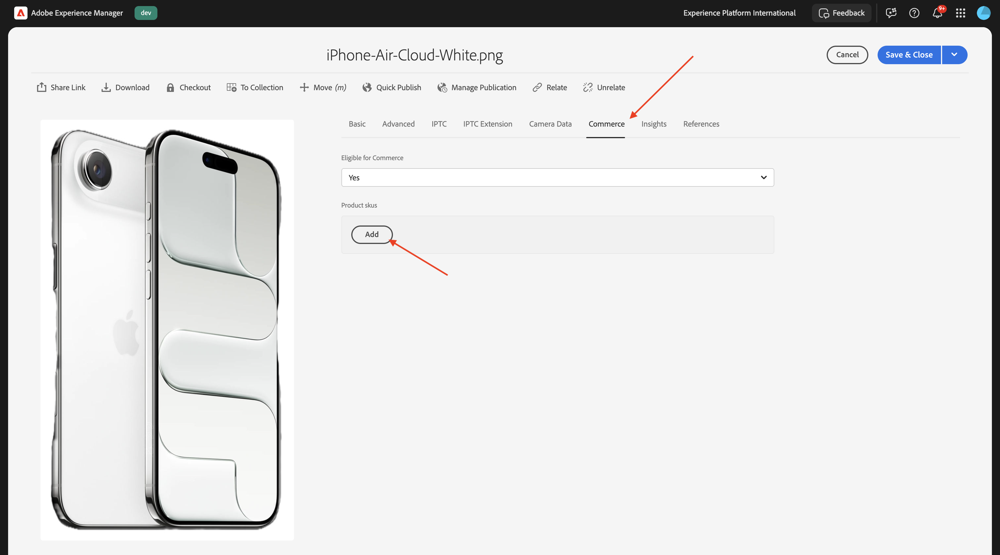

# 1.5.3 Connect ACCS to AEM Assets CS

>[!IMPORTANT]
>
>In order to complete this exercise, you need to have access to a working AEM Sites and Assets CS with EDS environment. 
>
>If you don't have such an environment yet, go to exercise [Adobe Experience Manager Cloud Service & Edge Delivery Services](./../../../modules/asset-mgmt/module2.1/aemcs.md){target="_blank"}. Follow the instructions there, and you'll have access to such an environment.

>[!IMPORTANT]
>
>If you have previously configured an AEM CS Program with an AEM Sites and Assets CS environment, it may be that your AEM CS sandbox was hibernated. Given that dehibernating such a sandbox takes 10-15 minutes, it would be a good idea to start the dehibernation process now so that you don't have to wait for it at a later time.

After completing the previous exercise, you could see a product being returned by ACCS to your website but it didn't have an image yet. At the end of this exercise, you should see an image being returned as well.


## 1.5.3.1 Update Pipeline Config

Go to [https://my.cloudmanager.adobe.com](https://my.cloudmanager.adobe.com){target="_blank"}. The org you should select is `--aepImsOrgName--`. 

Click to open your Cloud Manager Program, which should be called `--aepUserLdap-- - CitiSignal AEM+ACCS`.


Scoll down a little bit and then click **Access Repo Info** on the **Pipelines** tab. 


You should then see this. Click **Generate Password**.


Click **Generate Password** again.


You should then have a password available. Next, click the **copy** icon next to the **Git command line** field.


Create a new directory in a location of choice on your computer and name it **AEM Pipeline GitHub**.


Right-click your folder and then select **New Terminal at Folder**.


You should then see this.


Paste the **Git command line** command that you copied before in the Terminal window.


You need to enter a user name. Copy the user name from the Cloud Manager's Program Pipeline **Access Repo Info** and hit **enter**.


Next, you need to enter the password. Copy the password from the Cloud Manager's Program Pipeline **Access Repo Info** and hit **enter**.


This maye take a minute. Once completed, you'll have a local opy of the Git Repo that is linked to your Program's Pipeline.


You'll see a new directory in the **AEM Pipeline GitHub** directory. Open that directory.


Select all the files in that directory and delete all of them. 


Make sure the directory is empty.


Go to [https://github.com/ankumalh/assets-commerce](https://github.com/ankumalh/assets-commerce). Click **<> Code** and then select **Download ZIP**. Download the file and then drop it on your desktop.


Next, copy the file **assets-commerce-main.zip** to your desktop and unzip it. Open the folder **assets-commerce-main**.


Copy all the files from the directory **assets-commerce-main** to the empty directory of your Program's Pipeline Repository directory.


Next, open **Microsoft Visual Studio Code** and open the folder that contains your Program's Pipeline Repository in **Microsoft Visual Studio Code**.


Go to **Search** in the left menu and search for `<my-app>`. You need to replace all occurences of `<my-app>` by `--aepUserLdap--citisignalaemaccs`.

Click the **replace all** icon.


Click **Replace**.


The new files are now ready to be uploaded back to the Git Repo that is linked to your Program's Pipeline Repository. To do that, open the folder **AEM Pipeline GitHub** and right-click on the folder that contains the new files. Select **New Terminal at Folder**.


You should then see this. Paste the command `git add .` and hit **enter**.


You should then see this. Paste the command `git commit -m "add assets integration"` and hit **enter**.


You should then see this. Paste the command `git push origin main` and hit **enter**.


You should then see this. Your changes have now been deployed to your Program's Pipeline Git Repo.


Go back to Cloud Manager and click **Close**.


After making changes to the Pipeline's Git Repo, you need to run the **Deploy to Dev** pipeline again. Click the 3 dots **...** and select **Run**.



Click **Run**. Running a pipeline deployment may take 10-15 minutes. You need to wait until the pipeline deployment completes successfully before continuing.


## 1.5.3.2 Enable AEM Assets integration in ACCS

Go back to your ACCS instance. In the left menu, go to **Stores** and then select **Configuration**.


Scroll down in the menu to **ADOBE SERVICES** and then open **AEM Assets Integration**. You should then see this.


Fill out the following variables:

- **AEM Assets Program ID**: You can take the Program ID from the AEM CS Author URL. In this example, the Program ID is `166717`.


- **AEM Assets Environment ID**: You can take the Environment ID from the AEM CS Author URL. In this example, the Environment ID is `1786231`.


- **Asset Selector IMS Client ID**: set to `1`
- **Synchronization enabled**: set to `Yes`
- **Visualization Owner**: set to `AEM Assets`
- **Asset matching rule**: `Match by product SKU`
- **Match by product SKU attribute name**: `commerce:skus`

Click **Save Config**.


You should then see this.


## 1.5.3.3 Update config.json

Go to the GitHub repository that was created when setting up your AEM Sites CS/EDS environment. That repository was created in the exercise [1.1.2 Setup your AEM CS environment](./../../../modules/asset-mgmt/module2.1/ex3.md){target="_blank"} and should be named **citisignal-aem-accs**.

In the root directory, scroll down and click to open the file **config.json**. Click the **edit** icon to make changes to the file.


Add the below code snippet under line 5 `"commerce-endpoint": "https://na1-sandbox.api.commerce.adobe.com/XXX/graphql",`:

```json
 "commerce-assets-enabled": "true",
```

Click **Commit Changes...**.


Click **Commit Changes**.


Your change is now saved and will be published soon. It may take a couple of minutes before the change is visible on the storefront.


## 1.5.3.4 Verify Commerce Fields in AEM Assets CS

Log in to your AEM CS Author environment and go to **Assets**.


Go to **Files**.


Open the **CitiSignal** folder.


Hover over any asset and click the **info** icon.


You should now see a **Commerce** tab that contains 2 new metadata attributes.


Your AEM Assets CS environment now support the Commerce integration. You can now start uploading product images.

## 1.5.3.4 Upload Product Assets & Link to Products

[Download the product images here](./images/Product_Images.zip). Once downloaded, export the files onto your desktop.


Click **Create** and then select **Folder**.


Enter the value **Product_Images** for the fields **Title** and **Name**. Click **Create**.


Click to open the folder you just created.


Click **Create** and then select **Files**.


Navigate to the **Product_Images** folder on your desktop, select all the files and then click **Open**.


Click **Upload**.


Your images will then be available in your folder. Hover over the product **iPhone-Air-Light-Gold.png** and click the **Properties** icon.


Scroll down and set the field **Review Status** to **Approved**. The AEM Assets CS - ACCS integration only works for approved images.


Scroll up, go to the **Commerce** tab and then click **Add** under **Product skus**.


Add the following SKU's for this product:

| Key     | Value     | Usage     | 
|:-------------:| :---------------:| :---------------:| 
| `iPhone-Air-Light-Gold`| `1` |`thumbnail, image, swatch_image, small_image`|
| `iPhone-Air-Light-Gold-256GB`| `1` |`thumbnail, image, swatch_image, small_image`|
| `iPhone-Air-Light-Gold-512GB`| `1` |`thumbnail, image, swatch_image, small_image`|
| `iPhone-Air-Light-Gold-1TB`| `1` |`thumbnail, image, swatch_image, small_image`|

You should then have this. Click **Save & Close**.


Hover over the product **iPhone-Air-Space-Black.png** and click the **Properties** icon.


Scroll down and set the field **Review Status** to **Approved**. The AEM Assets CS - ACCS integration only works for approved images.


Scroll up, go to the **Commerce** tab and then click **Add** under **Product skus**.


Add the following SKU's for this product:

| Key     | Value     | Usage     | 
|:-------------:| :---------------:| :---------------:| 
| `iPhone-Air-Space-Black`| `1` |`thumbnail, image, swatch_image, small_image`|
| `iPhone-Air-Space-Black-256GB`| `1` |`thumbnail, image, swatch_image, small_image`|
| `iPhone-Air-Space-Black-512GB`| `1` |`thumbnail, image, swatch_image, small_image`|
| `iPhone-Air-Space-Black-1TB`| `1` |`thumbnail, image, swatch_image, small_image`|
| `iPhone-Air`| `1` |`thumbnail, image, swatch_image, small_image`|

You should then have this. Click **Save & Close**.


Hover over the product **iPhone-Air-Sky-Blue.png** and click the **Properties** icon.


Scroll down and set the field **Review Status** to **Approved**. The AEM Assets CS - ACCS integration only works for approved images.


Scroll up, go to the **Commerce** tab and then click **Add** under **Product skus**.


Add the following SKU's for this product:

| Key     | Value     | Usage     | 
|:-------------:| :---------------:| :---------------:| 
| `iPhone-Air-Sky-Blue`| `1` |`thumbnail, image, swatch_image, small_image`|
| `iPhone-Air-Sky-Blue-256GB`| `1` |`thumbnail, image, swatch_image, small_image`|
| `iPhone-Air-Sky-Blue-512GB`| `1` |`thumbnail, image, swatch_image, small_image`|
| `iPhone-Air-Sky-Blue-1TB`| `1` |`thumbnail, image, swatch_image, small_image`|

You should then have this. Click **Save & Close**.


Hover over the product **iPhone-Air-Cloud-White.png** and click the **Properties** icon.


Scroll down and set the field **Review Status** to **Approved**. The AEM Assets CS - ACCS integration only works for approved images.


Scroll up, go to the **Commerce** tab and then click **Add** under **Product skus**.



Add the following SKU's for this product:

| Key     | Value     | Usage     | 
|:-------------:| :---------------:| :---------------:| 
| `iPhone-Air-Cloud-White`| `1` |`thumbnail, image, swatch_image, small_image`|
| `iPhone-Air-Cloud-White-256GB`| `1` |`thumbnail, image, swatch_image, small_image`|
| `iPhone-Air-Cloud-White-512GB`| `1` |`thumbnail, image, swatch_image, small_image`|
| `iPhone-Air-Cloud-White-1TB`| `1` |`thumbnail, image, swatch_image, small_image`|

You should then have this. Click **Save & Close**.


Every **iPhone Air** image should now have a **green thumbs up**, indicating that the asset has been approved.


## 1.5.3.5 Verify Product Images on AEM Sites CS/EDS Storefront

>[!NOTE]
>
>It may take up to 15 minutes before the changes you made above are successfully deployed. If you don't see your image being shown yet, wait 15 minutes and then try again.
 
To verify that the integration is working, you need to open your CitiSignal website.

To acces your website, go to `main--citisignal-aem-accs--XXX.aem.page` and/or `main--citisignal-aem-accs--XXX.aem.live`, after replacing XXX by your GitHub user account, which in this example is `woutervangeluwe`.

So in this example, the full URL becomes this:
`https://main--citisignal-aem-accs--woutervangeluwe.aem.page` and/or `https://main--citisignal-aem-accs--woutervangeluwe.aem.live`.

You should then see this. Go to **Phones**.


You should then see a product image being shown for the **iPhone Air**. Click **iPhone Air**.


You should then see this. Make a change to the color and storage options, and you'll see the images dynamically change based on the choices you made.


Here's an example of changing the color to **Light-Gold** and the storage size to **256GB**.


Next Step: [Summary & Benefits](./summary.md){target="_blank"}

Go Back to [Adobe Commerce as a Cloud Service](./accs.md){target="_blank"}

[Go Back to All Modules](./../../../overview.md){target="_blank"}
