# 1.1.1 Create your Cloud Manager Program

Go to [https://my.cloudmanager.adobe.com](https://my.cloudmanager.adobe.com){target="_blank"}. The org you should select is `--aepImsOrgName--`. You'll then see something like this. Click **Add Program**.

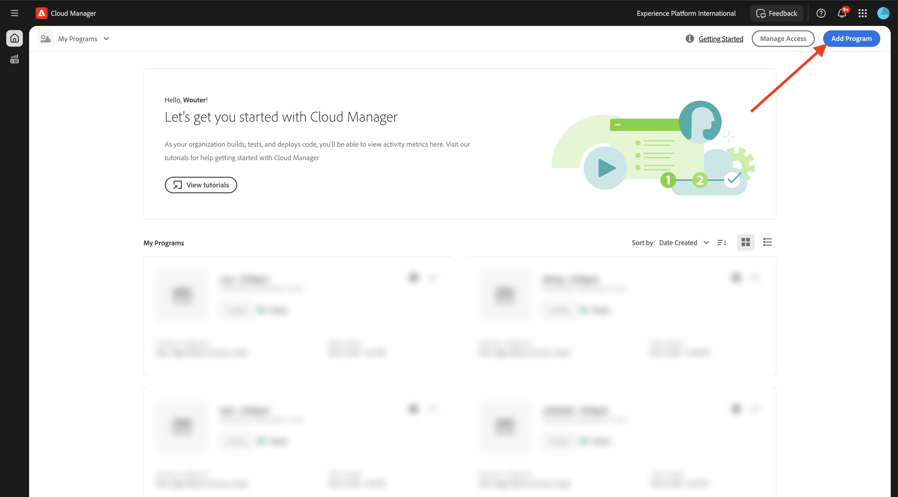

For the **Program Name**, use `--aepUserLdap-- - CitiSignal AEM+ACCS`. Select the option **Set up a sandbox**. Click **Continue**.

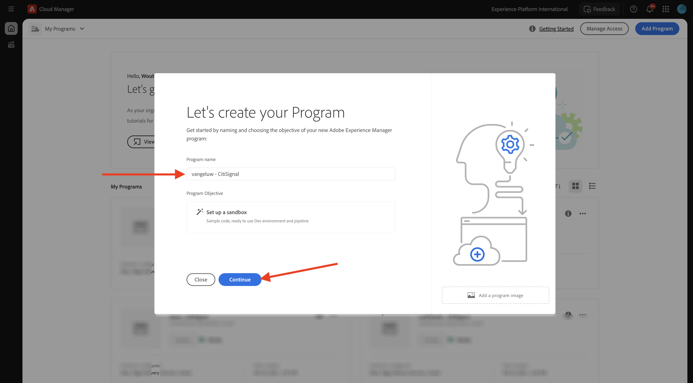

Ensure that the following options are selected:

- Sites
- Forms
- Assets 

Click the arrow for **Assets** to open the list of options.

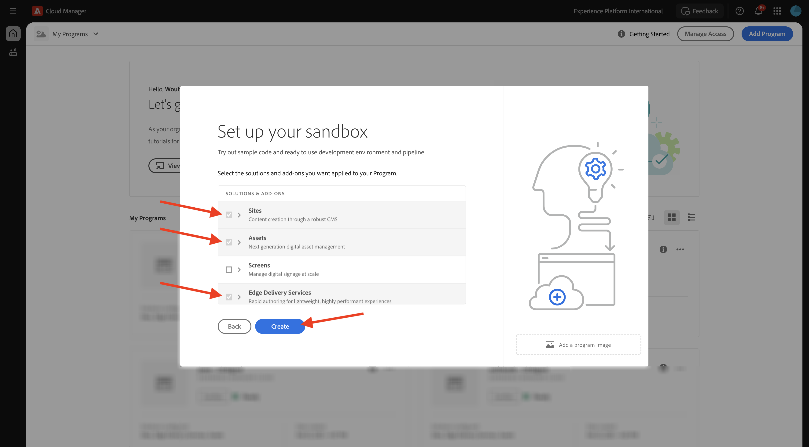

Ensure that the following options are selected:

- Content Hub

Scroll down in the list.

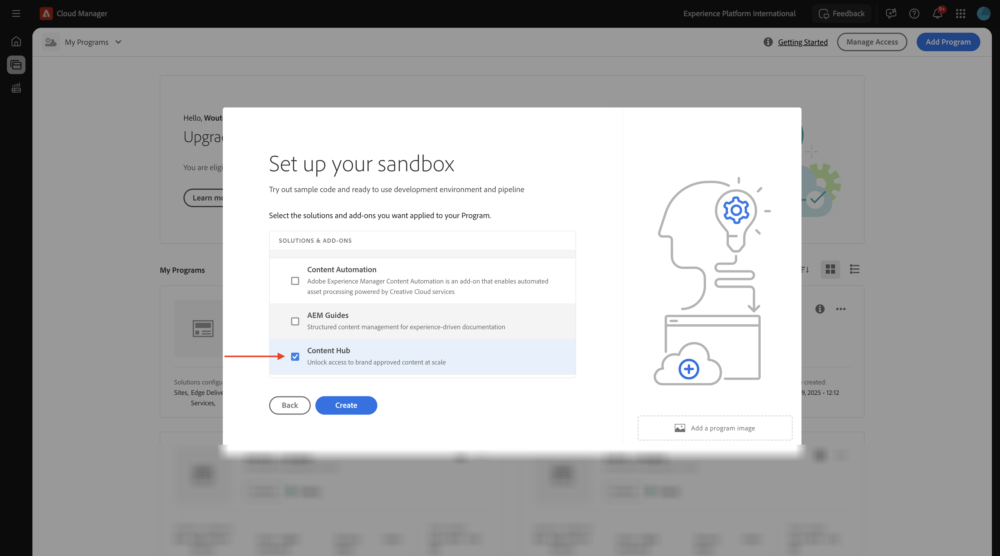

Ensure that the following options are selected:

- Edge Delivery Services 
- Dynamic Media

Click **Create**.

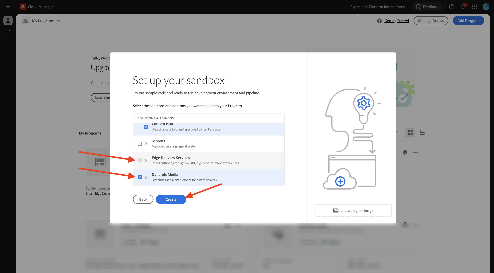

Creating your environment will take some time, 10-20mins.

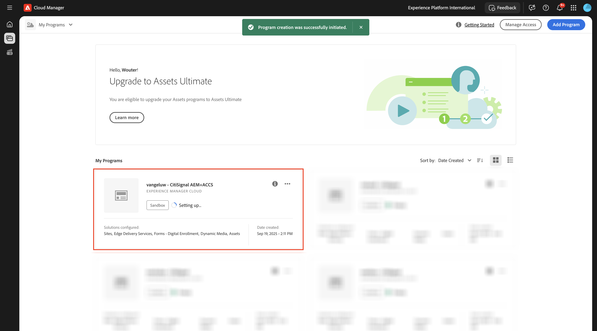

Once the environments are created and ready to use, you'll receive an email confirmation after which you can come back here.

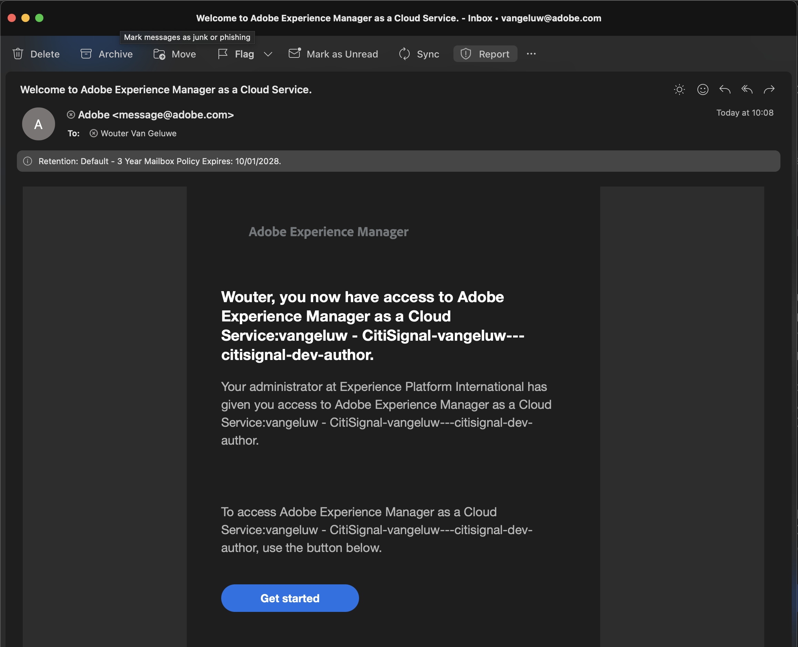

Once you've received your email confirmation, go back to [https://my.cloudmanager.adobe.com](https://my.cloudmanager.adobe.com){target="_blank"}. You'll then see that the status of your program has changed to **Ready**. Click your program to open it.

Have a look at the tab **Pipelines**. Click the 3 dots **...** and then click **Run**. 

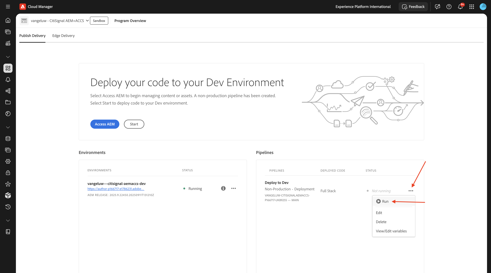

Click **Run**.

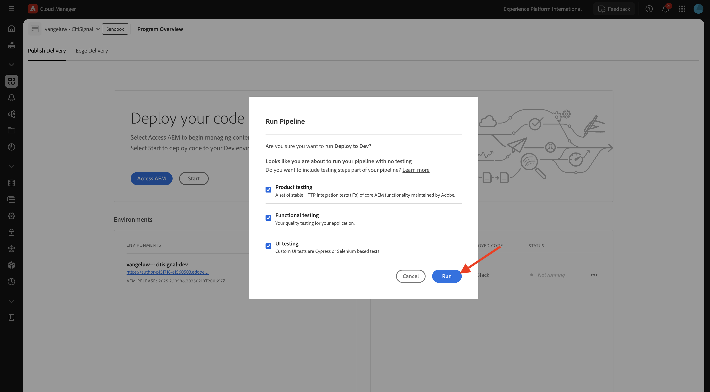

Next, click the 3 dots **...** on the **Environments** tab and click **View Details**.

You'll then see your environment details, including the URL of your **Author** environment, which you'll need in the next exercise.

Have a look at the **Content Hub** line, and select **Click to activate**.

Click **Activate**.

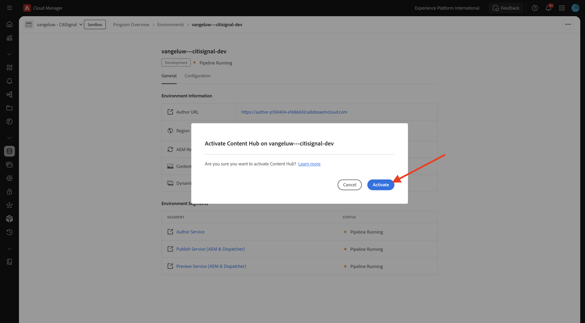

**Content Hub** activation has now started. This may take 10 minutes or more.

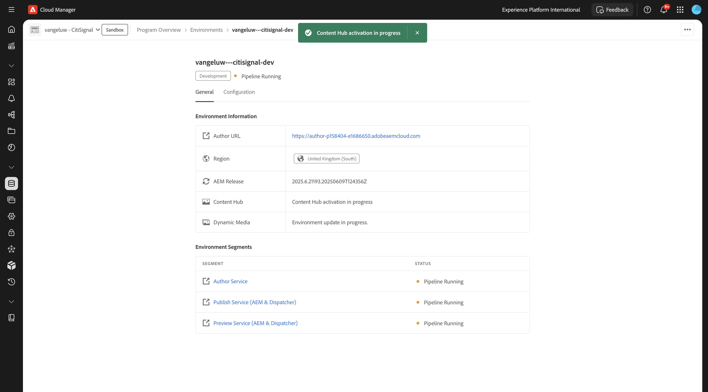

After about 10 minutes, the activation of **Content Hub** will be done. 
Next, have a look at the **Dynamic Media** line, and select **Click to activate**.

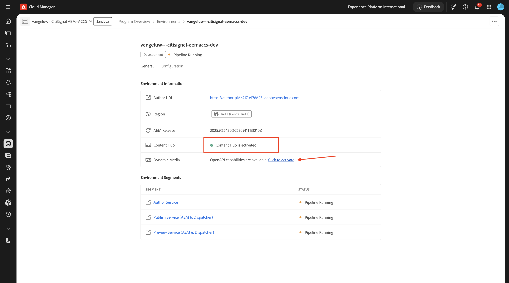

Click **Activate**.

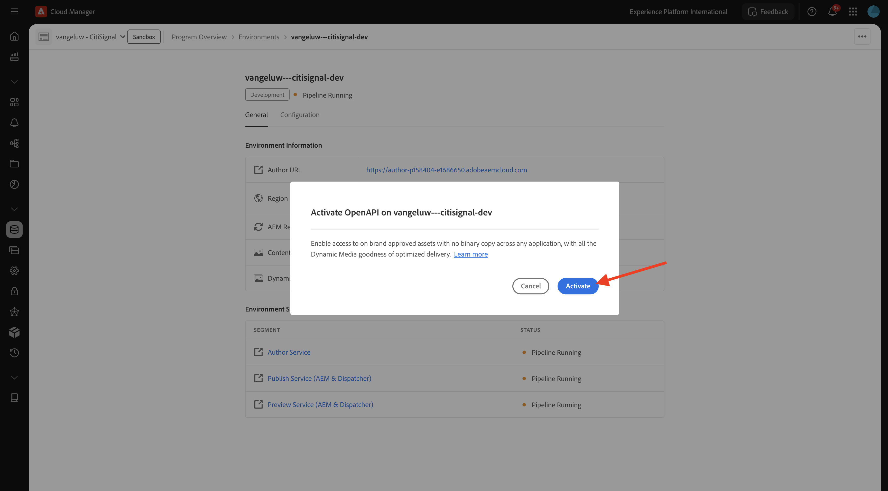

**Dynamic Media** activation has now started. This may take 10 minutes or more.

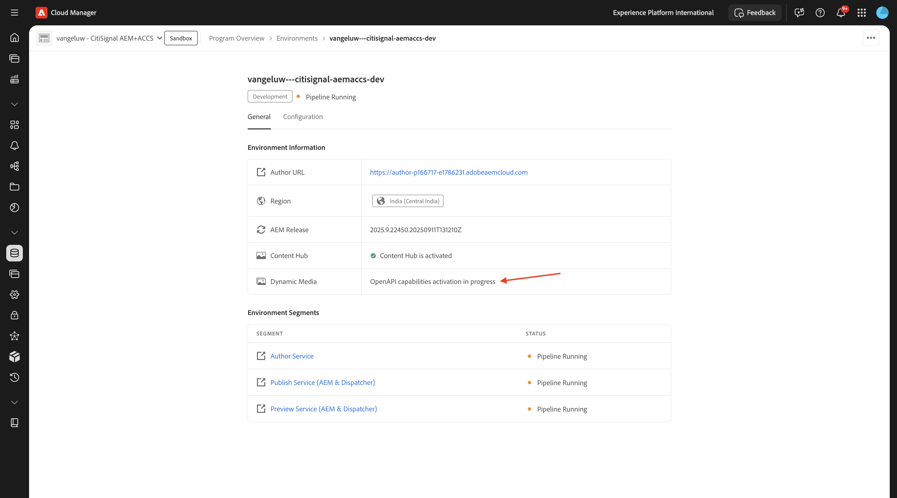

After about 10 minutes, the activation of **Dynamic Media** will be done. 

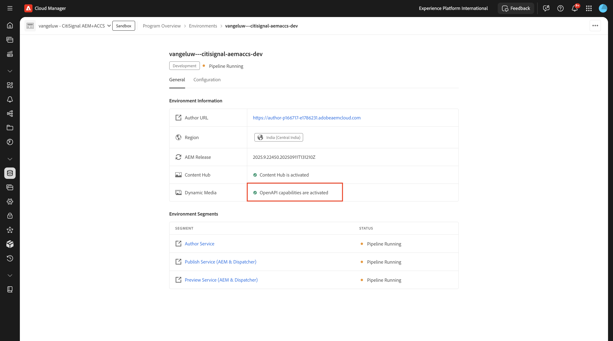

Once your pipeline run has finished, you can continue with the next exercise.

Next Step: [Setup your AEM CS environment](./ex2.md){target="_blank"}

Go Back to [Adobe Experience Manager Cloud Service & Edge Delivery Services](./aemcs.md){target="_blank"}

[Go Back to All Modules](./../../../overview.md){target="_blank"}
