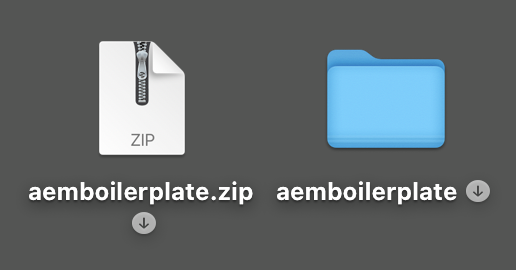
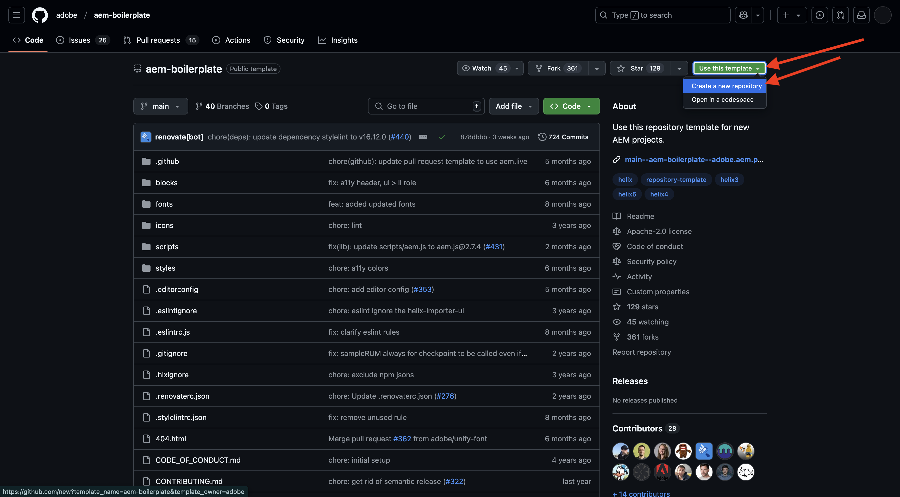
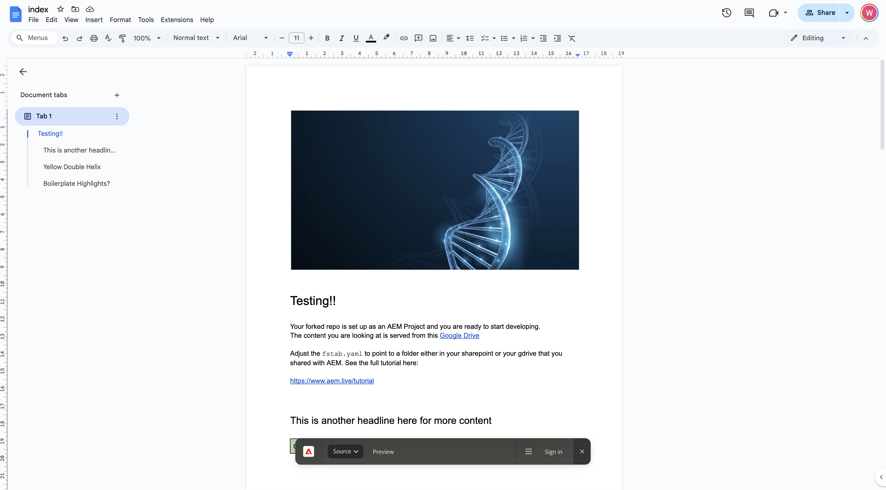

# 1.1.2 Create your document-based website

While you wait for your Cloud Manager Program to be created, you have enough time to set up your first document-based authoring website. The below exercise is based on the [aem.live Developer Tutorial](https://www.aem.live/developer/tutorial){target="_blank"}. Follow the steps below to get started.

## 1.1.2.1 Setup your Google Drive

Go to [https://drive.google.com](https://drive.google.com){target="_blank"}. Click **+ New** and then click **New Folder**.

{zoomable="yes"}

Name your folder `aemdocb-test`. Click **Create**.

{zoomable="yes"}

Download the file [aemboilerplate.zip](./../../../assets/aem/aemboilerplate.zip){target="_blank"} and extract it on your computer.

{zoomable="yes"}

You'll see 3 files in that folder. Copy those files into your new Google Drive folder.

{zoomable="yes"}

You now need to convert these files into a native Google file. To do that, open each file and then go to **File** > **Save as Google Docs**.

{zoomable="yes"}

You should do this for all 3 files, and afterwards you'll see 6 files in your Google Drive folder.

{zoomable="yes"}

You then have this in your folder.

{zoomable="yes"}

In order for the document-based authoring demo to work, you now need to share your Google Drive folder with the email address **helix@adobe.com**. Click your folder name, click **Share** and then click **Share** again.

{zoomable="yes"}

Enter the email address **helix@adobe.com** and click **Send**.

{zoomable="yes"}

Next, copy and write down the URL of your Google Drive folder as you'll need that in the next exercise. Click your folder name, click **Share** and then click **Copy link**.

{zoomable="yes"}

`https://drive.google.com/drive/folders/1PNIOFeptIfszSebawT-Y_bwB4_anQWk5?usp=drive_link`

You should remove the query string parameter `?usp=drive_link` so the URL should look like this:

`https://drive.google.com/drive/folders/1PNIOFeptIfszSebawT-Y_bwB4_anQWk5`

## 1.1.2.2 Setup your GitHub repo

Go to [https://github.com](https://github.com){target="_blank"}. Click **Sign In**.

{zoomable="yes"}

Enter your credentials. Click **Sign In**. 

{zoomable="yes"}

Once signed in, you'll see your GitHub Dashboard.

{zoomable="yes"}

Go to [https://github.com/adobe/aem-boilerplate](https://github.com/adobe/aem-boilerplate){target="_blank"}. You'll then see this. Click **Use this template** and then click **Create a new repository**.

{zoomable="yes"}

For the **Repository name**, use `aemdocb-test`. Set the visibility to **Private**. Click **Create repository**.

{zoomable="yes"}

After a couple of seconds, you'll then have your repository created.

{zoomable="yes"}

Next, go to [https://github.com/apps/aem-code-sync](https://github.com/apps/aem-code-sync){target="_blank"}. Click **Configure**.

{zoomable="yes"}

Click your GitHub account.

{zoomable="yes"}

Click **Only select repositories** and then add the repository that you just created. Next, click **Install**.

{zoomable="yes"}

You'll then get this confirmation.

{zoomable="yes"}

## 1.1.2.3 Update file fstab.yaml

In your GitHub repo, click to open the file `fstab.yaml`.

{zoomable="yes"}

Click the **edit** icon.

{zoomable="yes"}

You now need to update the value for the field **url** on line 2. 

{zoomable="yes"}

You need to replace the current value by the URL of your specific AEM CS environment in combination with the settings of your GitHub repo. 

This is the current value of the URL: `https://drive.google.com/drive/u/0/folders/1MGzOt7ubUh3gu7zhZIPb7R7dyRzG371j`.

Replace that value by the URL you copied from your Google Drive folder, `https://drive.google.com/drive/folders/1PNIOFeptIfszSebawT-Y_bwB4_anQWk5`. Click **Commit changes...**.

{zoomable="yes"}

Click **Commit changes**.

{zoomable="yes"}

## 1.1.2.4 Install AEM Sidekick extension

Go to [https://chromewebstore.google.com/detail/aem-sidekick/ccfggkjabjahcjoljmgmklhpaccedipo](https://chromewebstore.google.com/detail/aem-sidekick/ccfggkjabjahcjoljmgmklhpaccedipo){target="_blank"}. Click **Add to Chrome**.

{zoomable="yes"}

Pin the **AEM Sidekick** extension.

{zoomable="yes"}

## 1.1.2.5 Preview and Publish your document-based website

Go back to your Google Drive folder. In the task bar, click the **AEM Sidekick** extension. You then see a, AEM Sidekick bar popup on your folder.

{zoomable="yes"}

Select the 3 files in your Google Drive folder. Click **Preview**.

{zoomable="yes"}

Click **Preview** again.

{zoomable="yes"}

Click to close the green dialog popup.

{zoomable="yes"}

Select the 3 files in your Google Drive folder again. Now, click **Publish**.

{zoomable="yes"}

Click **Publish**.

{zoomable="yes"}

Click to close the green dialog again. Now, select the file **index**, click **Copy URLs** and then click **Copy Live URLs**.

{zoomable="yes"}

The URL that was copied will look like this: `https://main--aemdocb-test--woutervangeluwe.aem.live/`. 

In the above URL:

- **main** refers to the branch on your GitHub repo
- **aemdocb-test** refers to the GitHub repository name
- **woutervangeluwe** refers to the GitHub user account name
- **.live** refers to the live environment of your AEM instance
- You can replace **.live** by **.page** to open the preview environment of your AEM instance

Open a new browser window and navigate to the URL.

{zoomable="yes"}

## 1.1.2.6 Make a change and publish your change

Go back to your Google Drive and open the filer **index** in Google.

{zoomable="yes"}

Replace the text **Testing** by any other text of choice. Click **Preview**.

{zoomable="yes"}

The preview version of your website will then open. Review your change and click **Publish**.

{zoomable="yes"}

You'll then see the live version of your website.

{zoomable="yes"}

The above exercise was a good way to get started and experience document-based authoring yourself. You can now continue with the next exercise, where you'll set up your own demo website using CitiSignal as a demo brand.

Next Step: [1.1.3 Setup your AEM CS environment](./ex3.md){target="_blank"}

Go Back to [Adobe Experience Manager Cloud Service & Edge Delivery Services](./aemcs.md){target="_blank"}

[Go Back to All Modules](./../../../overview.md){target="_blank"}
