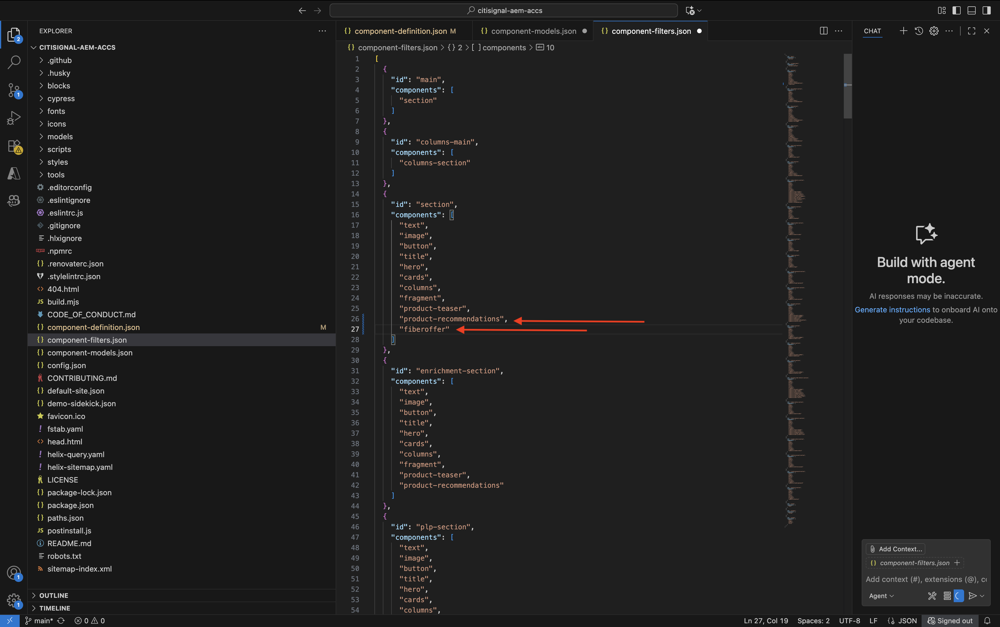

# 1.1.3 Develop a basic custom block

## 1.1.3.1 Setup your local development environment

Go to [https://desktop.github.com/download/](https://desktop.github.com/download/){target="_blank"}, download and install **Github Desktop**.


Once Github Desktop is installed, go to the GitHub repo you created in the previous exercise. Click **<> Code** and then click **Open with GitHub Desktop**.


Your GitHub repo will then be opened in GitHub Desktop. Feel free to change the **Local Path**. Click **Clone**.


A local folder will now be created.


Open Visual Studio Code. Go to **File** > **Open Folder**.


Select the folder that is used by your GitHub setup for **citisignal-aem-accs**.


You'll now see that folder open in Visual Studio Code, you're now ready to create a new block.


## 1.1.3.2 Create a basic custom block

Adobe recommends that you develop blocks in a three-phased approach:

- Create the definition and model for the block, review it, and bring it to production.
- Create content with the new block.
- Implement the decoration and styles for the new block.

### component-definition.json

In Visual Studio Code, open the file **component-definition.json**.


Scroll down until you see the **Blocks**. Set your cursor under the closing bracket of the component **Cards**


Paste this code and enter a comma **,** after the block of code:

```json
{
  "title": "FiberOffer",
  "id": "fiberoffer",
  "plugins": {
    "xwalk": {
      "page": {
        "resourceType": "core/franklin/components/block/v1/block",
        "template": {
          "name": "FiberOffer",
          "model": "fiberoffer",
          "offerText": "<p>Fiber will soon be available in your region!</p>",
          "offerCallToAction": "Get your offer now!",
          "offerImage": ""
        }
      }
    }
  }
}
```

Save your changes.


### component-models.json

In Visual Studio Code, open the file **component-models.json**.


Scroll down until you see the last item. Set your cursor next to the closing bracket of the last component.


Enter a comma **,**, then push enter and on the next line, paste this code:

```json
{
  "id": "fiberoffer",
  "fields": [
     {
       "component": "richtext",
       "name": "offerText",
       "value": "",
       "label": "Offer Text",
       "valueType": "string"
     },
     {
       "component": "richtext",
       "valueType": "string",
       "name": "offerCallToAction",
       "label": "Offer CTA",
       "value": ""
     },
     {
       "component": "reference",
       "valueType": "string",
       "name": "offerImage",
       "label": "Offer Image",
        "multi": false
     }
   ]
}
```

Save your changes.


### component-filters.json

In Visual Studio Code, open the file **component-filters.json**.


Under **section**, enter a comma `,` and paste the id of your component `"fiberoffer"` after the current last line.

Save your changes.



## 1.1.3.3 Commit your changes

You've now made several changes in your project that need to be committed back to your GitHub repository. To do that, open **GitHub Desktop**.

You should then see the 3 files that you just edited under **Changes**. Review your changes.


Enter a name for your PR, `Fiber Offer custom block`. Click **Commit to main**.


You should then see this. Click **Push origin**.


After a couple of seconds, your changes have been pushed to your GitHub repository.


In your browser, go to your GitHub account and to the repository your created for CitiSignal. You should then see something like this, showing that your changes have been received.


## 1.1.3.4 Add your block to a page

Now that your basic quote block is defined and committed to the CitiSignal project, you can add a **fiberoffer** block to an existing page.

Go to [https://my.cloudmanager.adobe.com](https://my.cloudmanager.adobe.com){target="_blank"}. Click your **Program** to open it.


Next, click the 3 dots **...** on the **Environments** tab and click **View Details**.


You'll then see your environment details. Click the URL of your **Author** environment.

>[!NOTE]
>
>It is possible that your environment is hibernated. If that is the case, you'll need to de-hibernate your environment first.


You should then see your AEM Author environment. Go to **Sites**.


Go to **CitiSignal**. Click **Create** and select **Page**.


Select **Page** and click **Next**.


Enter the following values:

- Title: **Fiber**
- Name: **fiber**
- Page Title: **Fiber**

Click **Create**.


Select **Open**.


You should then see this. 


Click in the blank area to select the **section** component. Then, click the plus **+** icon in the right menu.


You should then see your custom block shown in the list of available blocks. Click to select it.


You'll then see fields like **Offer Text**, **Offer CTA** and **Offer Image** being added to the editor. Click **+ Add** on the **Offer Image** field to select an image.


You should then see this. Click to open the folder **citisignal**.


Select the image **product-enrichment-1.png**. Click **Select**.


You should then have this. Click **Publish**.


Click **Publish** again.


Your new page has now been published.

## 1.1.3.5 Add your new page to the navigation menu

In your AEM Sites overview, go to **CitiSignal** and check the checkbox for the file **Header/nav**. Click **Edit**.


Select the **Text** field in the preview screen and then click the **Text** field on the right side of the screen to edit it.


Add a menu option to the nav menu with the text `Fiber`. Select the text **Fiber** and click the **link** icon.


Enter this for the **URL** `/content/CitiSignal/fiber.html` and click the **V** icon to confirm.


You should then have this. Click **Done**.


You should then have this. Click **Publish**.


Click **Publish** again.


You will now be able to view the changes to your website by going to `main--citisignal--XXX.aem.page/us/en/` and/or `main--citisignal--XXX.aem.live/us/en/`, after replacing XXX by your GitHub user account, which in this example is `woutervangeluwe`.

In this example, the full URL becomes this:
`https://main--citisignal--woutervangeluwe.aem.page/us/en/` and/or `https://main--citisignal--woutervangeluwe.aem.live/us/en/`.

You should then see this. Click **Fiber**.


Here is your basic custom block, but now rendered on the website.


Next Step: [Advanced Custom Block](./ex4.md){target="_blank"}

Go Back to [Adobe Experience Manager Cloud Service & Edge Delivery Services](./aemcs.md){target="_blank"}

[Go Back to All Modules](./../../../overview.md){target="_blank"}
