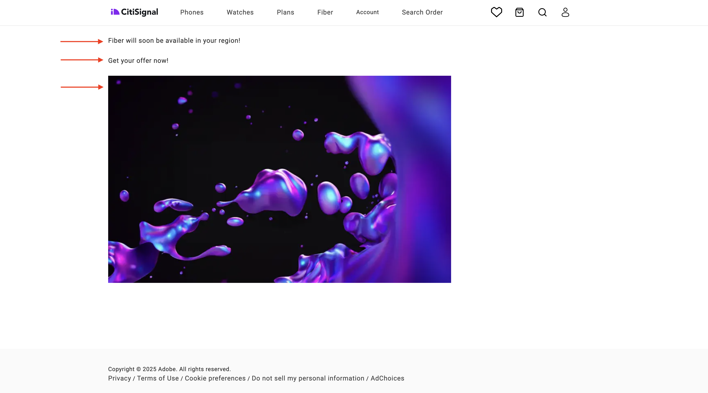
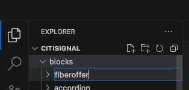
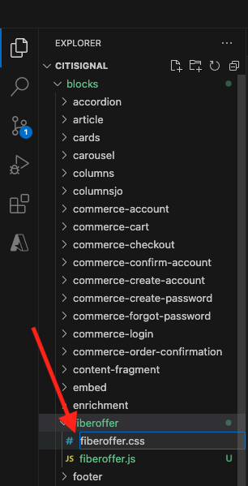
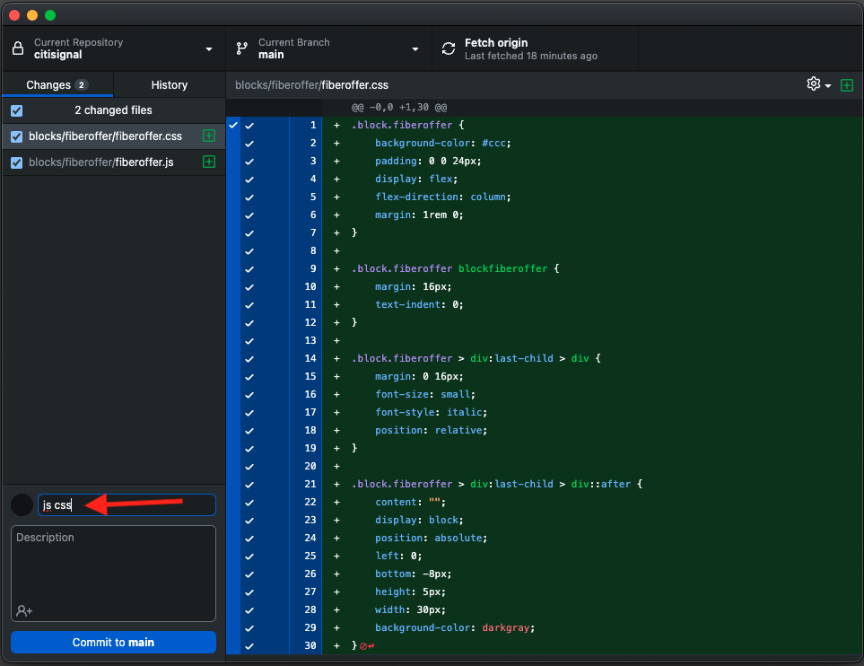
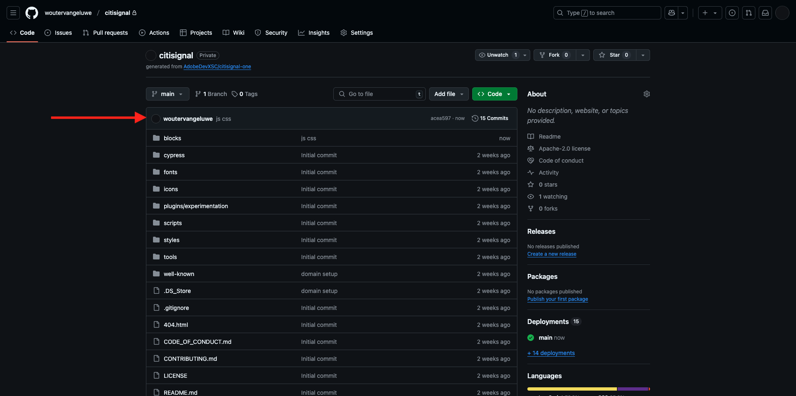
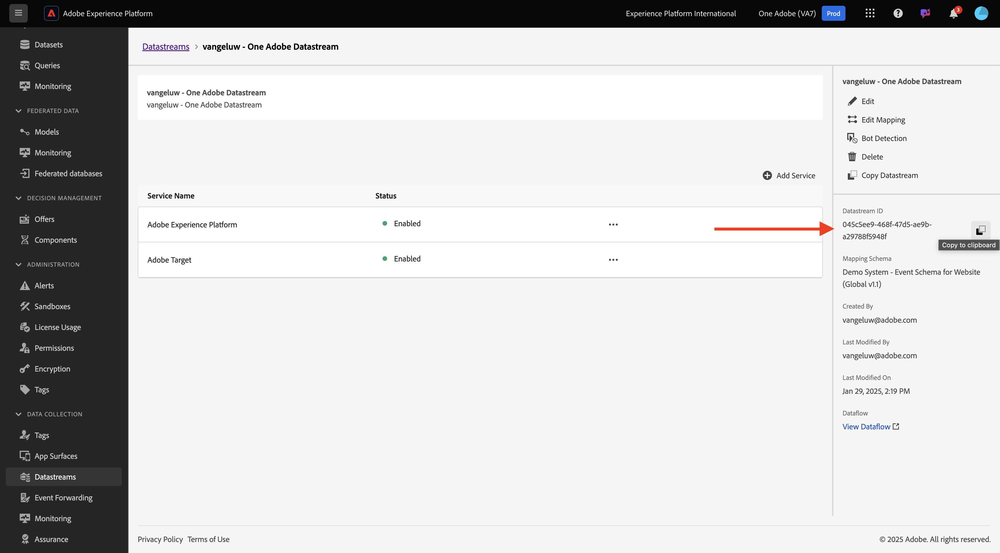
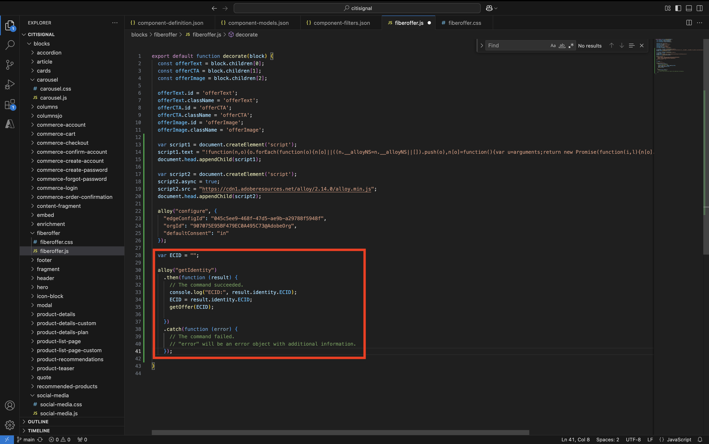
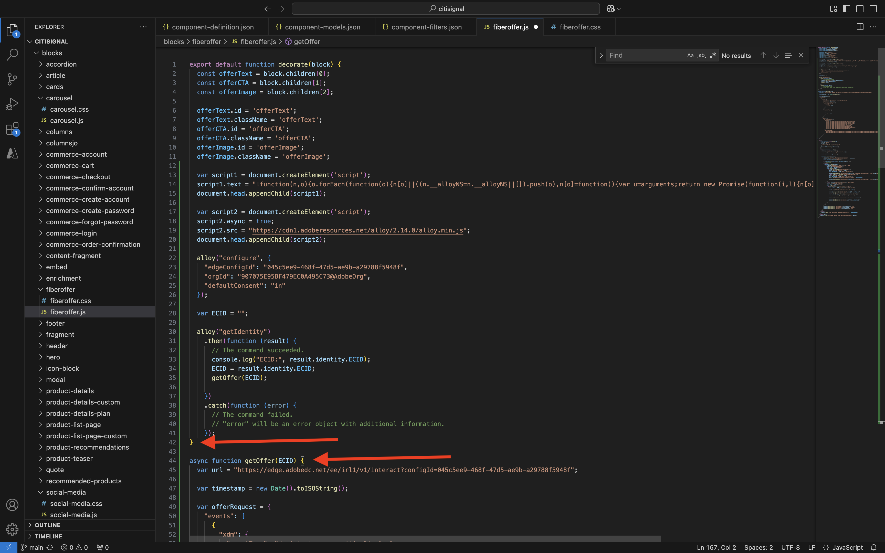
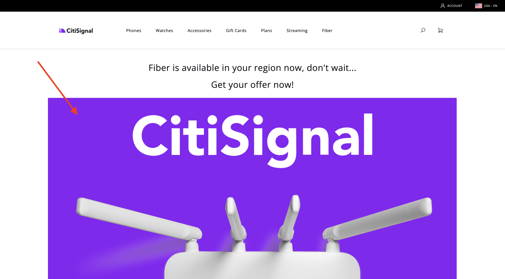

# 1.1.4 Advanced Custom Block

In the previous exercise, you configured a basic custom block called **Fiber Offer** that showcases fields like **Offer Text**, **Offer CTA** and **Offer Image** onto your website. 

You can now continue working on this block.

{zoomable="yes"}

## 1.1.4.1 Style your block

Now that you have a working **fiberoffer** block you can apply styling to it.

Go back to Visual Studio Code and open the folder **blocks**. You should now see multiple folders that each reference a specific block. In order to make your **fiberoffer** block more advanced, you now need to create a folder for your custom block.

{zoomable="yes"}

Select the folder **blocks** and then click the **Create New Folder** icon.

{zoomable="yes"}

Name your folder `fiberoffer` and hit **enter**.

{zoomable="yes"}

Select the new **fiberoffer** folder and click the **Create New File** icon.

{zoomable="yes"}

A new file is now created. Enter the name **fiberoffer.js** and hit enter.

{zoomable="yes"}

You can now implement block decoration by adding the following JavaScript into the file **fiberoffer.js**.

Save the file.

```js
export default function decorate(block) {
  const offerText = block.children[0];
  const offerCTA = block.children[1];
  const offerImage = block.children[2];

  offerText.id = 'offerText';
  offerText.className = 'offerText';
  offerCTA.id = 'offerCTA';
  offerCTA.className = 'offerCTA';
  offerImage.id = 'offerImage';
  offerImage.className = 'offerImage';
}
```

{zoomable="yes"}

Select the new **fiberoffer** folder and click the **Create New File** icon again.

{zoomable="yes"}

A new file is now created. Enter the name **fiberoffer.css** and hit enter.

{zoomable="yes"}

Copy and paste the folllowing CSS code in the newly created file.

```js
.offerText, .offerCTA, .offerImage{
    color: #14161A;
    font-size: 30px;
    padding: 0 0 24px;
    display: flex;
    flex-direction: column;
    margin: 1rem 0;
    text-align: center;
}
```

Save your changes.

{zoomable="yes"}

You've now made several changes in your project that need to be committed back to your GitHub repository. To do that, open **GitHub Desktop**.

You should then see the 2 files that you just edited under **Changes**. Review your changes.

Enter a name for your PR, `js css`. Click **Commit to main**.

{zoomable="yes"}

You should then see this. Click **Push origin**.

{zoomable="yes"}

In your browser, go to your GitHub account and to the repository your created for CitiSignal. You should then see something like this, showing that your changes have been received.

{zoomable="yes"}

You will now be able to view the changes to your website by going to `main--citisignal-aem-accs--XXX.aem.page` and/or `main--citisignal-aem-accs--XXX.aem.live`, after replacing XXX by your GitHub user account, which in this example is `woutervangeluwe`.

In this example, the full URL becomes this:
`https://main--citisignal-aem-accs--woutervangeluwe.aem.page` and/or `https://main--citisignal-aem-accs--woutervangeluwe.aem.live`.

You should then see this, with the styling applied to your page.

{zoomable="yes"}

## 1.1.4.2 Add logic and load data from an external endpoint

For this exercise, you will be doing a 'raw' configuration of Adobe's Web SDK and you'll be requesting the next best offer from Adobe Journey Optimizer Offer Decisioning. 

To be clear: this is not intended as a best practice implementation of Web SDK for AEM as a Cloud Service. In the next exercise you will be implementing data collection using a specific plugin that was developed for this.

This exercise is intended to show you a couple of basic things in JavaScript, like loading an external JS library, using the **alloy.js** library, sending a request and more.

The library **alloy.js** is the library behing Web SDK which makes it possible to send requests from a website to Adobe's Edge Network, and from there so applications like Adobe Experience Platform, Adobe Analytics, Adobe Target and more.

Add this code under the previous code you added for the styling of your block:

```javascript
var script1 = document.createElement('script');
  script1.text = "!function(n,o){o.forEach(function(o){n[o]||((n.__alloyNS=n.__alloyNS||[]).push(o),n[o]=function(){var u=arguments;return new Promise(function(i,l){n[o].q.push([i,l,u])})},n[o].q=[])})}(window,['alloy']);"
  document.head.appendChild(script1);

  var script2 = document.createElement('script');
  script2.async = true;
  script2.src = "https://cdn1.adoberesources.net/alloy/2.14.0/alloy.min.js";
  document.head.appendChild(script2);

  alloy("configure", {
    "edgeConfigId": "045c5ee9-468f-47d5-ae9b-a29788f5948f",
    "orgId": "907075E95BF479EC0A495C73@AdobeOrg",
    "defaultConsent": "in"
  });
```

You should then have this.

The first script tag (script1) that you added, is a function that is used by Web SDK and which creates a window object, named **alloy**.

The second script tag (script2) will asynchronously load the alloy.js library from Adobe's CDN.

The third block of code basically configures the alloy object to send data towards a specific Adobe IMS Org and Datastream. 

In the **Getting Started** module, you already configured a datastream, called `--aepUserLdap-- - One Adobe Datastream`. The field **edgeConfigId** in the above code references the ID of the datastream that was configured.

You don't need to change the field **edgeConfigId** at this moment. In the next exercise you will be able to do this using the **MarTech** plugin.

{zoomable="yes"}

You should now have this.

{zoomable="yes"}

Next, add this block below the previous code that you added in.

```javascript
var ECID = "";

  alloy("getIdentity")
    .then(function (result) {
      // The command succeeded.
      console.log("ECID:", result.identity.ECID);
      ECID = result.identity.ECID;
      getOffer(ECID);

    })
    .catch(function (error) {
      // The command failed.
      // "error" will be an error object with additional information.
    });
```

This block of code is used to retrieve the value of the Experience Cloud ID (ECID). The ECID is the unique device identifier of your browser.

As you can see in the above code, once the ECID is retrieved, another function is being called. This function is called **getOffer()** which you will add next.

{zoomable="yes"}

Next, add the below code under the 

```javascript
async function getOffer(ECID) {
  var url = "https://edge.adobedc.net/ee/irl1/v1/interact?configId=045c5ee9-468f-47d5-ae9b-a29788f5948f";

  var timestamp = new Date().toISOString();

  var offerRequest = {
    "events": [
      {
        "xdm": {
          "eventType": "decisioning.propositionDisplay",
          "timestamp": timestamp,
          "_experienceplatform": {
            "identification": {
              "core": {
                "ecid": ECID
              }
            }
          },
          "identityMap": {
            "ECID": [
              {
                "id": ECID
              }
            ]
          }
        },
        "query": {
          "personalization": {
            "schemas": [
              "https://ns.adobe.com/personalization/default-content-item",
              "https://ns.adobe.com/personalization/html-content-item",
              "https://ns.adobe.com/personalization/json-content-item",
              "https://ns.adobe.com/personalization/redirect-item",
              "https://ns.adobe.com/personalization/ruleset-item",
              "https://ns.adobe.com/personalization/message/in-app",
              "https://ns.adobe.com/personalization/message/content-card",
              "https://ns.adobe.com/personalization/dom-action"
            ],
            "decisionScopes": [
              "eyJ4ZG06YWN0aXZpdHlJZCI6ImRwczpvZmZlci1hY3Rpdml0eToxYTI3ODk3NzAzYTY5NWZmIiwieGRtOnBsYWNlbWVudElkIjoiZHBzOm9mZmVyLXBsYWNlbWVudDoxYTI0ZGM2MWJmYjJlMjIwIn0=",
              "eyJ4ZG06YWN0aXZpdHlJZCI6ImRwczpvZmZlci1hY3Rpdml0eToxYTI3ODk3NzAzYTY5NWZmIiwieGRtOnBsYWNlbWVudElkIjoiZHBzOm9mZmVyLXBsYWNlbWVudDoxYTI0ZGM0MzQyZjJlMjFlIn0="
            ]
          }
        }
      }
    ]
  }

  try {
    const response = await fetch(url, {
      method: "POST",
      headers: {
        "Content-Type": "application/json"
      },
      body: JSON.stringify(offerRequest),
    });

    if (response.status === 200) {
      var body = await response.json();
      console.log("Offer Decisioning Response: ", body);

      const decisions = body["handle"];

      decisions.forEach(decision => {
        if (decision["type"] == "personalization:decisions") {
          console.log("Offer Decisioning decision detail: ", decision);
          const payloads = decision["payload"];

          if (payloads === undefined || payloads.length == 0) {
            //do nothing
          } else {
            payloads.forEach(payload => {
              if (payload["placement"]["name"] == "Web - Image") {
                console.log("Web-Image payload");
                const items = payload["items"];
                items.forEach(item => {
                  if (item["id"].includes("dps:fallback-offer")) {
                    console.log("Item details: ", item);
                    const deliveryURL = item["data"]["deliveryURL"];

                    document.querySelector("#offerImage").innerHTML = "";
                  } else if (item["id"].includes("dps:personalized-offer")) {
                    console.log("Item details: ", item);
                    const deliveryURL = item["data"]["deliveryURL"];
                    console.log("Web-Image Personalized Offer Content: ", deliveryURL)

                    document.querySelector("#offerImage").innerHTML = "";
                  }
                });
              } else if (payload["placement"]["name"] == "Web - JSON") {
                console.log("Web-JSON payload");
                const items = payload["items"];
                items.forEach(item => {
                  if (item["id"].includes("dps:fallback-offer")) {
                    const content = JSON.parse(item["data"]["content"]);

                    console.log("Web-JSON Fallback Content: ", content)

                    document.querySelector("#offerText").innerHTML = content.text;
                    document.querySelector("#offerCTA").innerHTML = content.cta;
                  } else if (item["id"].includes("dps:personalized-offer")) {
                    const content = JSON.parse(item["data"]["content"]);

                    console.log("Web-JSON Personalized Offer Content: " + content);

                    document.querySelector("#offerText").innerHTML = content.text;
                    document.querySelector("#offerCTA").innerHTML = content.cta;
                  }
                });
              }
            });
          }
          document.querySelector("#offerImage").style.display = "block";
          document.querySelector("#offerText").style.display = "block";
          document.querySelector("#offerCTA").style.display = "block";
        }
      });
    } else {
      console.warn("Offer Decisioning Response unsuccessful:", response.body);
    }
  } catch (error) {
    console.error("Error when getting Offer Decisioning Response:", error);
  }
}
```

It's very important that this code block is pasted below the closing bracket which you can see on line 42 in this example. The code you just pasted is a separate function that needs it's own place in this file, and can't be nested in the above **default function**.

{zoomable="yes"}

The code block you just pasted simulates a request that would normally be made by Web SDK/alloy.js. In this example a **fetch** request will be made to **edge.adobedc.net**.

In the request, 2 **Decision Scopes** are specified which will ask Adobe Journey Optimizer Offer Decisioning to provide a decision about what offer needs to be seen by this ECID.

Once the response is received, this code will parse the response and will filter out things like the URL of the image that needs to be displayed and also the JSON response which contains things like the Offer Text and the Offer CTA, after which it will display these on the website.

Remember - this approach is used just for enablement purpose and is not the best practice way of implementing data collection.

Save your changes. Then, open **Github Desktop**, give a name to your PR and click **Commit to main**.

{zoomable="yes"}

Next, click **Push origin**.

{zoomable="yes"}

You will now be able to view the changes to your website by going to `main--citisignal-aem-accs--XXX.aem.page` and/or `main--citisignal-aem-accs--XXX.aem.live`, after replacing XXX by your GitHub user account, which in this example is `woutervangeluwe`.

In this example, the full URL becomes this:
`https://main--citisignal-aem-accs--woutervangeluwe.aem.page` and/or `https://main--citisignal-aem-accs--woutervangeluwe.aem.live`.

You should then see this.

{zoomable="yes"}

Next Step: [AEM Edge Delivery Services MarTech plugin](./ex5.md){target="_blank"}

Go Back to [Adobe Experience Manager Cloud Service & Edge Delivery Services](./aemcs.md){target="_blank"}

[Go Back to All Modules](./../../../overview.md){target="_blank"}
