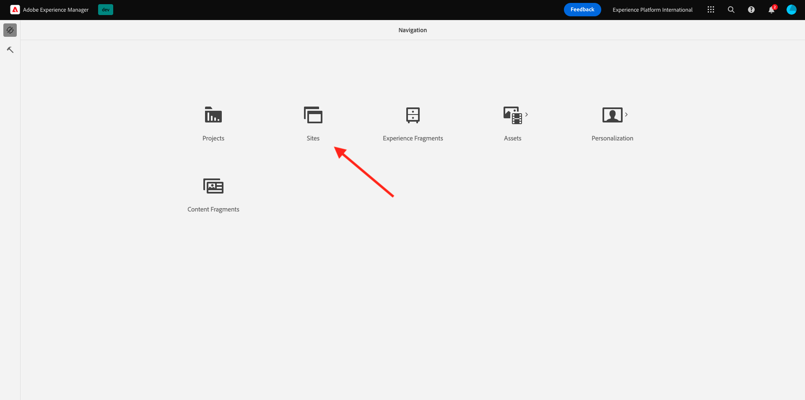
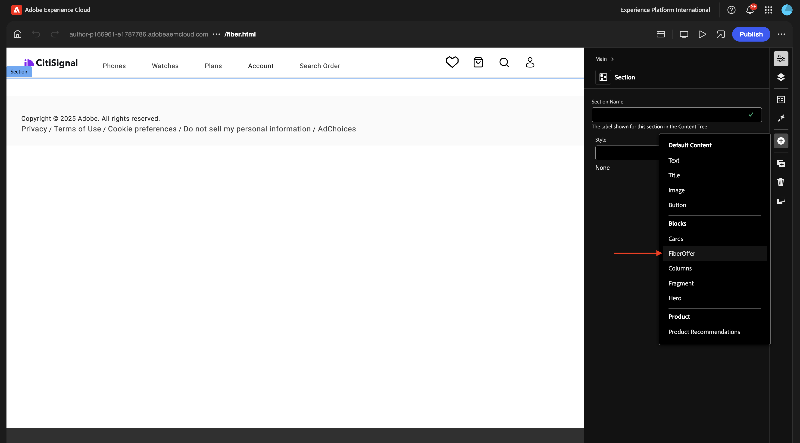

# 1.1.4 Develop a basic custom block

## 1.1.4.1 Setup your local development environment

Go to [https://desktop.github.com/download/](https://desktop.github.com/download/){target="_blank"}, download and install **Github Desktop**.

{zoomable="yes"}

Once Github Desktop is installed, go to the GitHub repo you created in the previous exercise. Click **<> Code** and then click **Open with GitHub Desktop**.

{zoomable="yes"}

Your GitHub repo will then be opened in GitHub Desktop. Feel free to change the **Local Path**. Click **Clone**.

{zoomable="yes"}

A local folder will now be created.

{zoomable="yes"}

Open Visual Studio Code. Go to **File** > **Open Folder**.

{zoomable="yes"}

Select the folder that is used by your GitHub setup for **citisignal**.

{zoomable="yes"}

You'll now see that folder open in Visual Studio Code, you're now ready to create a new block.

{zoomable="yes"}

## 1.1.4.2 Create a basic custom block

Adobe recommends that you develop blocks in a three-phased approach:

- Create the definition and model for the block, review it, and bring it to production.
- Create content with the new block.
- Implement the decoration and styles for the new block.

### component-definition.json

In Visual Studio Code, open the file **component-definition.json**.

{zoomable="yes"}

Scroll down until you see the component **Quote**. Set your cursor next to the closing bracket of the last component.

{zoomable="yes"}

Paste this code and enter a comma **,** after the block of code:

```json
{
  "title": "FiberOffer",
  "id": "fiberoffer",
  "plugins": {
    "xwalk": {
      "page": {
        "resourceType": "core/franklin/components/block/v1/block",
        "template": {
          "name": "FiberOffer",
          "model": "fiberoffer",
          "offerText": "<p>Fiber will soon be available in your region!</p>",
          "offerCallToAction": "Get your offer now!",
          "offerImage": ""
        }
      }
    }
  }
}
```

Save your changes.

{zoomable="yes"}

### component-models.json

In Visual Studio Code, open the file **component-models.json**.

{zoomable="yes"}

Scroll down until you see the last item. Set your cursor next to the closing bracket of the last component.

{zoomable="yes"}

Enter a comma **,**, then push enter and on the next line, paste this code:

```json
{
  "id": "fiberoffer",
  "fields": [
     {
       "component": "richtext",
       "name": "offerText",
       "value": "",
       "label": "Offer Text",
       "valueType": "string"
     },
     {
       "component": "richtext",
       "valueType": "string",
       "name": "offerCallToAction",
       "label": "Offer CTA",
       "value": ""
     },
     {
       "component": "reference",
       "valueType": "string",
       "name": "offerImage",
       "label": "Offer Image",
        "multi": false
     }
   ]
}
```

Save your changes.

{zoomable="yes"}

### component-filters.json

In Visual Studio Code, open the file **component-filters.json**.

{zoomable="yes"}

Under **section**, enter a comma **,** and the id of your component **fiberoffer** after the current last line.

Save your changes.

{zoomable="yes"}

## 1.1.4.3 Commit your changes

You've now made several changes in your project that need to be committed back to your GitHub repository. To do that, open **GitHub Desktop**.

You should then see the 3 files that you just edited under **Changes**. Review your changes.

{zoomable="yes"}

Enter a name for your PR, `Fiber Offer custom block`. Click **Commit to main**.

{zoomable="yes"}

You should then see this. Click **Push origin**.

{zoomable="yes"}

After a couple of seconds, your changes have been pushed to your GitHub repository.

{zoomable="yes"}

In your browser, go to your GitHub account and to the repository your created for CitiSignal. You should then see something like this, showing that your changes have been received.

{zoomable="yes"}

## 1.1.4.4 Add your block to a page

Now that your basic quote block is defined and committed to the CitiSignal project, you can add a **fiberoffer** block to an existing page.

Go to [https://my.cloudmanager.adobe.com](https://my.cloudmanager.adobe.com){target="_blank"}. Click your **Program** to open it.

{zoomable="yes"}

Next, click the 3 dots **...** on the **Environments** tab and click **View Details**.

{zoomable="yes"}

You'll then see your environment details. Click the URL of your **Author** environment.

>[!NOTE]
>
>It is possible that your environment is hibernated. If that is the case, you'll need to de-hibernate your environment first.

{zoomable="yes"}

You should then see your AEM Author environment. Go to **Sites**.

{zoomable="yes"}

Go to **CitiSignal** > **us** > **en**.

{zoomable="yes"}

Click **Create** and select **Page**.

{zoomable="yes"}

Select **Page** and click **Next**.

{zoomable="yes"}

Enter the following values:

- Title: **CitiSignal Fiber**
- Name: **citisignal-fiber**
- Page Title: **CitiSignal Fiber**

Click **Create**.

{zoomable="yes"}

You should then see this.

{zoomable="yes"}

Click in the blank area to select the **section** component. Then, click the plus **+** icon in the right menu.

{zoomable="yes"}

You should then see your custom block shown in the list of available blocks. Click to select it.

{zoomable="yes"}

You'll then see fields like **Offer Text**, **Offer CTA** and **Offer Image** being added to the editor. Click **+ Add** on the **Offer Image** field to select an image.

{zoomable="yes"}

You should then see this. Click to open the folder **citisignal**.

{zoomable="yes"}

Select the image **product-enrichment-1.png**. Click **Select**.

{zoomable="yes"}

You should then have this. Click **Publish**.

{zoomable="yes"}

Click **Publish** again.

{zoomable="yes"}

Your new page has now been published.

## 1.1.4.5 Add your new page to the navigation menu

In your AEM Sites overview, go to **CitiSignal** > **Fragments** and check the checkbox for **Header**. Click **Edit**.

{zoomable="yes"}

Add a menu option to the nav menu with the text `Fiber`. Select the text **Fiber** and click the **link** icon.

{zoomable="yes"}

Enter this for the **URL** `/us/en//citisignal-fiber` and click the **V** icon to confirm.

{zoomable="yes"}

You should then have this. Click **Publish**.

{zoomable="yes"}

Click **Publish** again.

{zoomable="yes"}

You will now be able to view the changes to your website by going to `main--citisignal--XXX.aem.page/us/en/` and/or `main--citisignal--XXX.aem.live/us/en/`, after replacing XXX by your GitHub user account, which in this example is `woutervangeluwe`.

In this example, the full URL becomes this:
`https://main--citisignal--woutervangeluwe.aem.page/us/en/` and/or `https://main--citisignal--woutervangeluwe.aem.live/us/en/`.

You should then see this. Click **Fiber**.

{zoomable="yes"}

Here is your basic custom block, but now rendered on the website.

{zoomable="yes"}

Next Step: [1.1.5 Advanced Custom Block](./ex5.md){target="_blank"}

Go Back to [Adobe Experience Manager Cloud Service & Edge Delivery Services](./aemcs.md){target="_blank"}

[Go Back to All Modules](./../../../overview.md){target="_blank"}
