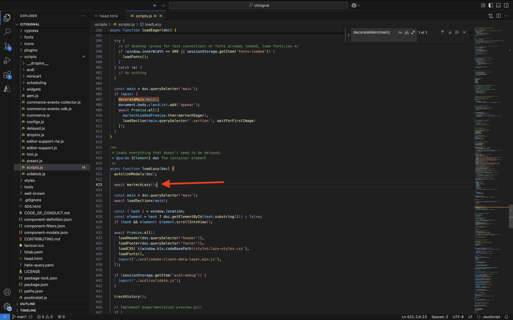
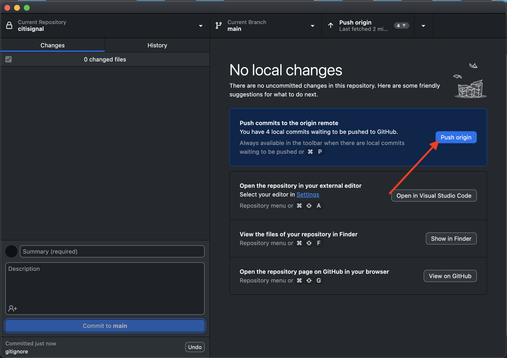
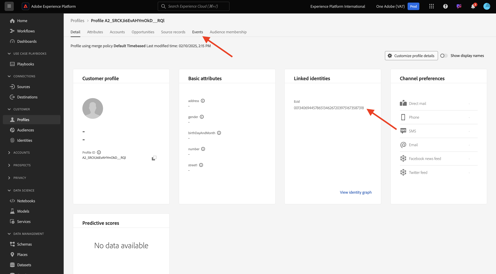

# 1.1.6 AEM Edge Delivery Services MarTech plugin

The AEM MarTech plugin helps you quickly set up a complete MarTech stack for your AEM project. 

>[!NOTE]
>
>This plugin is currently available to customers in collaboration with AEM Engineering via co-innovation projects. You can find more info on [https://github.com/adobe-rnd/aem-martech](https://github.com/adobe-rnd/aem-martech).

## 1.1.6.1 Add the plugin to your repo

Navigate to the folder that you're using for your **citisignal** GitHub repository. Right-click the folder name and then select **New Terminal at Folder**.

{zoomable="yes"}

You'll then see this. Paste the following command and hit **enter**.

```
git subtree add --squash --prefix plugins/martech https://github.com/adobe-rnd/aem-martech.git main
```

You should then see this.

{zoomable="yes"}

Navigate to the folder that you're using for your **citisignal** GitHub repository, open the folder **plugins**. You should now see a folder named **martech**.

{zoomable="yes"}

## 1.1.6.2 head.html

In Visual Studio Code, open the file **head.html**. Copy the below code and paste it in the file **head.html**.

```javascript
<link rel="preload" as="script" crossorigin="anonymous" href="/plugins/martech/src/index.js"/>
<link rel="preload" as="script" crossorigin="anonymous" href="/plugins/martech/src/alloy.min.js"/>
<link rel="preconnect" href="https://edge.adobedc.net"/>
<!-- change to adobedc.demdex.net if you enable third party cookies -->
```

Save your changes.

{zoomable="yes"}

## 1.1.6.3 scripts.js

In Visual Studio Code, go to the folder **scripts** and open the file **scripts.js**. Copy the below code and paste it in the file **scripts.js**, under the existing import scripts.

```javascript
import {
  initMartech,
  updateUserConsent,
  martechEager,
  martechLazy,
  martechDelayed,
} from '../plugins/martech/src/index.js';
```

Save your changes.

{zoomable="yes"}

In Visual Studio Code, in the file **scripts.js**, find the following code:

```javascript
const AUDIENCES = {
  mobile: () => window.innerWidth < 600,
  desktop: () => window.innerWidth >= 600,
  // define your custom audiences here as needed
};
```

Under **const AUDIENCES = {...};** paste the below code:

```javascript
  const isConsentGiven = true;
  const martechLoadedPromise = initMartech(
    // The WebSDK config
    // Documentation: https://experienceleague.adobe.com/en/docs/experience-platform/web-sdk/commands/configure/overview#configure-js
    {
      datastreamId: "XXX",
      orgId: "XXX",
      defaultConsent: 'in',
      onBeforeEventSend: (payload) => {
        // set custom Target params 
        // see doc at https://experienceleague.adobe.com/en/docs/platform-learn/migrate-target-to-websdk/send-parameters#parameter-mapping-summary
        payload.data.__adobe.target ||= {};

        // set custom Analytics params
        // see doc at https://experienceleague.adobe.com/en/docs/analytics/implementation/aep-edge/data-var-mapping
        payload.data.__adobe.analytics ||= {};
      },

      // set custom datastream overrides
      // see doc at:
      // - https://experienceleague.adobe.com/en/docs/experience-platform/web-sdk/commands/datastream-overrides
      // - https://experienceleague.adobe.com/en/docs/experience-platform/datastreams/overrides
      edgeConfigOverrides: {
        // Override the datastream id
        // datastreamId: '...'

        // Override AEP event datasets
        // com_adobe_experience_platform: {
        //   datasets: {
        //     event: {
        //       datasetId: '...'
        //     }
        //   }
        // },

        // Override the Analytics report suites
        // com_adobe_analytics: {
        //   reportSuites: ['...']
        // },

        // Override the Target property token
        // com_adobe_target: {
        //   propertyToken: '...'
        // }
      },
    },
    // The library config
    {
      launchUrls: ["XXX"],
      personalization: !!getMetadata('target') && isConsentGiven,
    },
  );
```

{zoomable="yes"}

There are a couple of variables that you need to replace in the above code, by your own environment's variables:

- `datastreamId: "XXX"`
- `orgId: "XXX"`
- `launchUrls: ["XXX"]`

You can find these variables by following these instructions:

### datastreamId

Go to [https://platform.adobe.com/](https://platform.adobe.com/) and then go to **Datastreams** in the left menu. Ensure that you're in the right sandbox, which should be `--aepSandboxName--`. Search the datastream that was created in the Getting Started section of this tutorial, which should be named `--aepUserLdap-- - One Adobe Datastream`. Click the **copy** icon to copy the **Datastream ID** and paste it in Visual Studio Code, in the file **scripts.js**, by replacing the placeholder value `XXX` next to `datastreamId:`.

{zoomable="yes"}

### orgId

Go to [https://platform.adobe.com/](https://platform.adobe.com/) and then go to **Queries** in the left menu. Under **Credentials**, you'll find the **IMS Org ID** as **Username**. Click the **copy** icon to copy the **IMS Org ID** and paste it in Visual Studio Code, in the file **scripts.js**, by replacing the placeholder value `XXX` next to `orgId:`.

{zoomable="yes"}

### launchUrls

Go to [https://platform.adobe.com/](https://platform.adobe.com/) and then go to **Tags** in the left menu. Search for your property using your LDAP, which should be `--aepUserLdap--`. Open your Web property.

{zoomable="yes"}

In the left menu, go to **Environments** and then click the **Install** icon for the **Development** environment.

{zoomable="yes"}

You'll then find the URL you need, but it's inside an HTML `<script></script>` tag. You should only copy the part that starts at `https` until `.min.js`. 

{zoomable="yes"}

The URL looks like this: `https://assets.adobedtm.com/b754ed1bed61/b9f7c7c484de/launch-5fcd90e5b482-development.min.js`. Please ensure that no other text is copied along as that would cause errors. In Visual Studio Code, in the file **scripts.js**, replace the placeholder value `XXX` in the `launchUrls:` array.

You now have the three variables you need. Your file `scripts.js` should now look like this:

{zoomable="yes"}

Next, search to find this block of code:

```javascript
const main = doc.querySelector('main');
  if (main) {
    decorateMain(main);
    document.body.classList.add('appear');
    await loadSection(main.querySelector('.section'), waitForFirstImage);	
  }
```

{zoomable="yes"}

Replace it by this block of code:

```javascript
const main = doc.querySelector('main');
  if (main) {
    decorateMain(main);
    document.body.classList.add('appear');
    await Promise.all([
      martechLoadedPromise.then(martechEager),
      loadSection(main.querySelector('.section'), waitForFirstImage)
    ]);
  }
```

{zoomable="yes"}

Next, search for and scroll down to `async function loadLazy(doc) {`.

{zoomable="yes"}

Under the line `autolinkModals(doc);`, add this line of code:

```javascript
await martechLazy();
```

{zoomable="yes"}

Next, search for and scroll down to the line `function loadDelayed() {`.

{zoomable="yes"}

Add this block of code unter the line `// load anything that can be postponed to the latest here`.

```javascript
window.setTimeout(() => {
    martechDelayed();
    return import('./delayed.js');
  }, 3000);
```

{zoomable="yes"}

Next, search for and go to the line that contains `window.adobeDataLayer.push`. 

{zoomable="yes"}

You'll see the object `pageContext` being defined like this. You now need to add two objects under `pageContext`.

```javascript
	pageContext: {
      pageType,
      pageName: document.title,
      eventType: 'visibilityHidden',
      maxXOffset: 0,
      maxYOffset: 0,
      minXOffset: 0,
      minYOffset: 0,
    }
```

This is the code that needs to be added:

```javascript
	,
    _experienceplatform: {
      identification:{
        core:{
          ecid: sessionStorage.getItem("com.adobe.reactor.dataElements.ECID")
        }
      }
    },
    web: {
      webPageDetails:{
        name: document.title,
        URL: window.location.href
      }
    }
```

**window.adobeDataLayer.push** should now look like this: 

```javascript
  window.adobeDataLayer.push({
    pageContext: {
      pageType,
      pageName: document.title,
      eventType: 'visibilityHidden',
      maxXOffset: 0,
      maxYOffset: 0,
      minXOffset: 0,
      minYOffset: 0,
    },
    _experienceplatform: {
      identification:{
        core:{
          ecid: sessionStorage.getItem("com.adobe.reactor.dataElements.ECID")
        }
      }
    },
    web: {
      webPageDetails:{
        name: document.title,
        URL: window.location.href
      }
    }
  });
```

{zoomable="yes"}

You've now made all the required changes in the file **scripts.js**.

Open GitHub Desktop client and commit your changes.

{zoomable="yes"}

Click **Push origin** to push your changes to your GitHub repository.

{zoomable="yes"}

## 1.1.6.4 ACDL extension in Tags property

In order for the AEM Edge Delivery Services MarTech plugin to function correctly, you need to add the extension for 

Go to [https://experience.adobe.com/#/data-collection/](https://experience.adobe.com/#/data-collection/). Search for and then open your Tags property for Web, which is named `--aepUserLdap-- - One Adobe (DD/MM/YYYY)`.

{zoomable="yes"}

Go to **Extensions**, to **Catalog**. Click the extension **Adobe Client Data Layer** and then click **Install**.

{zoomable="yes"}

You should then see this. There's no need to change anything at this moment. Click **Save to Library**.

{zoomable="yes"}

Your extension is then added to your Tags property.

{zoomable="yes"}

Go to **Publishing Flow** and open your **Main** library. Click **Add all Changed Resources** and then click **Save & Build to Development**.

{zoomable="yes"}

Your changes are now deployed.

## 1.1.6.5 Send data to Adobe Experience Platform Edge Network

You will now be able to view the changes to your website by going to `main--citisignal--XXX.aem.page/us/en` and/or `main--citisignal--XXX.aem.live/us/en`, after replacing XXX by your GitHub user account, which in this example is `woutervangeluwe`.

In this example, the full URL becomes this:
`https://main--citisignal--woutervangeluwe.aem.page/us/en` and/or `https://main--citisignal--woutervangeluwe.aem.live/us/en`.

>[!NOTE]
>
>Consider opening an incognito web page to ensure that you're starting data collection with a fresh, clean profile. This is easier for debugging and troubleshooting.

{zoomable="yes"}

In Chrome, open **Developer Tools** by going to **More Tools** > **Developer Tools**.

{zoomable="yes"}

In **Console** view, you'll see a number of lines that start with `[alloy]`. Have a look at the requests, one of them should look like this and have the request body as indicated in the image.

`[alloy] Request 55a9ddbc-0521-4ba3-b527-3da2cb35328a: Sending request.` 

Open the payload and drill down to the field `events[0].xdm._experienceplatform.identification.core.ecid`, and copy the ECID. 

{zoomable="yes"}

## 1.1.6.6 View customer profile in Adobe Experience Platform

Log in to Adobe Experience Platform by going to this URL: [https://experience.adobe.com/platform](https://experience.adobe.com/platform).

After logging in, you'll land on the homepage of Adobe Experience Platform.

{zoomable="yes"}

Before you continue, you need to select a **sandbox**. The sandbox to select is named ``--aepSandboxName--``. After selecting the appropriate sandbox, you'll see the screen change and now you're in your dedicated sandbox.

{zoomable="yes"}

In the left menu, go to **Customer** > **Profiles** > **Browse**. Select the **Identity namespace** of **ECID** and then past the **ECID** that you copied in the previous step. Click **View**. You should then see a profile being shown in the list. Click it to open it.

{zoomable="yes"}

You'll then see the **Profile Dashboard** overview, which shows the ECID. Next, go to **Events**.

{zoomable="yes"}

Under **Events**, you'll see several Experience Events, including an event with eventType **web.webpagedetails.pageViews**. Click **View JSON** to view all of the events that were collected.

{zoomable="yes"}

In the **JSON** view, verify the event with eventType **web.webpagedetails.pageViews** to see things like the **Page Name** and the **Page URL**.

{zoomable="yes"}

You've now completed this exercise.

Next Step: [Summary & Benefits](./summary.md){target="_blank"}

Go Back to [Adobe Experience Manager Cloud Service & Edge Delivery Services](./aemcs.md){target="_blank"}

[Go Back to All Modules](./../../../overview.md){target="_blank"}
