# 1.2.1 Getting started with AEM Assets

Go to [https://experience.adobe.com/](https://experience.adobe.com/){target="_blank"}. Ensure you're in the correct environment, which should be named `--aepImsOrgName--`.

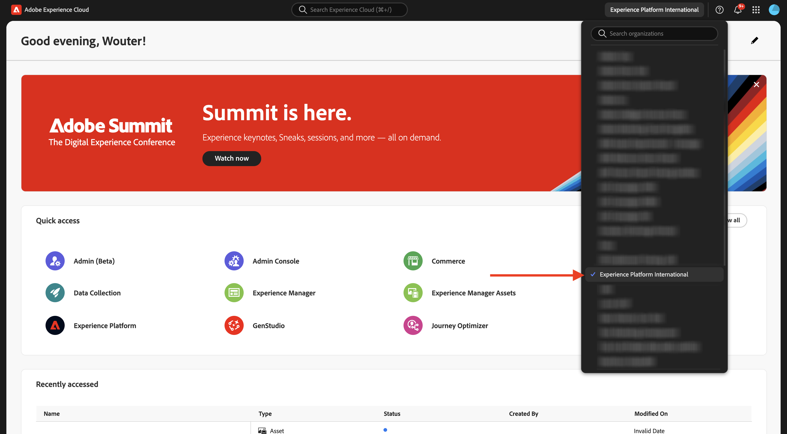

Open **Adobe Experience Manager Assets**.

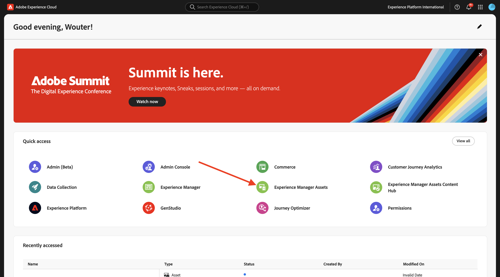

Select the AEM Assets CS environment that is assigned to you. In this case, the environment to select is `--aepUserLdap-- - CitiSignal dev author`.

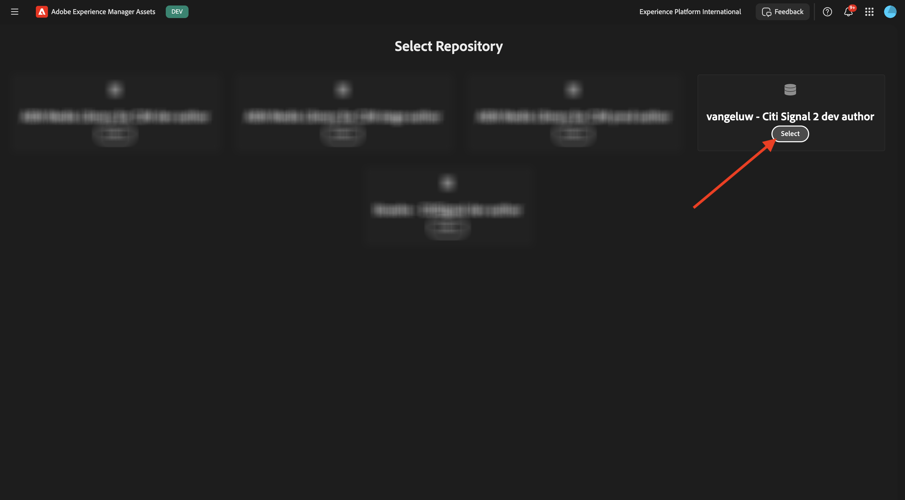

You should then see this. Go to **Assets**.

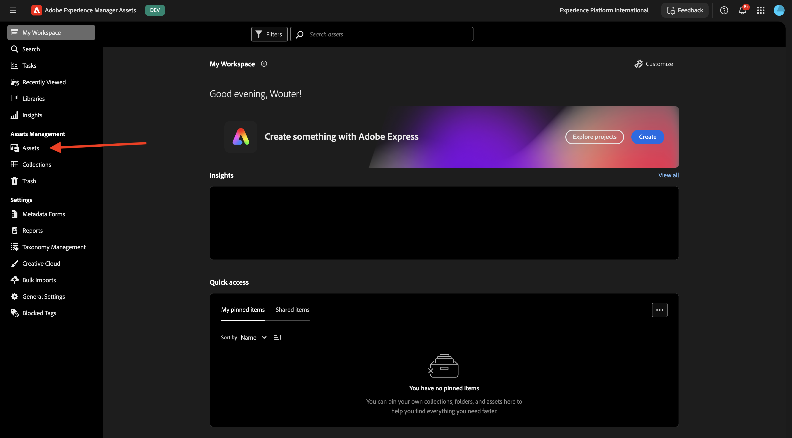

You should use a folder that is named `--aepUserLdap-- - CitiSignal Fiber Campaign`. If it doesn't exist yet, click **Create Folder**.

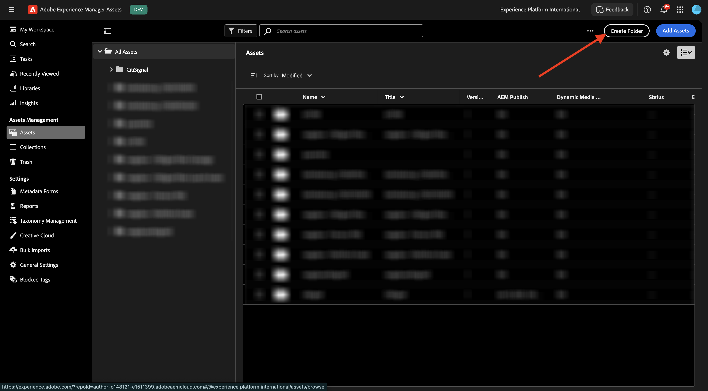

Enter the name `--aepUserLdap--` for your folder and click **Create**.

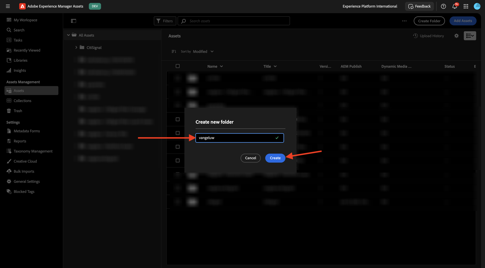

Open your newly created folder. In one of the previous exercise, you created 2 images which are named `CitiSignal - Neon Rabbit - Get On Board Now!.png` and `CitiSignal - Neon Rabbit - Timetravel now!.png`. You now need to upload these images in this folder if they aren't there yet.

In case you don't have these files anymore, you can download them [here](./images/CitiSignal_Neon_Rabbit.zip){target="_blank"}.

Click **Add Assets**.

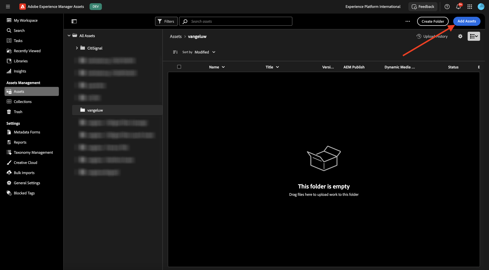

Select the 2 images mentioned above. Click **Open**.

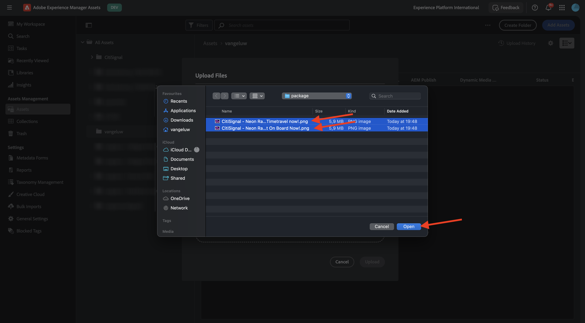

Click **Upload**.

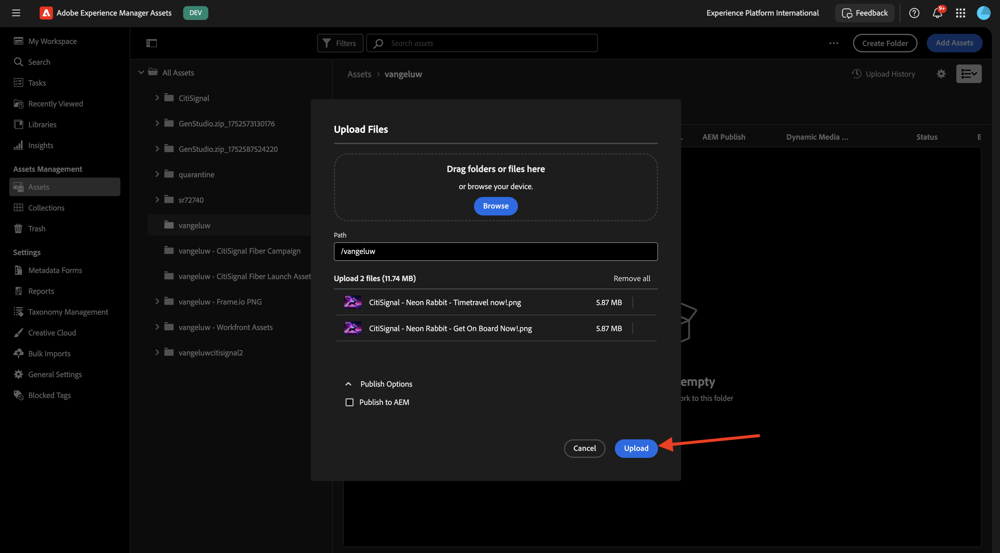

Click one of the images to select it.

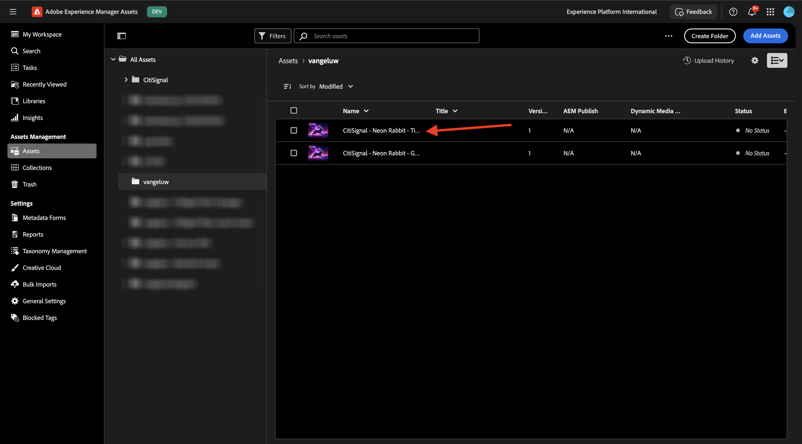

Click **Details**.

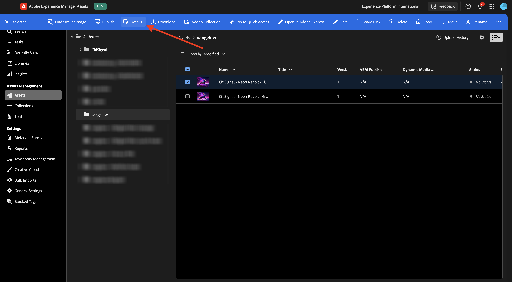

You're now seeing the available metadata of the specific file.

In the right menu, go to **Renditions**. You'll then see a number of predefined renditions of the image you selected with the ability to download them.

In the right menu, click the **scissors** icon. You find a number of editing actions that are available to you, powered by Adobe Express. Click **Remove Background**.

After a couple of seconds, you should see something similar to this, with the ability to either apply your changes or download the new file. Close the popup.

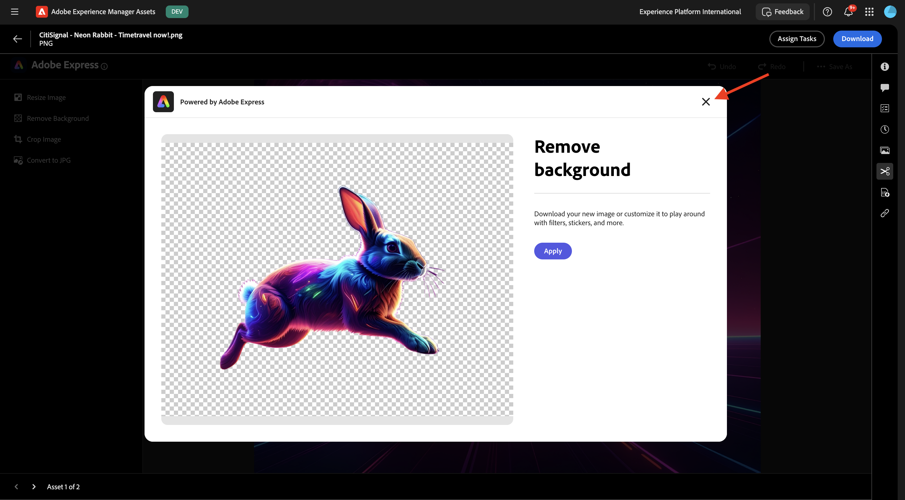

Clip **Crop Image**.

You can test some variations of different cropping sizes.

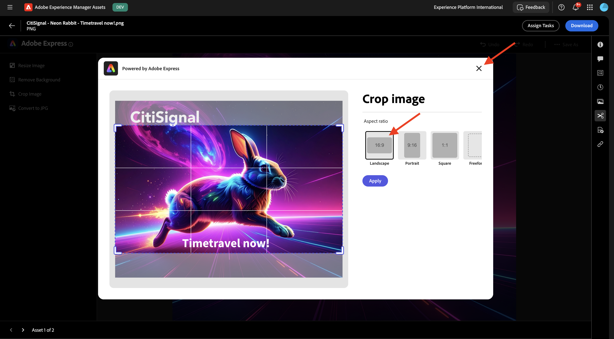

In the right menu, go to **Tasks**. Click **Assign Tasks**.

Set the **Task Title** to `Review image & approve`. Assign yourself. Click **Create**.

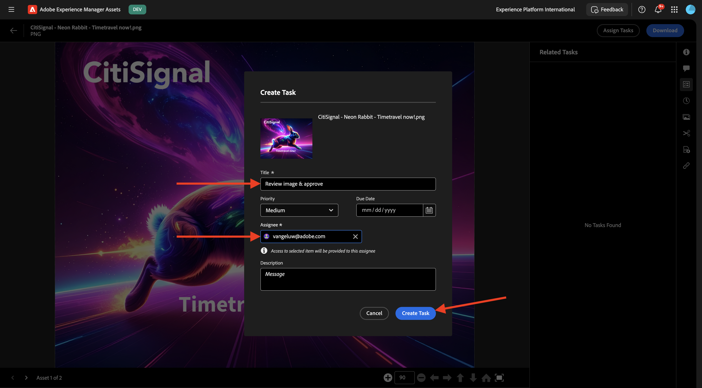

Click **View** on the notification.

Alternatively, refresh the screen to see the newly created tas appear in the **Related Tasks** list. Click the **Open** button to view the detail of the task.

You should then see something like this. Click **Approve**.

Confirm by clicking **Approve**.

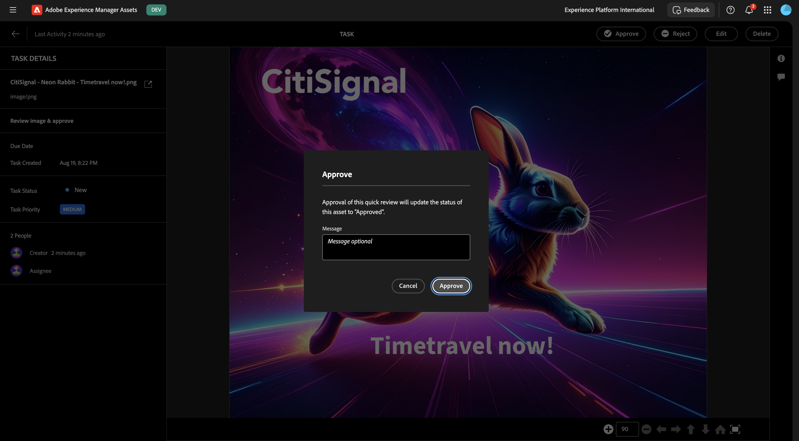

Your asset is now approved in AEM Assets.

Next Step: [Summary & Benefits](./summary.md){target="_blank"}

Go Back to [Adobe Experience Manager Assets](./aemassets.md){target="_blank"}

[Go Back to All Modules](./../../../overview.md){target="_blank"}
