# 1.2.2 Proofing with Workfront

## 1.2.2.1 Create a new Approval Flow

Go to [https://experienceplatform.my.workfront.com/](https://experienceplatform.my.workfront.com/){target="_blank"}.

Click the 9 dots **hamburger** icon and select **Proofing**.

Go to **Workflows**, click **+ New** and then select **New template**.

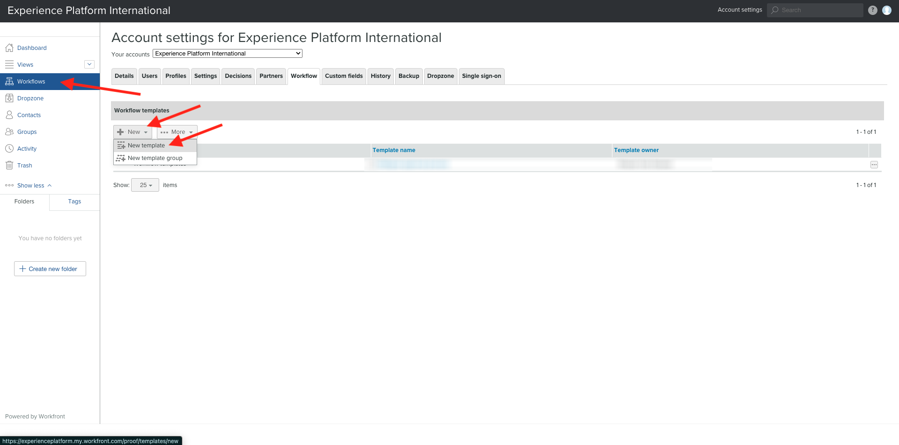

Set the **Template name** to `--aepUserLdap-- - Approval Workflow` and set the **Template owner** to yourself.

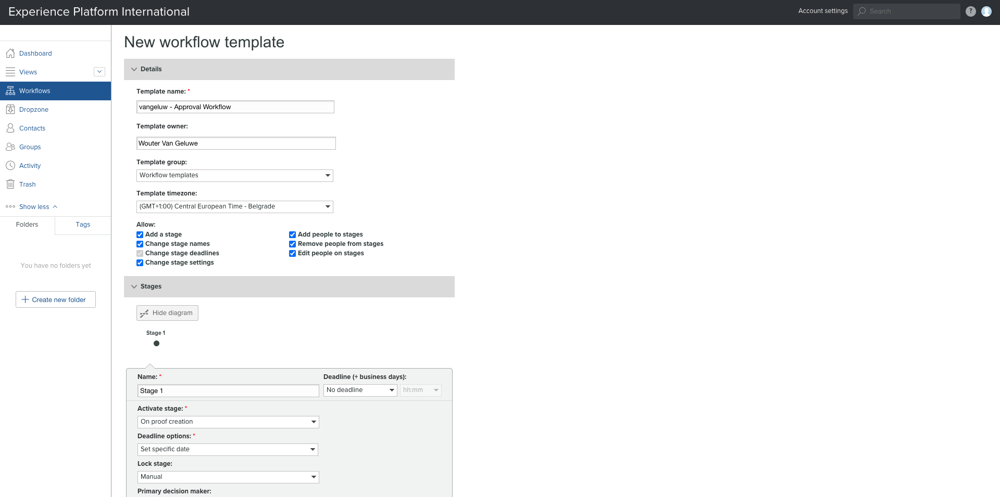

Scroll down, and under **Stages** > **Stage 1**, add **Wouter Van Geluwe** with the **Role** of **Reviewer & Approver**.

Click **Create**.

Your basic approval workflow is now ready to be used.

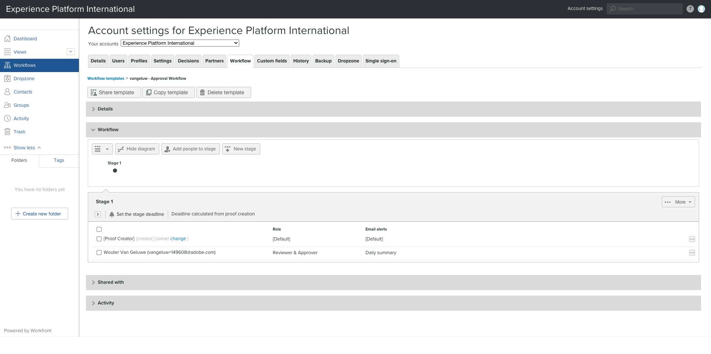

## 1.2.2.2 Create a new Project

From the Workfront home page, click **New** in the **My Projects** tab. Select **Blank Project**.

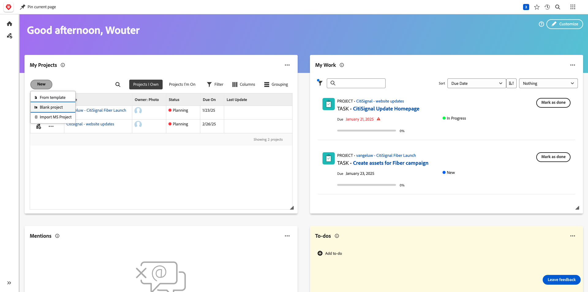

You should then see this. Change the name to `--aepUserLdap-- - CitiSignal Fiber Launch`.

Your project is now created.

## 1.2.2.3 Create a new Task

Enter this name for your task: **Create assets for Fiber campaign**. Click **Create Task**.

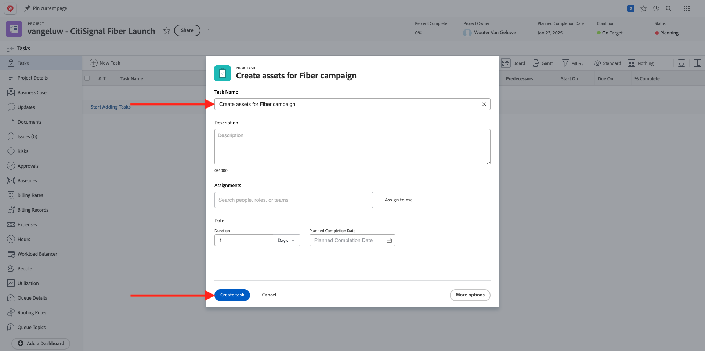

You should then see this.

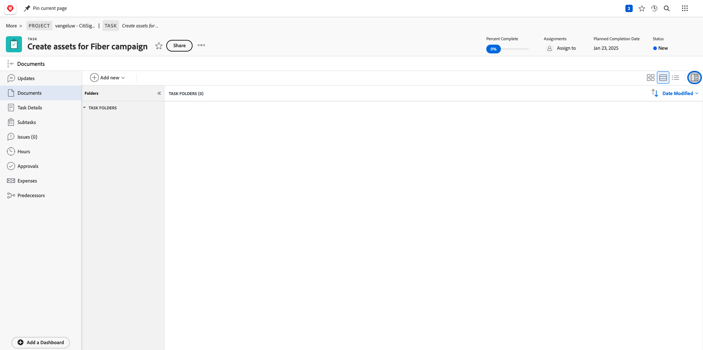

## 1.2.2.4 Add a new Document to your Task go through the approval flow

Click **+ Add new** and then select **Document**.

Download [this file](./images/2048x2048.png) to your desktop.

{width="50px" align="left"}

Select the file **2048x2048.png** and click **Open**.

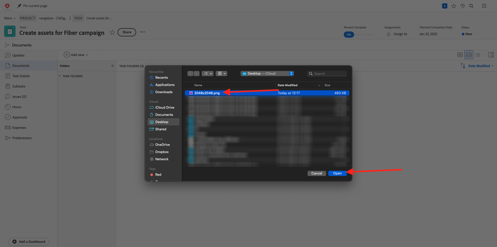

You should then have this. Click **Create proof** and then choose **Advanced Proof**.

In the **new proof** window, select the workflow template that you created before, which should be named `--aepuserLdap-- - Approval Workflow`. Click **Create Proof**.

You'll then be back in your task. Click the **Assign to** button and select **Assign to me**.

Click **Save**.

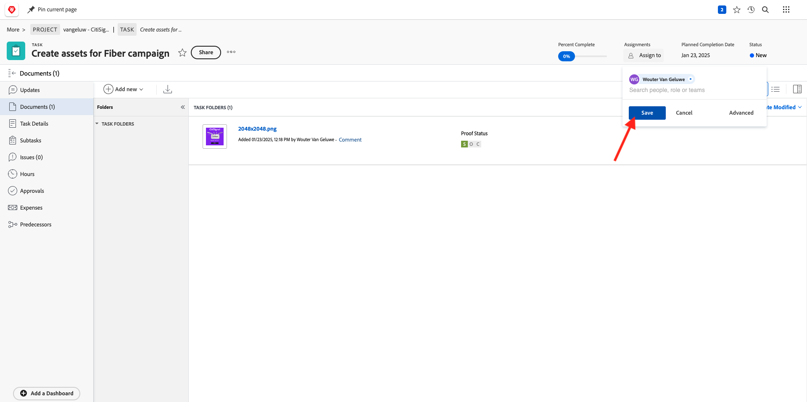

Click **Work on it**.

Click **Open Proof**

You can now review the proof. Select **Add comment** to add a remark that requires the document to be changed.

Enter your comment and click **Post**. Click **Close**.

Next, you need to change your role from **Reviewer** to **Reviewer & Approver**. To do that, go back to your Task and click **Proofing Workflow**.

Change your role from **Reviewer** to **Reviewer & Approver**.

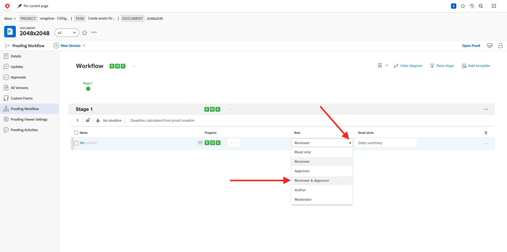

Go back to your Task and open the proof again. You now see a new button, **Make decision**. Click it.

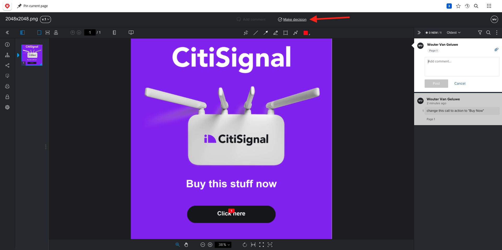

Select **Changes required** and click **make decision**.

You should then be back here. You now need to upload a second image that takes into account the comments that were provided.

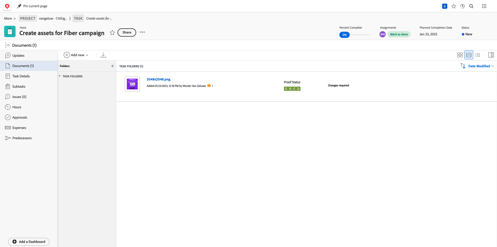

Download [this file](./images/2048x2048_buynow.png) to your desktop.

{width="50px" align="left"}

In your Task view, select the old image file that wasn't approved. Then, click **+ Add new**, select **Version** and then select **Document**.

Select the fle **2048x2048_buynow.png** and click **Open**.

You should then have this. Click **Create proof** and then select **Advanced Proof** again.

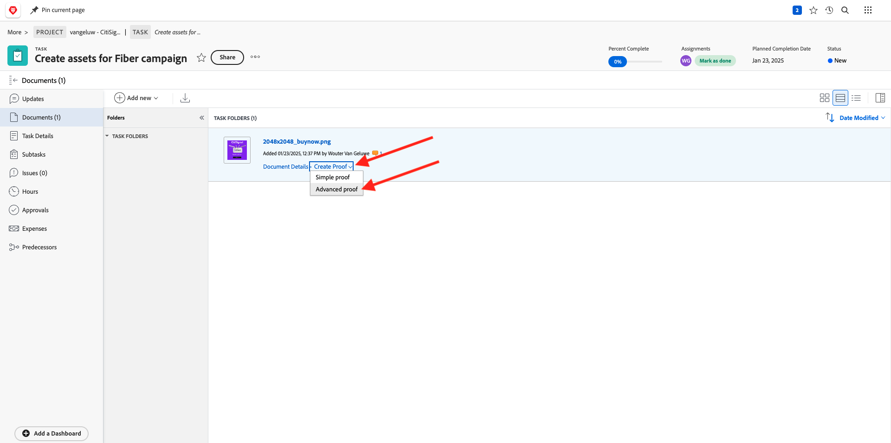

You'll then see this. The **Workflow template** is now preselected as Workfront assumes that the previous approval workflow is still valid. Click **Create Proof**.

Select **Open Proof**.

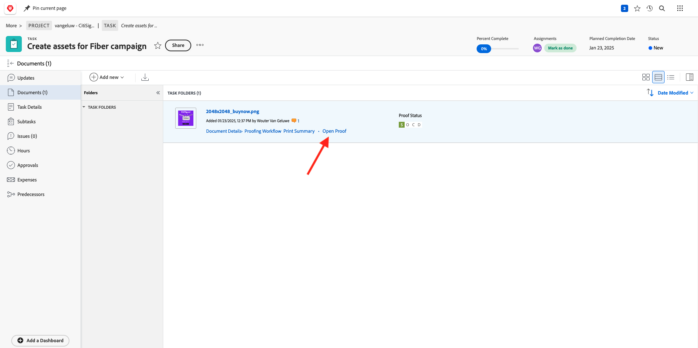

You can now see 2 versions of the file next to eachother.

Click **Make decision**, select **Approved** and click **Make decision** again.

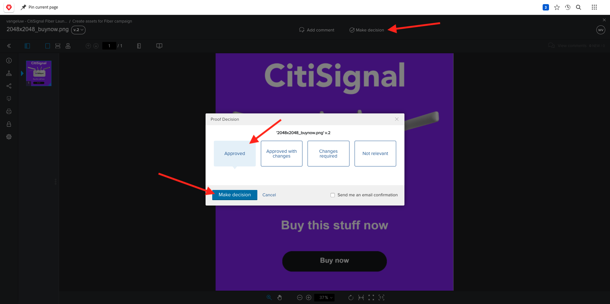

Close the proof preview.

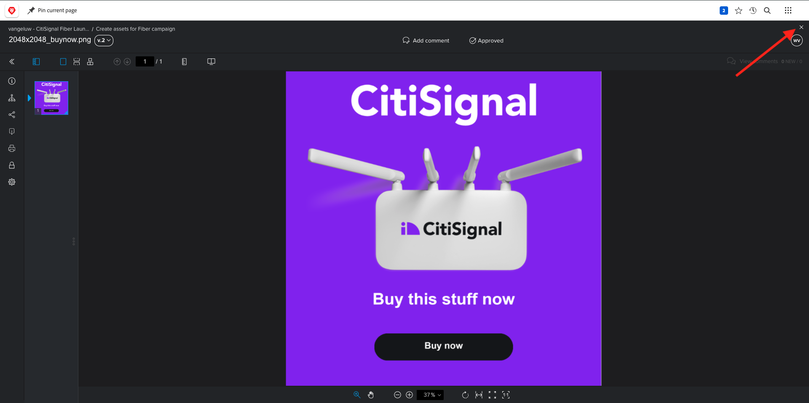

You'll then be back in your Task view, with an approved asset. This asset now needs to be shared towards AEM Assets.

Click the **Share arrow** icon and select your AEM Assets integration, which should be named `--aepUserLdap-- - Citi Signal AEM`.

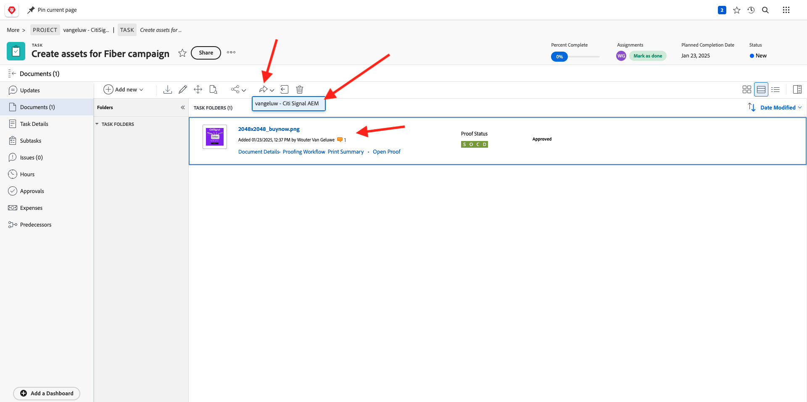

Double-click the folder you created before, which should be named `--aepUserLdap-- - Workfront Assets`.

Click **Select folder**.

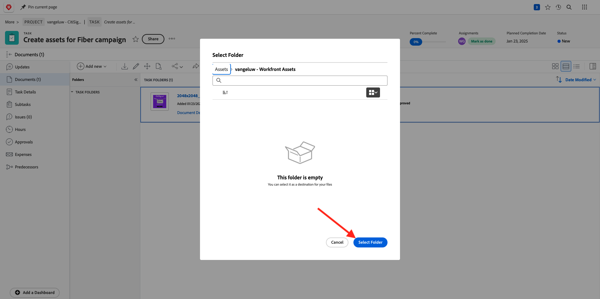

After 1-2 minutes, your document will now be published into AEM Assets. You'll see an AEM icon next to your document name.

Click **Open summary**.

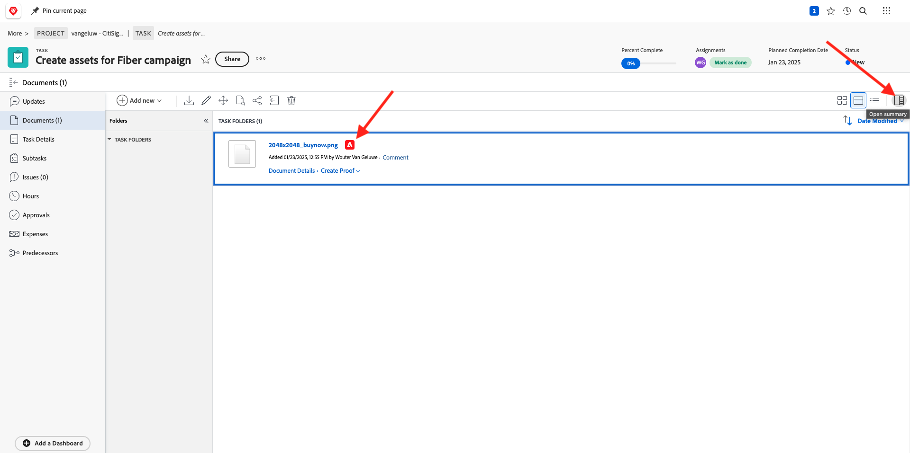

Go to **Metadata**, you should see this:

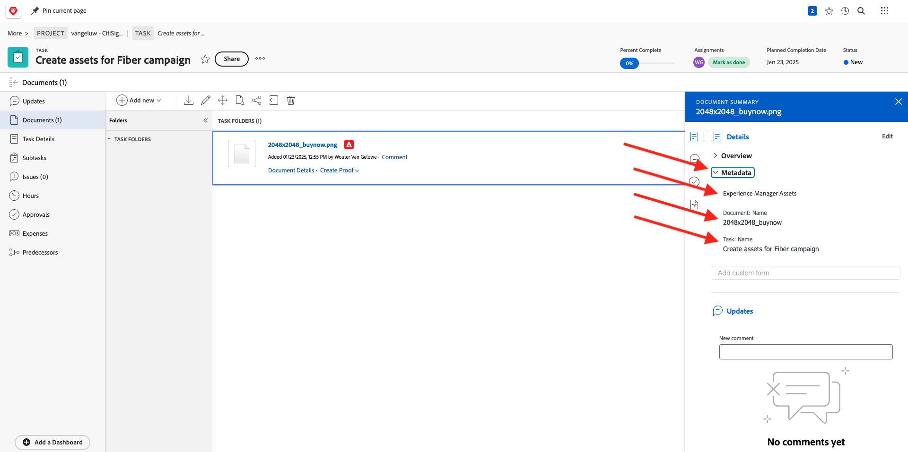

Go to **Overview** and click **+ Add** to add a description.

Enter your description. Your proof and document settings are now done.

## 1.2.2.5 View your file in AEM Assets

Go to your folder in AEM Assets, which is named `--aepUserLdap-- - Workfront Assets`.

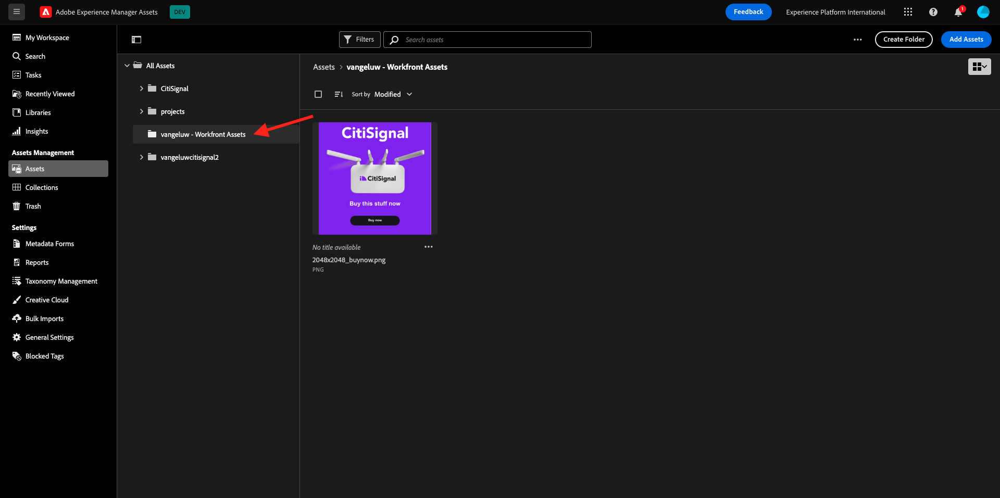

Click the 3 dots under your image, and then select **Details**.

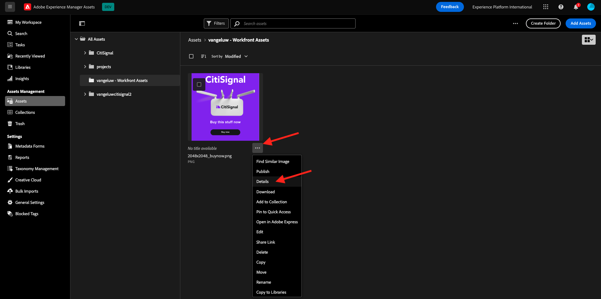

You'll then see the Metadata Form your created earlier, with the values that have been populated automatically by the integration between Workfront and AEM Assets.

Go Back to [Workflow Management with Adobe Workfront](./workfront.md){target="_blank"}

[Go Back to All Modules](./../../../overview.md){target="_blank"}
