# 1.1.1 Getting started with Firefly Services

Learn how to use Postman and Adobe I/O to query Adobe Firefly Services APIs.

## 1.1.1.1 Prerequisites

Before continuing with this exercise, you need to have completed the setup of [your Adobe I/O project](./../../../modules/getting-started/gettingstarted/ex6.md), and you also need to have configured an application to interact with APIs, such as [Postman](./../../../modules/getting-started/gettingstarted/ex7.md) or [PostBuster](./../../../modules/getting-started/gettingstarted/ex8.md).

## 1.1.1.1 firefly.adobe.com

Go to [https://firefly.adobe.com](https://firefly.adobe.com). Clik the **profile** icon and ensure you're logged in to the right **Account**, which should be `--aepImsOrgName--`. If needed, click **Switch Profile** to switch to that account.

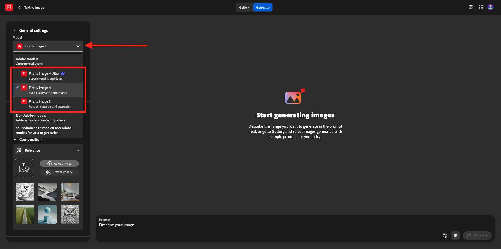{zoomable="yes"}

Enter the prompt `Horses in a field` and click **Generate**.

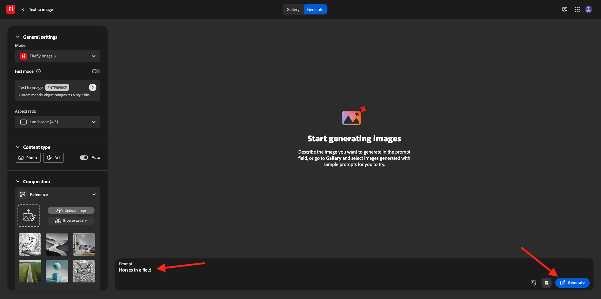{zoomable="yes"}

You should then see something similar to this.

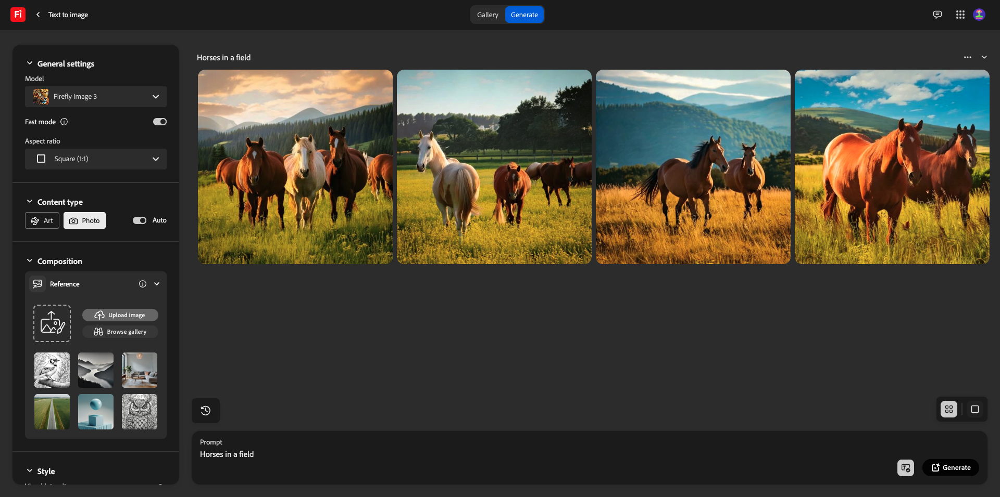{zoomable="yes"}

Next, open up the **Developer Tools** in your browser. 

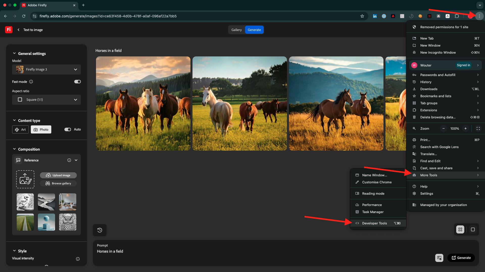{zoomable="yes"}

You should then see this. Go to the **Network** tab.

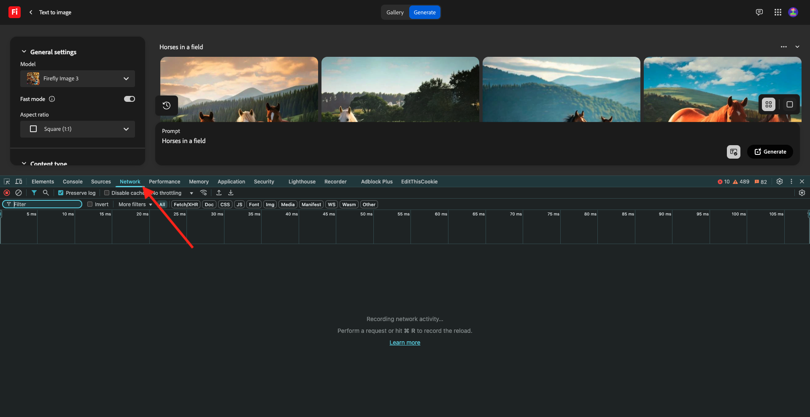{zoomable="yes"}

Enter the search term **generate** and then click **Generate** again. You should then see a request with the name **generate-async**. Select it and then go to **Payload** where you'll see the details of the request.

{zoomable="yes"}

The request that you're seeing here is the request that is sent to the server-side backend of Firefly Services. It contains several important parameters:

- **prompt**: This is your prompt, requesting what kind of image Firefly should generate

- **seeds**: In this request, the seeds were generated in a random way. Whenever Firefly generates an image, by default it begins the process by picking a random number called a seed. This random number contributes to what makes each image unique, which is great when you want to generate a wide variety of images. However, there may be times when you want to generate images that are similar to one another across multiple requests. For example, when Firefly generates an image that you want to modify using Firefly's other options (such as style presets, reference images, etc.), use that image's seed in future HTTP requests to limit the randomness of future images and hone in on the image you want.

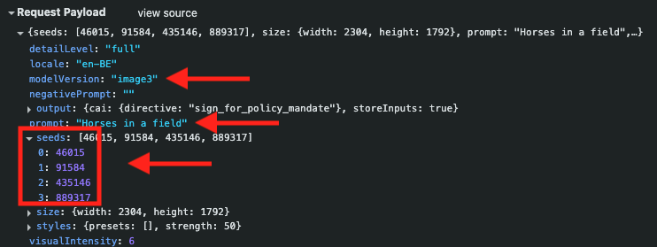{zoomable="yes"}

Have a look at the UI again. Change the **Aspect ratio** to **Landscape (4:3)**.

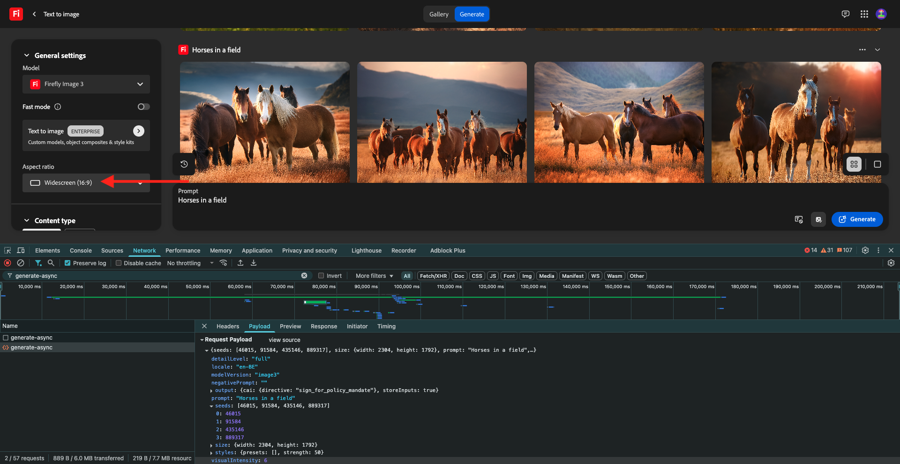{zoomable="yes"}

Scroll down to **Effects**, go to **Themes** and select an effect such as **Comic book**.

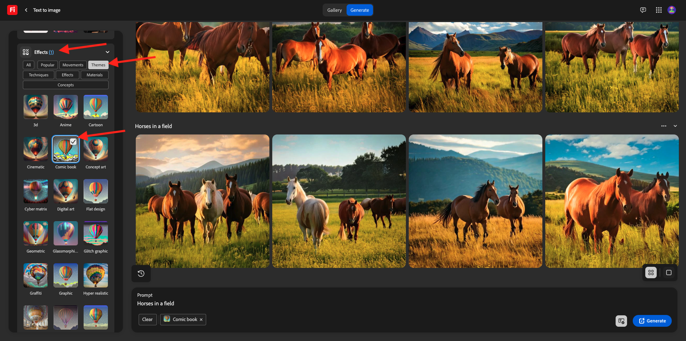{zoomable="yes"}

Open up the **Developer Tools** in your browser again. Then, click **Generate** and inspect the network request being sent.

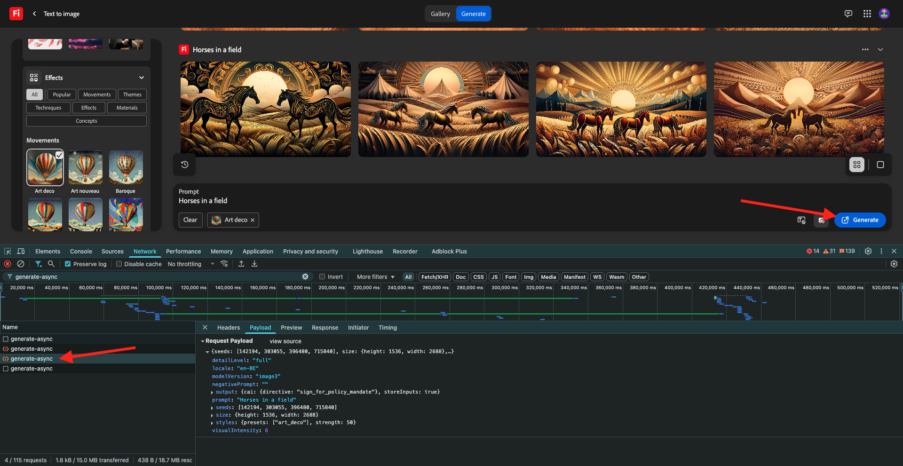{zoomable="yes"}

When you inspect the details of the network request, you'll now see the following:

- **prompt** hasn't changed in comparison to the previous request
- **seeds** haven't changed in comparison to the previous request
- **size** has changed, based on the change in **Aspect ratio**.
- **styles** has been added, and has a reference to the **comic_book** effect that you selected

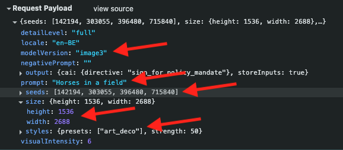{zoomable="yes"}

For the next exercise, you'll need to use one of the **seed** numbers. Write down a seed number of choice.

In the next exercise, you'll do similar things with Firefly Services, but then by using the API instead of the UI. In this example, the seed number is **45781**.

## 1.1.1.3 Adobe I/O - access_token

In the **Adobe IO - OAuth** collection, select the request named **POST - Get Access Token** and select **Send**. The response should contain a new **accestoken**.

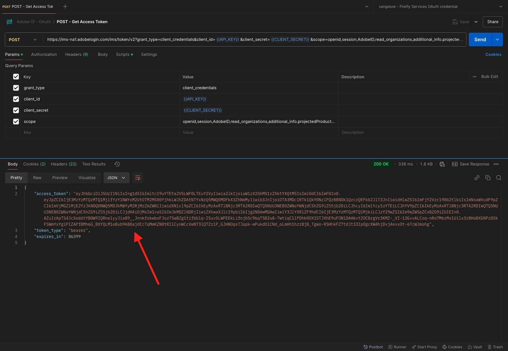{zoomable="yes"}

## 1.1.1.4 Firefly Services API, Text 2 Image

Now that you have a valid and fresh access_token, you are ready to send your first request to Firefly Services APIs.

Select the request named **POST - Firefly - T2I V3** from the **FF - Firefly Services Tech Insiders** collection.

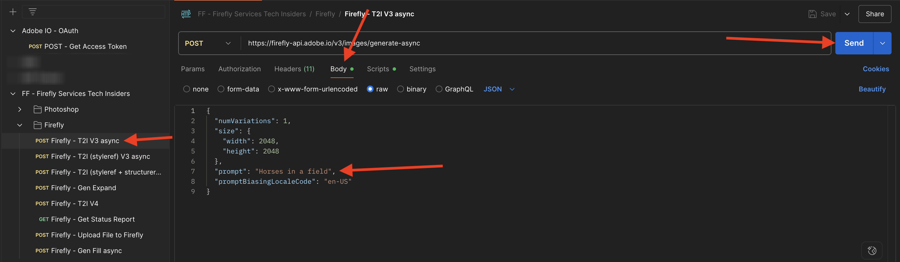{zoomable="yes"}

Copy the image URL from the response and open it in your web browser to view the image. 

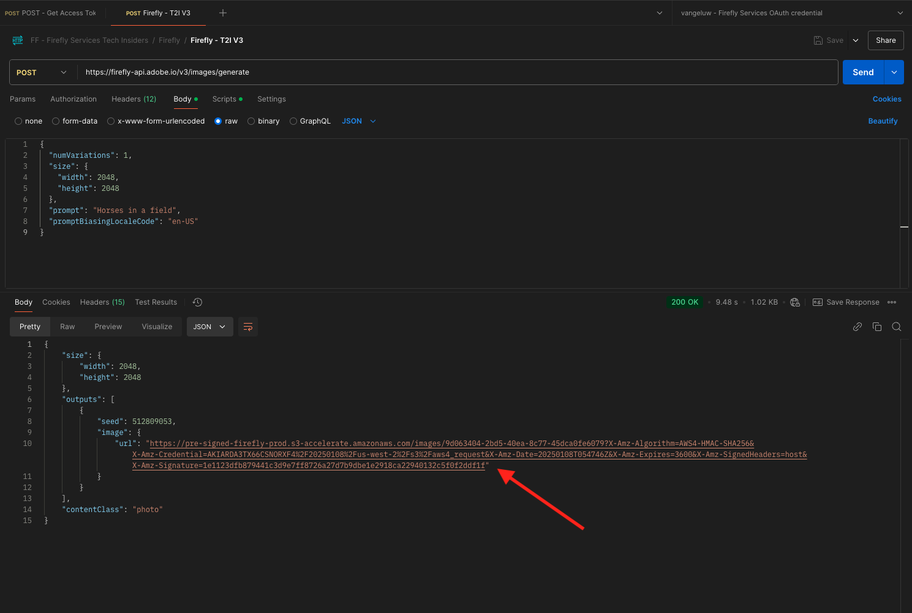{zoomable="yes"}

You should see a beautiful image portraying `horses in a field`.

{zoomable="yes"}

In the **Body** of your request **POST - Firefly - T2I V3**, add the following under the field `"promptBiasingLocaleCode": "en-US"` and replace the variable `XXX` by one of the seed numbers that were randomly used by the Firefly Services UI. In this example, the **seed** number is `45781`.

```json
,
  "seeds": [
    XXX
  ]
```

Click **Send**. You'll then receive a response with a new image generated by Firefly Services. Open the image to view it.

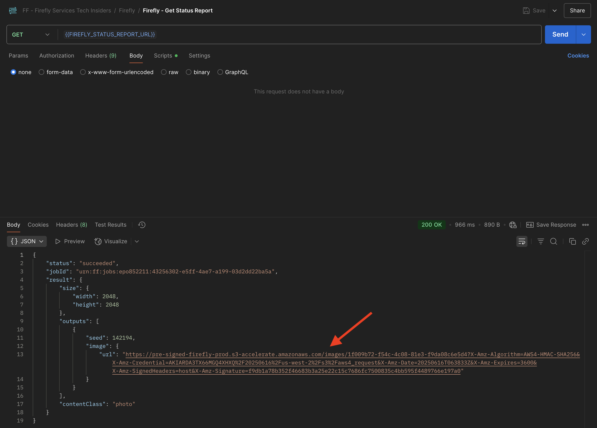{zoomable="yes"}

You should then see a new image with slight differences, based on the **seed** that was used.

{zoomable="yes"}

Next, in the **Body** of your request **POST - Firefly - T2I V3**, paste the below **styles** object under the **seeds** object. This will change the style of the generated image to **comic_book**.

```json
,
  "contentClass": "art",
  "styles": {
    "presets": [
      "comic_book"
    ],
    "strength": 50
  }
```

## Next Steps

Go to [Optimize your Firefly process using Microsoft Azure and presigned URLs](./ex2.md){target="_blank"}

Go back to [Overview of Adobe Firefly Services](./firefly-services.md){target="_blank"}

Go back to [All modules](./../../../overview.md){target="_blank"}
