# 1.1.1 Getting started with Firefly Services

Firefly Services includes **Firefly APIs**, **Lightroom APIs**, **Photoshop APIs**, **InDesign APIs**, and **Content Tagging APIs**.

These suites of APIs combine the power of Adobe's creative tools like Photoshop and Lightroom with cutting-edge AI/ML features like Content Tagging, Generative Fill, Text to Image, and more.

With Firefly Services, you're not just creating – you're automating, scaling your content production, and harnessing the latest AI/ML technologies to supercharge your workflows.

In this exercise, you'll learn how to use Postman and Adobe I/O to work with the various Adobe Firefly Services APIs.

This exercise focuses specifically on the Firefly APIs, such as:

- **Firefly Generate Images API**: this API is used to generated images using Firefly's Models
- **Firefly Generate Similar Images API**: this API is used to generated images that are similar to an already existing image
- **Firefly Expand Image API**: this API is used to expand an existing image to a larger aspect ratio/size
- **Firefly Fill Image API**: this API fills an area of an exisitng image based on images that Firefly generates based on your prompt. This is achieved using a mask that defines the area that needs to be filled.
- **Firefly Generate Object Composite API**: this API allows you to provide an input image yourself, which then combines your image with images generated by Firefly to create an image composite, or scene.
- **Firefly Custom Models API**: this API allows you to work with your own Firefly Custom Models, to generate new images based on your Firefly Custom Model

## 1.1.1.1 Prerequisites

Before continuing with this exercise, you need to have completed the setup of [your Adobe I/O project](./../../../modules/getting-started/gettingstarted/ex6.md), and you also need to have configured an application to interact with APIs, such as [Postman](./../../../modules/getting-started/gettingstarted/ex7.md) or [PostBuster](./../../../modules/getting-started/gettingstarted/ex8.md).

## 1.1.1.2 API basics

There are multiple types of API requests:

- **GET**: this is used when trying to retrieve information from an API endpoint, like getting a Status Report
- **POST**: this is used when something new needs to be done, like having Adobe Firefly Services generate a new image
- **PUT**: this is used to completely update existing data
- **PATCH**: this is used to selectively update existing data
- **DELETE**: this is used to delete data

When working with API's, you'll also notice response codes being returned by the various API endpoints.

There are 5 different categories of responses you may expect:

- **1xx informational response**: the request was received, continuing process
- **2xx successful**: the request was successfully received, understood, and accepted
- **3xx redirection**: further action needs to be taken in order to complete the request
- **4xx client error**: the request contains bad syntax or cannot be fulfilled
- **5xx server error**: the server failed to fulfil an apparently valid request

Here's an example of common response codes you may expect:

- **200 OK**: this is good, your request completed successfully
- **201 Created**: this is good, as an example, your image has been created
- **202 Accepted**: this is good, your request is accepted and will be processed
- **401 Unauthorized**: this is not good, likely your access token isn't valid
- **403 Forbidden**: this is not good, you probably lack the required permissions for the action you're trying to execute
- **404 Not Found**: this is not good, likely the URL you're trying to reach doesn't exist
- **429 Too Many Requests**: this is not good, you likely have sent to many requests in a short period. Try again later.

## 1.1.1.3 Explore firefly.adobe.com - stage 1

Let's start exploring Adobe Firefly Services. For exploreation, you'll start with a CitiSignal image generation example. The CitiSignal design team would like to generate a neon version of the CitiSignal brand name. They would like to use Adobe Firefly Services to do that.

The first thing that is needed to achieve this, is a black and white version of the CitiSignal brand name, something that looks like this:


### 1.1.1.3.1 Create your composition reference image

You can use [this sample image](./images/CitiSignal.jpg) or you can create your own text to experiment. Follow the below steps in Adobe Illustrator to create your own image file. If your choice is to use the predefined image, then skip the below section and go to step **1.1.1.3.2 Generate your image** directly.

Open **Adobe Illustrator**. Click **New file**.

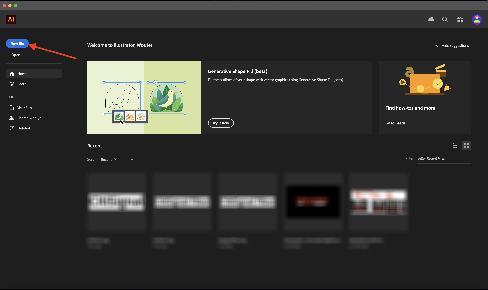

Select **Web-Large 1920 x 1080px**. Click **Create**.

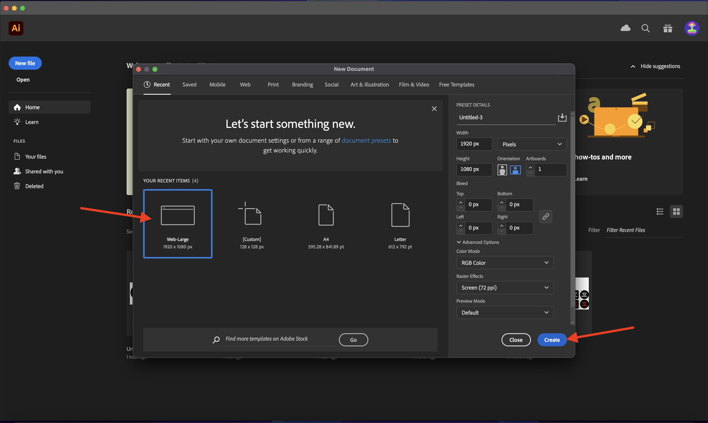

You should then have this. Click the **T** text icon.

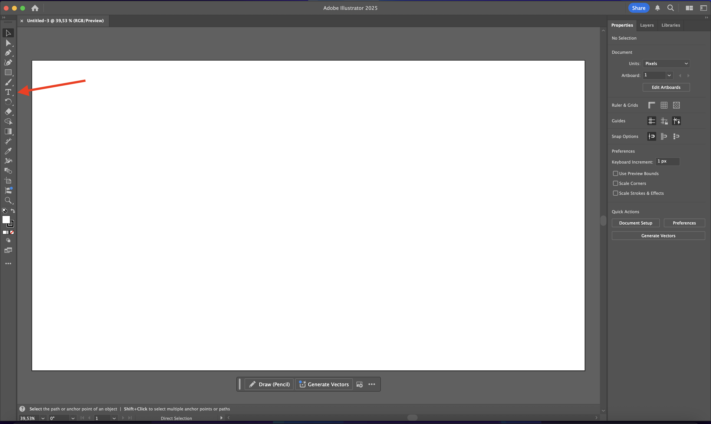

You should then have this.

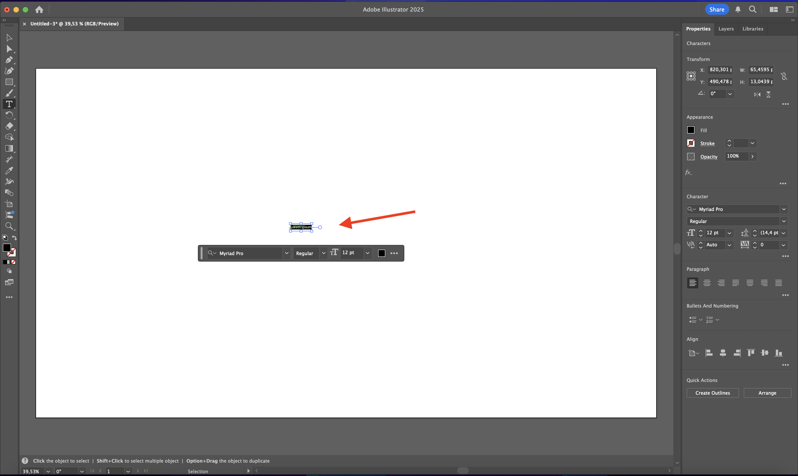

Change the font type to a font of choice, in this case the font type is **Adobe Clean Bold**.

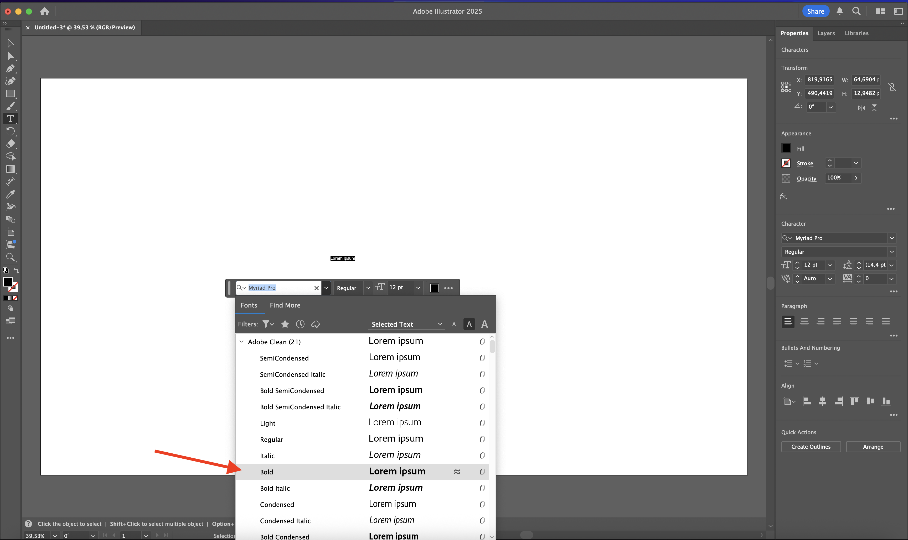

Change the font size to a size of choice, in this case **250 pt**.

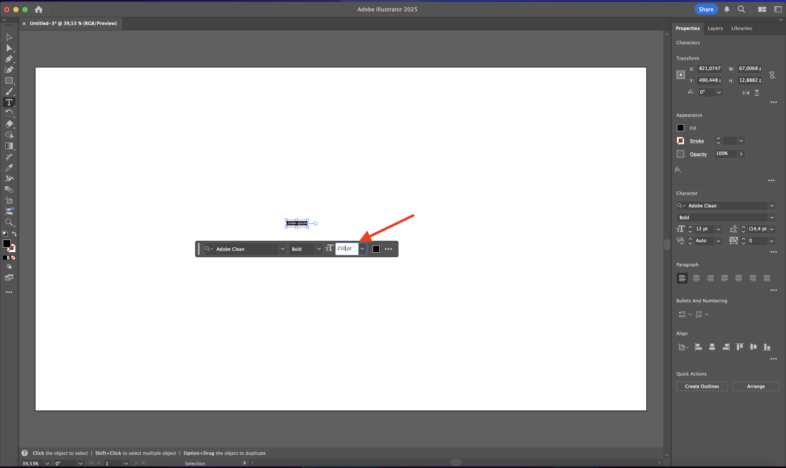

You should then have this.

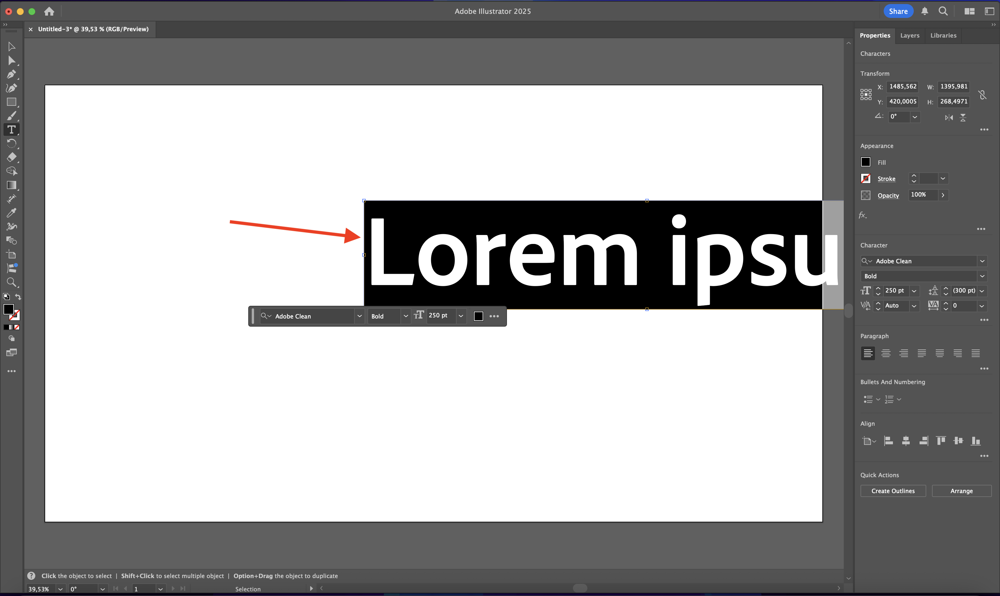

Change the text as you wish, in this case **CitiSignal**.

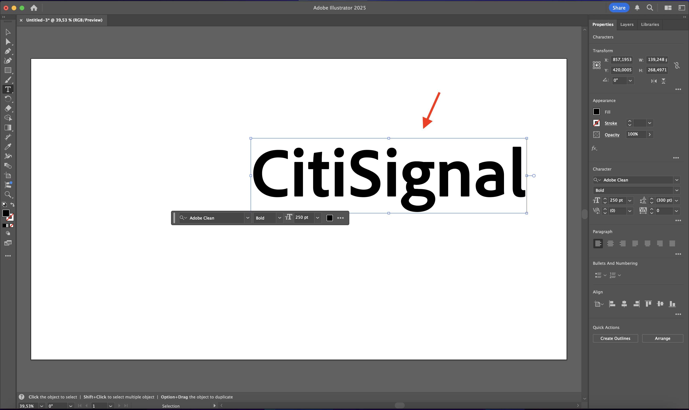

Center the text in your file.

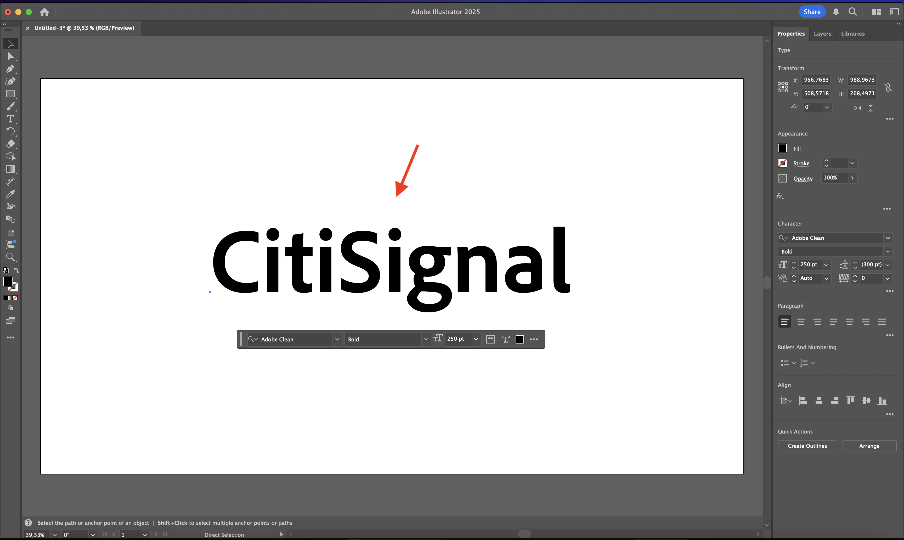

Go to **File > Export > Save for Web (Legacy)**

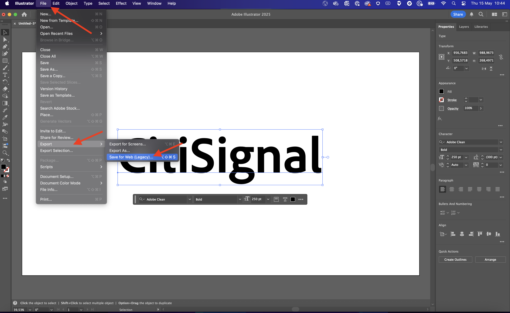

You should then have this. Click **Save**.

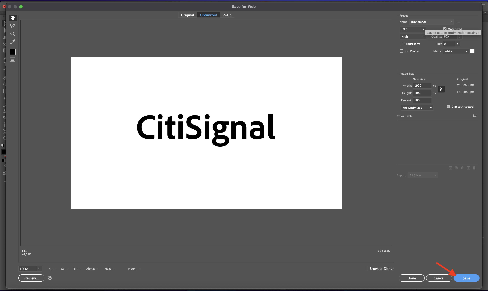

Give your file a name and save it to your desktop. Click **Save**.

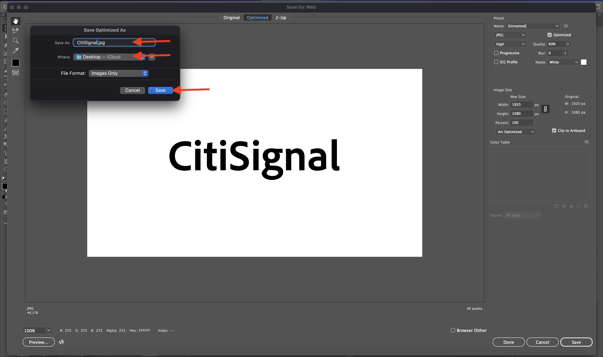

### 1.1.1.3.2 Generate your image

Go to [https://firefly.adobe.com](https://firefly.adobe.com). Click the **profile** icon and ensure you're logged in to the right **Account**, which should be `--aepImsOrgName--`. If needed, click **Switch Profile** to switch to that account.

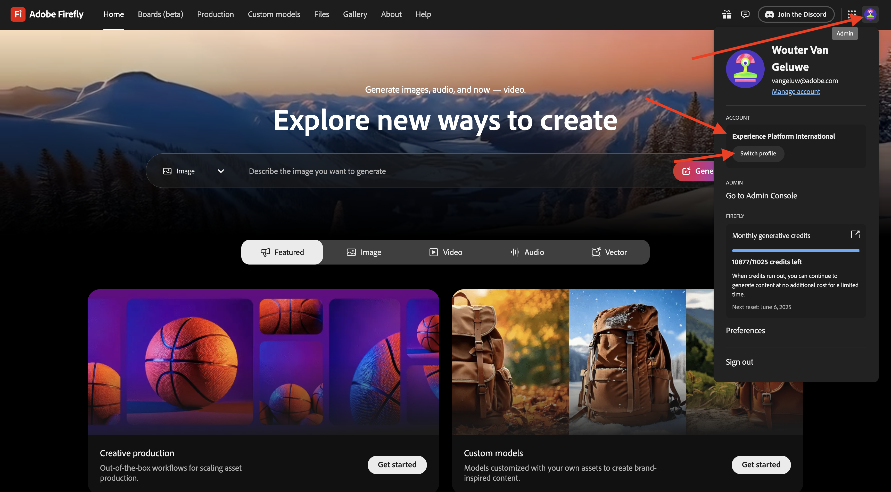

Enter the prompt `neon light lettering on a brick wall of a night club`. Click **Generate**.


You should then have something similar to this. These images aren't useful yet. Under **Composition**, click **Upload image**.

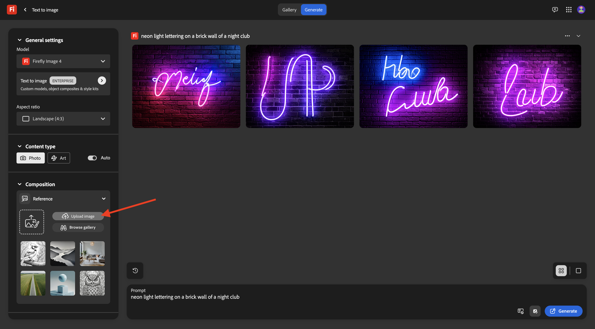

Select the image you created earlier, in this case **CitiSignal.jpg**. Click **Open** and then click **Generate**.

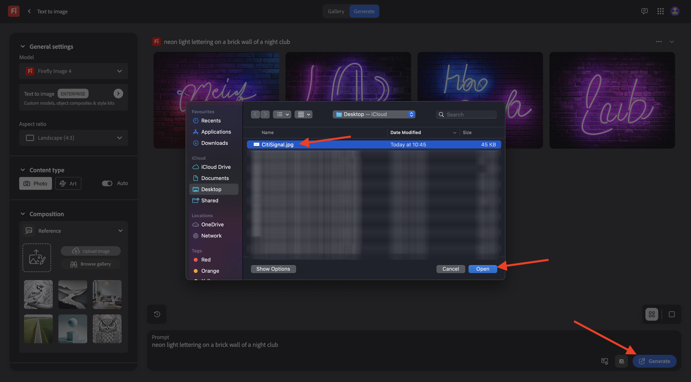

You should then have something similar to this. The application of the Composition reference isn't great yet. To change that, change the **Strength** slider to the maximum value. Click **Generate** again.


You now have several images that show a neon-version of the CitiSignal brand name, which you can use to iterate further.


You've now learnt to use Firefly to solve a design problem in a matter of minutes.

## 1.1.1.4 Explore firefly.adobe.com - stage 2

Go to [https://firefly.adobe.com/generate/image](https://firefly.adobe.com/generate/image). You should then see this. Click the **Model** dropdown list. You'll notice that there are 3 available versions of Adobe Firefly Services:

- Firefly Image 3
- Firefly Image 4
- Firefly Image 4 Ultra


>[!NOTE]
>
>Firefly Image 3 and Image 4 are available to everyone using Adobe Firefly Services, while Firefly Image 4 Ultra requires a Firefly Pro license. 

Click to select **Firefly Image 3** for this exercise.

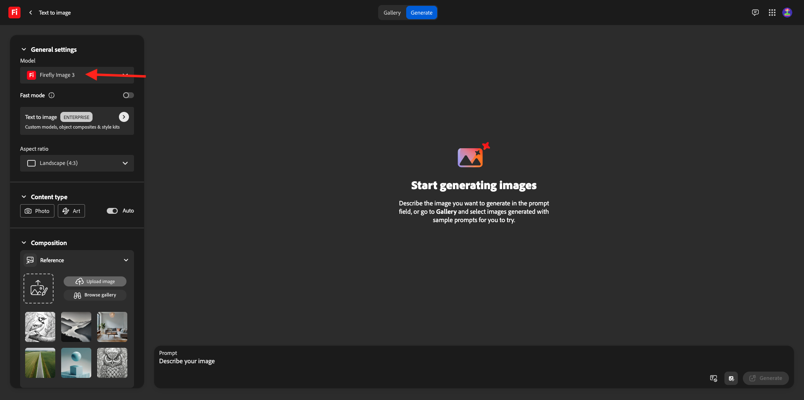

Enter the prompt `Horses in a field` and click **Generate**.


You should then see something similar to this.


Next, open up the **Developer Tools** in your browser. 


You should then see this. Go to the **Network** tab. Then, click **Generate** again.


Enter the search term **generate-async**. You should then see a request with the name **generate-async**. Select it and then go to **Payload** where you'll see the details of the request.


The request that you're seeing here is the request that is sent to the server-side backend of Firefly Services. It contains several important parameters:

- **prompt**: This is your prompt, requesting what kind of image Firefly should generate

- **seeds**: In this request, the seeds were generated in a random way. Whenever Firefly generates an image, by default it begins the process by picking a random number called a seed. This random number contributes to what makes each image unique, which is great when you want to generate a wide variety of images. However, there may be times when you want to generate images that are similar to one another across multiple requests. For example, when Firefly generates an image that you want to modify using Firefly's other options (such as style presets, reference images, etc.), use that image's seed in future HTTP requests to limit the randomness of future images and hone in on the image you want.


Have a look at the UI again. Change the **Aspect ratio** to **Widescreen (16:9)**.


Scroll down to **Effects**, go to **Themes** and select an effect such as **Art deco**.


Make sure **Developer Tools** is still open in your browser. Then, click **Generate** and inspect the network request being sent.


When you inspect the details of the network request, you'll now see the following:

- **prompt** hasn't changed in comparison to the previous request
- **seeds** have changed in comparison to the previous request
- **size** has changed, based on the change in **Aspect ratio**.
- **styles** has been added, and has a reference to the **art_deco** effect that you selected


For the next exercise, you'll need to use one of the **seed** numbers. Write down a seed number of choice. 

>[!NOTE]
>
>Seed numbers are random numbers that are chosen at the time of clicking **Generate**. If you would like to have a consistent look and feel to your generated image across multiple **Generate** requests, it's important to remember and specify the **seed number** of choice in future requests.

In the next exercise, you'll do similar things with Firefly Services, but then by using the API instead of the UI. In this example, the seed number is **142194** for the first image, which has 2 horses looking at each other with their heads facing eachother.

## 1.1.1.5 Adobe I/O - access_token

In the **Adobe IO - OAuth** collection, select the request named **POST - Get Access Token** and select **Send**. The response should contain a new **access_token**.


## 1.1.1.6 Firefly Services API, Text 2 Image, Image 3

Now that you have a valid and fresh access_token, you are ready to send your first request to Firefly Services APIs.

The request you'll be using here is a **asynchronous** request, which provides you with a response that contains the URL of the job that has been submitted, which means that you'll need to use a second request to check on the status of the job and to access the image that was generated.

>[!NOTE]
>
>With the release of Firefly Image 4 and Image 4 Ultra, synchronous requests will be deprecated in favour of asynchronours requests. 

Select the request named **POST - Firefly - T2I V3 async** from the **FF - Firefly Services Tech Insiders** collection. Go to **Headers** and verify the key/value pair combinations.

| Key     | Value     | 
|:-------------:| :---------------:| 
| `x-api-key`          | `{{API_KEY}}` |
| `Authorization`          | `Bearer {{ACCESS_TOKEN}}` |

Both values in this request refer to environment variables that have been defined upfront. `{{API_KEY}}` refers to the field **Client ID** of your Adobe I/O project. As part of the **Getting Started** section this tutorial, you configured that in Postman.

The value for the field **Authorization** is a bit special: `Bearer {{ACCESS_TOKEN}}`. It contains a reference to the **Access Token** that you generated in the previous step. When you received your **Access Token** by using the request **POST - Get Access Token** in the **Adobe IO - OAuth** collection, a script ran in Postman that stored the field **access_token** as an environment variable, which is now being referenced in the request **POST - Firefly - T2I V3 async**. Please note the specific addition of the word **Bearer** and a space before the `{{ACCESS_TOKEN}}`. The word bearer is case-sensitive and the space is required. If this isn't done correctly, Adobe I/O will return a **401 Unauthorized** error as it won't be able to process your **Access Token** correctly.

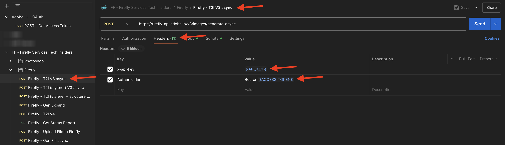

Next, go to the **Body** and verify the prompt. Click **Send**.


You will then get an immediate response. This response doesn't contain the image URLs of generated image, instead it contains a URL of the status report of the job that you launched, and it contains another URL that allows you to cancel the running job.

>[!NOTE]
>
>The Postman collection you're using has been configured to use dynamic variables. As an example, the field **statusUrl** has been stored as a dynamic variable in Postman thanks to the **Scripts** that have been configured in Postman.


To check the status report of your running job, select the request named **GET - Firefly - Get Status Report** from the **FF - Firefly Services Tech Insiders** collection. Click to open it, and then click **Send**. Select the URL of the generated image and open it in your browser.

>[!NOTE]
>
>The Postman collection you're using has been configured to use dynamic variables. As an example, the field **statusUrl** of the previous request was stored as a dynamic variable in Postman and it's now being used as the URL for the **GET - Firefly - Get Status Report** request.

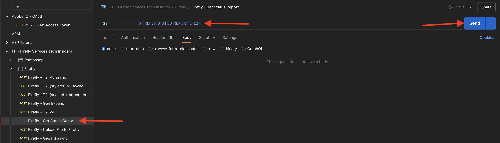

You should have received a similar response. This is the overview of the job that was executed. You can see the field **url**, which contains the generated image. Copy (or click) the image URL from the response and open it in your web browser to view the image. 


You should see a beautiful image portraying `horses in a field`.


In the **Body** of your request **POST - Firefly - T2I V3 async**, add the following under the field `"promptBiasingLocaleCode": "en-US"` and replace the variable `XXX` by one of the seed numbers that were randomly used by the Firefly Services UI. In this example, the **seed** number is `142194`.

```json
,
  "seeds": [
    XXX
  ]
```

Click **Send**. You'll then again receive a response with a link to the status report of the job you just submitted. 

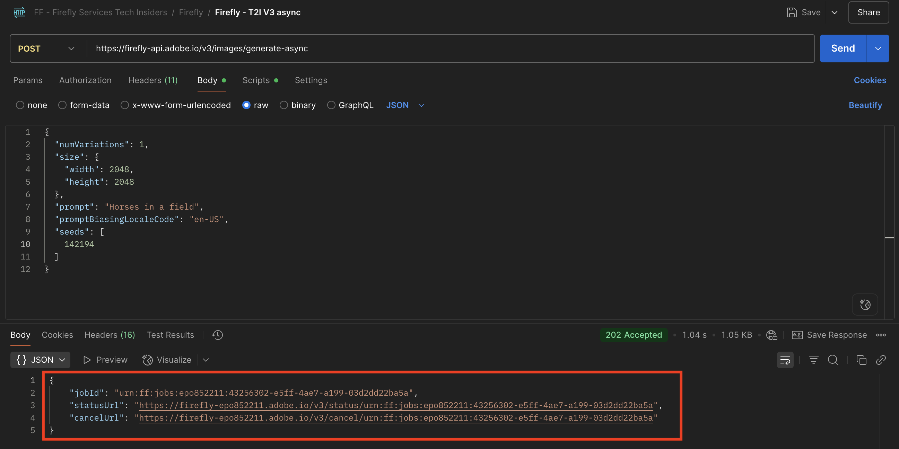

To check the status report of your running job, select the request named **GET - Firefly - Get Status Report** from the **FF - Firefly Services Tech Insiders** collection. Click to open it, and then click **Send**. Select the URL of the generated image and open it in your browser.


You should then see a new image with slight differences, based on the **seed** that was used. The seed `142194` had 2 horses looking at each other with their heads facing eachother.


Next, in the **Body** of your request **POST - Firefly - T2I V3 async**, paste the below **styles** object under the **seeds** object. This will change the style of the generated image to **art_deco**.

```json
,
  "contentClass": "art",
  "styles": {
    "presets": [
      "art_deco"
    ],
    "strength": 50
  }
```

You should then have this. Click **Send**. You'll then again receive a response with a link to the status report of the job you just submitted. 

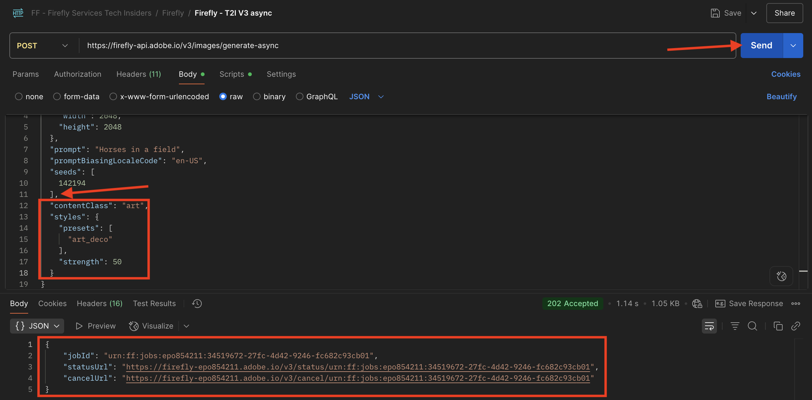

To check the status report of your running job, select the request named **GET - Firefly - Get Status Report** from the **FF - Firefly Services Tech Insiders** collection. Click to open it, and then click **Send**. Select the URL of the generated image and open it in your browser.

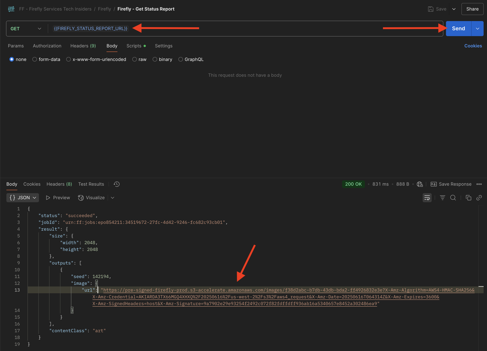

Your image has now changed a bit. When applying style presets, the seed image is no longer applied in the same way as before. Overall, with generative AI, it's very hard to guarantee that the same combination of inpunt parameters leads to the same image being generated.


Remove the code for the **seeds** object from the **Body** of your **POST - Firefly - T2I V3 async** request. Click **Send** and then click the image URL which you get from the response. You'll then again receive a response with a link to the status report of the job you just submitted. 

```json
,
  "seeds": [
    XXX
  ]
```

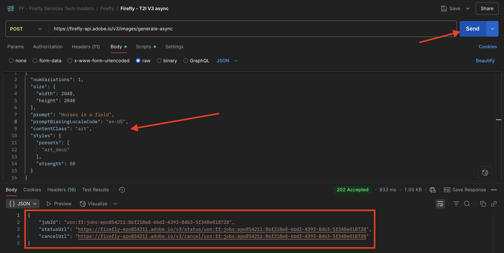

To check the status report of your running job, select the request named **GET - Firefly - Get Status Report** from the **FF - Firefly Services Tech Insiders** collection. Click to open it, and then click **Send**. Select the URL of the generated image and open it in your browser.

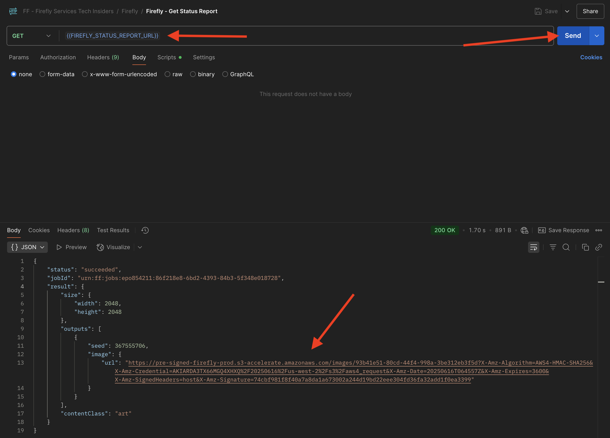

Your image has now changed a bit again.


## 1.1.1.7 Firefly Services API, Gen Expand

Select the request named **POST - Firefly - Gen Expand async** from the **FF - Firefly Services Tech Insiders** collection and go to the **Body** of the request.

- **size**: Enter the desired resolution. The value entered here should be bigger than the original size of the image and cannot be larger than 3999.
- **image.source.url**: This field requires a link to the image that needs to be expanded. In this example, a variable is used to refer to the image that was generated in the previous exercise.

- **horizontal alignment**: Accepted values are: `"center"`,`"left`, `"right"`.
- **vertical alignment**: Accepted values are: `"center"`,`"top`, `"bottom"`.

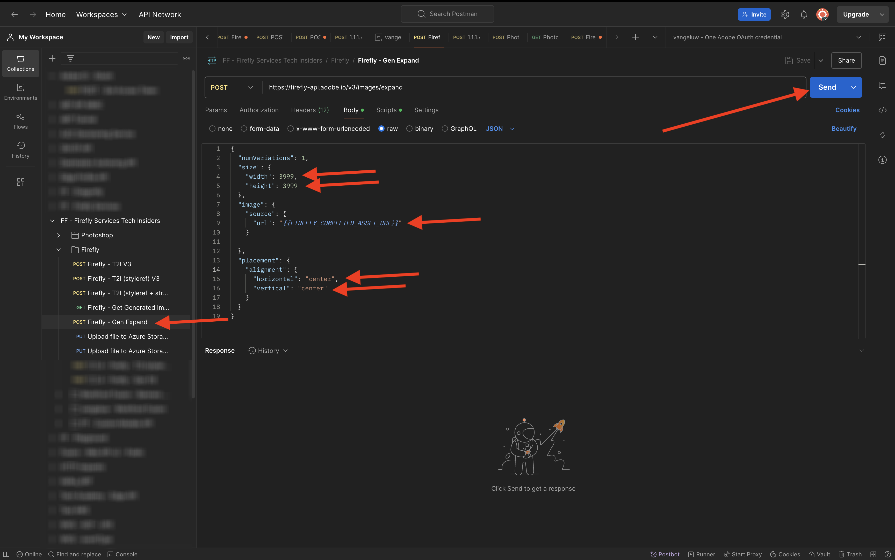

You'll then again receive a response with a link to the status report of the job you just submitted. 

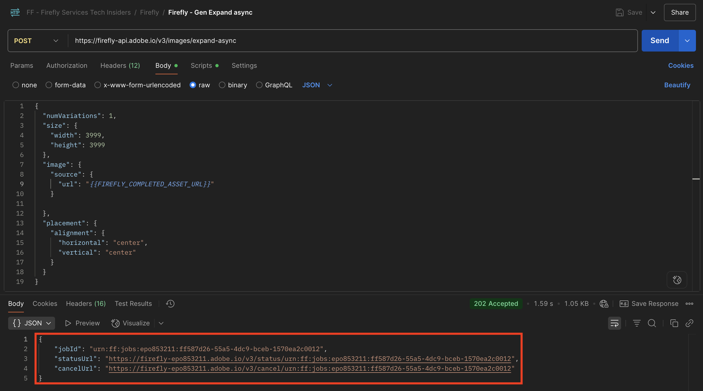

To check the status report of your running job, select the request named **GET - Firefly - Get Status Report** from the **FF - Firefly Services Tech Insiders** collection. Click to open it, and then click **Send**. Select the URL of the generated image and open it in your browser.

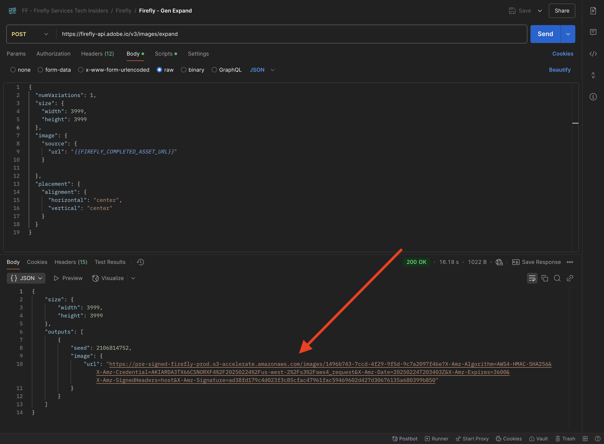

You'll now see that the image generated in the previous exercise has now been expanded to the resolution of 3999x3999.


Generate a new image using the **Firefly - T2I V3 async** request.

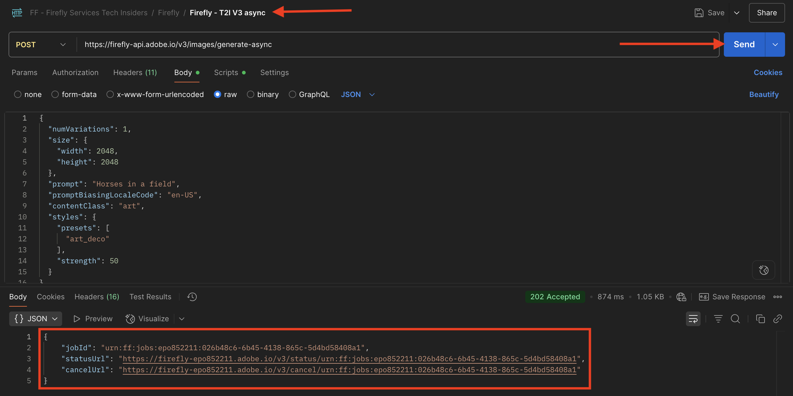

To check the status report of your running job, select the request named **GET - Firefly - Get Status Report** from the **FF - Firefly Services Tech Insiders** collection. Click to open it, and then click **Send**. Select the URL of the generated image and open it in your browser.

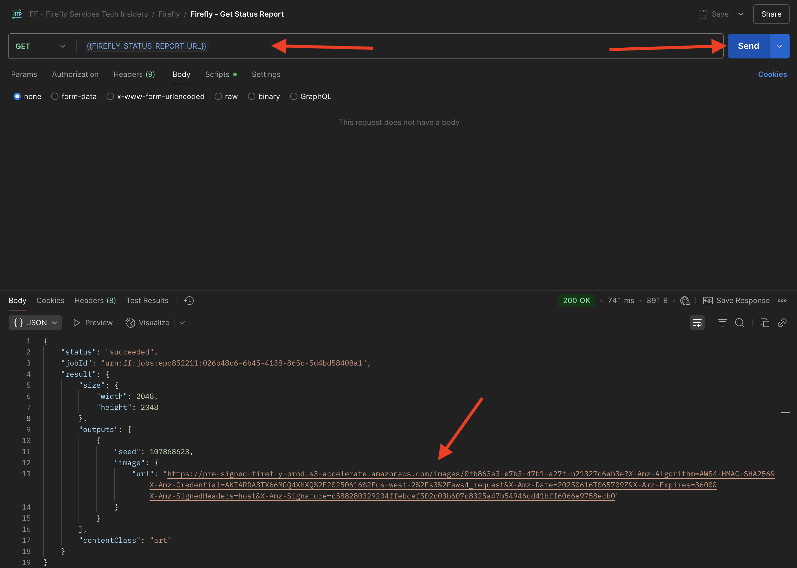

You should then see a similar image.


Select the request named **POST - Firefly - Gen Expand async** from the **FF - Firefly Services Tech Insiders** collection and go to the **Body** of the request.

When you change the alignment of the placement, the output will also be slightly different. In this example, the placement is changed to **left, bottom**. Click **Send**. You'll then again receive a response with a link to the status report of the job you just submitted. 

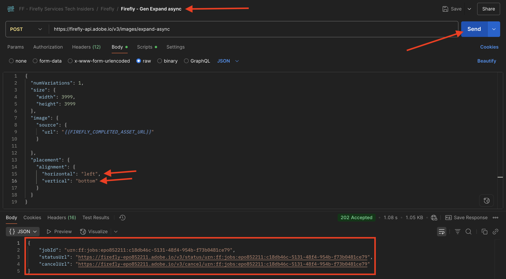

To check the status report of your running job, select the request named **GET - Firefly - Get Status Report** from the **FF - Firefly Services Tech Insiders** collection. Click to open it, and then click **Send**. Select the URL of the generated image and open it in your browser.

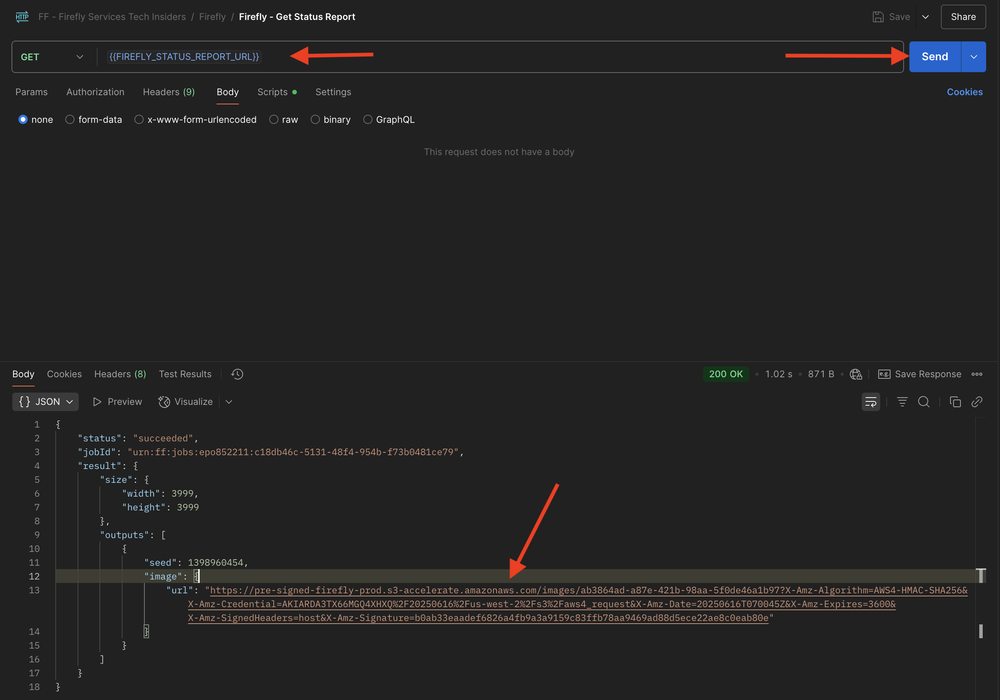

You should then see that the original image is used in a different placement, which influences the whole image.


## 1.1.1.8 Firefly Services API, Text 2 Image, Image 4 & Image 4 Ultra

With the recent release of Firefly Image Model 4, several improvements have been made available:

- Firefly Image Model 4 offers 2K resolution output with enhanced definition and detail.
- Firefly Image Model 4 delivers significant improvements in text rendering, humans, animals, and architecture.
- Firefly Image Model 4 maintains Adobe's commitment to IP-friendly, commercially safe generative AI.

Firefly Image Model 4 gives you exceptional images of people, animals, and detailed scenes and you can use Image Model 4 Ultra for generating images with hyper-realistic human interactions, architectural elements, and complex landscapes.​

### 1.1.1.8.1 image4_standard

Select the request named **POST - Firefly - T2I V4** from the **FF - Firefly Services Tech Insiders** collection and go to the **Headers** of the request.

You'll notice that the URL of the request is different from the **Firefly Services API, Text 2 Image, Image 3** request, which was **https://firefly-api.adobe.io/v3/images/generate**. This URL points to **https://firefly-api.adobe.io/v3/images/generate-async**. The addition of **-async** in the URL means you're using the asynchronous endpoint.

In the **Header** variables, you'll notice a new variable called **x-model-version**. This is a required header when interacting with Firefly Image 4 and Image 4 Ultra. To use Firefly Image 4 or Image 4 Ultra when generating images, the value of the header should then be set to either `image4_standard` or `image4_ultra`. In this example, you'll be using `image4_standard`. 

If you don't set the **x-model-version** to `image4_standard` or `image4_ultra`, then Firefly Services will default to using `image3` currently.

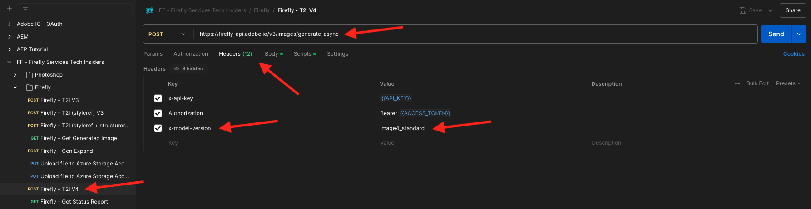

Go to the **Body** of the request. You should see that in the body, 4 images variations are being requested. The prompt is unchanged from before, and is still asking for **horses in a field** to be generated. Click **Send**

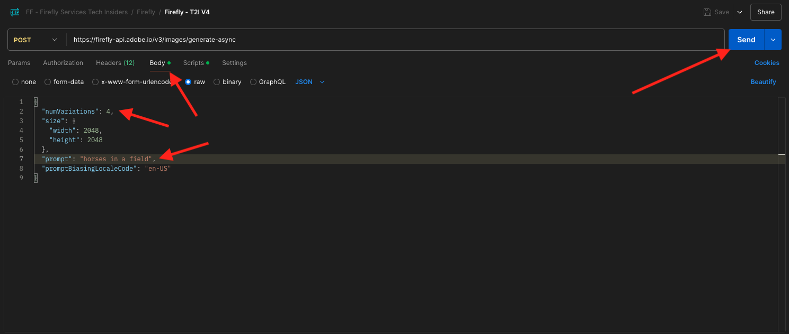

You will then get an immediate response. This response doesn't contain the image URLs of generated image, instead it contains a URL of the status report of the job that you launched, and it contains another URL that allows you to cancel the running job.

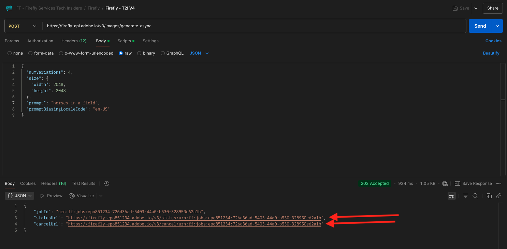

To check the status report of your running job, select the request named **GET - Firefly - Get Status Report** from the **FF - Firefly Services Tech Insiders** collection. Click to open it, and then click **Send**.

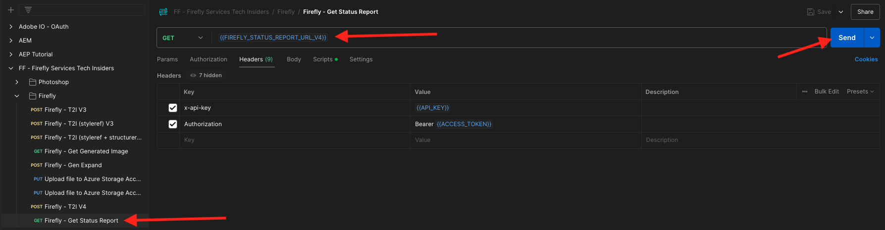

You will then see the status report of the image generation job that you just launched. Verify the field **status**, as it may be set to **running**, which means that the job hasn't completed yet. In this example, the job status is set to **succeeded**, which means that the images you requested have been generated.

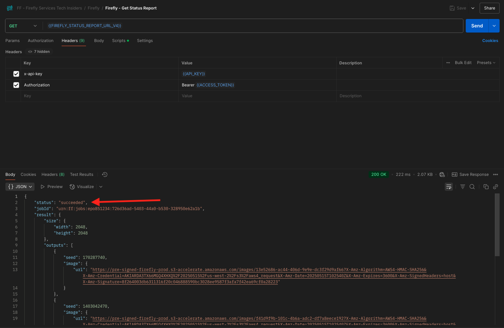

Scroll down a bit in the reponse, and you should then see in total 4 image variations being returned by Adobe Firefly Services. Click (or copy) the URL of one of the images and open it in your browser.

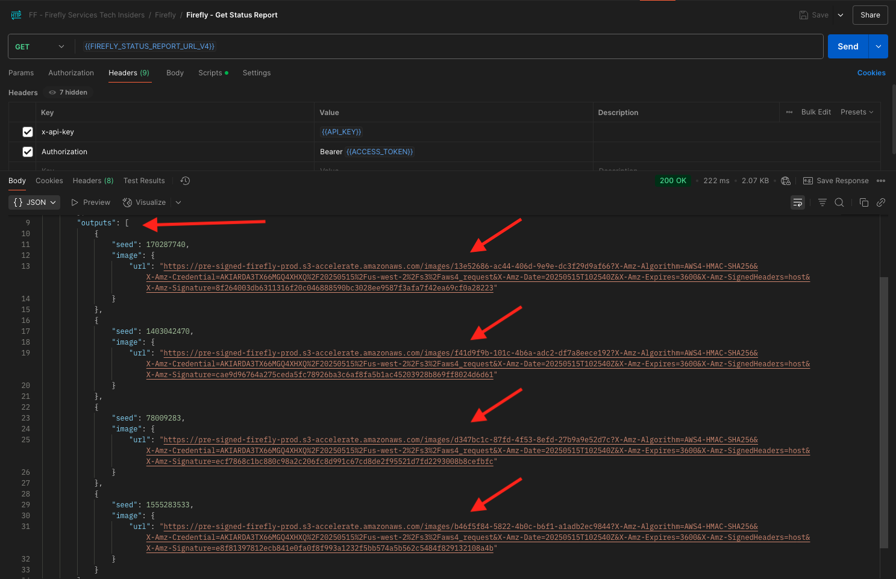

You should then see a hyperrealistic image of **horses in a field**.


### 1.1.1.8.2 image4_ultra

Go back to the request named **POST - Firefly - T2I V4** from the **FF - Firefly Services Tech Insiders** collection and go to the **Headers** of the request.

Change the variable **x-model-version** to `image4_ultra`. In this example, you'll be using `image4_ultra`.

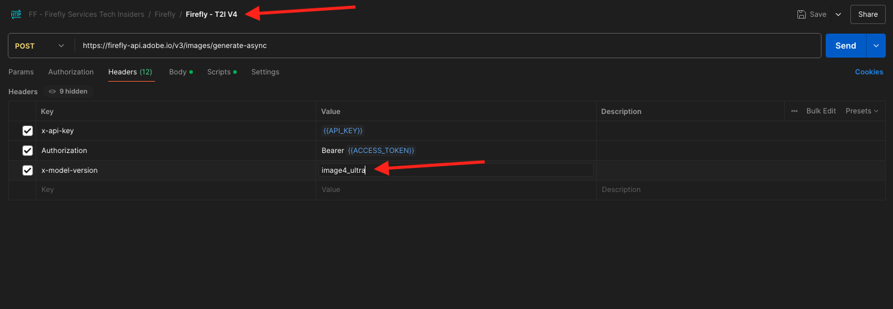

Go to the **Body** of the request. In the body, change the number of image variations to 1 as with Firefly Image 4 Ultra, only 1 image can be generated at the same time. The prompt is unchanged from before, and is still asking for **horses in a field** to be generated. Click **Send**

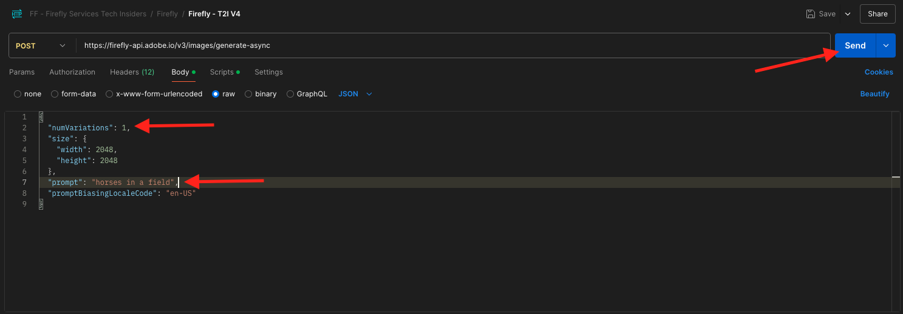

The response again contains a URL of the status report of the job that you launched, and it contains another URL that allows you to cancel the running job.

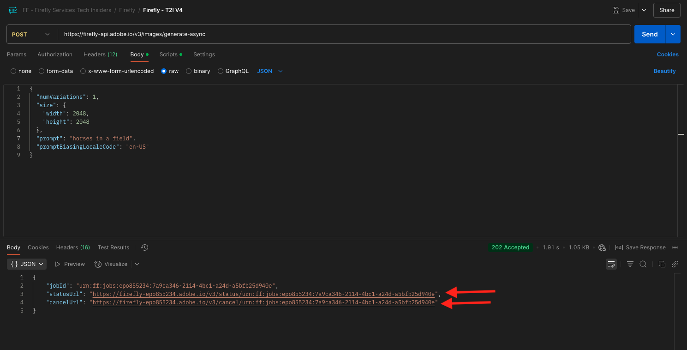

To check the status report of your running job, select the request named **GET - Firefly - Get Status Report** from the **FF - Firefly Services Tech Insiders** collection. Click to open it, and then click **Send**.

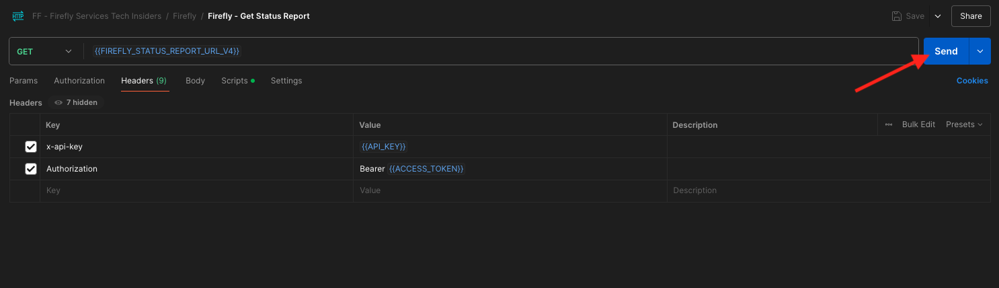

You will then see the status report of the image generation job that you just launched. Verify the field **status**, as it may be set to **running**, which means that the job hasn't completed yet. In this example, the job status is set to **succeeded**, which means that the images you requested have been generated.

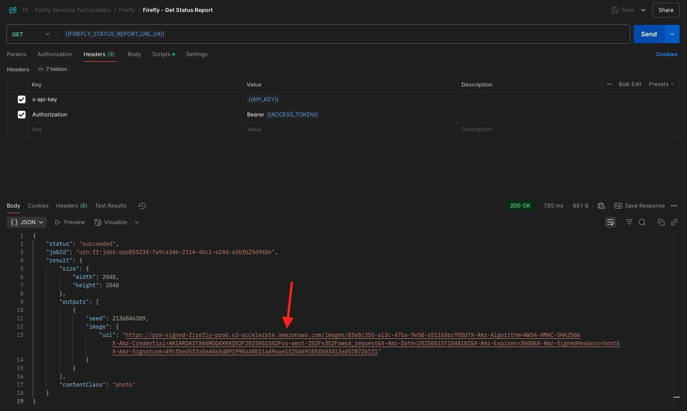

You should then see a hyperrealistic image of **horses in a field**.


### Negative prompting

In case you would like to request Firefly to not include something in the image that will be generated, you can include the field `negativePrompt` when using the API (this option is currently not exposed to the UI). As an example, if you don't want any flowers to be included when the prompt **horses in a field** is executed, then you can specify this in the **Body** of your API request:

```
"negativePrompt": "no flowers",
```

Go to the request **POST - Firefly - T2I V4** from the **FF - Firefly Services Tech Insiders** collection and go to the **Body** of the request. Paste the above text in the Body of the request. Click **Send**.

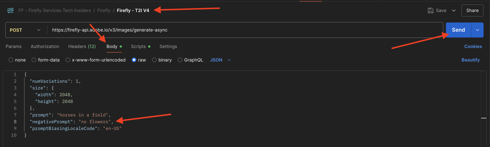

You should then see this.

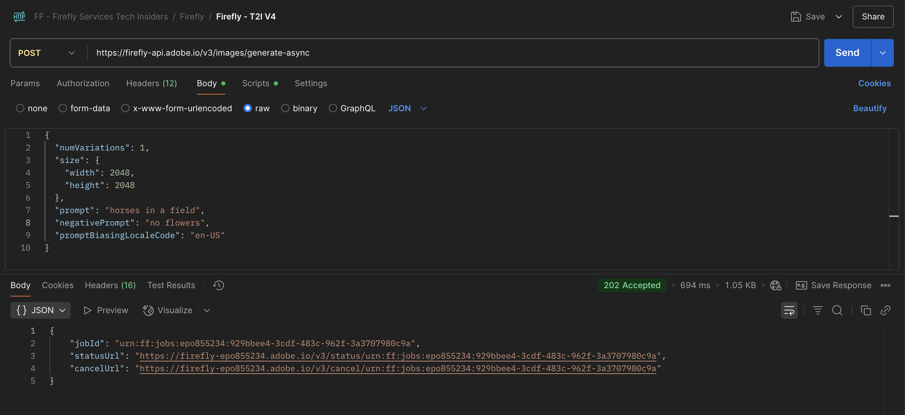

To check the status report of your running job, select the request named **GET - Firefly - Get Status Report** from the **FF - Firefly Services Tech Insiders** collection. Click to open it, and then click **Send**. Select the URL of the generated image and open it in your browser.

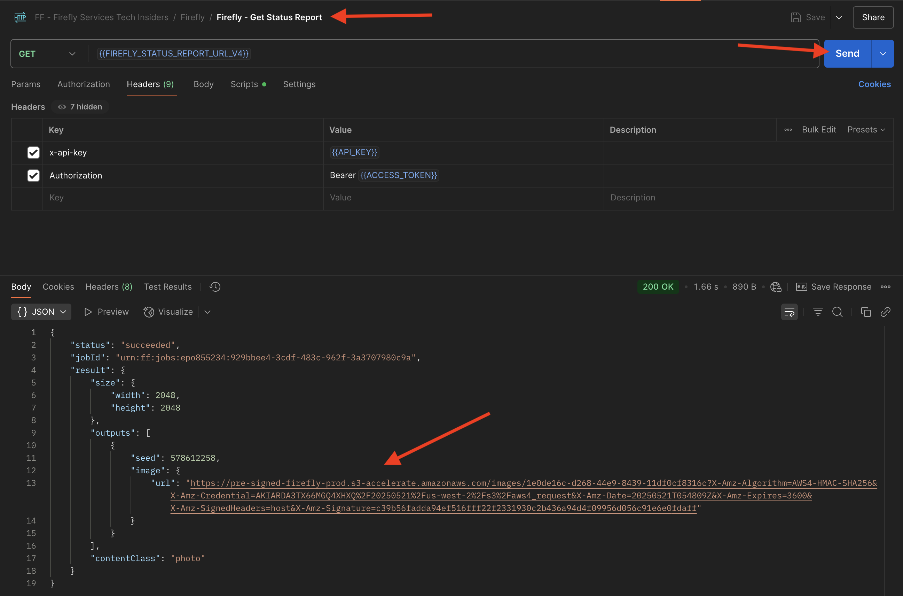

You will then see the generated image, which shouldn't contain any flowers.


## Next Steps

Go to [Optimize your Firefly process using Microsoft Azure and presigned URLs](./ex2.md){target="_blank"}

Go back to [Overview of Adobe Firefly Services](./firefly-services.md){target="_blank"}

Go back to [All modules](./../../../overview.md){target="_blank"}