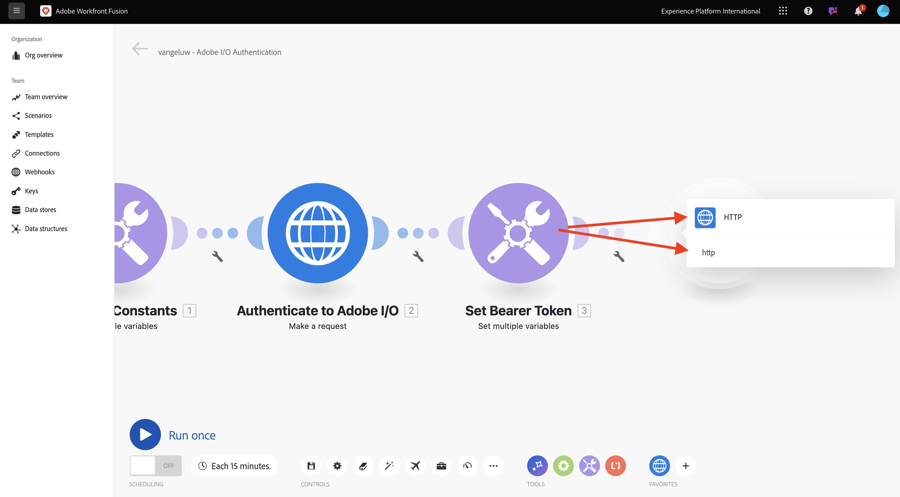
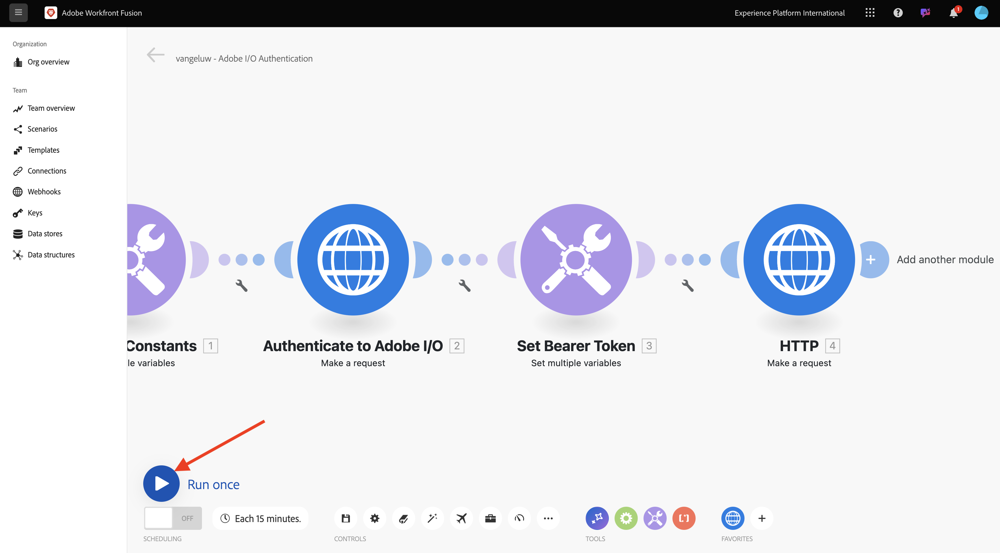
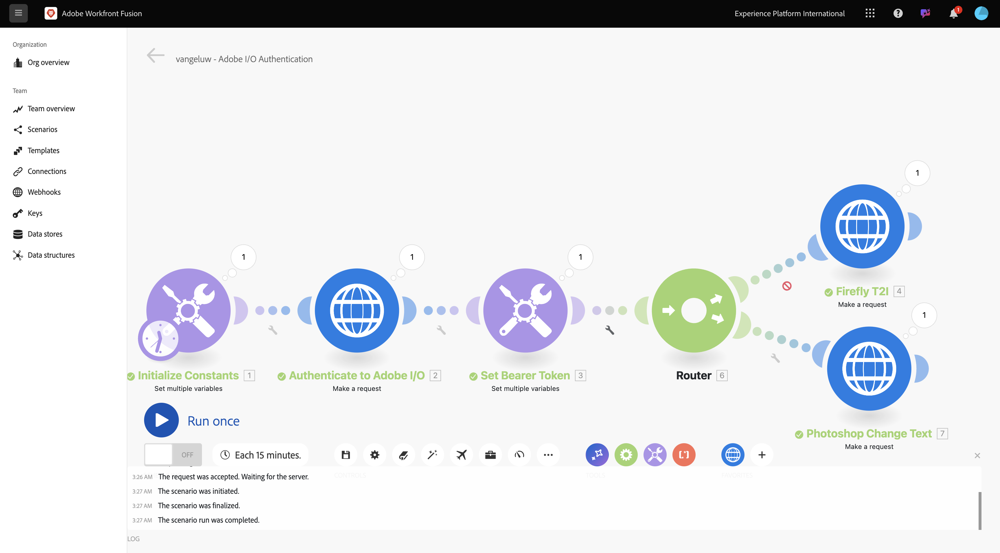
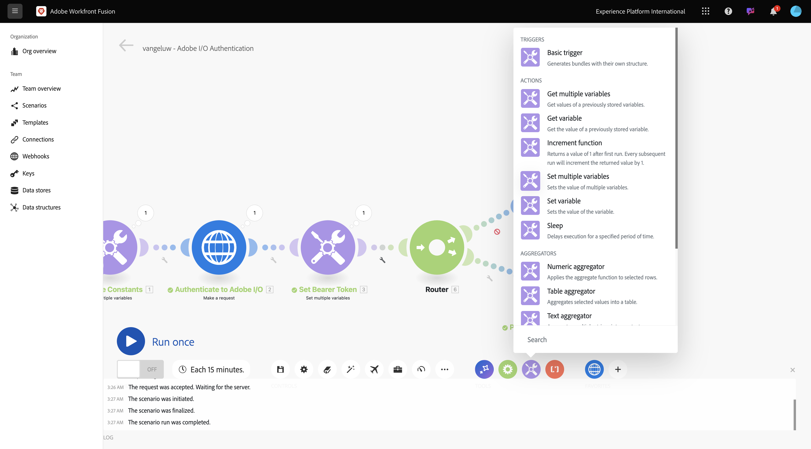
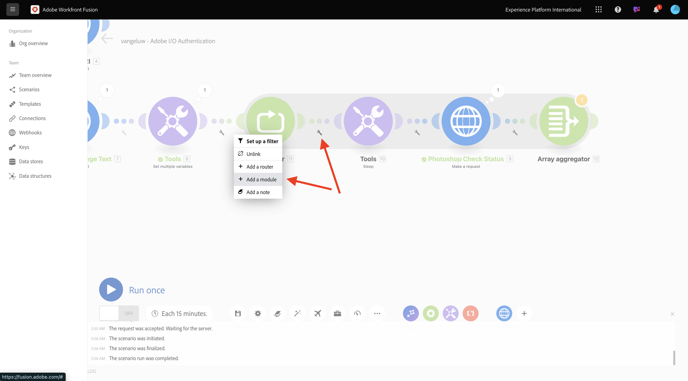
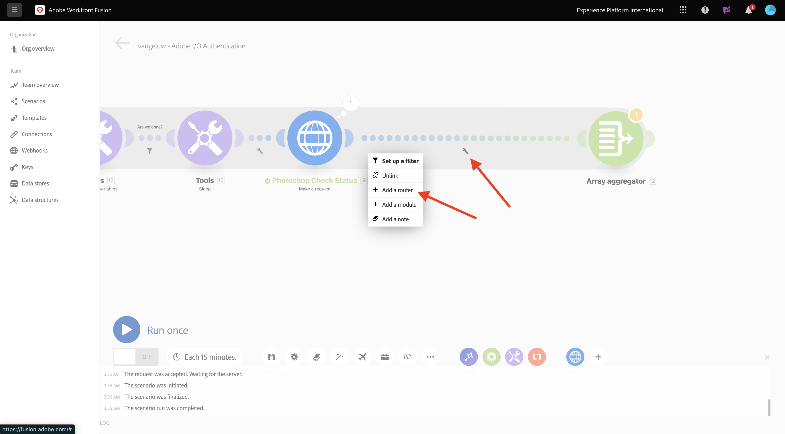
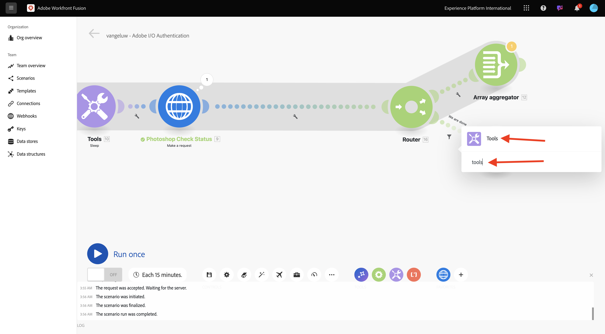
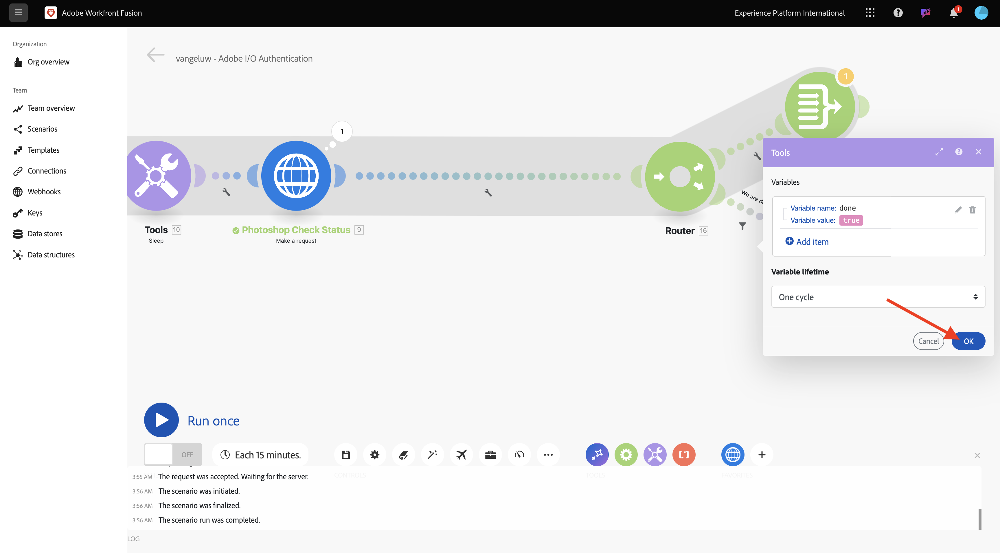

# 1.2.2 Use Adobe APIs in Workfront Fusion

Learn how to use Adobe APIs in Workfront Fusion.

## 1.2.2.1 Use Firefly Text To Image API with Workfront Fusion

1. Hover over the second **Set multiple variables** node and select **+** to add another module.

  

1. Search for **http** and select **HTTP**.

  

1. Select **Make a request**.

  

1. Select these variables:

  - **URL**: `https://firefly-api.adobe.io/v3/images/generate`
  - **Method**: `POST`

1. Select **Add a header**.

  

1. Enter the following headers:

  | Key     | Value     | 
  |:-------------:| :---------------:| 
  | `x-api-key`         | your stored variable for `CONST_client_id` |
  | `Authorization`         | `Bearer ` + your stored variable for `bearer_token` |
  | `Content-Type`         | `application/json` |
  | `Accept`         | `*/*` |

1. Enter the details for `x-api-key`. Select **Add**.

  

1. Select **Add a header**.

  

1. Enter the details for `Authorization`. Select **Add**.

  

1. Select **Add a header**. Enter the details for `Content-Type`. Select **Add**.

  

1. Select **Add a header**. Enter the details for `Accept`. Select **Add**.

  

1. Set the **Body type** to **Raw**. For **Content type**, select **JSON (application/json)**.

  

1. Paste this payload into the **Request content** field.

  ```json
  {
    "numVariations": 1,
    "size": {
      "width": 2048,
      "height": 2048
    },
    "prompt": "Horses in a field",
    "promptBiasingLocaleCode": "en-US"
  }
  ```

1. Check the box for **Parse response**. Select **OK**.

  

1. Select **Run once**.

  

  Your screen should look like this.

  

1. Select the **?** icon on the fourth node, HTTP, to see the response. You should see an image file in the response.

  

1. Copy the image URL and open it in a browser window. Your screen should look like this:

  

1. Right-click **HTTP** and rename to **Firefly T2I**.

  

1. Select **Save** to save your changes.

  

## 1.2.2.2 Use Photoshop API with Workfront Fusion

1. Select **wrench** between the nodes **Set Bearer Token** and **Firefly T2I**. Select **Add a router**.

  

1. Right-click **Firefly T2I** object and select **Clone**.

  

1. Drag and drop the cloned object close to the **Router** object—it auto-connects to the **Router**. Your screen should look like this:

  

You now have an identical copy based on the **Firefly T2I** HTTP request. Some of the settings of the **Firefly T2I** HTTP request are similar to what you need to interact with the **Photoshop API**, which is a time saver. Now, you only need to change the variables that aren't the same, like the request URL and the payload.

1. Change the **URL** to `https://image.adobe.io/pie/psdService/text`.

  

1. Replace **Request content** by the below payload:

  ```json
  {
    "inputs": [
      {
        "storage": "external",
        "href": "{{AZURE_STORAGE_URL}}/{{AZURE_STORAGE_CONTAINER}}/citisignal-fiber.psd{{AZURE_STORAGE_SAS_READ}}"
      }
    ],
    "options": {
      "layers": [
        {
          "name": "2048x2048-button-text",
          "text": {
            "content": "Click here"
          }
        },
        {
          "name": "2048x2048-cta",
          "text": {
            "content": "Buy this stuff"
          }
        }
      ]
    },
    "outputs": [
      {
        "storage": "azure",
        "href": "{{AZURE_STORAGE_URL}}/{{AZURE_STORAGE_CONTAINER}}/citisignal-fiber-changed-text.psd{{AZURE_STORAGE_SAS_WRITE}}",
        "type": "vnd.adobe.photoshop",
        "overwrite": true
      }
    ]
  }
  ```

  

  In order for this **Request content** to function properly, there are some variables that are missing:

  - `AZURE_STORAGE_URL`
  - `AZURE_STORAGE_CONTAINER`
  - `AZURE_STORAGE_SAS_READ`
  - `AZURE_STORAGE_SAS_WRITE`

1. Go back to your first node, select **Initialize Constants** and then choose **Add item** for each of these variables.

  

  | Key     | Example Value     | 
  |:-------------:| :---------------:| 
  | `AZURE_STORAGE_URL`| `https://vangeluw.blob.core.windows.net` |
  | `AZURE_STORAGE_CONTAINER`| `vangeluw` |
  | `AZURE_STORAGE_SAS_READ`| `?sv=2023-01-03&st=2025-01-13T07%3A36%3A35Z&se=2026-01-14T07%3A36%3A00Z&sr=c&sp=rl&sig=4r%2FcSJLlt%2BSt9HdFdN0VzWURxRK6UqhB8TEvbWkmAag%3D` |
  | `AZURE_STORAGE_SAS_WRITE`| `?sv=2023-01-03&st=2025-01-13T17%3A21%3A09Z&se=2025-01-14T17%3A21%3A09Z&sr=c&sp=racwl&sig=FD4m0YyyqUj%2B5T8YyTFJDi55RiTDC9xKtLTgW0CShps%3D` |

  You can find your variables by going back to Postman, and opening your **Environment Variables**.

  

1. Copy these values across to Workfront Fusion, and add a new item for each of these 4 variables.

1. Your screen should look like this. Select **OK**.

  

Next, go back to the cloned HTTP request to update the **Request content**. Notice the black variables in the **Request content**, which are the variables you copied across from Postman. You need to change to the variables you just defined in Workfront Fusion. Replace each variable one by one by deleting the black text and replacing it by the correct variable.

  

1. Make these 3 changes in the **inputs** section. Select **OK**.

  

1. Make these 3 changes in the **outputs** section. Select **OK**.

  

1. Right-click the cloned node, and select **Rename**. Change the name to **Photoshop Change Text**.

  

  Your screen should look like this:

  

1. Select **Run once**.

  

1. Select the **search** icon on the  **Photoshop Change Text** node to see the response. You should have a response that looks like this, with a link to a status file.

  

1. Before continuing with the Photoshop API interactions, disable the route to the **Firefly T2I** node to not send unneeded API calls to that API endpoint. Select the **wrench** icon, and then select **Disable route**.

  

  Your screen should look like this:

  

1. Next, add another **Set multiple variables** node.

  

1. Place it after the **Photoshop Change Text** node.

  

1. Select the **Set multiple variables** node, select **Add item**. Select the variable value from the response of the previous request.

  | Variable name     | Variable value     | 
  |:-------------:| :---------------:| 
  | `psdStatusUrl`| `data > _links > self > href` |

1. Select **Add**. 

  

1. Select **OK**.

  

1. Right-click on the **Photoshop Change Text** node and select **Clone**.

  

1. Drag the cloned HTTP request after the **Set multiple variables** node that you just created.

  

1. Right-click the cloned HTTP request, select **Rename** and change the name to **Photoshop Check Status**.

 

1. Select to open the HTTP request. Change the URL so that it references the variable that you created in the previous step, and set the **Method** to **GET**.

  

1. Remove the **Body** by selecting the empty option.

  

1. Select **OK**.

  

1. Select **Run once**.

  

  A response which containing the field **status**, with status set to **running** appears. It takes a couple of seconds for Photoshop to complete the process.

  

  Now that you know the response needs a bit more time to be finished, it may be a good idea to add a timer in front of this HTTP request so that it doesn't run immediately.

1. Select the **Tools** node and then select **Sleep**.

  

1. Position the **Sleep** node in between **Set multiple variables** and **Photoshop Check Status**. Set the **Delay** to **5** seconds. Select **OK**.

  

  Your screen should look like this. The challenge with the below configuration is that 5 seconds of waiting may be enough, but maybe it isn't enough. In reality, it would be better to have a more intelligent solution like a do...while loop that checks the status every 5 seconds until the status equals **succeeded**. So, you can implement such a tactic in the next steps.

  

1. Select the **wrench** icon in between **Set multiple variables** and **Sleep**. Select **Add module**.

  

1. Search for `flow` and then select **Flow Control**.

  

1. Select **Repeater**.

  

1. Set **Repeats** to **20**. Select **OK**.

  

1. Next, select **+** on the **Photoshop Check Status** to add another module.

  

1. Search for **flow** and select **Flow Control**.

  

1. Select **Array Aggregator**.

  

1. Set **Source Module** to **Repeater**. Select **OK**.

  

  Your screen should look like this:

  

1. Select the **wrench** icon and select **Add a module**.

  

1. Search for **tools** and select **Tools**.

 

1. Select **Get multiple variables**.

  

1. Select **+ Add item** and set the **Variable name** to `done`.

  

1. Select **OK**.

  

1. Select the **Set multiple variables** node that you configured before. In order to initialize the variable **done**, you need to set it to `false` here. Select **+ Add item**.

  

1. Use `done` for the **Variable name**

1. To set the status, a boolean value is needed. To find the boolean value, select **gear** and then select `false`. Select **Add**.

  

1. Select **OK**.

  

1. Next, select the **wrench** icon after the **Get multiple variables** node that you configured.

  

1. Select **Set up a filter**. You now need to check the value of the variable **done**. If that value is set to **false**, then the next part of the loop has to be executed. If the value is set to **true**, it means that the process has already successfully completed so there's no need to continue with the next part of the loop.

  

1. For the label, use **Are we done?**. Set the **Condition** using the already existing variable **done**, the operator should be set to **Equal to** and the value should be the boolean variable `false`. Select **OK**.

  

1. Next, make some room between the nodes **Photoshop Check Status** and **Array aggregator**. Then, select the **wrench** icon and select **Add a router**. You're doing this because after checking the status of the Photoshop file, there should be 2 paths. If the status is `succeeded`, then the variable of **done** should be set to `true`. If the status is not equal to `succeeded`, then the loop should continue. The router will make it possible to check and set this.

  

1. After adding the router, select the **wrench** icon and select **Set up a filter**.

  

1. For the label, use **We are done**. Set the **Condition** using the response from the **Photoshop Check Status** node by choosing the resposne field **data.outputs[].status**, the operator should be set to **Equal to** and the value should be `succeeded`. Select **OK**.

  

1. Next, select the empty node with the question mark and search for **tools**. Then, select **Tools**.

  

1. Select **Set multiple variables**.

  

1. When this branch of the router is used, it means the status of the Photoshop file creation has successfully completed. This means that the do...while loop no longer need to continue checking the status in Photoshop, so you should set the variable `done` to `true`.

1. For the **Variable name**, use `done`. 

1. For the **Variable value**, you should use the boolean value `true`. Select the **gear** icon and then select `true`. Select **Add**.

  

1. Select **OK**.

  

1. Next, right-click the **Set multiple variables** node you just created and select **Clone**.

  

1. Drag the cloned node so that it connects with the **Array aggregator**. Then, right-click the node and select **Rename**, and change the name to `Placeholder End`.

  

1. Remove the existing variable and select **+ Add Item**. For the **Variable name**, use `placeholder`, for the **Variable value**, use `end`. Select **Add** and then select **OK**.

  

1. Select **Save** to save your scenario. Next, select   **Run once**.

  

  Your scneario is then executed and should finish successfully. Notice that the do...while loop that you configured works fine. In the below run, you can see that the **Repeater** ran 20 times based on the bubble on the **Tools > Get multiple variables** node. After that node, you configured a filter that checked the status and only if the status was not equal to **succeeded**, the next nodes were executed. In this run, the part after the filter only ran once, because the status was already **succeeded** in the first run.

  

1. You can verify the status of the creation of your new Photoshop file by clicking the bubble on the **Photoshop Check Status** HTTP request and drilling down to the **status** field.

  

You've now configured the basic version of a repeatable scenario that automates a number of steps. In the next exercise, you'll iterate on that by adding complexity.

## Next steps

Go to [Process automation with Workfront Fusion](./ex3.md){target="_blank"}

Go back to [Automating Adobe Firefly Services](./automation.md){target="_blank"}

Go back to [All Modules](./../../../overview.md){target="_blank"}
