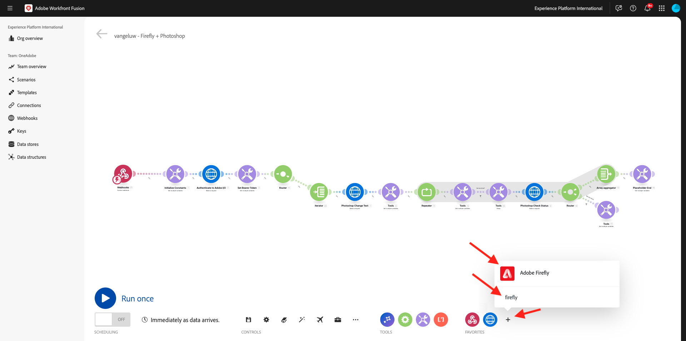
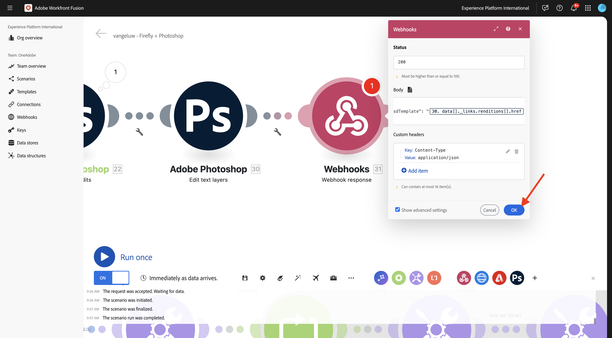

# 1.2.4 Automation using Connectors

You will now start using the out-of-the-box connectors in Workfront Fusion for Photoshop and you'll connect the Firefly Text-2-Image request and the Photoshop requests into one scenario.

## 1.2.4.1 Duplicate and prepare your scenario

In the left menu, go to **Scenarios** and select your folder `--aepUserLdap--`. You should then see the scenario you created before, which is named `--aepUserLdap-- - Adobe I/O Authentication`.


Click the arrow to open the dropdown menu and select **Clone**.


Set the **Name** of the cloned scenario to `--aepUserLdap-- - Firefly + Photoshop` and select the appropriate **Target team**. Click **Add** to add a new webhook.

>[!NOTE]
>
>You may not see the option to select a **Target Team**. This option is only shown if you're a user in more then 1 Team in Workfront Fusion. If you don't see this option, it simply means that you have only been added to 1 Team so no choice is needed.


Set the **Webhook name** to `--aepUserLdap-- - Firefly + Photoshop Webhook`. Click **Save**.


You should then see this. Click **Save**.


You should then see this. Click the **Webhook** module.


Click **Copy address to clipboard** and then click **Re-determine data structure**.


Open Postman. Add a new request in the same folder you were using before.


Make sure the following settings are applied:

- Request name: `POST - Send Request to Workfront Fusion Webhook Firefly + Photoshop`
- Request type: `POST`
- Request URL: paste the URL you copied from your Workfront Fusion Scenario's webhook.

Go to **Body** and set the **Body Type** to **raw** - **JSON**. Paste the following payload in the **Body**.

```json
{
    "psdTemplate": "citisignal-fiber.psd",
    "xlsFile": "placeholder",
    "prompt":"misty meadows",
    "cta": "Buy this now!",
    "button": "Click here to buy!"
}
```

This new payload will ensure that all variable information is provided from outside the scenario instead of it being hardcoded in the scenario. In an enterprise scenario, an organization needs a scenario to be defined in a reusable way, which means that a number of variables need to be provided as input variables instead of having them hardcoded in the scenario.

You should then have this. Click **Send**.


The Workfront Fusion webhook is still waiting for input. 


Once you've clicked **Send**, the message should change tp **Successfully determined**. Click **OK**.


## 1.2.4.2 Update Firefly T2I module

Right-click the module **Firefly T2I** and select **Delete module**.


Click the **+** icon, enter the search term `firefly` and then select **Adobe Firefly**.



Select **Generate an image**.


Drag and drop the **Adobe Firefly** module so that it connects to the **Router** module.


Click the **Adobe Firefly** module to open it, and then click **Add** to create a new connection.


Fill outthe following fields:

- **Connection name**: use `--aepUserLdap-- - Firefly connection`.
- **Environment**: use **Production**.
- **Type**: use **Personal account**.
- **Client ID**: copy the **Client ID** from your Adobe I/O project which is named `--aepUserLdap-- - One Adobe tutorial`.
- **Client Secret**: copy the **Client Secret** from your Adobe I/O project which is named `--aepUserLdap-- - One Adobe tutorial`.

You can find the **Client ID** and **Client Secret** of your Adobe I/O project [here](https://developer.adobe.com/console/projects.
){target="_blank"}.


Once you've filled out all the fields, click **Continue**. Your connection will then be validated automatically.


Next, select the variable **prompt** which is provided to the scenario by the incoming **Custom webhook**. Click **OK**.


Before you continue, you need to disable the old route in the scenario as for this exercise, you will only use the new route that you're configuring at the moment. To do that, click the **wrench** icon between the **Router** module and the **Iterator** module, and select **Disable route**.


Click **Save** to save your changes and then click **Run once** to test your configuration.


Go to Postman, verify the prompt in your request and then click **Send**.


Once you've clicked send, go back to Workfront Fusion and click the bubble icon on the **Adobe Firefly** module to verify the details.


Go into **OUTPUT** to **Details** > **url** to find the URl of the image that was generated by **Adobe Firefly**.


You should now see an image that represents the prompt you sent in from the Postman request, in this case **misty meadows**.


## 1.2.4.2 Change background of PSD file

You will now update your scenario to make it smarter by using more out-of-the-box connectors. You'll also connect the output from Firefly to Photoshop, so that the background image of the PSD-file changes dynamically by using the output from the Firefly Generate Image action.

You should then see this. Next, hover over the **Adobe Firefly** module and click the **+** icon.


In the search menu, enter `Photoshop` and then click the **Adobe Photoshop** action.


Select **Apply PSD edits**.


You should then see this. Click **Add** to add a new connection to Adobe Photoshop. 


Configure your connection as follows:

- Connection type: select **Adobe Photoshop (Server-to-Server)**
- Connection name: enter `--aepUserLdap-- - Adobe IO`
- Client ID: paste your Client ID
- Client Secret: paste your Client Secret

Click **Continue**.


To find your **Client ID** and **Client Secret**, go to [https://developer.adobe.com/console/home](https://developer.adobe.com/console/home){target="_blank"} and open your Adobe I/O project, which is named `--aepUserLdap-- One Adobe tutorial`. Go to **OAuth Server-to-Server** to find your Client ID and Client Secret. Copy those values and paste them in the connection setup in Workfront Fusion.


After clicking **Continue**, a popup window will be shown briefly while your credentials are being verified. Once done, you should see this.


You now need to enter the file location of the PSD file that you want Fusion to work with. For **Storage**, select **Azure** and for **File location**, enter `{{1.AZURE_STORAGE_URL}}/{{1.AZURE_STORAGE_CONTAINER}}/{{1.AZURE_STORAGE_SAS_READ}}`. Put the cursor next to the second `/`. Then, have a look a the available variables and scroll down to find the variable **psdTemplate**. Click the variable **psdTemplate** to select it.


You should then see this.


Scroll all the way down until you see **Layers**. Click **Add item**.


You should then see this. You now need to enter the name of the layer in your Photoshop PSD template that is used for the background of the file. 


In the file **citisignal-fiber.psd**, you'll find the layer that used for the background. In this example, that layer is named **2048x2048-background**.


Paste the name **2048x2048-background** in the Workfront Fusion dialog.


Scroll down until you see **Input**. You now need to define what needs to be inserted in the background layer. In this case, you need to select the output of the **Adobe Firefly** module, which contains the dynamically generated image.

For **Storage**, select **External**. For **File location**, you will need to copy and paste the variable `{{XX.details[].url}}` from the output of the **Adobe Firefly** module but you need to replace **XX** in the variable by the sequence number of the **Adobe Firefly** module, which in this example is **22**.


Next, scroll down until you see **Edit**. Set **Edit** to **Yes** and set **Type** to **Layer**. Click **Add**.


You should then see this. Next, you need to define the output of the action. Click **Add item** under **outputs**.


Select **Azure** for **Storage**, paste this `{{1.AZURE_STORAGE_URL}}/{{1.AZURE_STORAGE_CONTAINER}}/citisignal-fiber-replacedbg.psd{{1.AZURE_STORAGE_SAS_WRITE}}` under  **File Location** and select **vnd.adobe.photoshop** under **Type**. Click to enable **Show advanced settings**.


Under **Advanced Settings**, select **Yes** to overwrite files with the same name.
Click **Add**.


You should then have this. Click **OK**.


Click **Save** to save your changes and then click **Run once** to test your configuration.


Go to Postman, verify the prompt in your request and then click **Send**.


You should then see this. Click the bubble on the **Adobe Photoshop - Apply PSD edits** module.


You can now see that a new PSD file was generated successfully and stored in your Microsoft Azure Storage Account.


## 1.2.4.3 Change text layers of PSD file

### Call To Action Text

Next, hover over the **Adobe Photoshop - Apply PSD edits** module and click the **+** icon.


Select **Adobe Photoshop**.


Select **Edit text layers**.


You should then see this. First, select your previously already configured Adobe Photoshop connection, which should be named `--aepUserLdap-- Adobe IO`. 

You now need to define the location of the **Input file**, which is the output of the previous step and under **Layers**, you need to enter the **Name** of the text layer you want to change. 


For the **Input file**, select **Azure** for **Input file storage** and make sure to select the output from the previous request, **Adobe Photoshop - Apply PSD edits**, which you can take from here: `data[]._links.renditions[].href`


Open the file **citisignal-fiber.psd**. In the file, you'll notice that the layer containing the call to action is named **2048x2048-cta**.


Enter the name **2048x2048-cta** under **Name** in the dialog.


Scroll down until you see **Text** > **Content**. Select the variable **cta** from the Webhook payload.


Scroll down until you see **Output**. For **Storage**, select **Azure**. For **File location**, enter the below location. Please note the addition of the variable `{{timestamp}}` to the filename which is used to ensure that every file that is generated has a unique name. Also, set the **Type** to **vnd.adobe.photoshop**. Click **OK**.

`{{1.AZURE_STORAGE_URL}}/{{1.AZURE_STORAGE_CONTAINER}}/citisignal-fiber-changed-text-{{timestamp}}.psd{{1.AZURE_STORAGE_SAS_WRITE}}`


### Button Text

Right-click the module you just created and select **Clone**. This will create a second similar module.


Connect the cloned module to the previous **Adobe Photoshop - Edit text layers** module.


You should then see this. First, select your previously already configured Adobe Photoshop connection, which should be named `--aepUserLdap-- Adobe IO`. 

You now need to define the location of the **Input file**, which is the output of the previous step and under **Layers**, you need to enter the **Name** of the text layer you want to change. 


For the **Input file**, select **Azure** for **Input file storage** and make sure to select the output from the previous request, **Adobe Photoshop - Edit text layers**, which you can take from here: `data[]._links.renditions[].href`

Open the file **citisignal-fiber.psd**. In the file, you'll notice that the layer containing the call to action is named **2048x2048-button-text**.


Enter the name **2048x2048-button-text** under **Name** in the dialog.


Scroll down until you see **Text** > **Content**. Select the variable **button** from the Webhook payload.


Scroll down until you see **Output**. For **Storage**, select **Azure**. For **File location**, enter the below location. Please note the addition of the variable `{{timestamp}}` to the filename which is used to ensure that every file that is generated has a unique name. Also, set the **Type** to **vnd.adobe.photoshop**. Click **OK**.

`{{1.AZURE_STORAGE_URL}}/{{1.AZURE_STORAGE_CONTAINER}}/citisignal-fiber-changed-text-{{timestamp}}.psd{{1.AZURE_STORAGE_SAS_WRITE}}`


Click **Save** to save your changes.


## 1.2.4.4 Webhook response

After applying these changes to your Photoshop file, you now need to configure a **Webhook response** which will be sent back to whichever application has activated this scenario.

Hover over the module **Adobe Photoshop - Edit text layers** and click the **+** icon.


Search for `webhooks` and select **Webhook**.


Select **Webhook response**.


You should then see this. Paste the below payload in **Body**.

```json
{
    "newPsdTemplate": ""
}
```


Copy and paste the variable `{{XX.data[]._links.renditions[].href}}` and replace **XX** by the sequence number of the last **Adobe Photoshop - Edit text layers** module, which in this case is **25**. Enable the checkbox for **Show advanced settings** and then click **Add item**.


In the field **Key**, enter `Content-Type`. In the field **Value**, enter `application/json`. Click **Add**.


You should then have this. Click **OK**.



Click **Auto-align**.


You should then see this. Click **Save** to save your changes and then click **Run once** to test your scenario.


Go back to Postman and click **Send**. The prompt being used here is **misty meadows**.


The scenario will then be activated and after some time, a response will be shown in Postman that contains the URL of the newly created PSD file.


As a reminder: once the scenario has run in Workfront Fusion, you'll be able to see information about each module by clicking the bubble above each module.


Using Azure Storage Explorer, you can then find and open the newly created PSD file by double-clicking it in Azure Storage Explorer.


Your file should then look like this, with the background that is replaced by a background with **misty meadows**.


If you run your scenario once again, and then send a new request from Postman using a different prompt, you'll then see how easy and reusable your scenario has become. In this example, the new prompt being used is **sunny desert**.


And a couple of minutes later, a new PSD file has been generated with a new background.


## Next steps

Go to [1.2.5 Frame.io and Workfront Fusion](./ex5.md){target="_blank"}

Go back to [Creative Workflow Automation with Workfront Fusion](./automation.md){target="_blank"}

Go back to [All Modules](./../../../overview.md){target="_blank"}
