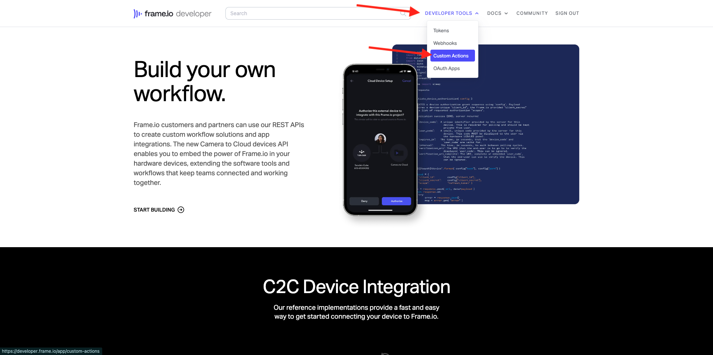
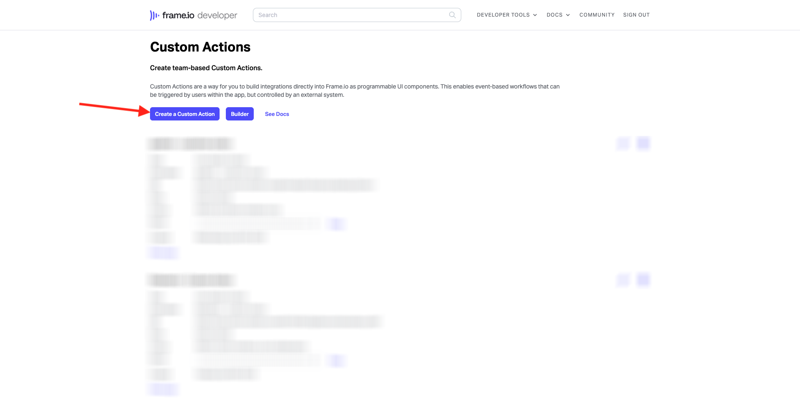
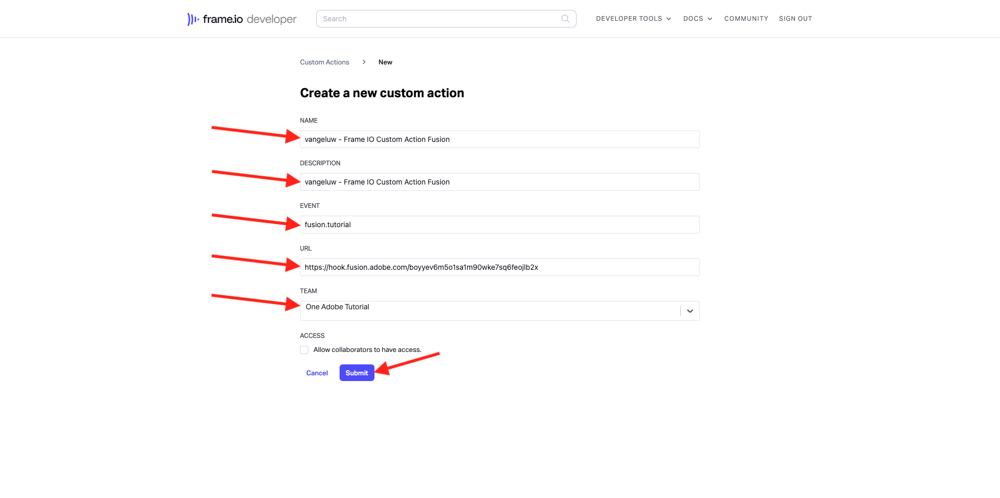
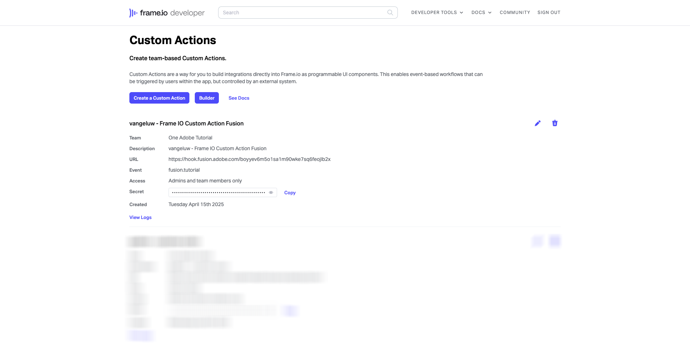

# 1.2.5 Frame I/O and Workfront Fusion

In the previous exercise you configured the scenario `--aepUserLdap-- - Firefly + Photoshop` and configured an incoming webhook to trigger the scenario, and a webhook response when the scenario completed successfully. You then used Postman to trigger that scenario. Postman is a great tool for testing, but in a real business scenario, business users wouldn't use Postman to trigger a scenario. Instead, they would use another application and they would expect that other application to activate a scenario in Workfront Fusion. In this exercise, that is exactly what you'll be doing with Frame I/O.

## 1.2.5.1 Accessing Frame I/O

>[!NOTE]
>
>In order to successfully complete this exercise, you need to be an Admin user in your Frame I/O account. The below exercise was created for Frame I/O V3 and will be updated at a later stage for Frame I/O V4.

Go to [https://app.frame.io/projects](https://app.frame.io/projects).

Click the **+ icon** to create your own project in Frame I/O.

Enter the name `--aepUserLdap--` and click **Create Project**.

You'll then see your project in the left menu. 
In one of the previous exercises, you downloaded [citisignal-fiber.psd](./../../../assets/ff/citisignal-fiber.psd){target="_blank"} to your desktop. Select that file, then drag and drop it in the project folder that was just created.

## 1.2.5.2 Workfront Fusion and Frame I/O

In the previous exercise, you created the scenario `--aepUserLdap-- - Firefly + Photoshop`, which started off with a custom webhook and that ended with a webhook response. The usage of the webhooks was then tested using Postman, but obviously, the point of such a scenario is to be called by an external application. As stated before, Frame I/O will be that exercise, but in between Frame I/O and the `--aepUserLdap-- - Firefly + Photoshop` another Workfront Fusion scenario is needed. you will now configure that scenario.

In the left menu, go to **Scenarios** and select your folder `--aepUserLdap--`. Click **Create a new scenario**.

Use the name `--aepUserLdap-- - Frame IO Custom Action`.

Click the **question mark object** on the canvas. Enter the text `webhook` in the search box and click **Webhooks**.

Click **Custom webhook**.

Click **Add** to create a new webhook url.

For the **Webhook name**, use `--aepUserLdap-- - Frame IO Custom Action Webhook`. Click **Save**.

You should then see this. Leave this screen open and untouched as you'll need it in a next step. You will have to copy the webhook URL in a next step, by clicking **Copy address to clipboard**. 

Go to [https://developer.frame.io/](https://developer.frame.io/). Click **DEVELOPER TOOLS** and then choose **Custom Actions**.

Click **Create a Custom Action**.

Enter the following values:

- **NAME**: use `vangeluw - Frame IO Custom Action Fusion`
- **DESCRIPTION**: use `vangeluw - Frame IO Custom Action Fusion`
- **EVENT**: use `fusion.tutorial`.
- **URL**: enter the URL of the webhook that you just created in Workfront Fusion
- **TEAM**: select the appropriate Frame I/O team, in this case, **One Adobe Tutorial**.

Click **Submit**.

You should then see this.

Go back to [https://app.frame.io/projects](https://app.frame.io/projects). Refresh the page.

After having refreshed the page, click the 3 dots **...** on the asset **citisignal-fiber.psd**. You should then see the custom action that you created earlier appear in the menu that is shown. Click the custom action `vangeluw - Frame IO Custom Action Fusion`.

You should then see a similar **Success!** popup. This popup is the result of the communication between Frame I/O and Workfront Fusion.

Change the screen back to Workfront Fusion. You shoud now see **Successfully determined** appear on the Custom Webhook object. Click **OK**.

Click **Run Once** to enable test mode, and test the communication with Frame I/O again.

Go back to Frame I/O and click the custom action `vangeluw - Frame IO Custom Action Fusion` again.

Switch the screen back to Workfront Fusion. You should now see a green checkmark, and a bubble showing **1**. Click the bubble to see the details.

The detailed view of the bubble shows you the data that was received from Frame I/O. You should see various ID's. As an example, the field **resource.id** shows the unique ID in Frame I/O of the asset **citisignal-fiber.psd**

Now that communication has been established between Frame I/O and Workfront Fusion, you can continue your configuration.

## 1.2.5.3 Providing a custom form response to Frame I/O.

## Next steps

Go to [1.2.6 Frame I/O to Fusion to AEM Assets](./ex6.md){target="_blank"}

Go back to [Creative Workflow Automation with Workfront Fusion](./automation.md){target="_blank"}

Go back to [All Modules](./../../../overview.md){target="_blank"}
              