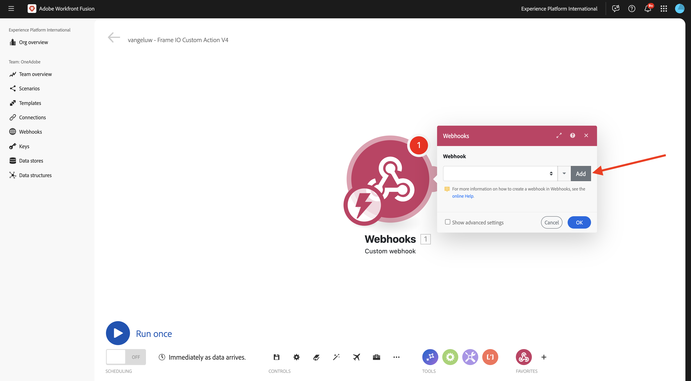
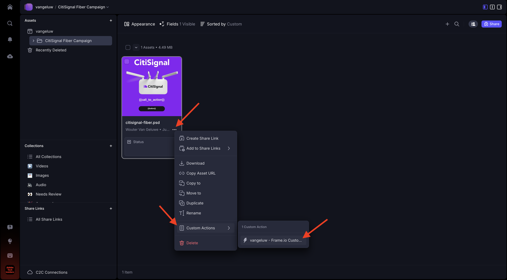
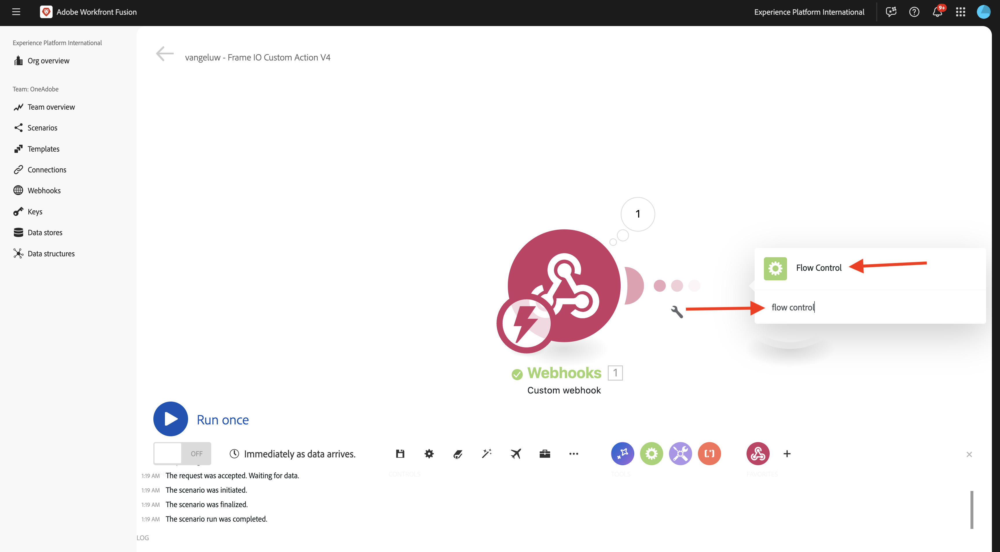
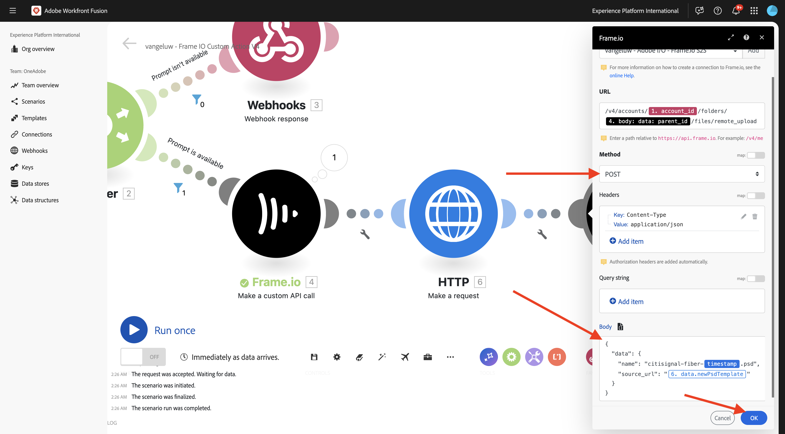
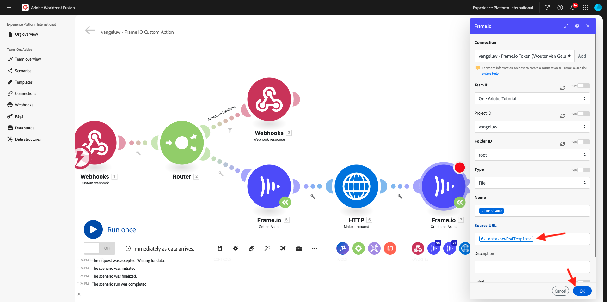
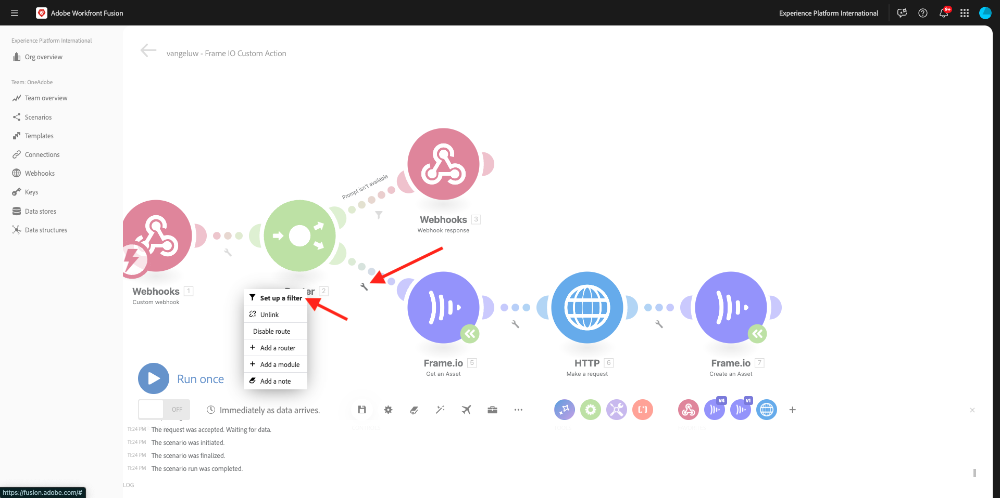

# 1.2.5 Frame.io and Workfront Fusion

In the previous exercise you configured the scenario `--aepUserLdap-- - Firefly + Photoshop` and configured an incoming webhook to trigger the scenario, and a webhook response when the scenario completed successfully. You then used Postman to trigger that scenario. Postman is a great tool for testing, but in a real business scenario, business users wouldn't use Postman to trigger a scenario. Instead, they would use another application and they would expect that other application to activate a scenario in Workfront Fusion. In this exercise, that is exactly what you'll be doing with Frame.io.

>[!NOTE]
>
>In order to successfully complete this exercise, you need to be an Admin user in your Frame.io account. The below exercise was created for Frame.io V3 and will be updated at a later stage for Frame.io V4.

## 1.2.5.1 Accessing Frame.io

Go to [https://app.frame.io/projects](https://app.frame.io/projects){target="_blank"}.

Click the **+ icon** to create your own project in Frame.io.


Enter the name `--aepUserLdap--` and click **Create Project**.


You'll then see your project in the left menu. 
In one of the previous exercises, you downloaded [citisignal-fiber.psd](./../../../assets/ff/citisignal-fiber.psd){target="_blank"} to your desktop. Select that file, then drag and drop it in the project folder that was just created.


## 1.2.5.2 Workfront Fusion and Frame.io

In the previous exercise, you created the scenario `--aepUserLdap-- - Firefly + Photoshop`, which started off with a custom webhook and that ended with a webhook response. The usage of the webhooks was then tested using Postman, but obviously, the point of such a scenario is to be called by an external application. As stated before, Frame.io will be that exercise, but in between Frame.io and the `--aepUserLdap-- - Firefly + Photoshop` another Workfront Fusion scenario is needed. you will now configure that scenario.

Go to [https://experience.adobe.com/](https://experience.adobe.com/){target="_blank"}. Open **Workfront Fusion**.


In the left menu, go to **Scenarios** and select your folder `--aepUserLdap--`. Click **Create a new scenario**.


Use the name `--aepUserLdap-- - Frame IO Custom Action`.


Click the **question mark object** on the canvas. Enter the text `webhook` in the search box and click **Webhooks**.


Click **Custom webhook**.


Click **Add** to create a new webhook url.



For the **Webhook name**, use `--aepUserLdap-- - Frame IO Custom Action Webhook`. Click **Save**.


You should then see this. Leave this screen open and untouched as you'll need it in a next step. You will have to copy the webhook URL in a next step, by clicking **Copy address to clipboard**. 


Go to [https://developer.frame.io/](https://developer.frame.io/){target="_blank"}. Click **DEVELOPER TOOLS** and then choose **Custom Actions**.


Click **Create a Custom Action**.


Enter the following values:

- **NAME**: use `--aepUserLdap-- - Frame IO Custom Action Fusion`
- **DESCRIPTION**: use `--aepUserLdap-- - Frame IO Custom Action Fusion`
- **EVENT**: use `fusion.tutorial`.
- **URL**: enter the URL of the webhook that you just created in Workfront Fusion
- **TEAM**: select the appropriate Frame.io team, in this case, **One Adobe Tutorial**.

Click **Submit**.


You should then see this.


Go back to [https://app.frame.io/projects](https://app.frame.io/projects){target="_blank"}. Refresh the page.


After having refreshed the page, click the 3 dots **...** on the asset **citisignal-fiber.psd**. You should then see the custom action that you created earlier appear in the menu that is shown. Click the custom action `--aepUserLdap-- - Frame IO Custom Action Fusion`.


You should then see a similar **Success!** popup. This popup is the result of the communication between Frame.io and Workfront Fusion.


Change the screen back to Workfront Fusion. You shoud now see **Successfully determined** appear on the Custom Webhook object. Click **OK**.


Click **Run Once** to enable test mode, and test the communication with Frame.io again.


Go back to Frame.io and click the custom action `--aepUserLdap-- - Frame IO Custom Action Fusion` again.



Switch the screen back to Workfront Fusion. You should now see a green checkmark, and a bubble showing **1**. Click the bubble to see the details.


The detailed view of the bubble shows you the data that was received from Frame.io. You should see various ID's. As an example, the field **resource.id** shows the unique ID in Frame.io of the asset **citisignal-fiber.psd**.


Now that communication has been established between Frame.io and Workfront Fusion, you can continue your configuration.

## 1.2.5.3 Providing a custom form response to Frame.io

When the custom action is invoked in Frame.io, Frame.io expects to receive a response from Workfront Fusion. If you think back to the scenario you built in the previous exercise, a number of variables are required to update the standard Photoshop PSD file. Those variables are defined in the payload that you used:

```json
{
    "psdTemplate": "citisignal-fiber.psd",
    "xlsFile": "placeholder",
    "prompt":"misty meadows",
    "cta": "Buy this now!",
    "button": "Click here to buy!"
}
```

So in order for the scenario `--aepUserLdap-- - Firefly + Photoshop` to run successfully, fields like **prompt**, **cta**, **button** and **psdTemplate** are needed.

The first 3 fields, **prompt**, **cta**, **button**, require user input which needs to be collected in Frame.io when the user invokes the custom action. So the first thing that needs to be done inside Workfront Fusion is to check whether or not these variables are available and if not, Workfront Fusion should reply back to Frame.io requesting those variables to be entered. The way to achieve that is by using a form in Frame.io.

Go back to Workfront Fusion and open your scenario `--aepUserLdap-- - Frame IO Custom Action`. Hover over the **Custom webhook** object and click the **+** icon to add another module.


Search for `Flow Control` and click **Flow Control**.



Click to select **Router**.


You should then see this.


Click the **?** object and then click to select **Webhooks**.


Select **Webhook response**.


You should then see this.


Copy the below JSON code and paste it in the field **Body**.


```json
{
  "title": "What do you want Firefly to generate?",
  "description": "Enter your Firefly prompt.",
  "fields": [
    {
      "type": "text",
      "label": "Prompt",
      "name": "Prompt",
      "value": ""
    },
    {
      "type": "text",
      "label": "CTA Text",
      "name": "CTA Text",
      "value": ""
    },
    {
      "type": "text",
      "label": "Button Text",
      "name": "Button Text",
      "value": ""
    }
  ]
}
```

Click the icon to clean up and beautify the JSON code. Then, click **OK**.


Click **Save** to save your changes.


Next, you need to set up a filter to ensure that this path of the scenario only runs when no prompt is available. Click the **wrench** icon and then select **Set up a filter**.


Configure the following fields:

- **Label**: use `Prompt isn't available`.
- **Condition**: use `{{1.data.Prompt}}`.
- **Basic Operators**: select **Does not exist**.

>[!NOTE]
>
>Variables in Workfront Fusion can be manually specified using this syntax: `{{1.data.Prompt}}`. The number in the variable references the module in the scenario. In this example, you can see that the first module in the scenario is called **Webhooks** and has a sequence number of **1**. This means that the variable `{{1.data.Prompt}}` will access the field **data.Prompt** from the module with sequence number 1. Sequence numbers can sometimes be different so pay attention when copying/pasting such variables and always verify that the sequence number used is the correct one.

Click **OK**.


You should then see this. Click the **Save** icon first, and then click **Run once** to test your scenario.


You should then see this.


Go back to Frame.io and click the custom action `--aepUserLdap-- - Frame IO Custom Action Fusion` on the asset **citisignal-fiber.psd** again.


You should now see a prompt inside Frame.io. Don't fill out the fields yet and don't submit the form yet. This prompt is shown based off of the response from Workfront Fusion that you just configured.


Switch back to Workfront Fusion and click the bubble on the **Webhook response** module. You'll see that under **INPUT**, you see the body containing the JSON payload for the form. Click **Run once** again.


You should then see this again.


Go back to Frame.io and fill out the fields as indicated. Click **Submit**.


You should then see a **Success!** popup.


Switch back to Workfront Fusion and click the bubble on the **Custom webhook** module. In Operation 1, under **OUTPUT**, you can now see a new **data** object that contains fields like **Button Text**, **CTA Text** and **Prompt**. With these user input variables available in your scenario, you have enough to continue your configuration.


## 1.2.5.4 Retrieve file location from Frame.io

As dicussed before, fields like **prompt**, **cta**, **button** and **psdTemplate** are needed for this scenario to function. The first 3 fields are now available already but the **psdTemplate** to use is still missing. The **psdTemplate** will now reference a Frame.io location as the file **citisignal-fiber.psd** is hosted in Frame.io. In order to retrieve the location of that file, you need to configure and use the Frame.io connection in Workfront Fusion.

Go back to Workfront Fusion and open your scenario `--aepUserLdap-- - Frame IO Custom Action`. Hover over the **?** module, click the **+** icon to add another module and search for `frame`. Click **Frame.io**.


Click **Frame.io (legacy)**.


Click **Get an asset**.


In order to use the Frame.io connection, you need to configure it first. Click **Add** to do that.


Open the **Connection type** dropdown.


Select **Frame.io API Key** and enter the name `--aepUserLdap-- - Frame.io Token`.


To get an API Token, go to [https://developer.frame.io/](https://developer.frame.io/){target="_blank"}. Click **DEVELOPER TOOLS** and then choose **Tokens**.


Click **Create a Token**.


Use the **Description** `--aepUserLdap-- - Frame.io Token` and click **Select all scopes**.


Scroll down and click **Submit**.


Your token is now created. Click **Copy** to copy it to your clipboard.


Go back to your scenario in Workfront Fusion. Paste the token in the field **Your Frame.io API Key**. Click **OK**. Your connection will now be tested by Workfront Fusion.


If the connection was tested successfully, it will appear automatically under **Connnection**. You now have a succesful connection, and you need to finish the configuration to get all the asset details from Frame.io, including the file location. To do this, you need to provide the **Asset ID**.


The **Asset ID** is shared by Frame.io to Workfront Fusion as part of the initial **Custom webhook** communication and can be found under the field **resource.id**. Select **resource.id** and click **OK**.


You should now see this. Save your changes and then click **Run once** to test your scenario.


Go back to Frame.io and click the custom action `--aepUserLdap-- - Frame IO Custom Action Fusion` on the asset **citisignal-fiber.psd** again.


You should now see a prompt inside Frame.io. Don't fill out the fields yet and don't submit the form yet. This prompt is shown based off of the response from Workfront Fusion that you just configured.


Switch back to Workfront Fusion. Click **Run once** again.


Go back to Frame.io and fill out the fields as indicated. Click **Submit**.


Switch back to Workfront Fusion and click the bubble on the **Frame.io - Get an asset** module. 


You can now see a lot of metadata about the specific asset **citisignal-fiber.psd**.


The specific piece of information that is needed for this use case, is the location url of the file **citisignal-fiber.psd**, which you can find by scrolling down to the field **Original**.


You now have all the fields (**prompt**, **cta**, **button** and **psdTemplate**) availabe that are needed for this scenario to function.

## 1.2.5.5 Invoke Workfront scenario

In the previous exercise you configured the scenario `--aepUserLdap-- - Firefly + Photoshop`. You now need to make a minor change to that scenario. 

Open the scenario `--aepUserLdap-- - Firefly + Photoshop` in another tab and click the first **Adobe Photoshop - Apply PSD edits** module. You should now see that the input file is configured to use a dynamic location in Microsoft Azure. Given that for this use case, the input file isn't stored in Microsoft Azure anymore but instead using Frame.io storage, you need to change these settings.


Change **Storage** to **External** and change **File location** to only use the **psdTemplate** variable that is taken from the incoming **Custom webhook** module. Click **OK** and then click **Save** to save your changes.


Click the **Custom webhook** module and then click **Copy address to clipboard**. You need to copy the URL as you'll need to use it in the other scenario.


Go back to your scenario `--aepUserLdap-- - Frame IO Custom Action`. Hover over the **Frame.io - Get an asset** module and click the **+** icon.


Enter `http` and then click **HTTP**.


Select **Make a request**.


Paste the URL of the custom webhook in the field **URL**. Set the **Method** to POST**.


Set **Body type** to **Raw** and **Content type** to **JSON (application/json)**.
Paste the below JSON payload in the field **Request content** and enable the checkbox for **Parse response**.

```json
{
    "psdTemplate": "citisignal-fiber.psd",
    "xlsFile": "placeholder",
    "prompt":"misty meadows",
    "cta": "Buy this now!",
    "button": "Click here to buy!"
}
```

You now have a static payload configured, but it needs to become dynamic using the previously collected variables.


For the field **psdTemplate**, replace the static variable **citisignal-fiber.psd** by the variable **Original**.


For the fields **prompt**, **cta** and **button**, replace the static variables by the dynamic variables that were inserted into the scenario by the incoming webhook request from Frame.io, which are the fields **data.Prompt**, **data.CTA Text** and **data.Button Text**.

Click **OK**.


Click **Save** to save your changes.


## 1.2.5.6 Save new asset in Frame.io

Once the other Workfront Fusion scenario has been invoked, the result will be a new Photoshop PSD template that is available. That PSD file needs to be stored back into Frame.io, which is the last step in this scenario.

Hover over the **HTTP - Make a request** module and click the **+** icon.


Select **Frame.io (Legacy)**.


Select **Create an asset**.


Your Frame.io connection will be automatically selected.


Select the following options:

- **Team ID**: select thje appropriate Team ID, in this case `One Adobe Tutorial`.
- **Project ID**: use `--aepUserLdap--`.
- **Folder ID**: use `root`.
- **Type**: use `File`.


For the field **Name**, you can use a variable such as **timestamp** (or change this into something that makes more sense to you). You can find the predefined variable **timestamp** under the **Date and time** tab.



For the field **Source URL**, use the below JSON code.

```json
{{6.data.newPsdTemplate}}
```

>[!NOTE]
>
>Variables in Workfront Fusion can be manually specified using this syntax: `{{6.data.newPsdTemplate}}`. The number in the variable references the module in the scenario. In this example, you can see that the sixth module in the scenario is called **HTTP - Make a request** and has a sequence number of **6**. This means that the variable `{{6.data.newPsdTemplate}}` will access the field **data.newPsdTemplate** from the module with sequence number 6. Sequence numbers can sometimes be different so pay attention when copying/pasting such variables and always verify that the sequence number used is the correct one.

Click **OK**.



Click **Save** to save your changes.


Lastly, you need to set up a filter to ensure that this path of the scenario only runs when a prompt is available. Click the **wrench** icon and then select **Set up a filter**.



Configure the following fields:

- **Label**: use `Prompt is available`.
- **Condition**: use `{{1.data.Prompt}}`.
- **Basic Operators**: select **exists**.

>[!NOTE]
>
>Variables in Workfront Fusion can be manually specified using this syntax: `{{1.data.Prompt}}`. The number in the variable references the module in the scenario. In this example, you can see that the first module in the scenario is called **Webhooks** and has a sequence number of **1**. This means that the variable `{{1.data.Prompt}}` will access the field **data.Prompt** from the module with sequence number 1. Sequence numbers can sometimes be different so pay attention when copying/pasting such variables and always verify that the sequence number used is the correct one.

Click **OK**.


Click **Save** to save your changes.


## 1.2.5.7 Test your end-to-end use case

Click **Run once** in your scenario `--aepUserLdap-- - Frame IO Custom Action`.


Go back to Frame.io and click the custom action `--aepUserLdap-- - Frame IO Custom Action Fusion` on the asset **citisignal-fiber.psd** again.


You should now see a prompt inside Frame.io. Don't fill out the fields yet and don't submit the form yet. This prompt is shown based off of the response from Workfront Fusion that you just configured.


Switch back to Workfront Fusion. Click **Run once** in your scenario `--aepUserLdap-- - Frame IO Custom Action`.


In Workfront Fusion, open the scenario `--aepUserLdap-- - Firefly + Photoshop` and also click **Run once** in that scenario.


Go back to Frame.io and fill out the fields as indicated. Click **Submit**.


After 1-2 minutes, you should see a new asset appearing automatically in Frame.io. Double-click the new asset to open it.


You can now clearly see that all the user input variables have been automatically applied.


You've now successfully completed this exercise.

## Next steps

Go to [1.2.6 Frame.io to Fusion to AEM Assets](./ex6.md){target="_blank"}

Go back to [Creative Workflow Automation with Workfront Fusion](./automation.md){target="_blank"}

Go back to [All Modules](./../../../overview.md){target="_blank"}
              