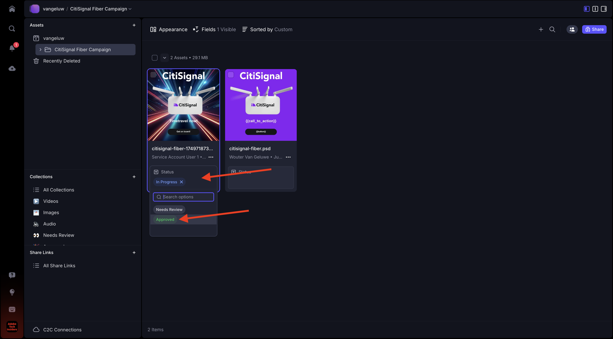

# 1.2.6 Frame I/O to Workfront Fusion to AEM Assets

>[!IMPORTANT]
>
>In order to complete this exercise, you need to have access to a working AEM Assets CS Author environment. If you follow exercise [Adobe Experience Manager Cloud Service & Edge Delivery Services](./../../../modules/asset-mgmt/module2.1/aemcs.md){target="_blank"} you wil have access to such an environment.

>[!IMPORTANT]
>
>If you have previously configured an AEM Assets CS Program with an Author environment, it may be that your AEM CS sandbox was hibernated. Given that dehibernating such a sandbox takes 10-15 minutes, it would be a good idea to start the dehibernation process now so that you don't get stuck at a later time.

In the previous exercise you configured a scenario that automatically generates variations of an Adobe Photoshop PSD file using Adobe Firefly, Photoshop APIs and Workfront Fusion. The output of that scenario was a new Photoshop PSD file. 

The business teams however don't need a PSD file, they need a PNG file or a JPG file. In this exercise, you'll configure a new automation that will result in a PNG file being generated once the asset in Frame I/O is approved, and that PNG file will be stored in AEM Assets automatically.

## 1.2.6.1 Create a new scenario

Go to [https://experience.adobe.com/](https://experience.adobe.com/). Open **Workfront Fusion**.

In the left menu, go to **Scenarios** and select your folder `--aepUserLdap--`. Click **Create a new scenario**.

Use the name `--aepUserLdap-- - Asset Approved PNG AEM Assets`. Next, click the **?** module, enter the search term `webhook` and then click **Webhooks**.

Click **Custom webhook**.

Click **Add** to create a new webhook.

Use the name `--aepUserLdap-- - Frame.io Webhook`. Click **Save**.

You should then see this. Click **Copy address to clipboard**.

## 1.2.6.2 Configure Webhook in Frame.io

Go to [https://developer.frame.io/](https://developer.frame.io/). Click **DEVELOPER TOOLS** and then choose **Custom Actions**.

Click **Create a Webhook**.

Enter the following values:

- **NAME**: use `--aepUserLdap-- - Asset Labels Updated`
- **URL**: enter the URL of the webhook that you just created in Workfront Fusion
- **TEAM**: select the appropriate Frame.io team, in this case, **One Adobe Tutorial**.

Scroll down and enable the checkbox next to **Asset Labels - updated**. Click **Submit**.

You should then see this.

Go to [https://app.frame.io/projects](https://app.frame.io/projects) and go to the folder that you created before, which should be named `--aepUserLdap--`. Double-click to open the asset that was created in the previous exercise.

You should then see something like this. Click the field **No Status** and change the status to **In Progress**.

Switch back to Workfront Fusion. You should now see that the connection was **Successfully determined**.

Click **Save** to save your changes, and then click **Run once** to do a quick test.

Switch back to Frame.io and click the field **In Progress** and change the status to **Needs review**.

Switch back to Workfront Fusion and click the bubble on the **Custom webhook** module. 

The detailed view of the bubble shows you the data that was received from Frame.io. You should see various ID's. As an example, the field **resource.id** shows the unique ID in Frame.io of the asset **citisignal-fiber.psd**.

## 1.2.6.3 Get Asset Details from Frame.io

Now that the communication between Frame.io and Workfront Fusion has been established over a custom webhook, you should get more details about the asset for which the status label was updated. To do this, you'll once again use the Frame.io connector in Workfront Fusion, similar to the previous exercise.

Click the **?** module and enter the search term `frame`. Click **Frame.io**.

Click **Frame.io (Legacy)**.

Click **Get an asset**.

Verify that the connection is set to the same connection that you created in the previous exercise, which should be named `--aepUserLdap-- - Frame.io Token`.

Next, you need to provide the **Asset ID**. The **Asset ID** is shared by Frame.io to Workfront Fusion as part of the initial **Custom webhook** communication and can be found under the field **resource.id**. Select **resource.id** and click **OK**.

Click **Save** to save your changes and then click **Run once** to test your configuration.

Switch back to Frame.io and click the field **Needs review** and change the status to **In Progress**.

Go back to Workfront Fusion and click the bubble on the **Frame.io - Get an asset** module. You should then see a similar overview.

In the asset details that were provided by Frame.io, you can find a field called **Label** that is set to **in_progress**. You'll have to use that field at a later stage to configure a filter.

## 1.2.6.4 Convert to PNG

Hover over the module **Frame.io - Get an asset** and click the **+** icon.

Enter the search term `photoshop` and then click **Adobe Photoshop**.

Click **Convert Image Format**.

Verify that the field **Connection** is using your previously created connection, which is named `--aepUserLdap-- - Adobe IO`.

Under **Input**, set the field **Storage** to **External** and set the **File Location** to use the variable **Original** that is returned by the module **Frame.io - Get an asset**.

Next, click **Add item** under **Outputs**.

For the **Outputs** configuration, set the field **Storage** to **Fusion internal storage** and the **Type** to **image/png**. Click **Save**.

Click **OK**.

Click **Save** to save your changes.

Next, you should set up a filter to ensure that only for assets that have a status that is **Approved**, a PNG file is rendered. To do that, click the **Wrench** icon between the modules **Frame.io - Get an asset** and **Adobe Photoshop - Convert image format** and then select **Set up a filter**.

Configure the following fields:

- **Label**: use `Is Asset Approved`.
- **Condition**: select the field **Label** from the response of the **Frame.io - Get an asset** module.
- **Basic Operators**: select **Equal to**.
- **Value**: `approved`.

Click **OK**.

Click **Save** to save your changes and then click **Run once** to test your configuration.

Switch back to Frame.io and click the field **In Progress** and change the status to **Approved**.

Go back to Workfront Fusion. You should now see that all modules in your scenario have been executed successfully. Click the bubble on the **Adobe Photoshop - Convert image format** module.

In the details of the execution of the **Adobe Photoshop - Convert image format** module, you can see that a PNG file was now generated. The next step is to then store that file in AEM Assets CS.

## 1.2.6.5 Store PNG in AEM Assets CS

Hover over the **Adobe Photoshop - Convert image format** module and click the **+** icon.

Enter the search term `aem` and select **AEM Assets**.

Click **Upload an asset**.

You now need to configure your connection to AEM Assets CS. Click **Add**.

Use the following settings:

- **Connection Type**: **AEM Assets as a Cloud Service**.
- **Connection Name**: `--aepUserLdap-- AEM Assets CS`.
- **Instance URL**: copy the instance URL of your AEM Assets CS Author environment, which should look like this: `https://author-pXXXXX-eXXXXXXX.adobeaemcloud.com`.
- **Access details fill options**: select **Provide JSON**.

You now need to provide the **Technical account credentials in JSON format**. To do this, there are a number of steps to follow using AEM Cloud Manager. While you do that, keep this screen open.

Go to [https://my.cloudmanager.adobe.com](https://my.cloudmanager.adobe.com){target="_blank"}. The org you should select is `--aepImsOrgName--`. You'll then see something like this. Click to open your program, which should be named `--aepUserLdap-- - Citi Signal`.

Click the 3 dots **...** and select **Developer Console**.

Click **Sign in with Adobe**.

You're then taken to the **Developer Console**. Click **Create new technical account**.

You should then see something like this. Copy the full JSON payload to your clipboard.

Go back to Workfront Fusion and paste the full JSON payload in the **Technical account credentials in JSON format** field. Click **Continue**.

Your connection will then be validated and when successful, your connection will be automatically selected in the AEM Assets module. The next thing to do is to configure a folder. As part of the exercise, you should create a new dedicated folder.

To create a new dedicated folder, go to [https://experience.adobe.com](https://experience.adobe.com/). Ensure that the right Experience Cloud instance is selected, which should be `--aepImsOrgName--`. Then, click **Experience Manager Assets**.

Click **Select** on your AEM Assets CS environment, which should be named `--aepUserLdap-- - Citi Signal dev`.

Go to **Assetss** and click **Create Folder**.

Enter the name `--aepUserLdap-- - Frame.io PNG` and click **Create**.

Your folder is then created.

Go back to Workfront Fusion, click **Click here to choose folder** and then choose the folder `--aepUserLdap-- - Frame.io PNG`.

Verify that the destination is set to `--aepUserLdap-- - Frame.io PNG`. Then, under **Source File**, select **Map**.

Under **File name**, choose the variable `{{3.filenames[]}}`.

Under **Data**, choose the variable `{{3.files[]}}`.

>[!NOTE]
>
>Variables in Workfront Fusion can be manually specified using this syntax: `{{3.filenames[]}}`. The number in the variable references the module in the scenario. In this example, you can see that the third module in the scenario is called **Adobe Photoshop - Convert image format** and has a sequence number of **3**. This means that the variable `{{3.filenames[]}}` will access the field **filenames[]** from the module with sequence number 3. Sequence numbers can sometimes be different so pay attention when copying/pasting such variables and always verify that the sequence number used is the correct one.

Click **OK**.

Click **Save** to save your changes.

Next, you need to set specific permissions for the Technical Account that you just created. When the account was created in **Developer Console** in **Cloud Manager**, it was given **Read** access rights but for this use case, **Write** access rights are required. You can do that by going to your AEM CS Author environment.

Go to [https://my.cloudmanager.adobe.com](https://my.cloudmanager.adobe.com){target="_blank"}. The org you should select is `--aepImsOrgName--`. Click to open your program, which should be named `--aepUserLdap-- - Citi Signal`. You'll then see something like this. Click the Author URL.

Click **Sign in with Adobe**.

Go to **Settings** > **Security** > **Users**.

Click to open the Technical Account user account.

Go to **Groups** and add this Technical Account user to the group **DAM-Users**.

Click **Save & Close**.

Go back to Workfront Fusion. Click **Run once** to test your scenario.

Switch back to Frame.io and make sure the status of your asset is changed to **Approved** again.

>[!NOTE]
>
>You may have to change it first back to **In Progress** or **Needs Review**, to then change it back to **Approved**.

Your Workfront Fusio scenario will then be activated and should complete successfully. By viewing the information in the bubble on the **AEM Assets** module, you can already see that the PNG file was successfully stored in AEM Assets CS.

Go back to AEM Assets CS and open the folder `--aepUserLdap-- - Frame.io PNG`. You should now see the PNG file that was generated as part of the Workfront Fusion scenario. Double-click the file to open it.

You can now see more details about the metadata of the PNG file that was generated.

You've now successfully completed this exercise.

## Next steps

Go to [Summary and Benefits of Creative Workflow Automation with Workfront Fusion](./summary.md){target="_blank"}

Go back to [Creative Workflow Automation with Workfront Fusion](./automation.md){target="_blank"}

Go back to [All Modules](./../../../overview.md){target="_blank"}
