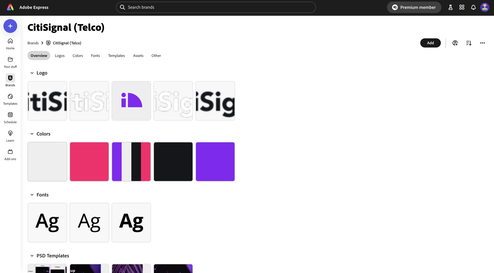
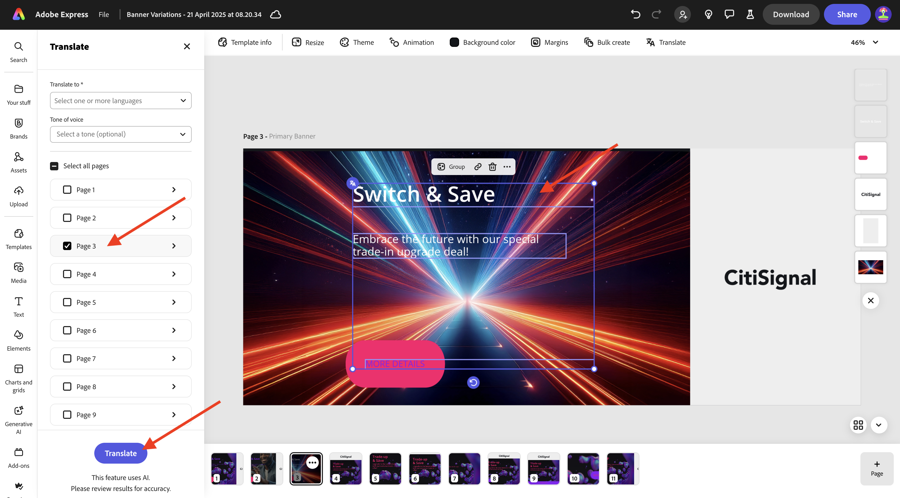
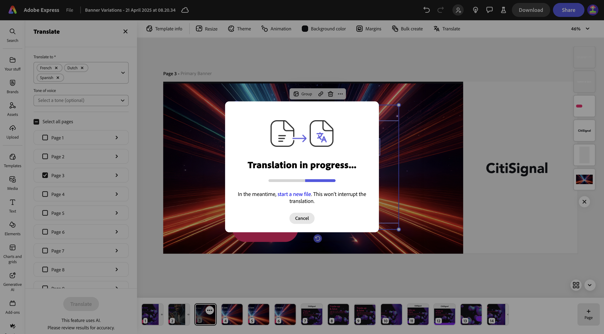

# 1.3.1 Getting started with Adobe Express

Open a new incognito browser window and go to [https://www.adobe.com/home](https://www.adobe.com/home){target="_blank"}. Log in using your **Company or School account** and then select the account **--aepImsOrgName--**. 

Adobe Express is available to you as part of your organization's licenses. To ensure you have access to Adobe Express, you need to check that you're logged in to the right organization. To do that, click the **profile** icon and verify which account is active. The account that you should be using is named `--aepImsOrgName--`.

Click **Switch profile** to change account.

Choose the right account from the menu, in this case **Experience Platform International** (but that may be a different org for you).

Once the right account is active, go to **Apps** and click **Get Started** on the **Adobe Express** card.

You're now logged in to **Adobe Express**.

## 1.3.1.1 Get started from a Brand template

In Adobe Express, go to **Brands**. Your brand template library is likely empty at the moment. CitiSignal has defined a brand template previously, and you should now reuse that existing template. 

To do that, go to [https://www.adobe.com/files/link/1c2f92cf-17bc-4d11-6031-dbd251e6cb57](https://www.adobe.com/files/link/1c2f92cf-17bc-4d11-6031-dbd251e6cb57).

You should then see this. Click the 3 dots **...**.

Select **Make a copy**.

After about a minute, you should see a message confirming that you've made a personal copy of the brand template.

Go back to Adobe Express, to **Brands**, and refresh the page. You should now see the **CitiSignal (Telco)** brand template. Click to open the **CitiSignal (Telco)** brand template.

You should then see a library of assets such as logos, fonts, colors, templates etc.

## Next Steps

Go to [Animation and Video in Adobe Express](./ex2.md){target="_blank"}

Go back to [Adobe Express and Adobe Experience Cloud](./express.md){target="_blank"}

Go back to [All Modules](./../../../overview.md){target="_blank"}
