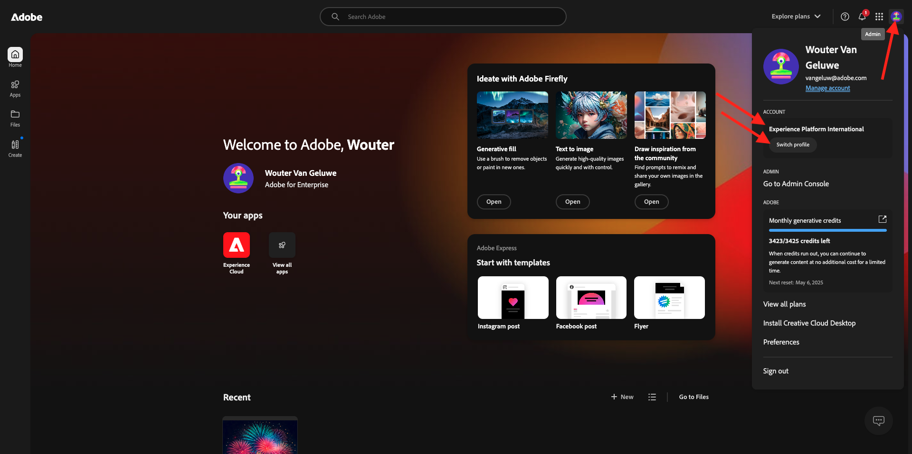
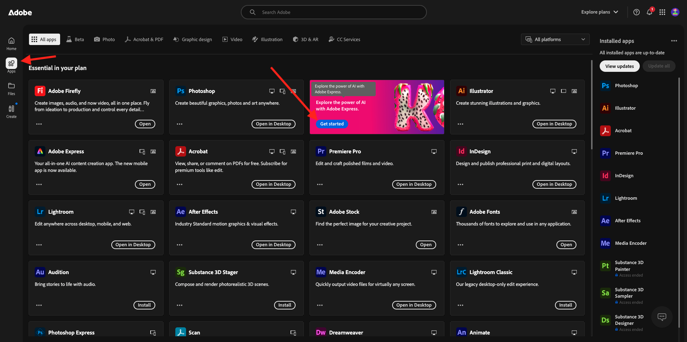
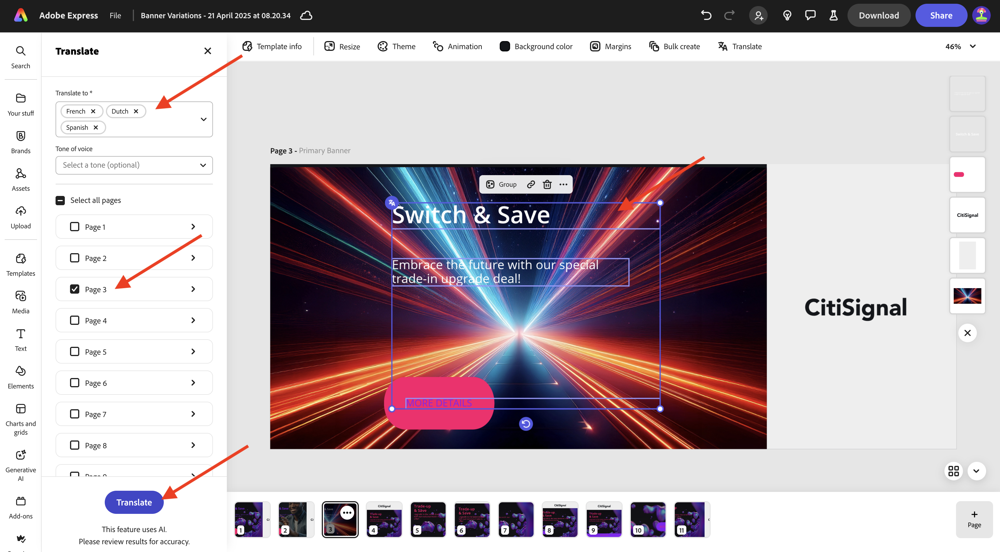

# 1.3.1 Getting started with Adobe Express

Open a new incognito browser window and go to [https://www.adobe.com/home](https://www.adobe.com/home){target="_blank"}. Log in using your **Company or School account** and then select the account **--aepImsOrgName--**. 

Adobe Express is available to you as part of your organization's licenses. To ensure you have access to Adobe Express, you need to check that you're logged in to the right organization. To do that, click the **profile** icon and verify which account is active. The account that you should be using is named `--aepImsOrgName--`.

Click **Switch profile** to change account.

Choose the right account from the menu, in this case **Experience Platform International** (but that may be a different org for you).

Once the right account is active, go to **Apps** and click **Get Started** on the **Adobe Express** card.

You're now logged in to **Adobe Express**.

## 1.3.1.1 Get started from a Brand template

In Adobe Express, go to **Brands**. Your brand template library is likely empty at the moment. CitiSignal has defined a brand template previously, and you should now reuse that existing template. 

To do that, go to [https://www.adobe.com/files/link/1c2f92cf-17bc-4d11-6031-dbd251e6cb57](https://www.adobe.com/files/link/1c2f92cf-17bc-4d11-6031-dbd251e6cb57).

You should then see this. Click the 3 dots **...**.

Select **Make a copy**.

After about a minute, you should see a message confirming that you've made a personal copy of the brand template.

Go back to Adobe Express, to **Brands**, and refresh the page. You should now see the **CitiSignal (Telco)** brand template. Click to open the **CitiSignal (Telco)** brand template.

You should then see a library of assets such as logos, fonts, colors, templates etc.

Go to **Express Templates** and click to open the template **Banner Variations**.

Click **Start a new file**.

You should then see this.

Click the textbox that says **Trade-up & Save**. Then, select **Rewrite** and choose a style, then click **Generate**.

Choose a variation and click **Replace**.

You should then see the updated text.

Next, click the text **MORE DETAILS**.

Select **Effects**.

Go to **Shape** and click **View all**.

Click the **finetune** button. Change the **Shape size** and then click the color button.

Change the color by picking another color from the **CitiSignal color theme**.

You should then see the changed button.

Next, go to **Brands** and then click **Apply Brand**. You should then see the appearance of the image change.

Note that you can also detail the **Apply Brand** settings by clicking the **gear** icon.

Next, click the 3 dots **...** on theimage you're working on and then click **Duplicate**.

You should then see an new, identical image. Click the background layer on the right side of your screen.

>[!IMPORTANT]
>
>In order to complete this exercise, you need to have access to a working AEM Assets CS Author environment. If you follow exercise [Adobe Experience Manager Cloud Service & Edge Delivery Services](./../../../modules/asset-mgmt/module2.1/aemcs.md){target="_blank"} you wil have access to such an environment.

Go to **Assets** in the left menu, select your AEM Assets CS repository which should be named `--aepUserLdap-- - CitiSignal dev`. Next, go to the folder **citisignal**.

Select the image **homepage-hero-1.png**. You should then see the background layer change.

Select the textbox as indicated and click **Rewrite**. Select **Rephrase** and then select a specific style. Click **Generate**.

Select a variant and click **Replace**.

You should then see this. Next, click the 3 dots **...** on the page at the bottom of the page and click **Duplicate**.

On the newly created image, go to **media** and click **Generate image**.

Select **Landscape (4:3)**.

Enetr the prompt `laser beams running through space` and click **Generate**.

You should then see an image generated by Adobe Firefly. Note that the layer in which the image was generated is all the way at the top.

Move down the newly generated image and put it just on top of the previous background layer.

Remove the old background layer by clicking it and selecting **Delete**.

Adjust the image so that it covers the whole canvas.

Select the textbox **Switch & Save** to change the font color to **white**.

Change the font color to **white**.

Select the other textbox to also change the font color to **white**.

Change the font color to **white**.

Next, click **Resize** and enter a custom resolution of **2600** x **1080**. Ensure that the checkbox for **Expand image** is checked. Click **Resize**.

You should then see this.

After a couple of minutes, you'll see some new variations of the image. Choose one and then click **Keep**.

You should then see this.

Move and adjust the image so that it fills the available space.

Next, click **Translate**.

Choose some languages such as **French**, **Dutch** and **Spanish**. Make sure that only the specific page you're working on is selected, which in this case is **Page 3**. Click **Translate**.

Translations will then be generated.

You should then see a number of new pages being created. Click the **close** icon.

Verify the translations and change them if needed, such as in this example where the translation isn't optimal.

Update the text as needed.

Your assets are now ready.

## Next Steps

Go to [Animation and Video in Adobe Express](./ex2.md){target="_blank"}

Go back to [Adobe Express and Adobe Experience Cloud](./express.md){target="_blank"}

Go back to [All Modules](./../../../overview.md){target="_blank"}
