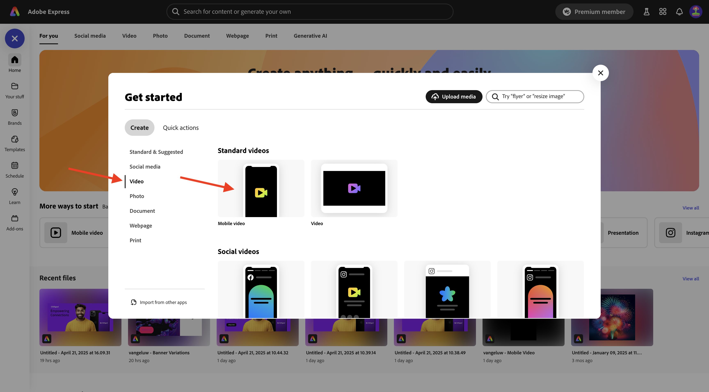
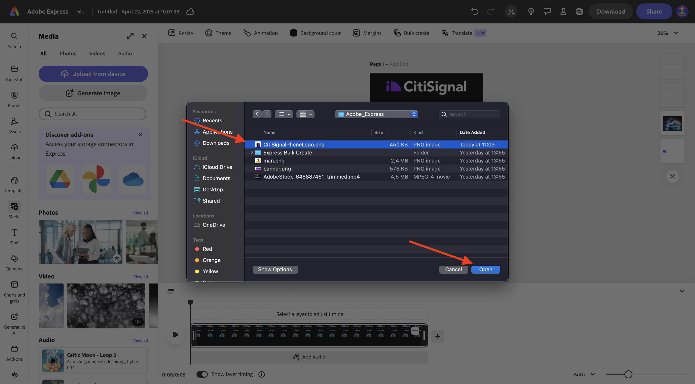
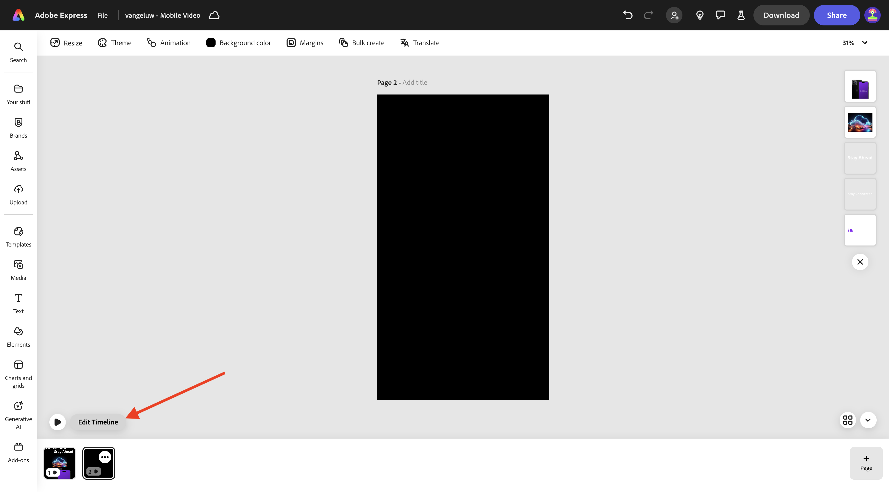

# 1.3.2 Animation and Video in Adobe Express

Before you start this exercise, download the required assets from [https://tech-insiders.s3.us-west-2.amazonaws.com/one-adobe/Adobe_Express.zip](https://tech-insiders.s3.us-west-2.amazonaws.com/one-adobe/Adobe_Express.zip){target="_blank"} and unzip them on your desktop.

Go to [https://new.express.adobe.com/](https://new.express.adobe.com/){target="_blank"}. Click the **+** icon to create a new **image**.

Go to **Video** and then select **Mobile Video**.

You should then see this.

Select **Background color** and then choose **black**.

Next, you should add the **CitiSignal** logo. Go to **Brands** and select the white CitiSignal logo. Click the 3 dots **...** and select **Place**.

Center the CitiSignal logo at the top of the image.

Go to **Text** and then select **Add your text**.

Enter the text `Stay Connected` and place the textbox in a similar location as shown in the below image.

Go to **Text** and then select **Add your text**. Enter the text `Stay Ahead`.

Place the textbox in a similar location as shown in the below image. 

Select the first textbox with the text **Stay Connected**. Go to **Brands**, to **Fonts**. Click the 3 dots **...** on the 1st font and click **Apply**.

Select the second textbox with the text **Stay Ahead**. Go to **Brands**, to **Fonts**. Click the 3 dots **...** on the 3rd font and click **Apply**.

You should then see this. Go to **Media** and select **Generate image**.

Enter the prompt `futuristic looking transparent cloud on a black background` and click **Generate**.

Select **Landscape (4:3)**.

You should then see this. Choose one of the variations.

Center the generated image. Go to **Media** and then click **Upload from device**.

Navigate to your desktop, to the folder **Adobe_Express** which contains the assets you previously downloaded. Select the file **CitiSignalPhoneLogo.png** and click **Open**.

You should then see this.

Drag the image down so that it looks similar to the below image.

Change the name of your project to `--aepUserLdap-- - Mobile Video`.

Go to **Animation** and then click the **Glide** animation.

Click the **play** icon to test your animation.

Select the textbox **Stay Ahead**.

Adjust the timeline slider for the textbox **Stay Ahead** so that it starts halfway.

Select the **CitiSignal** logo.

Open the 

Navigate to your desktop, to the folder **Adobe_Express** which contains the assets you previously downloaded. Select the file **`AdobeStock_648887461_trimmed.mp4`** and click **Open**.

## Next Steps

Go to [Bulk Create Assets in Adobe Express](./ex3.md){target="_blank"}

Go back to [Adobe Express and Adobe Experience Cloud](./express.md){target="_blank"}

Go back to [All Modules](./../../../overview.md){target="_blank"}
