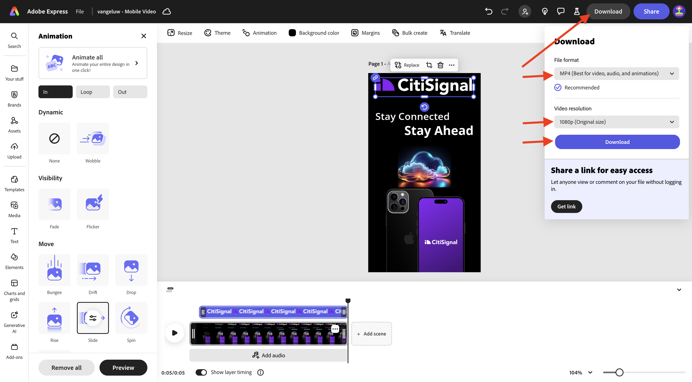
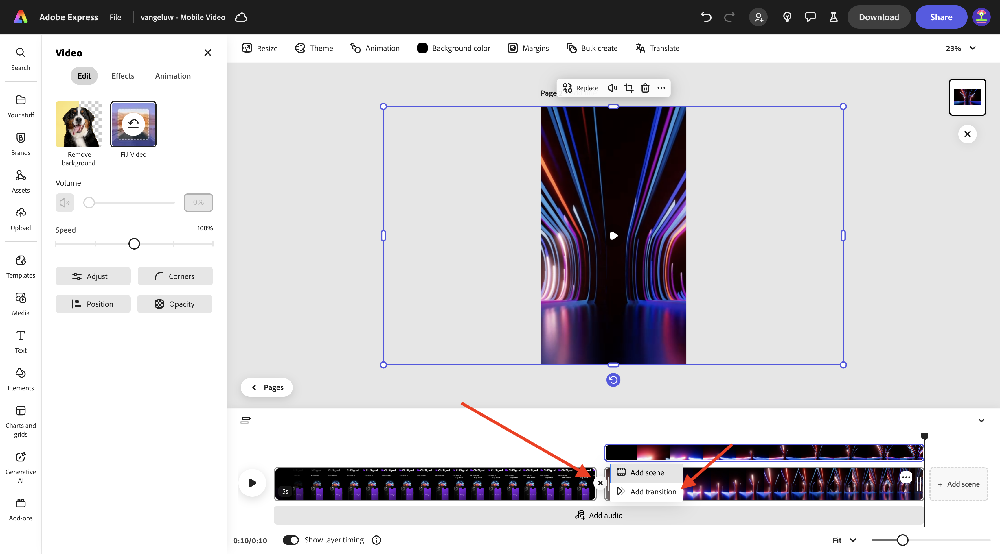
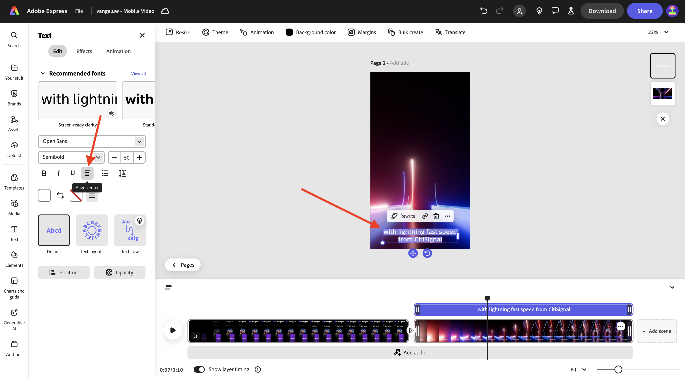

# 1.3.2 Animation and Video in Adobe Express

Learn how to use .

https://new.express.adobe.com/brands

## Next Steps

Go to [Animation and Video in Adobe Express](./ex2.md){target="_blank"}

Go back to [Adobe Express and Adobe Experience Cloud](./express.md){target="_blank"}

Go back to [All Modules](./../../../overview.md){target="_blank"}
