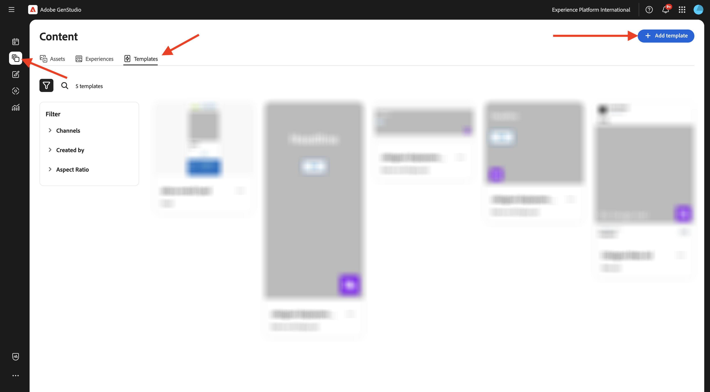
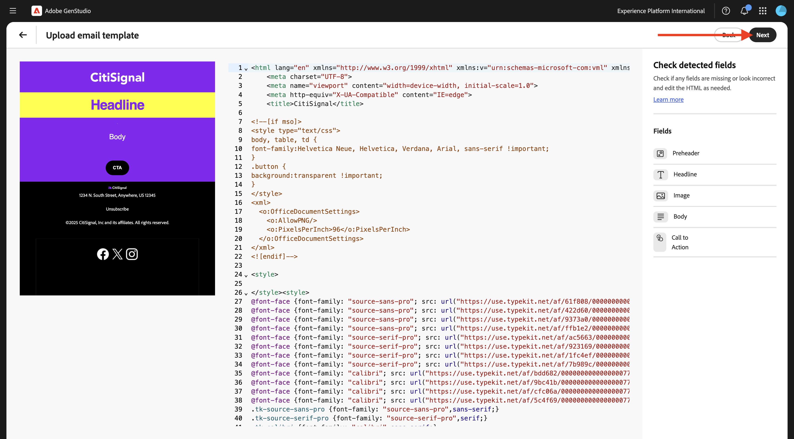

# 1.3.2 Configuration: Personas, Products and Templates

In this exercise, you'll configure personas, products and templates in GenStudio for Performance Marketing.

## 1.3.2.1 Products

Products in GenStudio for Performance Marketing leverage a deep understanding of product specifications, advantages, and differentiating factors to generate impactful content.

Products encompass all elements of a specific product, such as imagery, descriptions, and value propositions, to create a cohesive brand representation. Leveraging Adobe’s advanced AI technology, GenStudio for Performance Marketing guidelines—Brands, Products, and Personas—work together to generate compelling content that showcases the strengths of your products and ensures consistency across all messaging.

To start creating your own products, click the 3 dots **...** and then select **Products**.


Click **+ Add Product**.


Select **Add manually** and click **Continue**.


You should then see this.


For the product name, us `--aepUserLdap-- - CitiSignal Mobile Flex Plan`.

For the field **Description**, use this:

```
CitiSignal Mobile Flex is a next-gen 5G mobile plan that adapts to your lifestyle. Choose from Unlimited, Family Share, or Data Saver tiers, with optional add-ons like international roaming, hotspot tethering, and SmartFamily™ parental controls. All plans include priority access to CitiSignal’s 5G UltraWide network and seamless integration with CitiSignal Fiber for unified billing, shared data pools, and SmartSwitch™ connectivity. 
```

For the field **Value proposition**, use this:

```
A mobile plan that flexes with your life—fast, fair, and fully connected to your world.
```

For the field **Messaging preferences**, use this:

```
Remote Professionals: “Work from anywhere with a mobile plan that’s as flexible as your schedule.”
Online Gamers: “Unlimited 5G. No throttling. Just pure performance—on the go.”
Smart Home Families: “One plan. One bill. One less thing to worry about.”
```

Your product configuration should now look like this. Click the **back** icon.


Click **+ Add Product**.


Select **Add manually** and click **Continue**.


You should then see this.


For the product name, us `--aepUserLdap-- - CitiSignal Fiber Max`.

For the field **Description**, use this:

```
CitiSignal Fiber Max is our premium residential internet plan, engineered for households that demand uncompromising speed, stability, and coverage. With symmetrical speeds up to 2 Gbps, it’s ideal for remote professionals juggling Zoom calls and cloud apps, gamers chasing millisecond precision, and families running dozens of smart devices. The plan includes a Wi-Fi 6E router, optional mesh extenders for whole-home coverage, and proactive network monitoring. 
```

For the field **Value proposition**, use this:

```
Power your work, play, and home with the fastest, most reliable fiber internet—built for the way you live today and tomorrow.
```

For the field **Messaging preferences**, use this:

```
Remote Professionals: “Stay connected, stay productive—no matter how many meetings or megabytes your day demands.”
Online Gamers: “Zero lag. Zero mercy. Dominate with 2 Gbps fiber and ultra-low ping.”
Smart Home Families: “Every room. Every device. Always on. Welcome to whole-home harmony.”
```

Your product configuration should now look like this. Click the **back** icon.


You should then see the 2 products that you configured.


## 1.3.2.2 Personas

Personas provide an authentic portrayal of your customer segments, encompassing their information, interests, pain points, preferences, and behavioral traits.

GenStudio for Performance Marketing leverages the power of guidelines—Brands, Products, and Personas—and Adobe’s generative AI technology to curate personalized marketing content for your target customers.​

To start creating your personas, click the 3 dots **...** and then select **Personas**.


Click **+ Add Persona**.


Select **Add manually** and click **Continue**.


You should then see this.


For the persona name, us `--aepUserLdap-- - Smart Home Families`.

For the field **Description**, use this:

```
These are tech-forward households with multiple connected devices—smart TVs, thermostats, security systems, voice assistants, and more. They value convenience, automation, and seamless connectivity across the home. They often have children and are concerned about online safety, parental controls, and whole-home coverage.
```

For the field **Messaging preferences**, use this:

```
Friendly, family-oriented tone
Visuals showing whole-home coverage and device compatibility
Messaging that highlights security, parental controls, and easy setup
Bundled offers (e.g., mesh Wi-Fi, smart home consultations)
How-to content or setup guides for non-tech-savvy users
```

Your persona configuration should now look like this. Click the **back** icon.


Click **+ Add Persona**.


Select **Add manually** and click **Continue**.


You should then see this.


For the persona name, us `--aepUserLdap-- - Online Gamers`.

For the field **Description**, use this:

```
This persona includes competitive and casual gamers who demand ultra-fast, low-latency internet. They often stream gameplay, participate in multiplayer matches, and use voice chat platforms. They are highly sensitive to lag, jitter, and packet loss, and they’re vocal about their experiences online. Many are early adopters of new tech and value performance above all else.
```

For the field **Messaging preferences**, use this:

```
Bold, energetic tone with gaming lingo
Metrics like ping time, jitter, and upload/download speeds
Visuals showing latency improvements or side-by-side comparisons
Endorsements from gaming influencers or esports teams
Promotions tied to gaming platforms or bundles (e.g., free months of Xbox Game Pass)
```

Your persona configuration should now look like this. Click the **back** icon.


Click **+ Add Persona**.


Select **Add manually** and click **Continue**.


You should then see this.


For the persona name, us `--aepUserLdap-- - Remote Professionals`.

For the field **Description**, use this:

```
These are knowledge workers, freelancers, consultants, and hybrid employees who rely on a stable, high-speed internet connection to maintain productivity from home. Their workdays are filled with video calls, cloud-based collaboration, and large file transfers. They often use multiple devices simultaneously and expect seamless performance across all of them. Many are tech-savvy and value proactive customer support and service transparency.
```

For the field **Messaging preferences**, use this:

```
Clear, professional tone with a focus on productivity and reliability
Testimonials or case studies from similar professionals
Visuals like speed comparison charts and uptime guarantees
Emphasis on 24/7 support and service-level agreements
Messaging that highlights “work-from-anywhere” flexibility
```

Your persona configuration should now look like this. Click the **back** icon.


You should then see the 3 personas that you configured.


## 1.3.2.3 Templates

GenStudio for Performance Marketing enables content creators to produce consistent on-brand marketing content quickly using templates. A template significantly reduces the time and effort required to generate new content by providing a starting point that includes pre-configured layouts and design elements.

While GenStudio for Performance Marketing does not support the direct creation of templates within the application, you can easily design and prepare templates using popular design tools, such as Adobe InDesign, Illustrator, or Express. Once your design is complete, you can adapt it for use in GenStudio for Performance Marketing. In this exercise, you'll import a number of predefined templates into GenStudio for Performance Marketing.

In the previous exercise, you downloaded the file [CitiSignal-GSPeM-assets.zip](../../../assets/gspem/CitiSignal-GSPeM-assets.zip) to your desktop and unzipped it. That folder contains 4 sample templates that you now need to import in GenStudio.


### Meta template

Go to **Content** > **Templates**. Click **+ Add template**.



Select **Meta ads** and then click **Browse**.


In the folder that contains the downloaded **CitiSignal-GSPeM-assets** files, navigate to the folder **templates**. Select the file **citisignal-meta-ad.html** and click **Open**.


You should then see this. Click **Next**.


Click **Next**.


Use this for the field **Template name**: 
`--aepUserLdap---citisignal-meta-ad` and set the aspect ratio to **1:1**. Click **Publish template**.


Your template has now been saved and is available in the template library.


### Display Banner Ad templates

Click **+ Add template**.


Select **Banner and display ads** and then click **Browse**.


In the folder that contains the downloaded **CitiSignal-GSPeM-assets** files, navigate to the folder **templates**. Select the file **citisignal-displaytemplate-300x250.html** and click **Open**.


You should then see this. Click **Next**.


Click **Next**.


Use this for the field **Template name**: 
`--aepUserLdap---citisignal-displaytemplate-300x250` and set the **Ad width** and **Ad height** to **300x250**. Click **Publish template**.


Your template has now been saved and is available in the template library.


Click **+ Add template**.


Select **Banner and display ads** and then click **Browse**.


In the folder that contains the downloaded **CitiSignal-GSPeM-assets** files, navigate to the folder **templates**. Select the file **citisignal-displaytemplate-300x600.html** and click **Open**.


You should then see this. Click **Next**.


Click **Next**.


Use this for the field **Template name**: 
`--aepUserLdap---citisignal-displaytemplate-300x600` and set the **Ad width** and **Ad height** to **300x600**. Click **Publish template**.


Your template has now been saved and is available in the template library.


Click **+ Add template**.


Select **Banner and display ads** and then click **Browse**.


In the folder that contains the downloaded **CitiSignal-GSPeM-assets** files, navigate to the folder **templates**. Select the file **citisignal-displaytemplate-970x250.html** and click **Open**.


You should then see this. Click **Next**.


Click **Next**.


Use this for the field **Template name**: 
`--aepUserLdap---citisignal-displaytemplate-970x250` and set the **Ad width** and **Ad height** to **970x250**. Click **Publish template**.


Your template has now been saved and is available in the template library.


### Email template

Click **+ Add template**.


Select **Email** and then click **Browse**.


In the folder that contains the downloaded **CitiSignal-GSPeM-assets** files, navigate to the folder **templates**. Select the file **citisignal-email-template.html** and click **Open**.


You should then see this. Click **Next**.


Click **Next**.



Use this for the field **Template name**: 
`--aepUserLdap---citisignal-email-template`. 

Click **Publish template**.


Your template has now been saved and is available in the template library.


You've now configured the templates that you need for the next exercise.

## Next Steps

Go to [Campaign Activation to Meta](./ex3.md){target="_blank"}

Go back to [GenStudio for Performance Marketing](./genstudio.md){target="_blank"}

Go back to [All Modules](./../../../overview.md){target="_blank"}
