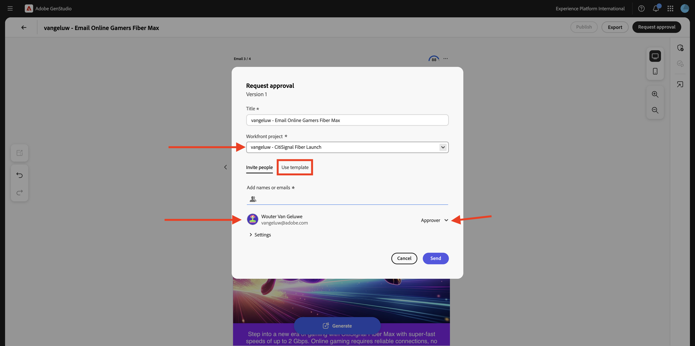
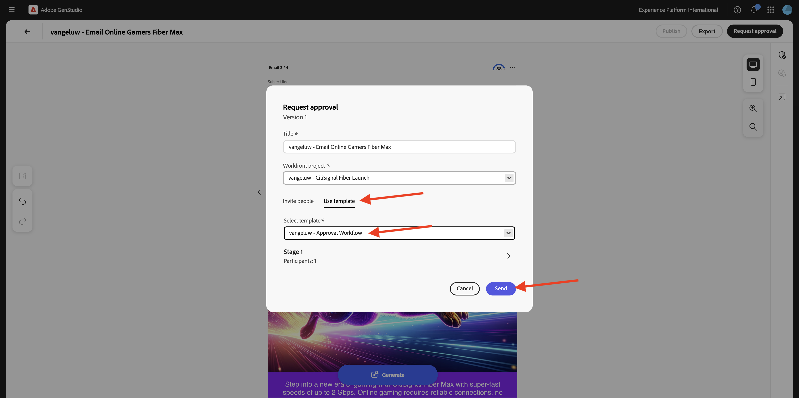

# 1.3.4 Create Email Experience for AJO

>[!IMPORTANT]
>
>In order to complete this exercise, you need to have access to an Adobe Journey Optimizer environment that is provisioned for the integration with GenStudio for Performance Marketing, which is currently in beta.

>[!IMPORTANT]
>
>In order to execute all steps in this exercise, you need to have access to an existing Adobe Workfront environment, and in that environment you need to have created a project and an approval workflow. If you follow exercise [Workflow Management with Adobe Workfront](./../../../modules/asset-mgmt/module2.2/workfront.md){target="_blank"} you wil have the required setup available.

## 1.3.4.1 Create & Approve Email Experience

In the left menu, go to **Create**. Select **Email**. 


Select the **Email** template that you imported before, which is named `--aepUserLdap---citisignal-email-template`. Click **Use**.


You should then see this. Change the name of your ad to `--aepUserLdap-- - Email Online Gamers Fiber Max`.


Under **Paramaters**, select the following options:

- **Brand**: `--aepUserLdap-- - CitiSignal`
- **Language**: `English (US)`
- **Persona**: `--aepUserLdap-- - Smart Home Families`
- **Product**: `--aepUserLdap-- - CitiSignal Fiber Max`

Click **Select from Content**.


Select the asset `--aepUserLdap-- - neon rabbit.png`. Click **Use**.


Enter the prompt `convince online gamers to start playing online multiplayer games using CitiSignal internet` and click **Generate**.


You should then see something like this, with 4 email variations being generated. The defautl view shows the **mobile** view, you can switch to the desktop view by clicking the **computer** icon.


For every email, a compliancy score is automatically calculated. Click the score to see more details.


Click **View and fix issues**.


You can then see more detail as to what you can do to optimize the complicancy score.


Next, click **Request approval**, which will connect to Adobe Workfront.


Select your Adobe Workfront project, which should be named `--aepUserLdap-- - CitiSignal Fiber Launch`. Enter your own email address under **Invite people** and ensure your role is set to **Approver**.



Alternatively, you can also use an existing approval workflow in Adobe Workfront. To do that, click **Use template** and select the template `--aepuserLdap-- - Approval Workflow`. Click **Send**.



Click **View comments in Workfront**, you'll now be sent to the Adobe Workfront Proof UI.


In the Adobe Workfront Proof UI, click **Make decision**.


Select **Approved** and click **Make decision**.


Click **Publish**.


Select your Campaign `--aepUserLdap-- - CitiSignal Fiber Launch Campaign` and click **Publish**.


Click **Open in Content**.


The 4 email experiences are now available under **Content** > **Experiences**.


## 1.3.4.2 Create a Campaign in AJO

Login to Adobe Journey Optimizer by going to [Adobe Experience Cloud](https://experience.adobe.com). Click **Journey Optimizer**.


You'll be redirected to the **Home**  view in Journey Optimizer. First, make sure you're using the correct sandbox. The sandbox to use is called `--aepSandboxName--`. You'll then be in the **Home** view of your sandbox `--aepSandboxName--`.


You'll now create a campaign. Unlike the event-based journey of the previous exercise which relies on incoming experience events or audience entries or exits to trigger a journey for 1 specific customer, campaigns target a whole audience once with unique content like newsletters, one-off promotions, or generic information or periodically with similar content sent on a regular basis like for instance birthday campaigns and reminders. 

In the menu, go to **Campaigns** and click **Create campaign**.


Select **Scheduled - Marketing** and click **Create**.


On the campaign creation screen, configure the following:

- **Name**: `--aepUserLdap--  - Online Gamers CitiSignal Fiber Max`.
- **Description**: Fiber campaign for Online Gamers

Click **Actions**.


Click **+ Add Action** and then select **Email**.


Then, select an existing **Email configuration** and then click **Edit content**.


You'll then see this. For the **Subject line**, use this: 

```
{{profile.person.name.firstName}}, say goodbye to delays!
```

Next, click **Edit content**.


Click **Import HTML**.


Next, click the button for **Adobe GenStudio for Performance Marketing**.


You should then see a popup window which shows all of the email experiences that were published in GenStudio for Performance Marketing. Select one of the available email experiences and click **Use**.


Select your own AEM Assets CS repository, which should be named `--aepUserLdap-- - CitiSignal dev`, and click **Import**.


You should then see this. Select the missing image button and click **Select an asset**.


Go to the folder that looks like this one, starting with **GenStudio.zip.....** and select the image `--aepUserLdap-- - neon rabbit.png`. CLick **Select**


You should then see this.


Scroll down to the footer, select the word **Unsubscribe** and click the **link** icon.


Set the **Type** to **External Opt-out/Unsubscription** and set the url to `https://techinsiders.org/unsubscribe.html` (it's not allowed to have a blank URL for the unsubscribe link).

Click **Save** and then click the **arrow** in the top lmeft corner of your screen to go back to the campaign configuration.


Go to **Audience**.


Click **Select audience**.


Select the audience of the subscription list for Online Gamers, which should be named `--aepUserLdap--_SL_Interest_Online_Gaming`. Click **Save**.


Click **Review to activate**.


If your campaign configuration has no issues, you'll be able to click **Activate**.


Your campaign will then be activated, which takes a couple of minutes.


After a couple of minutes, the campaign is live and the email will be sent to the subscription list that you selected.


You've now completed this exercise.

## Next Steps

Go to [Summary & benefits](./summary.md){target="_blank"}

Go back to [GenStudio for Performance Marketing](./genstudio.md){target="_blank"}

Go back to [All Modules](./../../../overview.md){target="_blank"}
