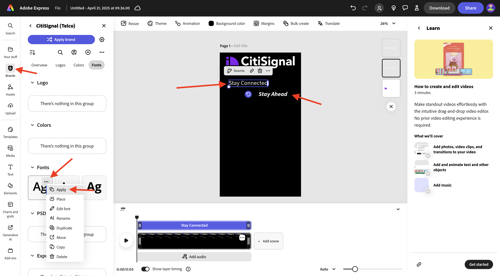
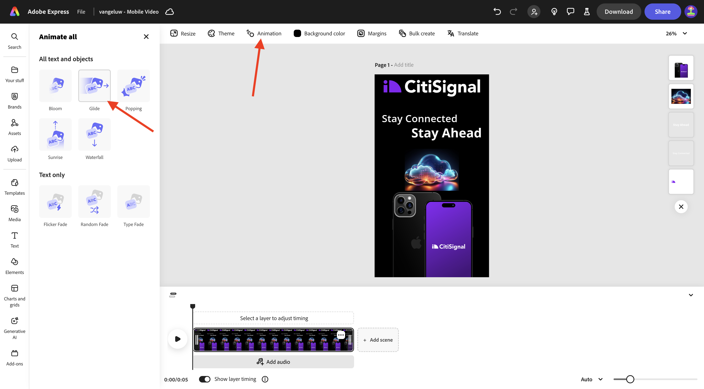
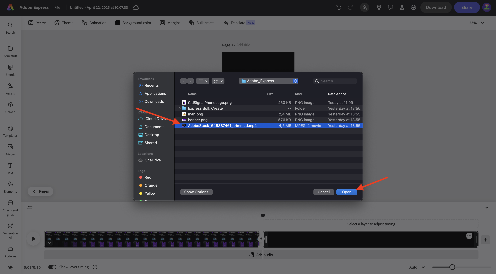
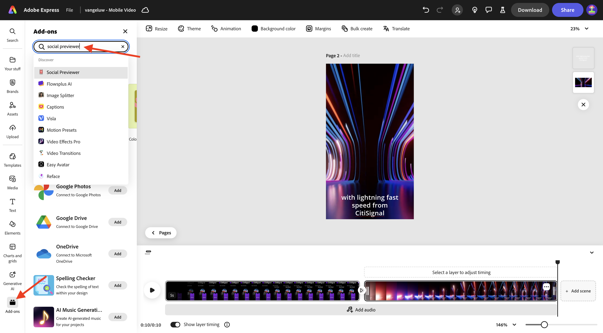
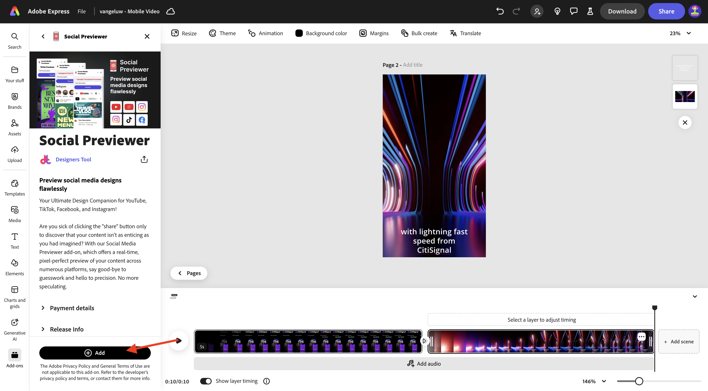
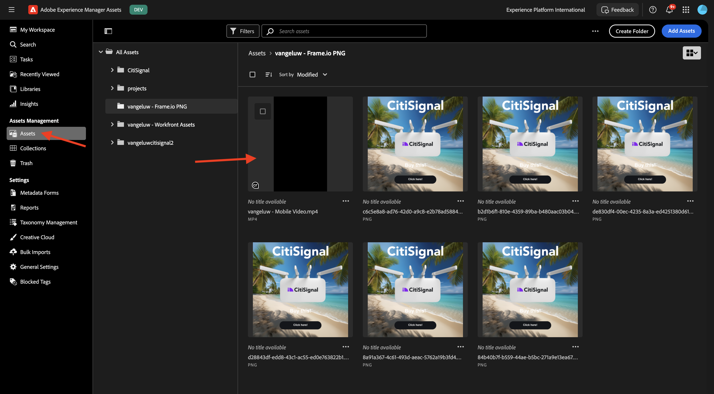

# 1.4.2 Animation and Video in Adobe Express

Before you start this exercise, download the required assets from [https://one-adobe-tech-insiders.s3.us-west-2.amazonaws.com/one-adobe/Adobe_Express.zip](https://one-adobe-tech-insiders.s3.us-west-2.amazonaws.com/one-adobe/Adobe_Express.zip){target="_blank"} and unzip them on your desktop.

## 1.4.2.1 Create a video

Go to [https://new.express.adobe.com/](https://new.express.adobe.com/){target="_blank"}. Click the **+** icon to create a new **image**.

Go to **Video** and then select **Mobile Video**.

You should then see this.

Select **Background color** and then choose **black**.

Next, you should add the **CitiSignal** logo. Go to **Brands** and select the white CitiSignal logo. Click the 3 dots **...** and select **Place**.

Center the CitiSignal logo at the top of the image.

Go to **Text** and then select **Add your text**.

Enter the text `Stay Connected` and place the textbox in a similar location as shown in the below image.

Go to **Text** and then select **Add your text**. Enter the text `Stay Ahead`.

Place the textbox in a similar location as shown in the below image. 

Select the first textbox with the text **Stay Connected**. Go to **Brands**, to **Fonts**. Click the 3 dots **...** on the 1st font and click **Apply**.

Select the second textbox with the text **Stay Ahead**. Go to **Brands**, to **Fonts**. Click the 3 dots **...** on the 3rd font and click **Apply**.

You should then see this. Go to **Media** and select **Generate image**.

Enter the prompt `futuristic looking transparent cloud on a black background` and click **Generate**.

Select **Landscape (4:3)**.

You should then see this. Choose one of the variations.

Center the generated image. Go to **Media** and then click **Upload from device**.

Navigate to your desktop, to the folder **Adobe_Express** which contains the assets you previously downloaded. Select the file **CitiSignalPhoneLogo.png** and click **Open**.

You should then see this.

Drag the image down so that it looks similar to the below image.

Change the name of your project to `--aepUserLdap-- - Mobile Video`.

Go to **Animation** and then click the **Glide** animation.

Click the **play** icon to test your animation.

Select the textbox **Stay Ahead**.

Adjust the timeline slider for the textbox **Stay Ahead** so that it starts halfway.

Select the **CitiSignal** logo.

Open the detail settings on the **Slide** action and change the duration to 2.5s.

Next, click **Download**. Select the **File format** **MP4** and set **Video resolution** to **1080p**. Click **Download**. 

Your video file will then be generated and will then be downloaded to your computer. Your first video is now ready.

## 1.4.2.2 Add to your video

Close the **Timeline** view.

Click the 3 dots **...** and select **Duplicate**.

A new page will then be generated. Click **Edit Timeline** to start working with the new page.

Click **+ Add scene**.

You should then see a new scene being added.

Navigate to your desktop, to the folder **Adobe_Express** which contains the assets you previously downloaded. Select the file **`AdobeStock_648887461_trimmed.mp4`** and click **Open**.

Your video file will then be added into the new scene.

Click in the middle between the 2 scenes and then select **Add transition**.

Click **Dip to black**.

Change the **Duration** to 2 seconds. Feel free to click the **play** button to test your transition.

Go to **Text** and then click **Add your text**.

Enter the text `with lightning fast speed from CitiSignal`. Center the text by clicking **Align center**.

Change the font size to **60**.

## 1.4.2.3 Use add-ons in Adobe Express

Go to **Add-ons** and search for the add-on **Social Previewer**.

Click **+ Add** to add the add-on.

Select the add-on **Social Previewer** and click the **Instagram Post** preview option. You can now easily preview how your post will look on the most common social media platforms.

## 1.4.2.4 Make a new template in Adobe Express

Next, click the **Share** button and then select **Make a template**.

Use the name `--aepUserLdap-- - Mobile Video`, select the brand **CitiSignal (Telco)** and then click **Save template**.

Your video template is now saved in your Brand template.

## 1.4.2.5 Save your video in AEM Assets CS

Click **Share** again and then select **Save to cloud**. Select **AEM Assets**.

Select the **Current page**. Use the name `--aepUserLdap-- - Mobile Video` and then click **Select folder**.

Select the folder **`--aepUserLdap-- - Frame.io PNG`** and click **Select**.

Click **Upload 1 asset**.

Go to [https://experience.adobe.com/](https://experience.adobe.com/){target="_blank"} and click **Experience Manager Assets**.

Select your AEM Assets CS environment, which should be named `--aepUserLdap-- - Citi Signal dev`.

In **Assets**, navigate to the folder **`--aepUserLdap-- - Frame.io PNG`**. Double-click on the asset **`--aepUserLdap-- - Mobile Video`** to open it.

Your video that was created in Adobe Express, is now available in Adobe Experience Manager Assets.

## Next Steps

Go to [Bulk Create Assets in Adobe Express](./ex3.md){target="_blank"}

Go back to [Adobe Express and Adobe Experience Cloud](./express.md){target="_blank"}

Go back to [All Modules](./../../../overview.md){target="_blank"}
