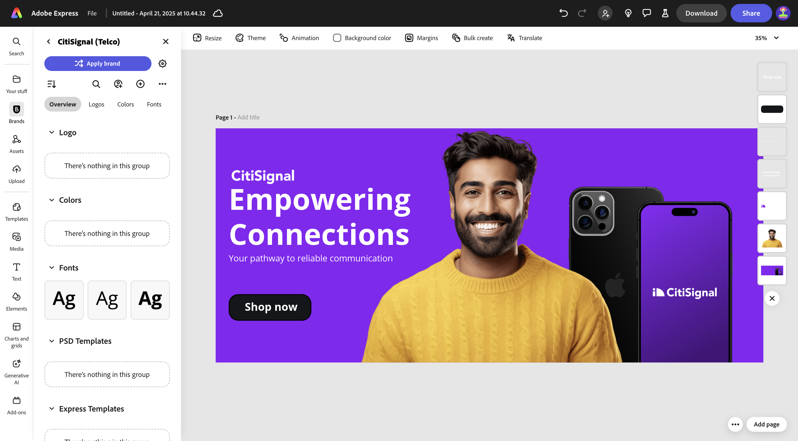

# 1.4.3 Bulk Create Assets in Adobe Express

Before you start this exercise, download the required assets from [https://one-adobe-tech-insiders.s3.us-west-2.amazonaws.com/one-adobe/Adobe_Express.zip](https://one-adobe-tech-insiders.s3.us-west-2.amazonaws.com/one-adobe/Adobe_Express.zip){target="_blank"} and unzip them on your desktop.

## 1.4.3.1 Create your basic asset

Go to [https://new.express.adobe.com/](https://new.express.adobe.com/){target="_blank"}. Click the **+** icon to create a new **image**.

Select **Photo** and then choose **Upload media**.

Navigate to your desktop, to the folder **Adobe_Express** which contains the assets you previously downloaded. Select the file **banner.png** and click **Open**.

You should then see this. Select **Edit image**.

Next, go to **Media** and select **Upload image**. Navigate to your desktop, to the folder **Adobe_Express** which contains the assets you previously downloaded. Select the file **man.png** and click **Open**.

You should then see this.

Next, you should add the **CitiSignal** logo. Go to **Brands** and select the white CitiSignal logo. Click the 3 dots **...** and select **Place**.

Adjust the location of the CitiSignal logo image to reflect the same position in the below image.

Go to **Text** and click **Add your text**.

In the new textbox, add the text `Empowering Connections`. Drag the textbox to a similar location as shown in the below image. Next, go to **Brands**, to **Fonts**. Click the 3 dots **...** on the 3rd font and click **Apply**.

Next, change the font color to **white**.

Go to **Text** again and click **Add your text**.

In the new textbox, enter the text `Your pathway to reliable communication`. Adjust the location of the textbox to be under the previous textbox, similar to the image the below. 

Go to **Brands**, to **Fonts**, and click the 3 dots **...** on the second font. Then, click **Apply**.

You should then have this. Next, go to **Elements**, to **Shapes** and click the rounded rectangle shape.

You'll then have a new rounded rectangle shape on your image. Adjust the size and the location so that it looks like a button. Then, change the color of the rounded rectangle to **black**.

Go to **Text** again and click **Add your text**.

Enter the text `Shop now` in the new textbox and change the location of the textbox to be centered on the button. Go to **Brands**, to **Fonts**, and click the 3 dots **...** on the third font. Then, click **Apply**.

You should then see this.

## 1.4.3.2 Bulk create in Adobe Express

Next, click **Bulk create**.

You should then see this. Click **browse**.

Navigate to your desktop, to the folder **Express Bulk Create** in the folder **Adobe_Express** which contains the assets you previously downloaded. Select the file **CTA-options.csv** and click **Open**.

You should then see this. Click **Next**.

Click **Connect Element**.

Select the textbox that contains the text **Your pathway to reliable communicaiton**. Then click the **Element 1** button and link it to a field from the CSV file, in this case, the field **Subhead**.

Next, select the textbox that contains the text **Shop now**. 

Then click the **Element 1** button and link it to a field from the CSV file, in this case, the field **CTA**.

You should then see this. Next, click the image of the person.

Click the button **Element 1**.

You'll then see this popup. Click **browse**.

Navigate to your desktop, to the folder **Express Bulk Create** in the folder **Adobe_Express** which contains the assets you previously downloaded. Select 6-7 image files and click **Open**.

You'll then see this. Drag and drop a different image to each variation of the asset. Click **Done**

You'll then see the variations of the image being generated. Click **Create page(s)**.

Your variations are now ready, and you can inspect each one individually to review and validate.

You've now completed this exercise.

## Next Steps

Go to [Summary & benefits](./summary.md){target="_blank"}

Go back to [Adobe Express and Adobe Experience Cloud](./express.md){target="_blank"}

Go back to [All Modules](./../../../overview.md){target="_blank"}