# 1.5.2 Approvals with Frame.io

>[!NOTE]
>
> The below screenshot shows a specific environment being used. When you are going through this tutorial, it is very likely that your environment has a different name. When you signed up for this tutorial, you were provided with the environment details to use, please follow those instructions.

In order to walk through the approvals workflow in Frame.io, you need to have an asset. In this exercise, you'll start of by creatng that asset yourself using Adobe Firefly and Adobe Express. Once you have the asset, you'll upload it in Frame.io and then approve it eventually.

## 1.5.2.1 Create Asset with Adobe Firefly Services and Adobe Express

Go to [https://firefly.adobe.com/](https://firefly.adobe.com/){target="_blank"}. Enter the prompt `a neon rabbit running very fast through space` and click **Generate**.

You will then see several images being generated. Choose the image you like the most, click the **Share** icon on the image and then select **Open in Adobe Express**.

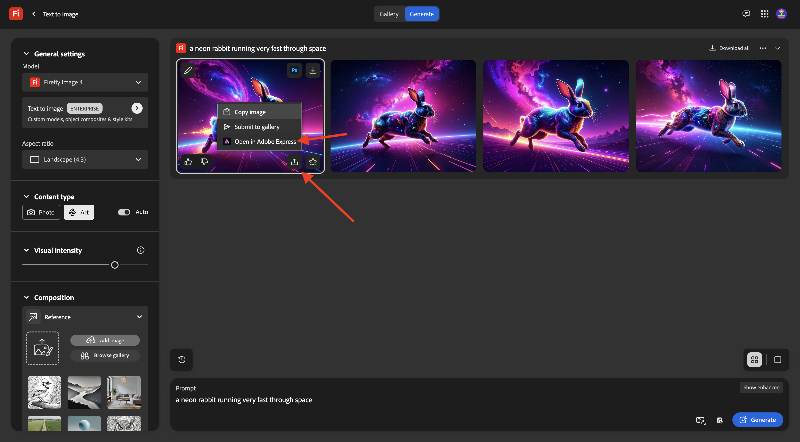

You will then see the image you just generated become available in Adobe Express for editing. You now need to add the CitiSignal logo on the image. To do that, go to **Brands**.

You should then see a CitiSignal brand template. that was created in GenStudio for Performance Marketing appear in Adobe Express. Click to select a brand template which has `CitiSignal` in its name.

Go to **Logos** and click the **white** Citisignal logo to drop it on the image.

Position the CitiSignal logo at the top of your image, not too far from the middle.

Go to **Text**.

Click **Add your text**.

Enter the text `Timetravel now!`, change the font color and font size, set the text to **Bold** so that you have an image similar to this one.

Next, click **Share**.

Click **... Show All**.

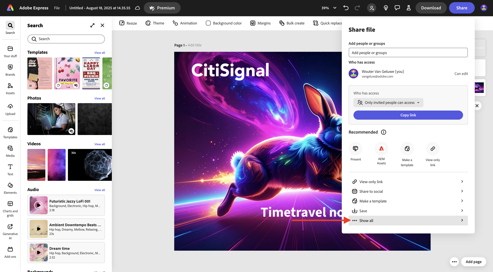

Scroll down and select **Download**.

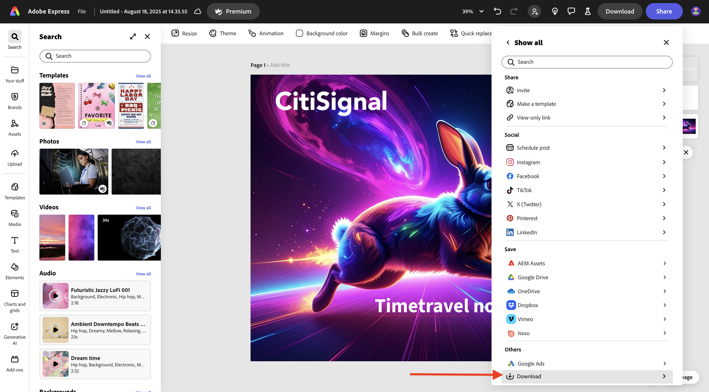

Click **Download**.

You'll then have your asset on your local machine.

## 1.5.2.2 Approve your asset in Frame.io

Go to [https://next.frame.io/](https://next.frame.io/). Make sure you're logged in to the environment `--aepImsOrgName--`.

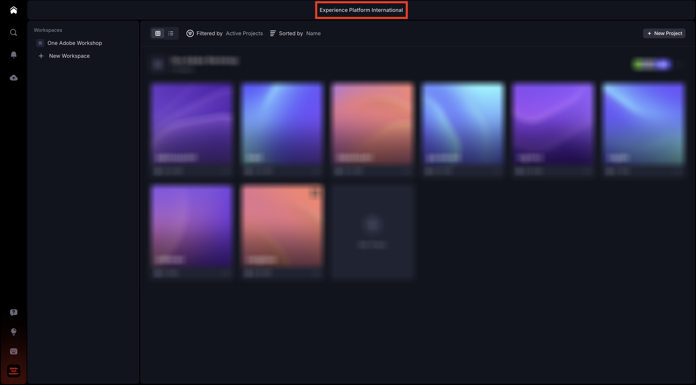

In case you're not logged in to the right environment, click the logo in the bottom left corner and click to select the environment that you need to use.

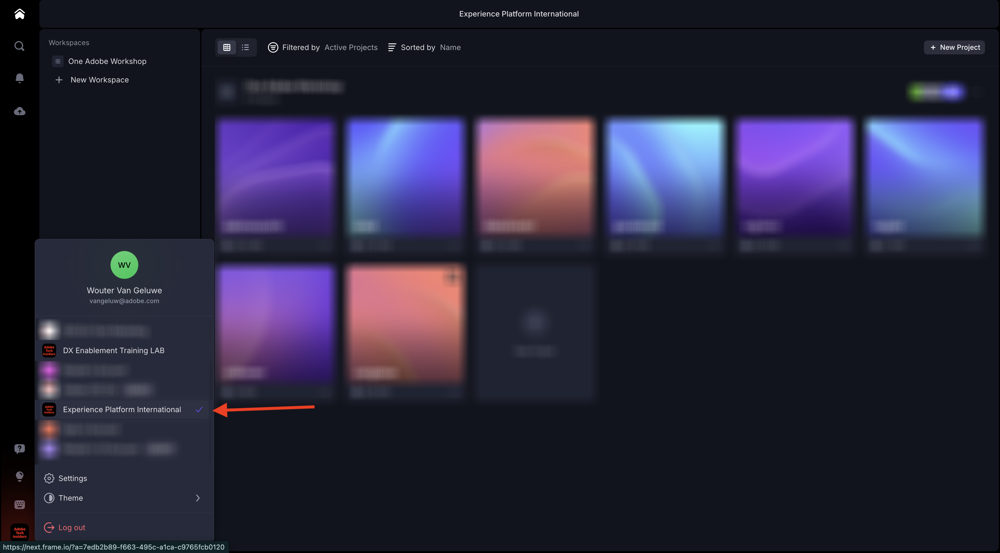

Go to your workspace, which should be named `--aepUserLdap--` and then open the folder **CitiSignal**. Click the **+** icon and then select **New Folder**.

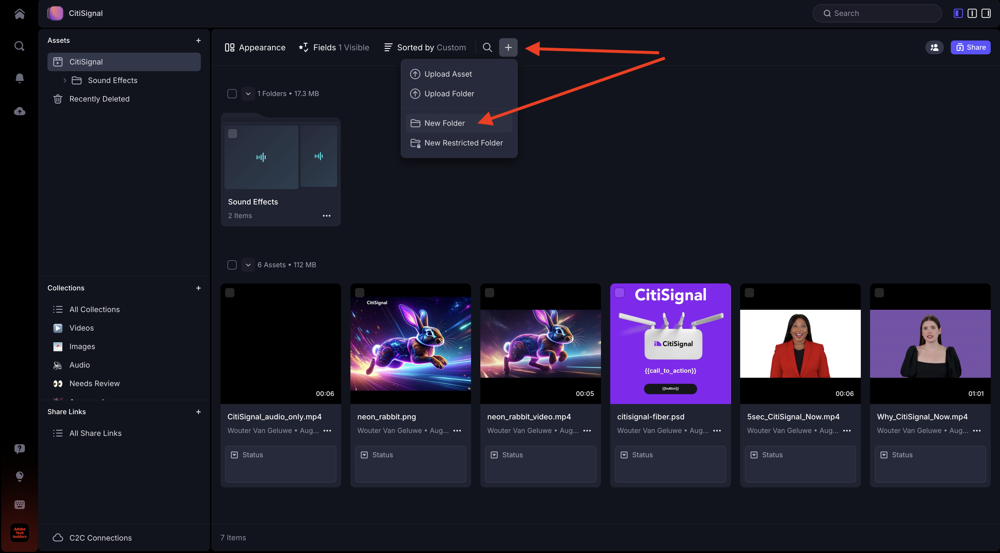

Name the folder `--aepUserLdap-- - Approvals`. Double-click the folder to open it.

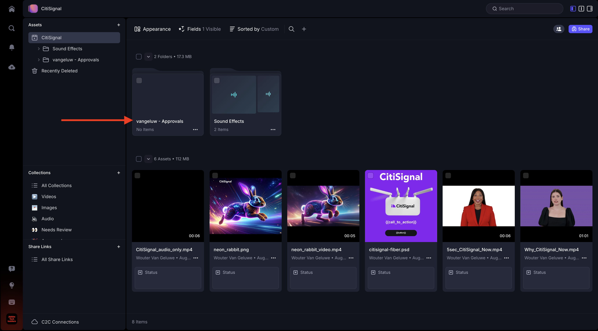

You'll now upload the file that you created in the previous exercise into this folder. Click **Upload**.

Select the file and click **Open**.

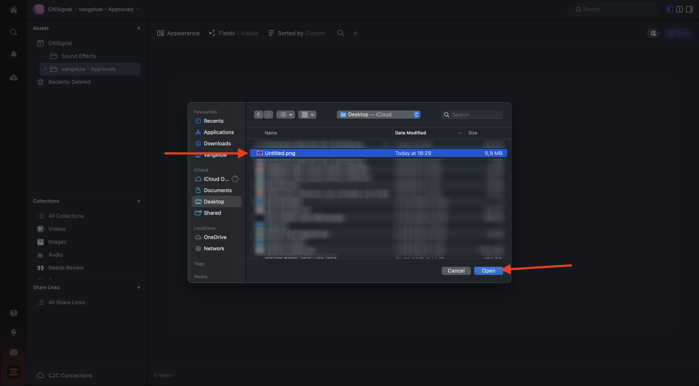

You should then have this. Double-click the file to open it.

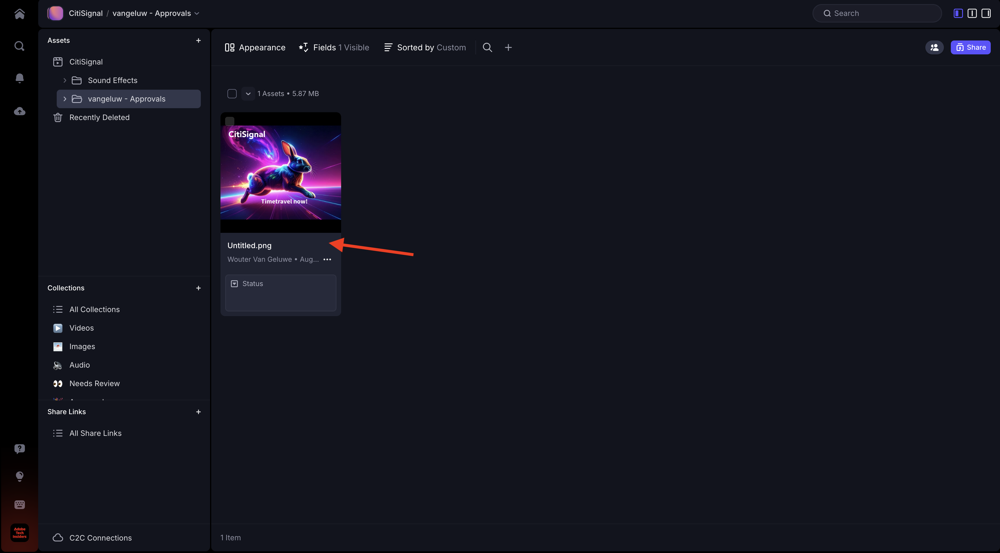

Enable the icon to leave an anchored comment.

Enter a commment, such as `Change CTA to "Get on board now!"`. Click the **send** icon to share your comment.

You should then have this. Go to **Fields**.

In the **Status** field, change the status to **Needs Review**.

You should then have this.

## 1.5.2.3 Make design changes in Adobe Express

Go to [https://new.express.adobe.com/your-stuff/files](https://new.express.adobe.com/your-stuff/files) and open the image you created earlier again.

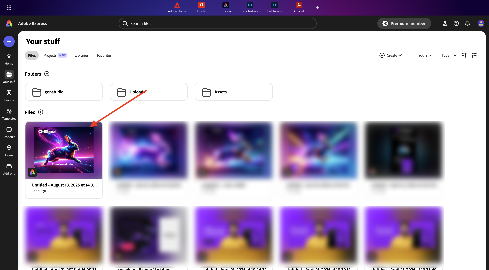

Change the CTA text to `Get On Board Now!`.

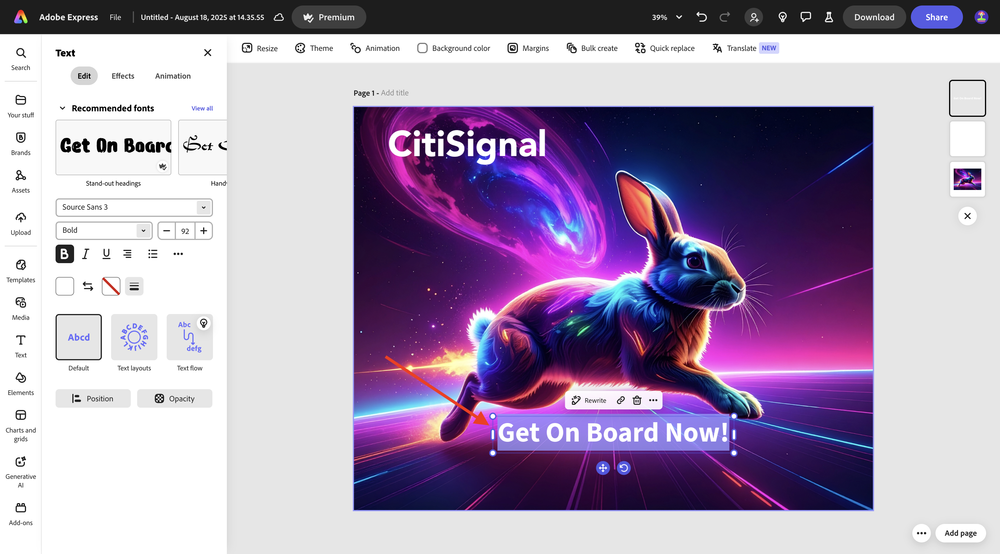

Click **Share** and then select **Download**.

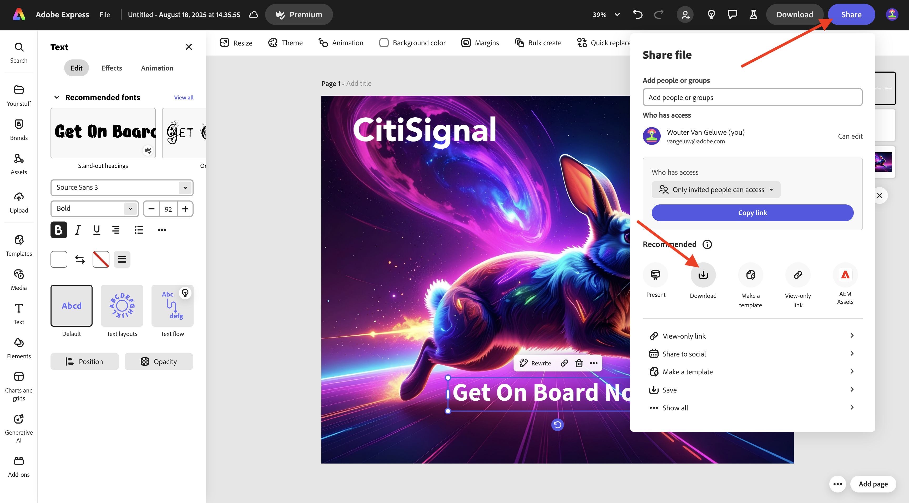

Click **Download**.

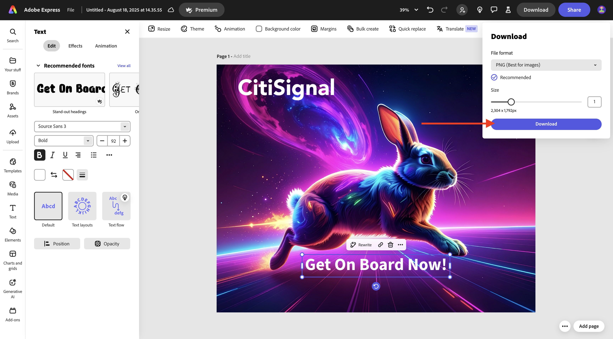

You'll then have a new image downloaded on your local machine.

## Next Steps

[1.5.3 Frame.io and Premiere Pro](./ex3.md){target="_blank"}

Go back to [Streamline your workflow with Frame.io](./frameio.md){target="_blank"}

Go back to [All Modules](./../../../overview.md){target="_blank"}
