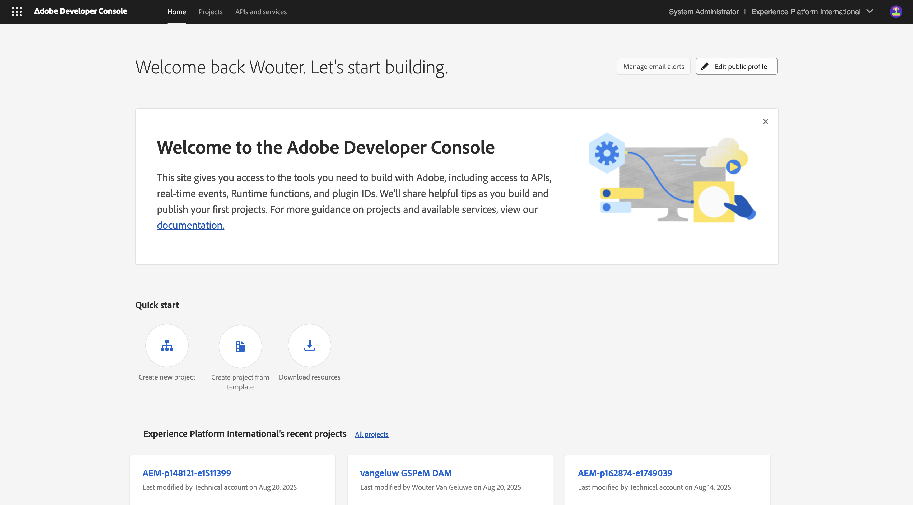
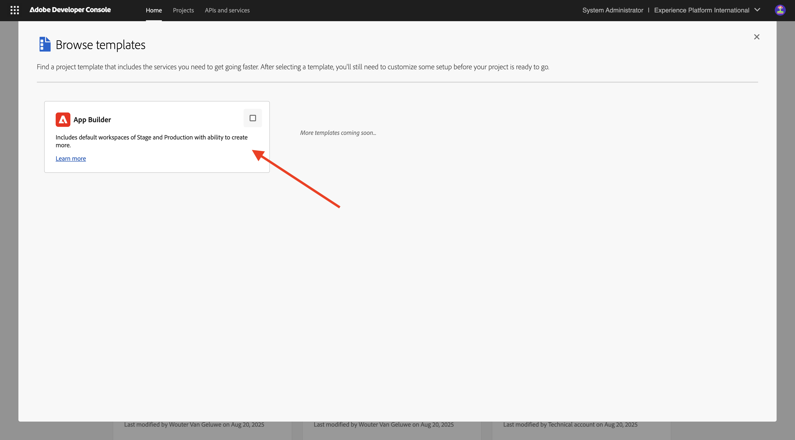
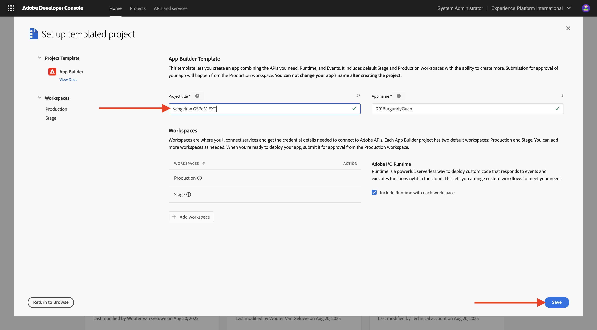
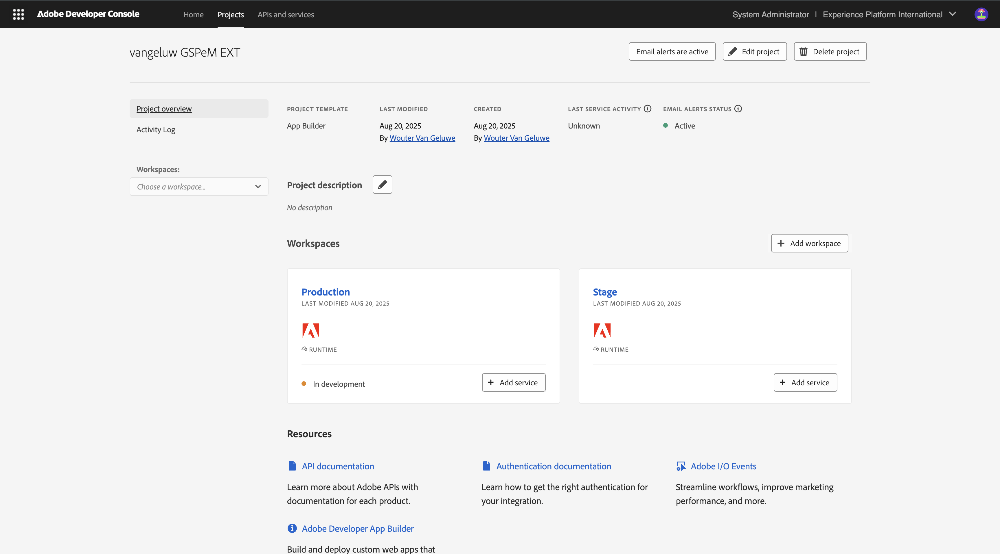

# 1.6.1 Adobe IO and App Builder

## 1.6.1.1 Create your Adobe I/O project

Go to [https://developer.adobe.com/console/home](https://developer.adobe.com/console/home){target="_blank"}.

Make sure to select the correct instance in the top right corner of your screen. Your instance is `--aepImsOrgName--`. 

>[!NOTE]
>
> The below screenshot shows a specific org being selected. When you are going through this tutorial, it is very likely that your org has a different name. When you signed up for this tutorial, you were provided with the environment details to use, please follow those instructions.

Next, select **Create project from template**.

Select **App Builder**.

Enter the name `--aepUserLdap-- GSPeM EXT`. Click **Save**.

You should then see something like this.

## Next Steps

Go to [Create your AWS S3 bucket](./ex2.md){target="_blank"}

Go back to [GenStudio for Performance Marketing - Extensibility](./genstudioext.md){target="_blank"}

Go back to [All Modules](./../../../overview.md){target="_blank"}
