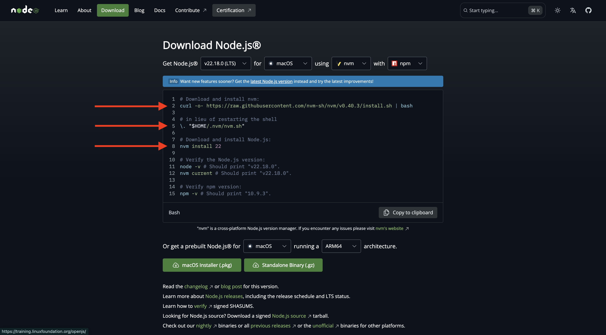
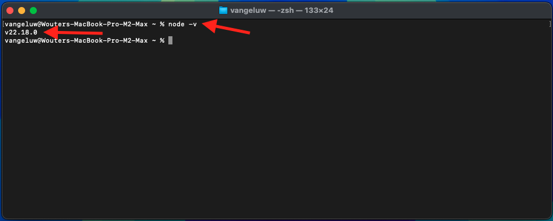
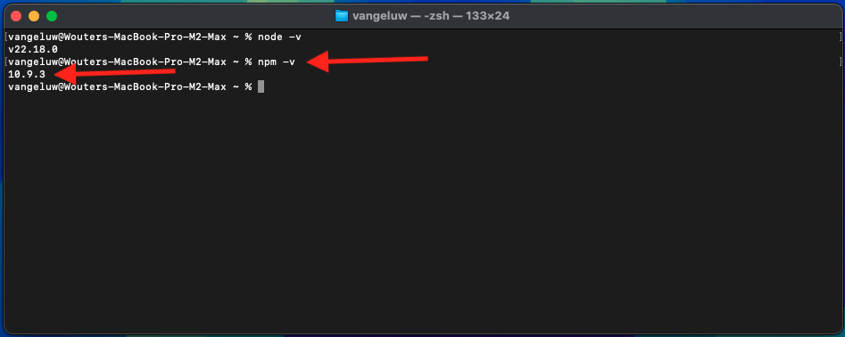
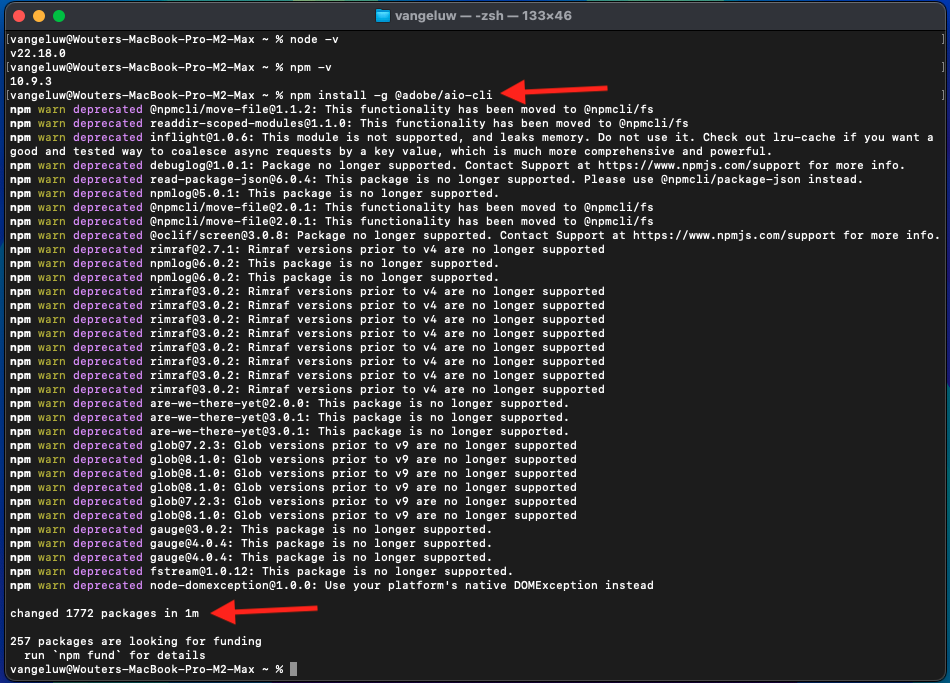

# 1.6.1 Adobe IO and App Builder

## 1.6.1.1 Create your Adobe I/O project

Go to [https://developer.adobe.com/console/home](https://developer.adobe.com/console/home){target="_blank"}.

Make sure to select the correct instance in the top right corner of your screen. Your instance is `--aepImsOrgName--`. 

>[!NOTE]
>
> The below screenshot shows a specific org being selected. When you are going through this tutorial, it is very likely that your org has a different name. When you signed up for this tutorial, you were provided with the environment details to use, please follow those instructions.

Next, select **Create project from template**.

Select **App Builder**.

Enter the name `--aepUserLdap-- GSPeM EXT`. Click **Save**.

You should then see something like this.

## 1.6.1.2 Configure your development environment

In order to create, submit and deploy your extensible app, your local development environment on your computer should have the following applications and packages installed:

- Node.js (version 20.x or higher)
- npm (packaged with Node.js)
- Adobe Developer command-line interface (CLI)

In case these applications or packages aren't installed yet on your computer, follow these steps.

### Node.js & npm

Go to [https://nodejs.org/en/download](https://nodejs.org/en/download). You should then see this, with a number of terminal commands that need to be executed in order to have Node.js and npm installed. The commands that are shown here are applicable to MacBook.

First, open a new terminal window. Paste and execute the command mentioned on line 2 in the screenshot:

`curl -o- https://raw.githubusercontent.com/nvm-sh/nvm/v0.40.3/install.sh | bash`

Next, execute the command on line 5 in the screenshot:

`\. "$HOME/.nvm/nvm.sh"`

After having executed both commands successfully, run this command:

`node -v`

You should see a version number being returned.

Next, run this command:

`npm -v`

You should see a version number being returned.

If the last 2 commands successfully returned a version number, then your configuration of these 2 capabilities is successful.

### Adobe Developer command-line interface (CLI)

To install the Adobe Developer command-line interface (CLI), run the following command in a terminal window:

`npm install -g @adobe/aio-cli`

Running this command may take a couple of minutes, the end result should be similar to this:

The Adobe Developer command-line interface (CLI) is now also successfully installed.

You've now set up the basic elements to be able to run an App Builder project.

## Next Steps

Go to [Create your AWS S3 bucket](./ex2.md){target="_blank"}

Go back to [GenStudio for Performance Marketing - Extensibility](./genstudioext.md){target="_blank"}

Go back to [All Modules](./../../../overview.md){target="_blank"}
