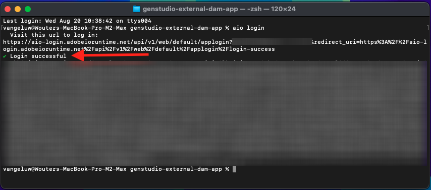

# 1.6.3 Create and deploy your external DAM app

## 1.6.3.1 Download sample app files

Go to [https://github.com/woutervangeluwe/genstudio-external-dam-app](https://github.com/woutervangeluwe/genstudio-external-dam-app). Click **Code** and then select **Download ZIP**.


Unpack the zip-file onto your desktop.


## 1.6.3.2 Configure the Adobe Developer command-line interface

Right-click the **genstudio-external-dam-app-main** folder and select **New Terminal at Folder**.


You should then see this. Enter the command `aio login`. This command will redirect to your browser and will expect you to login.


After successful login, you should see this in the browser.


The browser will then redirect back to the terminal window. You should see a message that says **Login successful** and a long token that is returned by the browser.



The next step is to configure the instance and Adobe IO project that you will use for the external DAM app.

To do this, you need to download a file from the Adobe IO project that you configured before.

Go to [https://developer.adobe.com/console/home](https://developer.adobe.com/console/home){target="_blank"} and open the project you created before, which is named `--aepUserLdap-- GSPeM EXT`. Open the **Production** workspace.


Click **Download all**. This will download a JSON file.


Copy the JSON file from your **Downloads** directory into the root directory of the external DAM app.


Go back to your terminal window. Enter the command `aio app use XXX-YYY-Production.json`.

>[!NOTE]
>
>You need to change the name of the file in the above command to match the name of your file.

Once the command has run, your external DAM app will now be connected to the Adobe IO project with App Builder that you created before.


## 1.6.3.3 Install the GenStudio Extensibility SDK

Next, you need to install the **GenStudio Extensibility SDK**. You can find more detail about the SDK here: [https://github.com/adobe/genstudio-extensibility-sdk](https://github.com/adobe/genstudio-extensibility-sdk).

To install the SDK, run this command in your terminal window:

`npm install @adobe/genstudio-extensibility-sdk`


After a couple of minutes, the SDK will be installed.


## 1.6.3.4 Review the external DAM app in Visual Studio Code

Open Visual Studio Code. Click **Open...** to open a folder.


Select the folder **genstudio-external-dam-app-main** which contains the app you downloaded before. Click **Open**.


Click to open the file **.env**.


The **.env** file was created by the command `aio app use` that you ran in the previous step and contains the information needed to connect to your Adobe IO project with App Builder.


You now need to add the following details to the **.env** file, so that the external DAM app can connect to the AWS S3 bucket that you created before.

```
AWS_ACCESS_KEY_ID=
AWS_SECRET_ACCESS_KEY=
AWS_REGION=
AWS_BUCKET_NAME=
```

The field **`AWS_ACCESS_KEY_ID`** and **`AWS_SECRET_ACCESS_KEY`** were available after creating the IAM user in the previous exercise. You were asked to write them down, you can now copy the values.


The field **`AWS_REGION`** can be taken from the AWS S3 Home view, next to your bucket name. In this example, the region is **us-west-2**.


The field **`AWS_BUCKET_NAME`** should be `--aepUserLdap---gspem-dam`.

This information allows you to update the values of each of these variables.

```
AWS_ACCESS_KEY_ID=XXX
AWS_SECRET_ACCESS_KEY=YYY
AWS_REGION=us-west-2
AWS_BUCKET_NAME=--aepUserLdap---gspem-dam
```

You should now paste this text in the `.env` file. Don't forget to save your changes.


Next, go back to your terminal window. Run this command:

`export $(grep -v '^#' .env | xargs)`


Lastly, you need to change the label that will be shown inside GenStudio for Performance Marketing, so that you can distinguish your external DAM app from other integrations. To do that, open the file **Constants.ts** which you can find by drilling down in explorer to **src/genstudiopem > web-src > src**. 

Line 14 needs to be changed to 

`export const extensionLabel: string = "--aepUserLdap-- - External S3 DAM";`

Don't forget to save your changes.


## 1.6.3.5 Run your external DAM app

In your terminal window, run the command `aio app run`. You should then see this after 1-2 minutes.

>[!NOTE]
>
>When you run `aio app run` for the first time, you may be redirected to the browser to accept a new certificate. If that happens, accept the certificate and then you'll be able to continue with the below steps.


You've now confirmed that your app is running. The next step is to deploy it.

First, push **CTRL+C** to stop the app from running. Then, enter the command `aio app deploy`. This command will deploy your code to Adobe IO.

As a result, you'll receive a similar URL to access your deployed application:

`https://133309-201burgundyguan.adobeio-static.net/index.html`


For testing purposes, you can now use that URL as a query string paramater by adding `?ext=` as a prefix to the above URL. This results in this query string parameter:

`?ext=https://133309-201burgundyguan.adobeio-static.net/index.html`

Go to [https://experience.adobe.com/genstudio/create](https://experience.adobe.com/genstudio/create).


Next, add the query string parameter just before the **#**. Your new URL should look like this:

`https://experience.adobe.com/?ext=https://133309-201burgundyguan.adobeio-static.net/index.html#/@experienceplatform/genstudio/create`

The page will load as normal. Click **Banners** to start creating a new banner.


Select a template and click **Use**.


Click **Select from content**.


You should then be able to select your external DAM, which should be named `--aepUserLdap-- - External S3 DAM` out of the dropdown list.


You should then see this. Select the image **neon_rabbit_banner.jpg** and lick **Use**.


You've now selected an image out of your external DAM running in an S3 bucket. With the image selected, you can now follow the normal workflow as documented in the exercise [1.3.3.4 Create & Approve Meta ad](./../module1.3/ex3.md#create--approve-meta-ad).


When making changes to the code on your local machine, you will need to redeploy your app. When you re-deploy, use this terminal command:

`aio app deploy --force-build --force-deploy` 


Your app is now ready to be published.

## Next Steps

Go to [Publish your app privately](./ex4.md){target="_blank"}

Go back to [GenStudio for Performance Marketing - Extensibility](./genstudioext.md){target="_blank"}

Go back to [All Modules](./../../../overview.md){target="_blank"}
