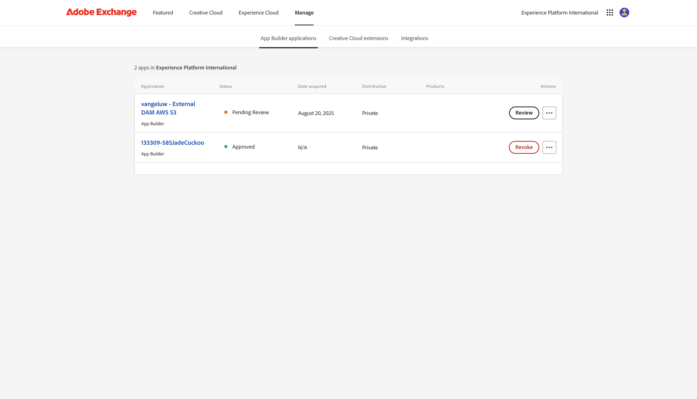

# 1.6.4 Deploy your code and publish your app privately

Publishing your app privately will mean that your app is available in GenStudio for Performance Marketing without having to use the query string paramater.

## 1.6.4.1 Publish your app

Go to [https://developer.adobe.com/console/projects](https://developer.adobe.com/console/projects){target="_blank"}.

>[!NOTE]
>
> The below screenshot shows a specific org being selected. When you are going through this tutorial, it is very likely that your org has a different name. When you signed up for this tutorial, you were provided with the environment details to use, please follow those instructions.

Open the Adobe IO project with App Builder, which should be name `--aepUserLdap-- GSPeM EXT`.

Go to **Production**.

Click **Publish privately**.

You then need to fill out a number of fields.

Fill out the following fields like this:

- **App Title**: `--aepUserLdap-- - External DAM AWS S3`.
- **App Description**: `External DAM AWS S3`
- **Contact email**: enter your email address
- **App Icon**: download and use this image: [S3 image](./images/s3.jpeg)
- **Note to reviewer**: External DAM AWS S3

Click **Submit**.

Click **Submit**.

## 1.6.4.2 Approve your app

Once a developer submits a new app for publication, the system administrators of your org will be notified and will be asked to review and approve.

If you're a system administrator, you'll receive this email and then you can click **My Exchange** to start that process.

On **Adobe Exchange**, the App Builder applications are shown and the app that was just submitted is now pending a review. Click the **Review** button for the app `--aepUserLdap-- - External DAM AWS S3`.

Add in a comment and click **Approve**.

Your app is now approved and will be working automatically in GenStudio for Performance Marketing, without the need to specify the query string parameter.

## Next Steps

Go to [Summary & Benefits](./summary.md){target="_blank"}

Go back to [GenStudio for Performance Marketing - Extensibility](./genstudioext.md){target="_blank"}

Go back to [All Modules](./../../../overview.md){target="_blank"}
