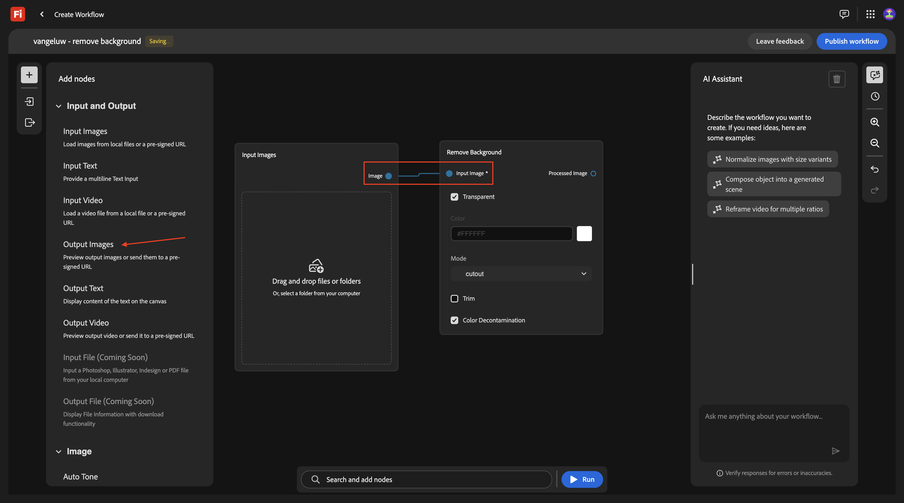
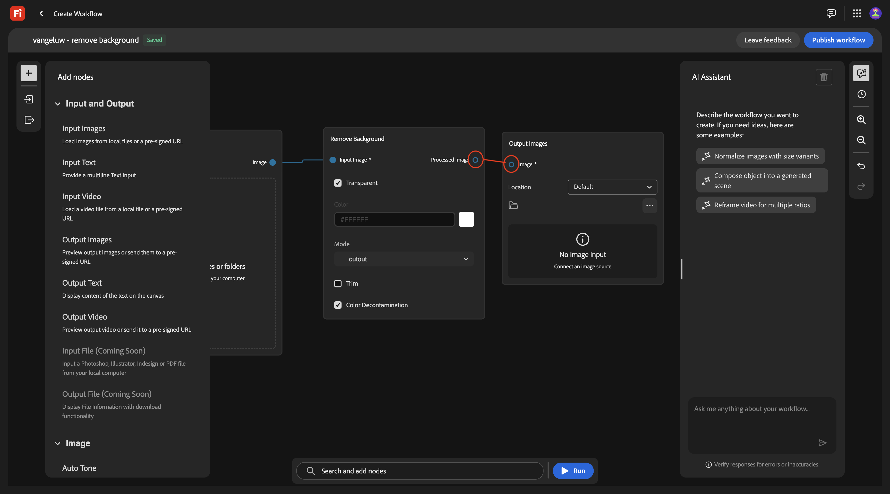
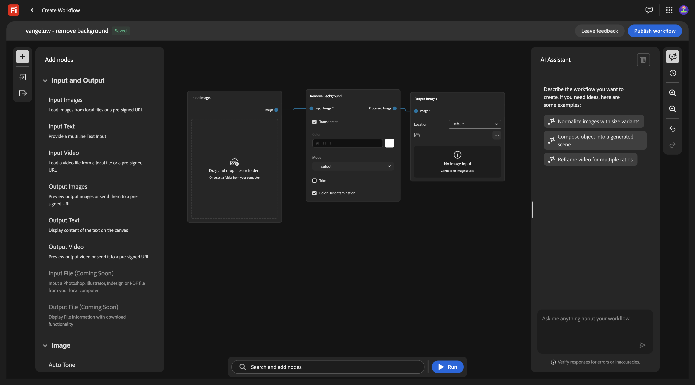
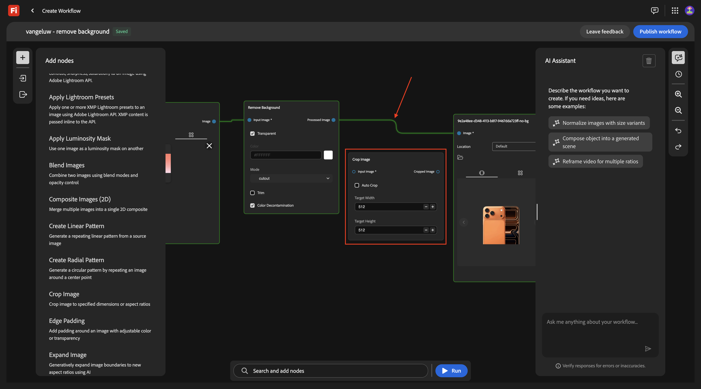
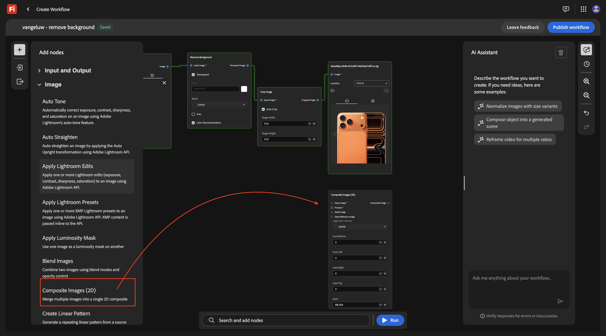
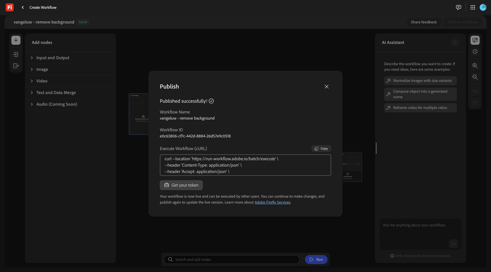

# 1.7.1 Getting started with Firefly Creative Production for Enterprise

>[!IMPORTANT]
>
>Your AEM CS sandbox may be hibernated. Given that dehibernating a sandbox takes 10-15 minutes, it would be a good idea to start the dehibernation process now so that you don't have to wait for it at a later time.

>[!IMPORTANT]
>
>Before you begin, read the below instructions!

## Instructions: Partner Lab New Orleans

For this exercise, you need to use:

- **Instance**: **Adobe Tech Insiders**
- **Username**: **adobetechinsiders-XXX@adobeeventlab.com**
- **Password**: use the password that was shared with you

## 1.7.1.1 Remove background

Go to [https://firefly.adobe.com](https://firefly.adobe.com). Click the profile icon in the top right corner and verify you've select the correct instance, which should be `--aepImsOrgName--`.

Go to **Production**.

You should then see this. Click **Create workflow (beta)**.

To get to know Firefly Creative Production for Enterprise, you'll now implement a basic use case which is focused on removing the background of a specific image.

Change the name of your workflow to `vangeluw - remove background`.

Open the **Image**

Select **Remove Background**, then drag and drop this node onto the canvas.

You now need to connect an input image node and an output image node to the **Remove Background**.

Scroll up and go to **Input and Output**. Click the **Input Images** node and drag it onto the canvas.

You should then have this. Connect the **Input Images** node to the **Remove Background** node by hovering over the blue dot next to **Image** on the **Input Images** node, and drawing a line to the blue dot next to **Input Image** on the **Remove Background** node.

You should then have this. Next, click the **Output Images** node and drag it onto the canvas.

You should then have this. Connect the **Remove Background** node to the **Output Images** node by hovering over the blue dot next to **Output Image** on the **Remove Background** node, and drawing a line to the blue dot next to **Image** on the **Output Images** node.

You should then have this.

Your basic workflow is now ready to test. Download the image [phone.png](./assets/phone.png) to your desktop.

Go back to your workflow. Click the **Drag and drop** area of the **Input Images** node.

Select the file **phone.png**. Click **Open**.

You should then see this. Click **Run**.

After 1-2 minuntes, you should see this result.

## 1.7.1.2 Remove background + Crop

You should now add a **Crop** node to the canvas. In the menu, go to **Image** and scroll down to find **Crop**. Drag it onto the canvas.

Position the **Crop** node between the **Remove Background** node and the **Output Image** node. 

You now need to remove the connection between the **Remove Background** node and the **Output Image** node. You can do that by double-clicking the line between both nodes.

You should then have this. Connect the **Remove Background** node to the **Crop** node, and then connect the **Crop** node to the **Output Image** node.

Check the checkbox to **Auto Crop**, and then you can test your workflow by clicking **Run**.

After 1-2 minutes, you should see this, which shows an image with a different resolution now.

## 1.7.1.3 Remove background + Crop + Composite Image

In the menu, under **Image** select a **Composite Images (2D)** node and drag it onto the canvas.

Add a second connection to the **Crop** node, by connecting the blue dot next to **Cropped image** to the blue dot next to **Input image** on the **Composite Images (2D)** node.

In the menu, under **Input and Output**, select an **Input Text** node and drag it onto the canvas. 

Connect the green dot next to **Text** on the **Input Text** node to the green dot next to **Prompt** on the **Composite Images (2D)** node.

You should then have this. Enter the below prompt in the **Input Text** node.

`magazine quality photo of a phone on a red pedestal with a pink background surrounded by origami style pink paper hearts`

In the menu, under **Input and Output**, select an **Output Images** node and drag it onto the canvas. 

Connect the blue dot next to **Composite image** on the **Composite Images (2D)** node to the blue dot next to **Input image** on the **Output Image** node.

Click **Run**.

After a couple of minutes, you should see something like this, which shows your original image in a composition based on the prompt that was provided, in a specific resolution.

## 1.7.1.4 Remove background + Crop + Composite Image + Generate Video

In the menu, go to **Video**. Select the **Generate Video** node and drag it onto the canvas.

Connect the blue dot next to **Composite image** of the **Composite Images (2D)** node to the blue dot next to **Input image** of the **Generate Video** node.

In the menu, go to **Input and Output**. Select the **Input Text** node and drag it onto the canvas.

Connect the green dot next to **Text** on the **Input Text** node to the green dot next to **Prompt** of the **Generate Video** node.

Enter the prompt `background hearts fluttering` in the **Input text** node.

In the menu, go to **Input and Output**. Select the **Output Video** node and drag it onto the canvas.

Connect the purple dot next to **Video Output** of the **Generate Video** node to the purple dot next to **Video** on the **Output Video** node.

Click **Run**.

After a couple of videos, you should see this which shows a video based on the combination of the provided image and prompt.

## 1.7.1.5 Scale

You've now done this for 1 image. Let's now use this workflow, but for multiple images.

Download these images to your desktop:

- [watch.jpg](./assets/watch.jpg) 
- [airpods.jpg](./assets/airpods.jpg) 

In your workflow, go back to the first node, **Input Images**. Remove the currently selected image.

Click the **Drag and drop** area.

Select the 3 images that you've downloaded. Click **Open**.

You should then see this. click **Run**.

After several minutes, you should see a similar output, with 3 images being generated, and 3 videos.

## 1.7.1.5 Store in AEM Assets CS

In this exercise, you'll store the assets that are created as part of your custom workflow in AEM Assets CS.

You should first create a new folder in your AEM Assets CS environment.

To do that, go to [https://experience.adobe.com](https://experience.adobe.com). Click to open **Experience Manager Assets**.

Select your AEM Assets CS environment, which should be named `--aepUserLdap-- - CitiSignal AEM + ACCS`.

Go to **Assets** and click **Create Folder**.

Enter the name: `--aepUserLdap-- - Firefly Creative Production for Enterprise`. Click **Create**.

Go back to your custom workflow and go to the **Output Images** node. Click **Default** and then select **AEM Assets**.

You should then see this popup. Select your AEM Assets CS repository, and then select the folder that you just created, which should be named: `--aepUserLdap-- - Firefly Creative Production for Enterprise`. Click **Select**.

Go to the **Output Video** node. Click **Default** and then select **AEM Assets**.

You should then see this popup. Select your AEM Assets CS repository, and then select the folder that you just created, which should be named: `--aepUserLdap-- - Firefly Creative Production for Enterprise`. Click **Select**.

You should then have this. Click **Run**.

After a couple of minutes, you should see the assets that are created become available in the folder in AEM Assets CS.

Go back to your workflow. Click **Publish**.

You should then see this.

Your workflow is now published, and can now be executed programmatically as part of the next exercise.

## Next Steps

Go to [1.7.2 Execute your custom workflow programmatically](./ex2.md){target="_blank"}

Go back to [Firefly Creative Production for Enterprise](./workflowbuilder.md){target="_blank"}

Go back to [All Modules](./../../../overview.md){target="_blank"}
