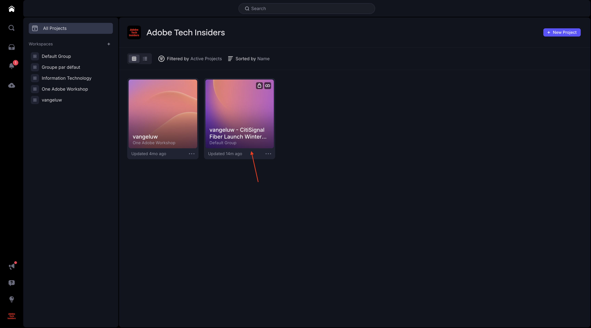
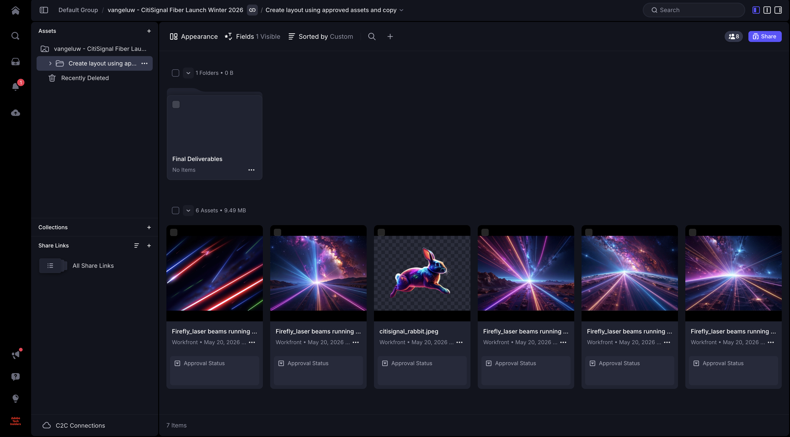
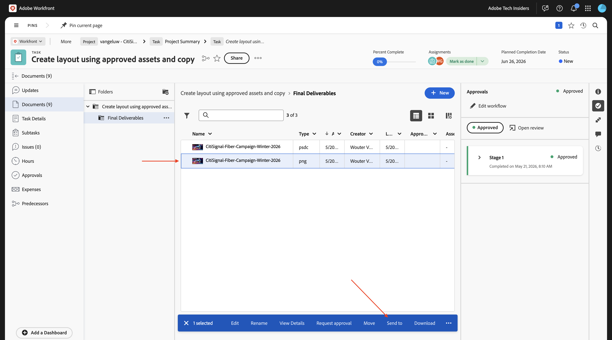

# 1.8.2 Create a new asset, review & approve it

## 1.8.2.1 Verify reference images in Frame.io

Go to [https://next.frame.io/](https://next.frame.io/){target="_blank"}. Click to open the folder of your project.

You should now see all the reference images that were provided in Workfront. The designer now has access to all files that were uploaded in Workfront, in a secure environment, automatically.

Click **+** and then select **New Folder**.

Enter the name: `Final Deliverables` and hit **enter**. This folder will be used to upload the final document that will be created by the designerL

## 1.8.2.2 Create a new asset with Adobe Firefly and Adobe Express

>[!NOTE]
>
>In case you prefer not to create the new asset yourself, you can download the finished version [here](./images/timetravelnow.png).

Go to [https://firefly.adobe.com/](https://firefly.adobe.com/){target="_blank"}. Enter the prompt `a neon rabbit running very fast through space` and click **Generate**.

You will then see several images being generated. Choose the image you like the most, click the **Share** icon on the image and then select **Open in Adobe Express**.

You will then see the image you just generated become available in Adobe Express for editing. You now need to add the CitiSignal logo on the image. To do that, go to **Brands**.

You should then see a CitiSignal brand template. that was created in GenStudio for Performance Marketing appear in Adobe Express. Click to select a brand template which has `CitiSignal` in its name.

Go to **Logos** and click the **white** Citisignal logo to drop it on the image.

Position the CitiSignal logo at the top of your image, not too far from the middle.

Go to **Text**.

Click **Add your text**.

Enter the text `Timetravel now!`, change the font color and font size, set the text to **Bold** so that you have an image similar to this one.

Next, click **Share**.

Click **... Show All**.

Scroll down and select **Download**.

Click **Download**.

You'll then have your asset on your local machine.

Change the name of the file to `timetravelnow.png`.

## 1.8.2.3 Review the asset in Frame.io

Go back to [https://next.frame.io/](https://next.frame.io/){target="_blank"} and open the folder of your project.

Click **Upload**.

Select the file **timetravelnow.png** and click **Open**.

You should then see this.

Change the status to **Needs Review** and then double-click the image to open it.

Tag one of the reviewers in your environment and add a message like: `ready for your feedback on this one`.

The reviewer can then comment to either make changes or confirming it looks good.

## 1.8.2.4 Consult the asset in Workfront

While the design team is iterating over the asset that they're creating, the project manager in Workfront can follow along with what's happening. Go back to Workfront. Refresh the page.

You'll now see the folder that was created in Frame.io appear in Workfront. Click it to open it.

You should then see this. Hover over the file **timetravelnow.png** and click **Document Details**.

As the project manager, you can now see the current version of that image so you know what's happening and that this is actively being worked on. Click **Open in Frame.io**.

A new window will then open up, showing the asset in Frame.io.

## 1.8.2.5 Approve the asset 

In Workfront, go to **Approvals** and click **Add**.

Add yourself as an approver and then click **Submit Request**.

You should then see this. Click **Open review**, which will take you to Frame.io.

In Frame.io, you can see all the comments and review the asset. Click to open the **Your decision** field. 

Select **Approved**.

Switch back to Workfront and refresh the page, you'll now see that the status here is changed as well. The asset is approved and can be used for delivery and activation next.

## Next Steps

Go back to [Unified Review & Approval with Workfront, Frame.io and Adobe Cloud Storage](./esm.md){target="_blank"}

Go back to [All Modules](./../../../overview.md){target="_blank"}
