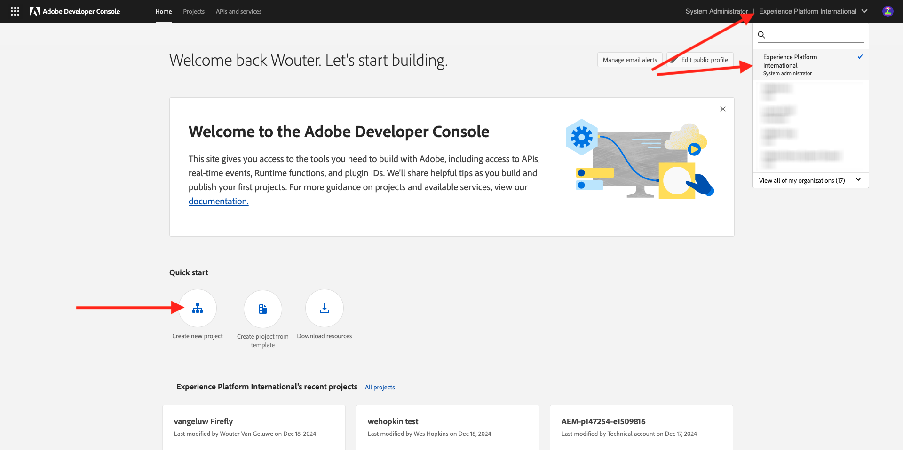
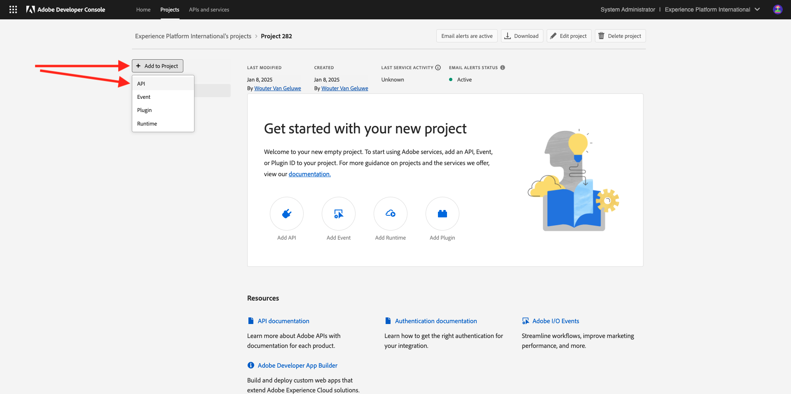
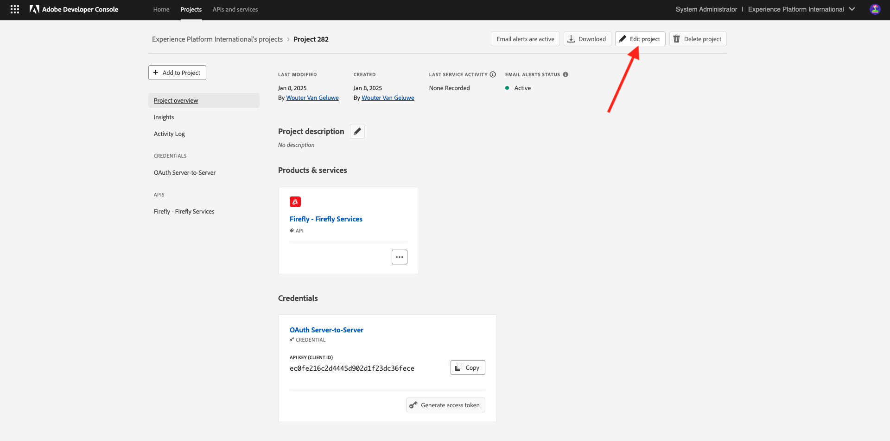
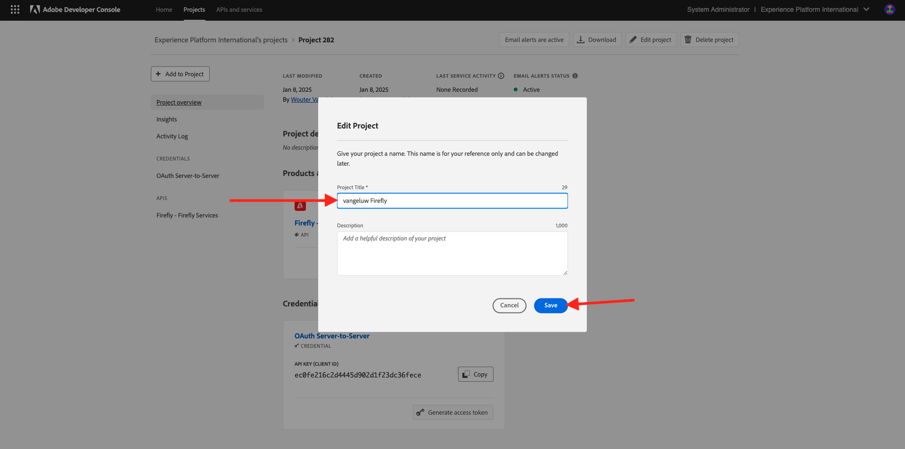
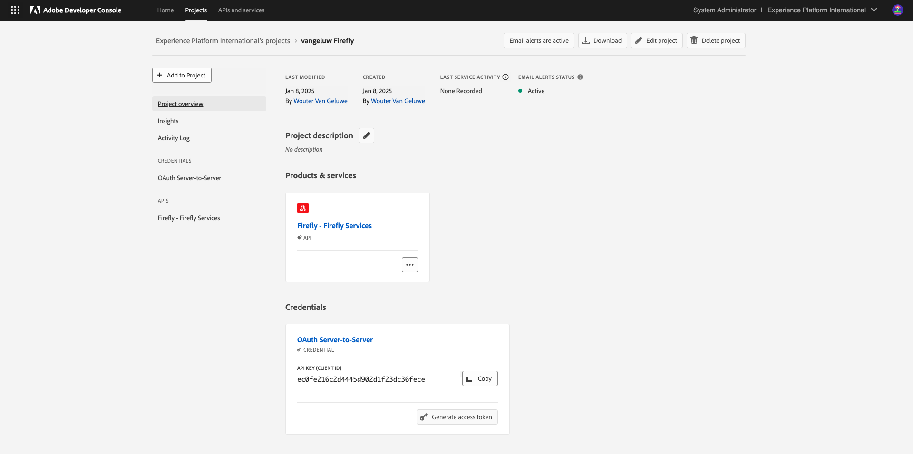
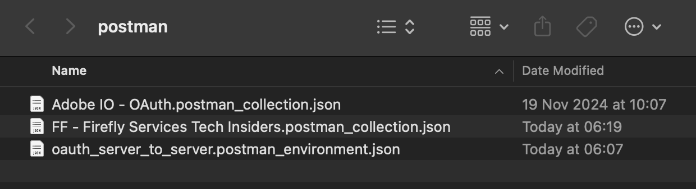
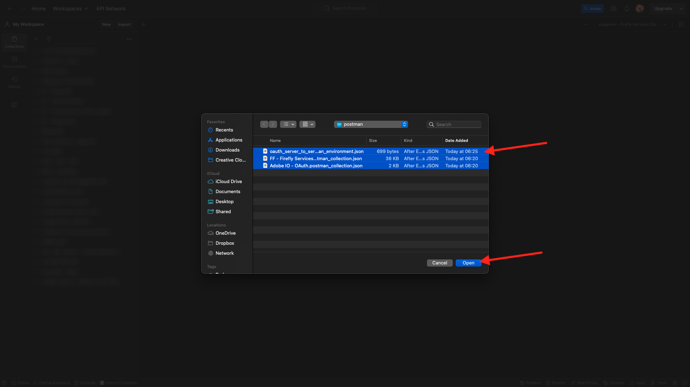
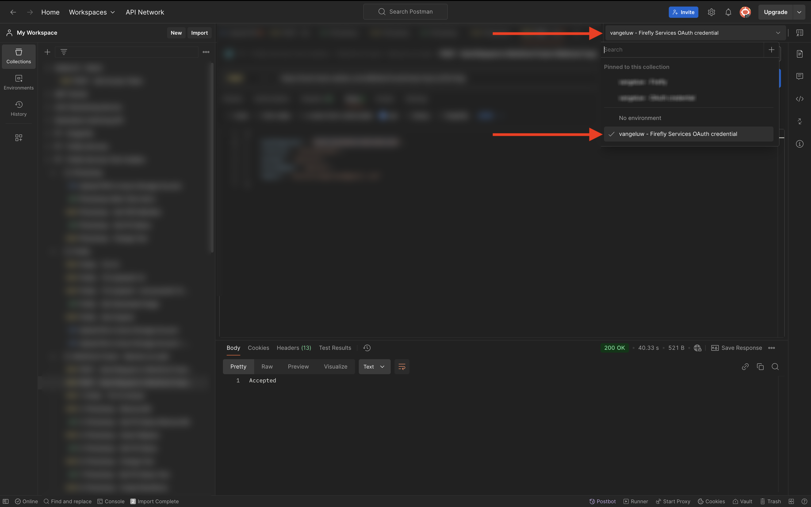

# 1.1.1 Getting started with Firefly Services

Learn how to use Postman and Adobe I/O to query Adobe Firefly Services APIs.

## 1.1.1.2 Configure your Adobe I/O Project

In this exercise, Adobe I/O is used to query against Firefly Services APIs. Follow these steps to setup Adobe I/O.

1. Go to [https://developer.adobe.com/console/home](https://developer.adobe.com/console/home){target="_blank"}.

  

1. Make sure to select the correct instance in the top right corner of your screen. Your instance is `--aepImsOrgName--`. Next, select **Create new project**.

  

1. Select **+ Add to Project** and choose **API**.

  

 Your screen should look like this.

  

1. Select **Creative Cloud** and choose **Firefly - Firefly Services**, then select **Next**.

  

1. Provide a name for your credential: `--aepUserLdap-- - Firefly Services OAuth credential`and select **Next**.

  

1. Select the default profile **Default Firefly Services Configuration** and select **Save Configured API**.

  

  Your Adobe I/O integration is now ready.

  

## 1.1.1.3 Download the Postman environment

1. Select **Download for Postman**, then choose **OAuth Server-to-Server** to download a Postman environment.

  

1. Select your project name.

  

1. Select **Edit Project**.

  

1. Enter a friendly name for your integration: `--aepUserLdap-- Firefly`and select **Save**.

  

  The setup of your Adobe I/O integration is now finished.

  

## 1.1.1.4 Postman authentication to Adobe I/O

>[!IMPORTANT]
>
>If you're an Adobe employee, please follow the instructions here to use [PostBuster](./../../../postbuster.md).

1. Download and install the relevant version of Postman for your OS at [Postman Downloads](https://www.postman.com/downloads/){target="_blank"}.

  

1. Start the application.

  In Postman, there are 2 concepts: Environments and Collections.

  - The environment file contains all of your environmental variables which are more or less consistent. In the environment, you'll find things like the IMSOrg of your Adobe environment, alongside security credentials like your Client ID and others. You downloaded the environment file during the Adobe I/O setup previously and it's named  **`oauth_server_to_server.postman_environment.json`**.
    
  - The Collection contains a number of API requests that you can use. We will use 2 collections
    - 1 Collection for Authentication to Adobe I/O
    - 1 Collection for the exercises in this module

1. Download [postman.zip](./../../../assets/postman/postman-ff.zip) to your local desktop. 

  

  In **postman.zip** file are the following files:

    - `Adobe IO - OAuth.postman_collection.json`
    - `FF - Firefly Services Tech Insiders.postman_collection.json`
  
1. Unzip **postman-ff.zip** and store the following 2 files in a folder on your desktop:
  - Adobe IO - OAuth.postman_collection.json 
  - FF - Firefly Services Tech Insiders.postman_collection.json 
  - oauth_server_to_server.postman_environment.json

  

1. In Postman, select **Import**.

  

1. Select **Files**.

  

1. Choose the three files from the folder, then select **Open** and **Import**. 

  

  

  No you have everything you need in Postman to start interacting with Firefly Services through the APIs.

## 1.1.1.5 Request an access token

Next, to make sure you're properly authenticated, you need to request an access token.

1. Make sure that you've got the right environment selected before executing any request by verifying the Environment-dropdown list in the top right corner. The selected Environment should have a name similar to this one, `--aepUserLdap-- Firefly Services OAuth Credential`.

  

  The selected Environment should have a name similar to this one, `--aepUserLdap-- Firefly Services OAuth Credential`.

  

  Now that your Postman environment and collections are configured and working, you can authenticate from Postman to Adobe I/O.

1. In the **Adobe IO - OAuth** collection, select the request named **POST - Get Access Token** and select **Send**. 

  Notice under **Query Params**, two variables are referenced, `API_KEY` and `CLIENT_SECRET`. These variables are taken from the selected environment, `--aepUserLdap-- Firefly Services OAuth Credential`. 

  

  If successful, a response containing a bearer token, an access token, and an expiration window appears in the **Body** section of Postman.

  

  You should see a similar response containing the following information:

  | Key     | Value     | 
  |:-------------:| :---------------:| 
  | token_type          | **bearer** |
  | access_token    | **eyJhbGciOiJSU...** | 
  | expires_in          | **86399** |

  The Adobe I/O **bearer-token** has a specific value (the very long access_token) and an expiration window and is now valid for 24 hours. This means that after 24 hours, if you want to use Postman to authenticate to Adobe I/O, you will have to generate a new token by running this request again.

## 1.1.1.6 Firefly Services API, Text 2 Image

Now you are ready to send your first request to Firefly Services APIs.

1. Select the request named **POST - Firefly - T2I V3** from the **FF - Firefly Services Tech Insiders** collection.

  

1. Copy the image URL from the response and open it in your web browser to view the image. 

  

  You should see a beautiful image portraying `horses in a field`.

  

Feel free to play around with the API request before continuing to the next exercise.

## Next Steps

Go to [Optimize your Firefly process using Microsoft Azure and presigned URLs](./ex2.md){target="_blank"}

Go back to [Overview of Adobe Firefly Services](./firefly-services.md){target="_blank"}

Go back to [All modules](./../../../overview.md){target="_blank"}
