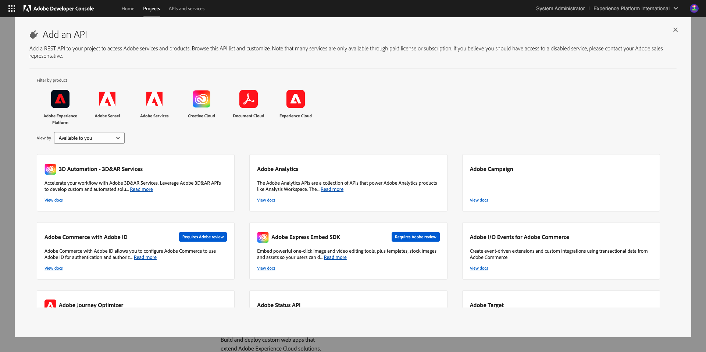
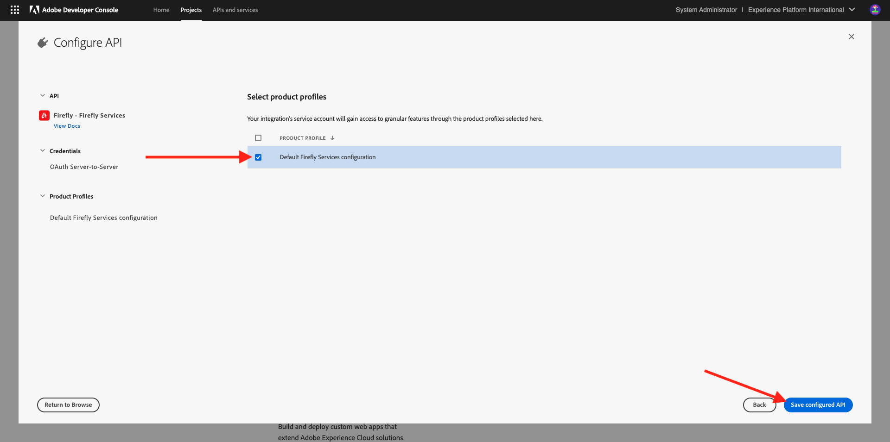
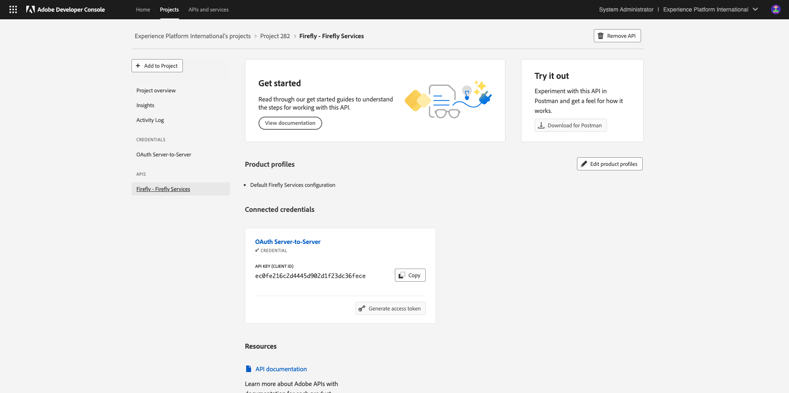
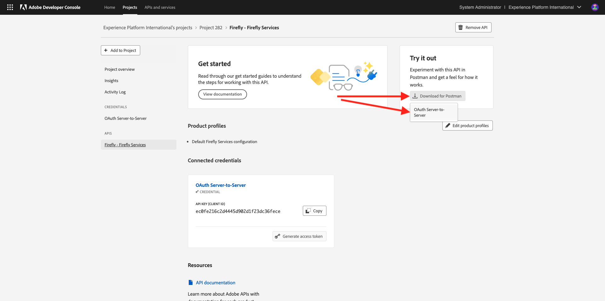
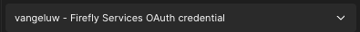
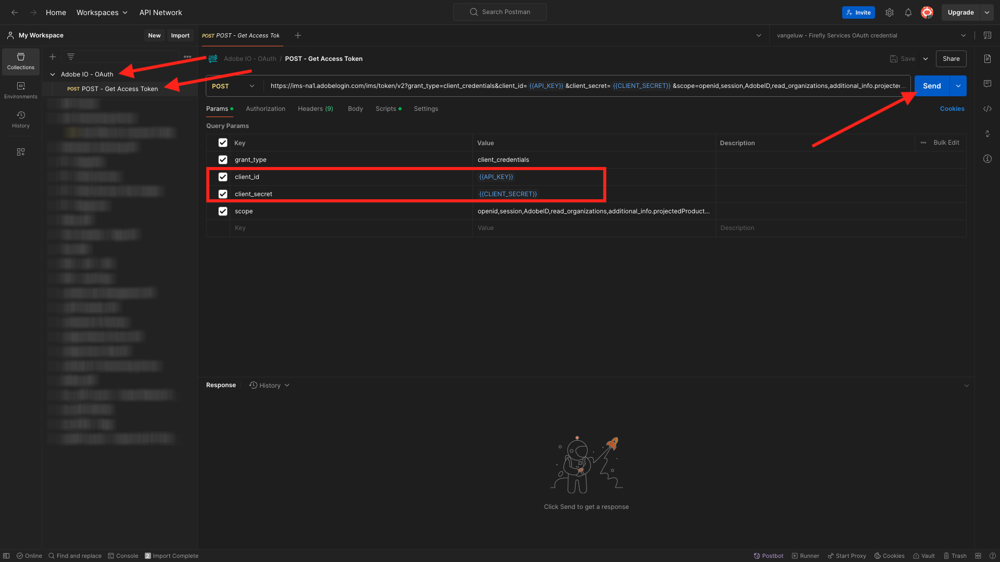

# 1.1.1 Getting Started with Firefly Services

In this exercise, you'll use Postman and Adobe I/O to query Adobe Firefly Services APIs.

## Configure your Adobe I/O Project

In this exercise you'll be using Adobe I/O quite intensively to query against Firefly Services APIs. Please follow the below steps to setup Adobe I/O.

Go to [https://developer.adobe.com/console/home](https://developer.adobe.com/console/home)

Make sure to select the correct instance in the top right corner of your screen. Your instance is `--aepImsOrgName--`. Click **Create new project**.

Select **+ Add to Project** and select **API**.

You'll then see this:

Select **Creative Cloud** and click **Firefly - Firefly Services**. Click **Next**.

You'll now see this. Provide a name for your credential: `--aepUserLdap-- - Firefly Services OAuth credential`. Click **Next**.

Next, you need to select a product profile that will define what permissions are available to this integration.

Select the profile **Default Firefly Services Configuration**. 

Click **Save Configured API**.

Your Adobe I/O integration is now ready.

Click the **Download for Postman** button and then click **OAuth Server-to-Server** to download a Postman environment.

Your IO Project currently has a generic name. You need to give a friendly name to your integration. Click on **Project X** (or similar name) as indicated

Click **Edit Project**.

Enter a name for your integration: `--aepUserLdap-- Firefly`. 

Click **Save**.

The setup of your Adobe I/O integration is now finished.

## Postman authentication to Adobe I/O

Go to [https://www.postman.com/downloads/](https://www.postman.com/downloads/). 

Download and install the relevant version of Postman for your OS.

After installation of Postman, start the application.

In Postman, there are 2 concepts: Environments and Collections.

- The environment file contains all of your environmental variables which are more or less consistent. In the environment, you'll find things like the IMSOrg of your Adobe environment, alongside security credentials like your Client ID and others. The environment file is the one you downloaded during the Adobe I/O setup in the previous exercise, it's named like this: **`oauth_server_to_server.postman_environment.json`**.
  
- The Collection contains a number of API requests that you can use. We will use 2 collections
  - 1 Collection for Authentication to Adobe I/O
  - 1 Collection for the exercises in this module

Please download the file [postman.zip](./../../../assets/postman/postman-ff.zip) to your local desktop. 

In this **postman.zip** file, you'll find the following files:

- `Adobe IO - OAuth.postman_collection.json`
- `FF - Firefly Services Tech Insiders.postman_collection.json`
  
Unzip the **postman-ff.zip** file and store these 2 files in a folder on your desktop, together with the downloaded Postman environment from Adobe I/O, which is the file `oauth_server_to_server.postman_environment.json`. You need to have these 3 files in that folder:

Go back to Postman. Click **Import**.

Click **files**.

Navigate to the folder on your desktop in which you extracted the 2 downloaded files. Select these 3 files at the same time and click **Open**.

After having clicked **Open**, Postman will show you an overview of the Environment and Collections you're about to import. Click **Import**.

You now have everything you need in Postman to start interacting with Firefly Services through the APIs.

The first thing to do, is to make sure you're properly authenticated. To be authenticated, you need to request an access token.

Make sure that you've got the right environment selected before executing any request. You can check the currently selected Environment by verifying the Environment-dropdown list in the top right corner. 

The selected Environment should have a name similar to this one, `--aepUserLdap-- Firefly Services OAuth Credential`.

Your Postman environment and collections are now configured and working. You can now authenticate from Postman to Adobe I/O.

In the **Adobe IO - OAuth** collection, select the request with the name **POST - Get Access Token**. You'll that under **Params**, 2 variables are being referenced, `API_KEY` and `CLIENT_SECRET`. These variables are taken from the selected environment, `--aepUserLdap-- Firefly Services OAuth Credential`.

Click **Send**.

After clicking **Send**, you'll see a response displayed in the **Body** section of Postman:

If your configuration was successful, you should see a similar response that contains the following information:

| Key     | Value     | 
|:-------------:| :---------------:| 
| token_type          | **bearer** |
| access_token    | **eyJhbGciOiJSU...** | 
| expires_in          | **86399** |

Adobe I/O has given you a **bearer**-token, with a specific value (the very long access_token) and an expiration window.

The token that we've received is now valid for 24 hours. This means that after 24 hours, if you want to use Postman to authenticate to Adobe I/O, you will have to generate a new token by running this request again.

## Firefly Services API, Text 2 Image

Now you can go ahead and send your first request to Firefly Services APIs.

In the **FF - Firefly Services Tech Insiders** collection, select the request with the name **POST - Firefly - T2I V3**. In the **Body** section, you'll see a default prompt saying `Horses in a field`. Click **Send** to have Firefly Services generate that image.

You'll then see a similar response, containing an image URL. Copy the image URL and open it in your web browser.

You'll now see a beautiful image portraying `horses in a field`.

Feel free to play around with the API request before continuing to the next exercise.

Next Step: [1.1.2 Request images with specifications](./ex2.md)

[Go Back to Module 1.1](./firefly-services.md)

[Go Back to All Modules](./../../../overview.md)
