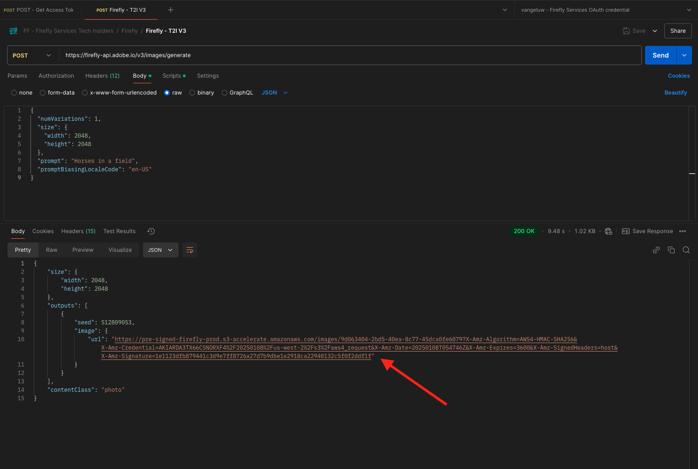

# 1.1.1 Getting started with Firefly Services

Learn how to use Postman and Adobe I/O to query Adobe Firefly Services APIs.

## 1.1.1.1 Prerequisites

Before continuing with this exercise, you need to have completed the setup of [your Adobe I/O project](./../../../modules/getting-started/gettingstarted/ex6.md), and you also need to have configured an application to interact with APIs, such as [Postman](./../../../modules/getting-started/gettingstarted/ex7.md) or [PostBuster](./../../../modules/getting-started/gettingstarted/ex8.md).

## 1.1.1.2 Adobe I/O - access_token

In the **Adobe IO - OAuth** collection, select the request named **POST - Get Access Token** and select **Send**. The response should contain a new **accestoken**.

{zoomable="yes"}

## 1.1.1.3 Firefly Services API, Text 2 Image

Now that you have a valid and fresh access_token, you are ready to send your first request to Firefly Services APIs.

Select the request named **POST - Firefly - T2I V3** from the **FF - Firefly Services Tech Insiders** collection.

{zoomable="yes"}

Copy the image URL from the response and open it in your web browser to view the image. 

{zoomable="yes"}

You should see a beautiful image portraying `horses in a field`.

{zoomable="yes"}

Feel free to play around with the API request before continuing to the next exercise.

## Next Steps

Go to [Optimize your Firefly process using Microsoft Azure and presigned URLs](./ex2.md){target="_blank"}

Go back to [Overview of Adobe Firefly Services](./firefly-services.md){target="_blank"}

Go back to [All modules](./../../../overview.md){target="_blank"}
